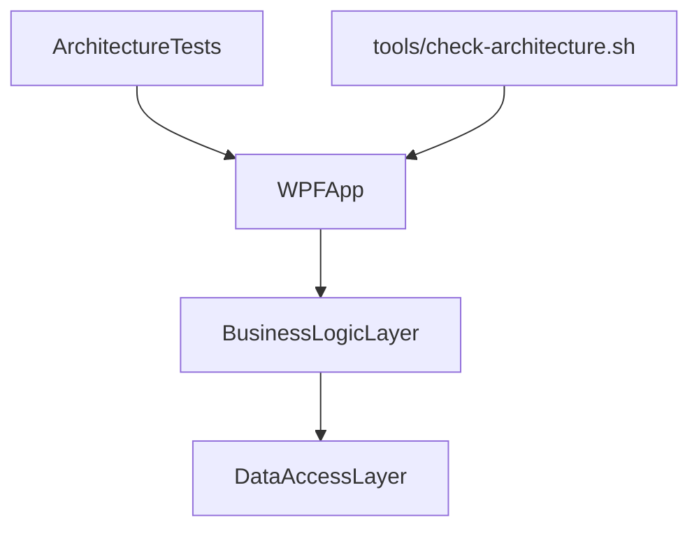

# ArchScheme — повна as-is документація (єдиний файл)

> Цей файл об’єднує весь вміст документації архітектури репозиторію в один Markdown-документ.

## Зміст об’єднаних джерел
- `ArchScheme/00_Index.md`
- `ArchScheme/01_Repository_Overview.md`
- `ArchScheme/02_Project_References.md`
- `ArchScheme/03_Layer_Map.md`
- `ArchScheme/04_Folder_Tree.md`
- `ArchScheme/05_Data_Flows.md`
- `ArchScheme/06_Dependency_Map.md`
- `ArchScheme/07_Startup_and_Composition.md`
- `ArchScheme/08_Tests_and_Guardrails.md`
- `ArchScheme/Files/ArchitectureTests/ArchitectureTests.md`
- `ArchScheme/Files/BusinessLogicLayer/BusinessLogicLayer.md`
- `ArchScheme/Files/BusinessLogicLayer/BusinessLogicLayer__Availability.md`
- `ArchScheme/Files/BusinessLogicLayer/BusinessLogicLayer__Common.md`
- `ArchScheme/Files/BusinessLogicLayer/BusinessLogicLayer__Contracts__Database.md`
- `ArchScheme/Files/BusinessLogicLayer/BusinessLogicLayer__Contracts__Employees.md`
- `ArchScheme/Files/BusinessLogicLayer/BusinessLogicLayer__Contracts__Enums.md`
- `ArchScheme/Files/BusinessLogicLayer/BusinessLogicLayer__Contracts__Export.md`
- `ArchScheme/Files/BusinessLogicLayer/BusinessLogicLayer__Contracts__Models.md`
- `ArchScheme/Files/BusinessLogicLayer/BusinessLogicLayer__Contracts__Shops.md`
- `ArchScheme/Files/BusinessLogicLayer/BusinessLogicLayer__Generators.md`
- `ArchScheme/Files/BusinessLogicLayer/BusinessLogicLayer__Mappers.md`
- `ArchScheme/Files/BusinessLogicLayer/BusinessLogicLayer__Schedule.md`
- `ArchScheme/Files/BusinessLogicLayer/BusinessLogicLayer__Services.md`
- `ArchScheme/Files/BusinessLogicLayer/BusinessLogicLayer__Services__Abstractions.md`
- `ArchScheme/Files/BusinessLogicLayer/BusinessLogicLayer__Services__Export.md`
- `ArchScheme/Files/DataAccessLayer/DataAccessLayer.md`
- `ArchScheme/Files/DataAccessLayer/DataAccessLayer__Administration.md`
- `ArchScheme/Files/DataAccessLayer/DataAccessLayer__Migrations.md`
- `ArchScheme/Files/DataAccessLayer/DataAccessLayer__Models.md`
- `ArchScheme/Files/DataAccessLayer/DataAccessLayer__Models__DataBaseContext.md`
- `ArchScheme/Files/DataAccessLayer/DataAccessLayer__Models__Enums.md`
- `ArchScheme/Files/DataAccessLayer/DataAccessLayer__Repositories.md`
- `ArchScheme/Files/DataAccessLayer/DataAccessLayer__Repositories__Abstractions.md`
- `ArchScheme/Files/RepositoryRoot/root.md`
- `ArchScheme/Files/WPFApp/WPFApp.md`
- `ArchScheme/Files/WPFApp/WPFApp__Applications__Configuration.md`
- `ArchScheme/Files/WPFApp/WPFApp__Applications__Diagnostics.md`
- `ArchScheme/Files/WPFApp/WPFApp__Applications__Export.md`
- `ArchScheme/Files/WPFApp/WPFApp__Applications__Matrix__Availability.md`
- `ArchScheme/Files/WPFApp/WPFApp__Applications__Matrix__Schedule.md`
- `ArchScheme/Files/WPFApp/WPFApp__Applications__Notifications.md`
- `ArchScheme/Files/WPFApp/WPFApp__Applications__Preview.md`
- `ArchScheme/Files/WPFApp/WPFApp__Converters.md`
- `ArchScheme/Files/WPFApp/WPFApp__Converters__Validation.md`
- `ArchScheme/Files/WPFApp/WPFApp__DesignTime.md`
- `ArchScheme/Files/WPFApp/WPFApp__MVVM__Commands.md`
- `ArchScheme/Files/WPFApp/WPFApp__MVVM__Core.md`
- `ArchScheme/Files/WPFApp/WPFApp__MVVM__Threading.md`
- `ArchScheme/Files/WPFApp/WPFApp__MVVM__Validation.md`
- `ArchScheme/Files/WPFApp/WPFApp__MVVM__Validation__Rules.md`
- `ArchScheme/Files/WPFApp/WPFApp__MVVM__Validation__WpfRules.md`
- `ArchScheme/Files/WPFApp/WPFApp__Resources.md`
- `ArchScheme/Files/WPFApp/WPFApp__Resources__Availability.md`
- `ArchScheme/Files/WPFApp/WPFApp__Resources__Container.md`
- `ArchScheme/Files/WPFApp/WPFApp__Resources__Controls.md`
- `ArchScheme/Files/WPFApp/WPFApp__Resources__Styles.md`
- `ArchScheme/Files/WPFApp/WPFApp__UI__Dialogs.md`
- `ArchScheme/Files/WPFApp/WPFApp__UI__Helpers.md`
- `ArchScheme/Files/WPFApp/WPFApp__UI__Hotkeys.md`
- `ArchScheme/Files/WPFApp/WPFApp__UI__Matrix__Schedule.md`
- `ArchScheme/Files/WPFApp/WPFApp__View.md`
- `ArchScheme/Files/WPFApp/WPFApp__ViewModel__Availability__Edit.md`
- `ArchScheme/Files/WPFApp/WPFApp__ViewModel__Availability__Helpers.md`
- `ArchScheme/Files/WPFApp/WPFApp__ViewModel__Availability__List.md`
- `ArchScheme/Files/WPFApp/WPFApp__ViewModel__Availability__Main.md`
- `ArchScheme/Files/WPFApp/WPFApp__ViewModel__Availability__Profile.md`
- `ArchScheme/Files/WPFApp/WPFApp__ViewModel__Container__Edit.md`
- `ArchScheme/Files/WPFApp/WPFApp__ViewModel__Container__Edit__Helpers.md`
- `ArchScheme/Files/WPFApp/WPFApp__ViewModel__Container__List.md`
- `ArchScheme/Files/WPFApp/WPFApp__ViewModel__Container__Profile.md`
- `ArchScheme/Files/WPFApp/WPFApp__ViewModel__Container__ScheduleEdit.md`
- `ArchScheme/Files/WPFApp/WPFApp__ViewModel__Container__ScheduleEdit__Helpers.md`
- `ArchScheme/Files/WPFApp/WPFApp__ViewModel__Container__ScheduleList.md`
- `ArchScheme/Files/WPFApp/WPFApp__ViewModel__Container__ScheduleProfile.md`
- `ArchScheme/Files/WPFApp/WPFApp__ViewModel__Database.md`
- `ArchScheme/Files/WPFApp/WPFApp__ViewModel__Dialogs.md`
- `ArchScheme/Files/WPFApp/WPFApp__ViewModel__Employee.md`
- `ArchScheme/Files/WPFApp/WPFApp__ViewModel__Employee__Helpers.md`
- `ArchScheme/Files/WPFApp/WPFApp__ViewModel__Home.md`
- `ArchScheme/Files/WPFApp/WPFApp__ViewModel__Information.md`
- `ArchScheme/Files/WPFApp/WPFApp__ViewModel__Main.md`
- `ArchScheme/Files/WPFApp/WPFApp__ViewModel__Shop.md`
- `ArchScheme/Files/WPFApp/WPFApp__ViewModel__Shop__Helpers.md`
- `ArchScheme/Files/WPFApp/WPFApp__View__Availability.md`
- `ArchScheme/Files/WPFApp/WPFApp__View__Container.md`
- `ArchScheme/Files/WPFApp/WPFApp__View__Dialogs.md`
- `ArchScheme/Files/WPFApp/WPFApp__View__Employee.md`
- `ArchScheme/Files/WPFApp/WPFApp__View__Helpers.md`
- `ArchScheme/Files/WPFApp/WPFApp__View__Home.md`
- `ArchScheme/Files/WPFApp/WPFApp__View__Information.md`
- `ArchScheme/Files/WPFApp/WPFApp__View__Shop.md`
- `ArchScheme/Files/WinFormsApp/WinFormsApp__View__Container.md`
- `ArchScheme/Files/WinFormsApp/WinFormsApp__View__Shared.md`
- `ArchScheme/Folders/ArchitectureTests.md`
- `ArchScheme/Folders/BusinessLogicLayer.md`
- `ArchScheme/Folders/BusinessLogicLayer/Availability.md`
- `ArchScheme/Folders/BusinessLogicLayer/Common.md`
- `ArchScheme/Folders/BusinessLogicLayer/Contracts/Database.md`
- `ArchScheme/Folders/BusinessLogicLayer/Contracts/Employees.md`
- `ArchScheme/Folders/BusinessLogicLayer/Contracts/Enums.md`
- `ArchScheme/Folders/BusinessLogicLayer/Contracts/Export.md`
- `ArchScheme/Folders/BusinessLogicLayer/Contracts/Models.md`
- `ArchScheme/Folders/BusinessLogicLayer/Contracts/Shops.md`
- `ArchScheme/Folders/BusinessLogicLayer/Generators.md`
- `ArchScheme/Folders/BusinessLogicLayer/Mappers.md`
- `ArchScheme/Folders/BusinessLogicLayer/Schedule.md`
- `ArchScheme/Folders/BusinessLogicLayer/Services.md`
- `ArchScheme/Folders/BusinessLogicLayer/Services/Abstractions.md`
- `ArchScheme/Folders/BusinessLogicLayer/Services/Export.md`
- `ArchScheme/Folders/DataAccessLayer.md`
- `ArchScheme/Folders/DataAccessLayer/Administration.md`
- `ArchScheme/Folders/DataAccessLayer/Migrations.md`
- `ArchScheme/Folders/DataAccessLayer/Models.md`
- `ArchScheme/Folders/DataAccessLayer/Models/DataBaseContext.md`
- `ArchScheme/Folders/DataAccessLayer/Models/Enums.md`
- `ArchScheme/Folders/DataAccessLayer/Repositories.md`
- `ArchScheme/Folders/DataAccessLayer/Repositories/Abstractions.md`
- `ArchScheme/Folders/RepositoryRoot.md`
- `ArchScheme/Folders/WPFApp.md`
- `ArchScheme/Folders/WPFApp/Applications/Configuration.md`
- `ArchScheme/Folders/WPFApp/Applications/Diagnostics.md`
- `ArchScheme/Folders/WPFApp/Applications/Export.md`
- `ArchScheme/Folders/WPFApp/Applications/Matrix/Availability.md`
- `ArchScheme/Folders/WPFApp/Applications/Matrix/Schedule.md`
- `ArchScheme/Folders/WPFApp/Applications/Notifications.md`
- `ArchScheme/Folders/WPFApp/Applications/Preview.md`
- `ArchScheme/Folders/WPFApp/Converters.md`
- `ArchScheme/Folders/WPFApp/Converters/Validation.md`
- `ArchScheme/Folders/WPFApp/DesignTime.md`
- `ArchScheme/Folders/WPFApp/MVVM/Commands.md`
- `ArchScheme/Folders/WPFApp/MVVM/Core.md`
- `ArchScheme/Folders/WPFApp/MVVM/Threading.md`
- `ArchScheme/Folders/WPFApp/MVVM/Validation.md`
- `ArchScheme/Folders/WPFApp/MVVM/Validation/Rules.md`
- `ArchScheme/Folders/WPFApp/MVVM/Validation/WpfRules.md`
- `ArchScheme/Folders/WPFApp/Resources.md`
- `ArchScheme/Folders/WPFApp/Resources/Availability.md`
- `ArchScheme/Folders/WPFApp/Resources/Container.md`
- `ArchScheme/Folders/WPFApp/Resources/Controls.md`
- `ArchScheme/Folders/WPFApp/Resources/Styles.md`
- `ArchScheme/Folders/WPFApp/UI/Dialogs.md`
- `ArchScheme/Folders/WPFApp/UI/Helpers.md`
- `ArchScheme/Folders/WPFApp/UI/Hotkeys.md`
- `ArchScheme/Folders/WPFApp/UI/Matrix/Schedule.md`
- `ArchScheme/Folders/WPFApp/View.md`
- `ArchScheme/Folders/WPFApp/View/Availability.md`
- `ArchScheme/Folders/WPFApp/View/Container.md`
- `ArchScheme/Folders/WPFApp/View/Dialogs.md`
- `ArchScheme/Folders/WPFApp/View/Employee.md`
- `ArchScheme/Folders/WPFApp/View/Helpers.md`
- `ArchScheme/Folders/WPFApp/View/Home.md`
- `ArchScheme/Folders/WPFApp/View/Information.md`
- `ArchScheme/Folders/WPFApp/View/Shop.md`
- `ArchScheme/Folders/WPFApp/ViewModel/Availability/Edit.md`
- `ArchScheme/Folders/WPFApp/ViewModel/Availability/Helpers.md`
- `ArchScheme/Folders/WPFApp/ViewModel/Availability/List.md`
- `ArchScheme/Folders/WPFApp/ViewModel/Availability/Main.md`
- `ArchScheme/Folders/WPFApp/ViewModel/Availability/Profile.md`
- `ArchScheme/Folders/WPFApp/ViewModel/Container/Edit.md`
- `ArchScheme/Folders/WPFApp/ViewModel/Container/Edit/Helpers.md`
- `ArchScheme/Folders/WPFApp/ViewModel/Container/List.md`
- `ArchScheme/Folders/WPFApp/ViewModel/Container/Profile.md`
- `ArchScheme/Folders/WPFApp/ViewModel/Container/ScheduleEdit.md`
- `ArchScheme/Folders/WPFApp/ViewModel/Container/ScheduleEdit/Helpers.md`
- `ArchScheme/Folders/WPFApp/ViewModel/Container/ScheduleList.md`
- `ArchScheme/Folders/WPFApp/ViewModel/Container/ScheduleProfile.md`
- `ArchScheme/Folders/WPFApp/ViewModel/Database.md`
- `ArchScheme/Folders/WPFApp/ViewModel/Dialogs.md`
- `ArchScheme/Folders/WPFApp/ViewModel/Employee.md`
- `ArchScheme/Folders/WPFApp/ViewModel/Employee/Helpers.md`
- `ArchScheme/Folders/WPFApp/ViewModel/Home.md`
- `ArchScheme/Folders/WPFApp/ViewModel/Information.md`
- `ArchScheme/Folders/WPFApp/ViewModel/Main.md`
- `ArchScheme/Folders/WPFApp/ViewModel/Shop.md`
- `ArchScheme/Folders/WPFApp/ViewModel/Shop/Helpers.md`
- `ArchScheme/Folders/WinFormsApp/View/Container.md`
- `ArchScheme/Folders/WinFormsApp/View/Shared.md`
- `ArchScheme/Projects/ArchitectureTests.md`
- `ArchScheme/Projects/BusinessLogicLayer.md`
- `ArchScheme/Projects/DataAccessLayer.md`
- `ArchScheme/Projects/RepositoryRoot.md`
- `ArchScheme/Projects/WPFApp.md`
- `ArchScheme/Projects/WinFormsApp.md`

---


# Джерело: `ArchScheme/00_Index.md`

# ArchScheme — індекс документації

Цей каталог містить as-is документацію поточної архітектури репозиторію без змін production-коду.

## Як читати документацію
1. Почніть з `01_Repository_Overview.md`.
2. Далі `02_Project_References.md` і `03_Layer_Map.md`.
3. Для повної структури використайте `04_Folder_Tree.md`.
4. Потоки і залежності: `05_Data_Flows.md`, `06_Dependency_Map.md`, `07_Startup_and_Composition.md`, `08_Tests_and_Guardrails.md`.
5. Деталізація по проєктах/папках/файлах знаходиться в підпапках `Projects/`, `Folders/`, `Files/`.

## Список Markdown-файлів у `ArchScheme/`
- `01_Repository_Overview.md`
- `02_Project_References.md`
- `03_Layer_Map.md`
- `04_Folder_Tree.md`
- `05_Data_Flows.md`
- `06_Dependency_Map.md`
- `07_Startup_and_Composition.md`
- `08_Tests_and_Guardrails.md`
- `Files/ArchitectureTests/ArchitectureTests.md`
- `Files/BusinessLogicLayer/BusinessLogicLayer.md`
- `Files/BusinessLogicLayer/BusinessLogicLayer__Availability.md`
- `Files/BusinessLogicLayer/BusinessLogicLayer__Common.md`
- `Files/BusinessLogicLayer/BusinessLogicLayer__Contracts__Database.md`
- `Files/BusinessLogicLayer/BusinessLogicLayer__Contracts__Employees.md`
- `Files/BusinessLogicLayer/BusinessLogicLayer__Contracts__Enums.md`
- `Files/BusinessLogicLayer/BusinessLogicLayer__Contracts__Export.md`
- `Files/BusinessLogicLayer/BusinessLogicLayer__Contracts__Models.md`
- `Files/BusinessLogicLayer/BusinessLogicLayer__Contracts__Shops.md`
- `Files/BusinessLogicLayer/BusinessLogicLayer__Generators.md`
- `Files/BusinessLogicLayer/BusinessLogicLayer__Mappers.md`
- `Files/BusinessLogicLayer/BusinessLogicLayer__Schedule.md`
- `Files/BusinessLogicLayer/BusinessLogicLayer__Services.md`
- `Files/BusinessLogicLayer/BusinessLogicLayer__Services__Abstractions.md`
- `Files/BusinessLogicLayer/BusinessLogicLayer__Services__Export.md`
- `Files/DataAccessLayer/DataAccessLayer.md`
- `Files/DataAccessLayer/DataAccessLayer__Administration.md`
- `Files/DataAccessLayer/DataAccessLayer__Migrations.md`
- `Files/DataAccessLayer/DataAccessLayer__Models.md`
- `Files/DataAccessLayer/DataAccessLayer__Models__DataBaseContext.md`
- `Files/DataAccessLayer/DataAccessLayer__Models__Enums.md`
- `Files/DataAccessLayer/DataAccessLayer__Repositories.md`
- `Files/DataAccessLayer/DataAccessLayer__Repositories__Abstractions.md`
- `Files/RepositoryRoot/root.md`
- `Files/WPFApp/WPFApp.md`
- `Files/WPFApp/WPFApp__Applications__Configuration.md`
- `Files/WPFApp/WPFApp__Applications__Diagnostics.md`
- `Files/WPFApp/WPFApp__Applications__Export.md`
- `Files/WPFApp/WPFApp__Applications__Matrix__Availability.md`
- `Files/WPFApp/WPFApp__Applications__Matrix__Schedule.md`
- `Files/WPFApp/WPFApp__Applications__Notifications.md`
- `Files/WPFApp/WPFApp__Applications__Preview.md`
- `Files/WPFApp/WPFApp__Converters.md`
- `Files/WPFApp/WPFApp__Converters__Validation.md`
- `Files/WPFApp/WPFApp__DesignTime.md`
- `Files/WPFApp/WPFApp__MVVM__Commands.md`
- `Files/WPFApp/WPFApp__MVVM__Core.md`
- `Files/WPFApp/WPFApp__MVVM__Threading.md`
- `Files/WPFApp/WPFApp__MVVM__Validation.md`
- `Files/WPFApp/WPFApp__MVVM__Validation__Rules.md`
- `Files/WPFApp/WPFApp__MVVM__Validation__WpfRules.md`
- `Files/WPFApp/WPFApp__Resources.md`
- `Files/WPFApp/WPFApp__Resources__Availability.md`
- `Files/WPFApp/WPFApp__Resources__Container.md`
- `Files/WPFApp/WPFApp__Resources__Controls.md`
- `Files/WPFApp/WPFApp__Resources__Styles.md`
- `Files/WPFApp/WPFApp__UI__Dialogs.md`
- `Files/WPFApp/WPFApp__UI__Helpers.md`
- `Files/WPFApp/WPFApp__UI__Hotkeys.md`
- `Files/WPFApp/WPFApp__UI__Matrix__Schedule.md`
- `Files/WPFApp/WPFApp__View.md`
- `Files/WPFApp/WPFApp__ViewModel__Availability__Edit.md`
- `Files/WPFApp/WPFApp__ViewModel__Availability__Helpers.md`
- `Files/WPFApp/WPFApp__ViewModel__Availability__List.md`
- `Files/WPFApp/WPFApp__ViewModel__Availability__Main.md`
- `Files/WPFApp/WPFApp__ViewModel__Availability__Profile.md`
- `Files/WPFApp/WPFApp__ViewModel__Container__Edit.md`
- `Files/WPFApp/WPFApp__ViewModel__Container__Edit__Helpers.md`
- `Files/WPFApp/WPFApp__ViewModel__Container__List.md`
- `Files/WPFApp/WPFApp__ViewModel__Container__Profile.md`
- `Files/WPFApp/WPFApp__ViewModel__Container__ScheduleEdit.md`
- `Files/WPFApp/WPFApp__ViewModel__Container__ScheduleEdit__Helpers.md`
- `Files/WPFApp/WPFApp__ViewModel__Container__ScheduleList.md`
- `Files/WPFApp/WPFApp__ViewModel__Container__ScheduleProfile.md`
- `Files/WPFApp/WPFApp__ViewModel__Database.md`
- `Files/WPFApp/WPFApp__ViewModel__Dialogs.md`
- `Files/WPFApp/WPFApp__ViewModel__Employee.md`
- `Files/WPFApp/WPFApp__ViewModel__Employee__Helpers.md`
- `Files/WPFApp/WPFApp__ViewModel__Home.md`
- `Files/WPFApp/WPFApp__ViewModel__Information.md`
- `Files/WPFApp/WPFApp__ViewModel__Main.md`
- `Files/WPFApp/WPFApp__ViewModel__Shop.md`
- `Files/WPFApp/WPFApp__ViewModel__Shop__Helpers.md`
- `Files/WPFApp/WPFApp__View__Availability.md`
- `Files/WPFApp/WPFApp__View__Container.md`
- `Files/WPFApp/WPFApp__View__Dialogs.md`
- `Files/WPFApp/WPFApp__View__Employee.md`
- `Files/WPFApp/WPFApp__View__Helpers.md`
- `Files/WPFApp/WPFApp__View__Home.md`
- `Files/WPFApp/WPFApp__View__Information.md`
- `Files/WPFApp/WPFApp__View__Shop.md`
- `Files/WinFormsApp/WinFormsApp__View__Container.md`
- `Files/WinFormsApp/WinFormsApp__View__Shared.md`
- `Folders/ArchitectureTests.md`
- `Folders/BusinessLogicLayer.md`
- `Folders/BusinessLogicLayer/Availability.md`
- `Folders/BusinessLogicLayer/Common.md`
- `Folders/BusinessLogicLayer/Contracts/Database.md`
- `Folders/BusinessLogicLayer/Contracts/Employees.md`
- `Folders/BusinessLogicLayer/Contracts/Enums.md`
- `Folders/BusinessLogicLayer/Contracts/Export.md`
- `Folders/BusinessLogicLayer/Contracts/Models.md`
- `Folders/BusinessLogicLayer/Contracts/Shops.md`
- `Folders/BusinessLogicLayer/Generators.md`
- `Folders/BusinessLogicLayer/Mappers.md`
- `Folders/BusinessLogicLayer/Schedule.md`
- `Folders/BusinessLogicLayer/Services.md`
- `Folders/BusinessLogicLayer/Services/Abstractions.md`
- `Folders/BusinessLogicLayer/Services/Export.md`
- `Folders/DataAccessLayer.md`
- `Folders/DataAccessLayer/Administration.md`
- `Folders/DataAccessLayer/Migrations.md`
- `Folders/DataAccessLayer/Models.md`
- `Folders/DataAccessLayer/Models/DataBaseContext.md`
- `Folders/DataAccessLayer/Models/Enums.md`
- `Folders/DataAccessLayer/Repositories.md`
- `Folders/DataAccessLayer/Repositories/Abstractions.md`
- `Folders/RepositoryRoot.md`
- `Folders/WPFApp.md`
- `Folders/WPFApp/Applications/Configuration.md`
- `Folders/WPFApp/Applications/Diagnostics.md`
- `Folders/WPFApp/Applications/Export.md`
- `Folders/WPFApp/Applications/Matrix/Availability.md`
- `Folders/WPFApp/Applications/Matrix/Schedule.md`
- `Folders/WPFApp/Applications/Notifications.md`
- `Folders/WPFApp/Applications/Preview.md`
- `Folders/WPFApp/Converters.md`
- `Folders/WPFApp/Converters/Validation.md`
- `Folders/WPFApp/DesignTime.md`
- `Folders/WPFApp/MVVM/Commands.md`
- `Folders/WPFApp/MVVM/Core.md`
- `Folders/WPFApp/MVVM/Threading.md`
- `Folders/WPFApp/MVVM/Validation.md`
- `Folders/WPFApp/MVVM/Validation/Rules.md`
- `Folders/WPFApp/MVVM/Validation/WpfRules.md`
- `Folders/WPFApp/Resources.md`
- `Folders/WPFApp/Resources/Availability.md`
- `Folders/WPFApp/Resources/Container.md`
- `Folders/WPFApp/Resources/Controls.md`
- `Folders/WPFApp/Resources/Styles.md`
- `Folders/WPFApp/UI/Dialogs.md`
- `Folders/WPFApp/UI/Helpers.md`
- `Folders/WPFApp/UI/Hotkeys.md`
- `Folders/WPFApp/UI/Matrix/Schedule.md`
- `Folders/WPFApp/View.md`
- `Folders/WPFApp/View/Availability.md`
- `Folders/WPFApp/View/Container.md`
- `Folders/WPFApp/View/Dialogs.md`
- `Folders/WPFApp/View/Employee.md`
- `Folders/WPFApp/View/Helpers.md`
- `Folders/WPFApp/View/Home.md`
- `Folders/WPFApp/View/Information.md`
- `Folders/WPFApp/View/Shop.md`
- `Folders/WPFApp/ViewModel/Availability/Edit.md`
- `Folders/WPFApp/ViewModel/Availability/Helpers.md`
- `Folders/WPFApp/ViewModel/Availability/List.md`
- `Folders/WPFApp/ViewModel/Availability/Main.md`
- `Folders/WPFApp/ViewModel/Availability/Profile.md`
- `Folders/WPFApp/ViewModel/Container/Edit.md`
- `Folders/WPFApp/ViewModel/Container/Edit/Helpers.md`
- `Folders/WPFApp/ViewModel/Container/List.md`
- `Folders/WPFApp/ViewModel/Container/Profile.md`
- `Folders/WPFApp/ViewModel/Container/ScheduleEdit.md`
- `Folders/WPFApp/ViewModel/Container/ScheduleEdit/Helpers.md`
- `Folders/WPFApp/ViewModel/Container/ScheduleList.md`
- `Folders/WPFApp/ViewModel/Container/ScheduleProfile.md`
- `Folders/WPFApp/ViewModel/Database.md`
- `Folders/WPFApp/ViewModel/Dialogs.md`
- `Folders/WPFApp/ViewModel/Employee.md`
- `Folders/WPFApp/ViewModel/Employee/Helpers.md`
- `Folders/WPFApp/ViewModel/Home.md`
- `Folders/WPFApp/ViewModel/Information.md`
- `Folders/WPFApp/ViewModel/Main.md`
- `Folders/WPFApp/ViewModel/Shop.md`
- `Folders/WPFApp/ViewModel/Shop/Helpers.md`
- `Folders/WinFormsApp/View/Container.md`
- `Folders/WinFormsApp/View/Shared.md`
- `Projects/ArchitectureTests.md`
- `Projects/BusinessLogicLayer.md`
- `Projects/DataAccessLayer.md`
- `Projects/RepositoryRoot.md`
- `Projects/WPFApp.md`
- `Projects/WinFormsApp.md`

## Карта розділів
- 00: індекс
- 01-04: репозиторний та структурний рівень
- 05-08: потоки, залежності, startup, guardrails
- `Projects/*`: профілі проєктів
- `Folders/*`: профілі значущих папок
- `Files/*`: покомпонентний опис файлів за шаблоном


# Джерело: `ArchScheme/01_Repository_Overview.md`

# Огляд репозиторію

## Проєкти у рішенні (.csproj)
- `WPFApp/WPFApp.csproj` — UI-шар WPF (View/ViewModel/ресурси/експорт/діалоги).
- `BusinessLogicLayer/BusinessLogicLayer.csproj` — сервіси, фасади, контракти, мапінг, алгоритми розкладу/доступності.
- `DataAccessLayer/DataAccessLayer.csproj` — EF Core контекст, моделі, репозиторії, міграції, адмін-сервіс SQLite.
- `ArchitectureTests/ArchitectureTests.csproj` — тестові guardrails архітектурних меж.

## Загальна карта шарів
- Presentation: `WPFApp` + XAML + ViewModels + UI services.
- Business: `BusinessLogicLayer` (Contracts, Services, Facades, Mappers, Generators).
- Data: `DataAccessLayer` (Repositories, Models, DbContext, Migrations).
- Guardrails/Tools: `ArchitectureTests`, `tools/check-architecture.sh`.

## High-level dependency map
- `WPFApp` → `BusinessLogicLayer`
- `BusinessLogicLayer` → `DataAccessLayer`
- `ArchitectureTests` читає `WPFApp` файли для перевірки залежностей.
- `tools/check-architecture.sh` дублює перевірки boundary через `rg`.

## Ключові технології, що зафіксовані в коді
- .NET 10
- WPF/XAML
- Microsoft.Extensions.Hosting + DI
- Entity Framework Core + SQLite
- xUnit (архітектурні тести)
- ClosedXML (експорт)


# Джерело: `ArchScheme/02_Project_References.md`

# Project References та Package References

## `WPFApp/WPFApp.csproj`
- TargetFramework: net10.0-windows
- ProjectReference:
  - `..\BusinessLogicLayer\BusinessLogicLayer.csproj` — міжпроєктна залежність у межах solution.
- PackageReference:
  - `ClosedXML` `0.102.3` — зовнішня бібліотека, яка використовується цим проєктом.
  - `CommunityToolkit.Mvvm` `8.4.0` — зовнішня бібліотека, яка використовується цим проєктом.
  - `Microsoft.Extensions.DependencyInjection` `10.0.1` — зовнішня бібліотека, яка використовується цим проєктом.
  - `Microsoft.Extensions.Hosting` `10.0.1` — зовнішня бібліотека, яка використовується цим проєктом.
- Build settings:
  - `OutputType` = `WinExe`
  - `Nullable` = `enable`
  - `ImplicitUsings` = `enable`
  - `UseWPF` = `true`

## `BusinessLogicLayer/BusinessLogicLayer.csproj`
- TargetFramework: net10.0
- ProjectReference:
  - `..\DataAccessLayer\DataAccessLayer.csproj` — міжпроєктна залежність у межах solution.
- PackageReference:
  - відсутні або задаються неявно SDK
- Build settings:
  - `ImplicitUsings` = `enable`
  - `Nullable` = `enable`

## `DataAccessLayer/DataAccessLayer.csproj`
- TargetFramework: net10.0
- ProjectReference:
  - відсутні
- PackageReference:
  - `Microsoft.EntityFrameworkCore` `10.0.0` — зовнішня бібліотека, яка використовується цим проєктом.
  - `Microsoft.EntityFrameworkCore.Design` `10.0.0` — зовнішня бібліотека, яка використовується цим проєктом.
  - `Microsoft.EntityFrameworkCore.Sqlite` `10.0.0` — зовнішня бібліотека, яка використовується цим проєктом.
  - `Microsoft.EntityFrameworkCore.Tools` `10.0.0` — зовнішня бібліотека, яка використовується цим проєктом.
- Build settings:
  - `ImplicitUsings` = `enable`
  - `Nullable` = `enable`

## `ArchitectureTests/ArchitectureTests.csproj`
- TargetFramework: net10.0
- ProjectReference:
  - відсутні
- PackageReference:
  - `Microsoft.NET.Test.Sdk` `17.14.1` — зовнішня бібліотека, яка використовується цим проєктом.
  - `xunit` `2.9.3` — зовнішня бібліотека, яка використовується цим проєктом.
  - `xunit.runner.visualstudio` `3.1.2` — зовнішня бібліотека, яка використовується цим проєктом.
- Build settings:
  - `ImplicitUsings` = `enable`
  - `Nullable` = `enable`
  - `IsPackable` = `false`


# Джерело: `ArchScheme/03_Layer_Map.md`

# Карта шарів (as-is)

## WPF / Presentation (`WPFApp`)
- Містить `App.xaml`/`App.xaml.cs`, `View/*`, `ViewModel/*`, ресурси стилів, конвертери, MVVM-команди, UI-сервіси.
- Взаємодія з BLL відбувається через інтерфейси сервісів/фасадів, зареєстровані у DI.

## BusinessLogicLayer
- `Contracts/*`: DTO, Request-моделі, enum-и, SQL export моделі.
- `Services/*`: прикладні сервіси, фасади, експортні побудовники, абстракції сервісів.
- `Mappers/*`: перетворення DAL↔BLL контрактів.
- `Availability/*`, `Schedule/*`, `Generators/*`: pure logic обчислення/парсинг/генерація.

## DataAccessLayer
- `Models/*`: EF-сутності, enum-и, `AppDbContext`.
- `Repositories/*`: репозиторії та їх абстракції.
- `Migrations/*`: історія міграцій схеми БД.
- `Administration/*`: сервіс адміністрування SQLite.

## ArchitectureTests / tools
- `ArchitectureTests/WpfBoundaryTests.cs` перевіряє, що WPF не посилається напряму на DAL.
- `tools/check-architecture.sh` повторює ті самі перевірки через shell/rg.

## Типи, що перетинають межі
- DTO/Requests з `BusinessLogicLayer/Contracts/*` переходять між WPF та BLL.
- Моделі DAL (`DataAccessLayer/Models/*`) використовуються всередині BLL через репозиторії/мапери.
- Enum-и `AvailabilityKind`, `SlotStatus` існують і в Contracts, і в DAL Models.

## Потік даних між шарами
1. View/ViewModel у WPF формує команди/запити.
2. BLL сервіси/фасади виконують orchestration, валідацію, мапінг.
3. DAL репозиторії працюють через `AppDbContext` та EF Core.
4. Результат повертається у DTO/ViewModel стан і відображається через Binding у XAML.


# Джерело: `ArchScheme/04_Folder_Tree.md`

# Повне дерево папок/файлів (релевантні проєкти)

## WPFApp
```text
WPFApp
├── App.xaml
├── App.xaml.cs
├── Applications
│   ├── Configuration
│   │   └── DatabasePathProvider.cs
│   ├── Diagnostics
│   │   ├── ExceptionMessageBuilder.cs
│   │   └── DiagnosticsServiceImpl.cs
│   ├── Export
│   │   ├── IScheduleExportService.cs
│   │   └── ScheduleExportService.cs
│   ├── Matrix
│   │   ├── Availability
│   │   │   ├── AvailabilityCellCodeParser.cs
│   │   │   └── AvailabilityMatrixEngine.cs
│   │   └── Schedule
│   │       ├── ScheduleMatrixConstants.cs
│   │       ├── ScheduleMatrixEngine.cs
│   │       └── ScheduleTotalsCalculator.cs
│   ├── Notifications
│   │   └── DatabaseChangeNotifier.cs
│   └── Preview
│       └── AvailabilityPreviewBuilder.cs
├── AssemblyInfo.cs
├── Converters
│   ├── DataRowViewBoolColumnConverter.cs
│   ├── EmployeeTotalHoursHeaderConverter.cs
│   ├── ScheduleMatrixCellBrushConverter.cs
│   ├── ScheduleMatrixCellReferenceConverter.cs
│   ├── ScheduleMatrixEmployeeTotalHoursConverter.cs
│   └── Validation
│       └── FirstValidationErrorConverter.cs
├── DesignTime
│   ├── AvailabilityEditViewDesignVM.cs
│   ├── AvailabilityListDesignViewModel.cs
│   ├── AvailabilityProfileViewDesignVM.cs
│   ├── ContainerProfileViewDesignVm.cs
│   ├── ContainerScheduleEditDesignVM.cs
│   └── HomeViewDesignTime.cs
├── MVVM
│   ├── Commands
│   │   ├── AsyncRelayCommand.cs
│   │   └── RelayCommand.cs
│   ├── Core
│   │   ├── ObservableObject.cs
│   │   └── ViewModelBase.cs
│   ├── Threading
│   │   └── UiDebouncedAction.cs
│   └── Validation
│       ├── Rules
│       │   ├── AvailabilityValidationRules.cs
│       │   ├── ContainerValidationRules.cs
│       │   ├── EmployeeValidationRules.cs
│       │   ├── ScheduleValidationRules.cs
│       │   └── ShopValidationRules.cs
│       ├── ValidationErrors.cs
│       └── WpfRules
│           └── MinHoursAtLeastOneRule.cs
├── Resources
│   ├── Availability
│   │   └── AvailabilityResources.xaml
│   ├── Container
│   │   └── ContainerScheduleResources.xaml
│   ├── Controls
│   │   ├── NumericUpDown.xaml
│   │   └── NumericUpDown.xaml.cs
│   ├── Excel
│   │   ├── ContainerTemplate.xlsx
│   │   └── ScheduleTemplate.xlsx
│   ├── Styles
│   │   ├── Buttons.xaml
│   │   ├── DataGrids.xaml
│   │   ├── Icons.xaml
│   │   ├── ScrollBars.xaml
│   │   ├── TextBoxes.xaml
│   │   └── Theme.xaml
│   └── ViewTemplates.xaml
├── UI
│   ├── Dialogs
│   │   ├── ColorPickerService.cs
│   │   ├── CustomMessageBox.cs
│   │   └── IColorPickerService.cs
│   ├── Helpers
│   │   └── ColorHelpers.cs
│   ├── Hotkeys
│   │   └── KeyGestureTextHelper.cs
│   └── Matrix
│       └── Schedule
│           └── ScheduleMatrixColumnBuilder.cs
├── View
│   ├── Availability
│   │   ├── AvailabilityEditView.xaml
│   │   ├── AvailabilityEditView.xaml.cs
│   │   ├── AvailabilityListView.xaml
│   │   ├── AvailabilityListView.xaml.cs
│   │   ├── AvailabilityProfileView.xaml
│   │   ├── AvailabilityProfileView.xaml.cs
│   │   ├── AvailabilityView.xaml
│   │   └── AvailabilityView.xaml.cs
│   ├── Container
│   │   ├── ContainerEditView.xaml
│   │   ├── ContainerEditView.xaml.cs
│   │   ├── ContainerListView.xaml
│   │   ├── ContainerListView.xaml.cs
│   │   ├── ContainerProfileView.xaml
│   │   ├── ContainerProfileView.xaml.cs
│   │   ├── ContainerScheduleEditView.xaml
│   │   ├── ContainerScheduleEditView.xaml.cs
│   │   ├── ContainerScheduleProfileView.xaml
│   │   ├── ContainerScheduleProfileView.xaml.cs
│   │   ├── ContainerView.xaml
│   │   └── ContainerView.xaml.cs
│   ├── DatabaseView.xaml
│   ├── DatabaseView.xaml.cs
│   ├── Dialogs
│   │   ├── ColorPickerDialog.xaml
│   │   ├── ColorPickerDialog.xaml.cs
│   │   ├── CustomMessageBoxView.xaml
│   │   ├── CustomMessageBoxView.xaml.cs
│   │   ├── UIStatus.xaml
│   │   └── UIStatus.xaml.cs
│   ├── Employee
│   │   ├── EmployeeEditView.xaml
│   │   ├── EmployeeEditView.xaml.cs
│   │   ├── EmployeeListView.xaml
│   │   ├── EmployeeListView.xaml.cs
│   │   ├── EmployeeProfileView.xaml
│   │   ├── EmployeeProfileView.xaml.cs
│   │   ├── EmployeeView.xaml
│   │   └── EmployeeView.xaml.cs
│   ├── Helpers
│   │   ├── AvailabilityMatrixGridBuilder.cs
│   │   └── AvailabilityViewInputHelper.cs
│   ├── Home
│   │   ├── HomeView.xaml
│   │   └── HomeView.xaml.cs
│   ├── Information
│   │   ├── InformationView.xaml
│   │   └── InformationView.xaml.cs
│   ├── MainWindow.xaml
│   ├── MainWindow.xaml.cs
│   └── Shop
│       ├── ShopEditView.xaml
│       ├── ShopEditView.xaml.cs
│       ├── ShopListView.xaml
│       ├── ShopListView.xaml.cs
│       ├── ShopProfileView.xaml
│       ├── ShopProfileView.xaml.cs
│       ├── ShopView.xaml
│       └── ShopView.xaml.cs
├── ViewModel
│   ├── Availability
│   │   ├── Edit
│   │   │   ├── AvailabilityEditViewModel.Batching.cs
│   │   │   ├── AvailabilityEditViewModel.Binds.cs
│   │   │   ├── AvailabilityEditViewModel.Commands.cs
│   │   │   ├── AvailabilityEditViewModel.Fields.cs
│   │   │   ├── AvailabilityEditViewModel.Matrix.cs
│   │   │   ├── AvailabilityEditViewModel.Validation.cs
│   │   │   └── AvailabilityEditViewModel.cs
│   │   ├── Helpers
│   │   │   ├── BindRow.cs
│   │   │   └── EmployeeListItem.cs
│   │   ├── List
│   │   │   └── AvailabilityListViewModel.cs
│   │   ├── Main
│   │   │   ├── AvailabilityViewModel.Binds.cs
│   │   │   ├── AvailabilityViewModel.DatabaseReload.cs
│   │   │   ├── AvailabilityViewModel.Employees.cs
│   │   │   ├── AvailabilityViewModel.Groups.cs
│   │   │   ├── AvailabilityViewModel.Initialization.cs
│   │   │   ├── AvailabilityViewModel.NavStatus.cs
│   │   │   ├── AvailabilityViewModel.Navigation.cs
│   │   │   ├── AvailabilityViewModel.Ui.cs
│   │   │   └── AvailabilityViewModel.cs
│   │   └── Profile
│   │       └── AvailabilityProfileViewModel.cs
│   ├── Container
│   │   ├── Edit
│   │   │   ├── ContainerEditViewModel.cs
│   │   │   ├── ContainerViewModel.AvailabilityPreview.cs
│   │   │   ├── ContainerViewModel.Containers.cs
│   │   │   ├── ContainerViewModel.DatabaseReload.cs
│   │   │   ├── ContainerViewModel.Lookups.cs
│   │   │   ├── ContainerViewModel.Navigation.cs
│   │   │   ├── ContainerViewModel.ScheduleEditor.cs
│   │   │   ├── ContainerViewModel.Schedules.BlockFactory.cs
│   │   │   ├── ContainerViewModel.Schedules.Open.cs
│   │   │   ├── ContainerViewModel.Schedules.SaveGenerate.cs
│   │   │   ├── ContainerViewModel.cs
│   │   │   └── Helpers
│   │   │       ├── ContainerSection.cs
│   │   │       ├── ContainerViewModel.Export.cs
│   │   │       └── ContainerViewModel.Ui.cs
│   │   ├── List
│   │   │   └── ContainerListViewModel.cs
│   │   ├── Profile
│   │   │   └── ContainerProfileViewModel.cs
│   │   ├── ScheduleEdit
│   │   │   ├── ContainerScheduleEditViewModel.CellStyling.cs
│   │   │   ├── ContainerScheduleEditViewModel.Lookups.cs
│   │   │   ├── ContainerScheduleEditViewModel.MatrixBinding.cs
│   │   │   ├── ContainerScheduleEditViewModel.MatrixEditAndRefresh.cs
│   │   │   ├── ContainerScheduleEditViewModel.ModelBinding.cs
│   │   │   ├── ContainerScheduleEditViewModel.Selection.cs
│   │   │   ├── ContainerScheduleEditViewModel.Totals.cs
│   │   │   ├── ContainerScheduleEditViewModel.Validation.cs
│   │   │   ├── ContainerScheduleEditViewModel.cs
│   │   │   └── Helpers
│   │   │       ├── IScheduleMatrixStyleProvider.cs
│   │   │       ├── ScheduleBlockViewModel.cs
│   │   │       ├── ScheduleCellStyleStore.cs
│   │   │       └── ScheduleMatrixCellRef.cs
│   │   ├── ScheduleList
│   │   │   └── ContainerScheduleListViewModel.cs
│   │   └── ScheduleProfile
│   │       └── ContainerScheduleProfileViewModel.cs
│   ├── Database
│   │   └── DatabaseViewModel.cs
│   ├── Dialogs
│   │   └── CustomMessageBoxViewModel.cs
│   ├── Employee
│   │   ├── EmployeeEditViewModel.cs
│   │   ├── EmployeeListViewModel.cs
│   │   ├── EmployeeProfileViewModel.cs
│   │   ├── EmployeeViewModel.cs
│   │   └── Helpers
│   │       └── EmployeeDisplayHelper.cs
│   ├── Home
│   │   └── HomeViewModel.cs
│   ├── Information
│   │   └── InformationViewModel.cs
│   ├── Main
│   │   ├── MainViewModel.cs
│   │   └── NavPage.cs
│   └── Shop
│       ├── Helpers
│       │   └── ShopDisplayHelper.cs
│       ├── ShopEditViewModel.cs
│       ├── ShopListViewModel.cs
│       ├── ShopProfileViewModel.cs
│       └── ShopViewModel.cs
└── WPFApp.csproj
```

## BusinessLogicLayer
```text
BusinessLogicLayer
├── Availability
│   ├── AvailabilityCodeParser.cs
│   ├── AvailabilityGroupValidator.cs
│   └── AvailabilityPayloadBuilder.cs
├── BusinessLogicLayer.csproj
├── Common
│   └── ValidationException.cs
├── Contracts
│   ├── Database
│   │   └── SqliteAdminDtos.cs
│   ├── Employees
│   │   ├── EmployeeDto.cs
│   │   └── SaveEmployeeRequest.cs
│   ├── Enums
│   │   ├── AvailabilityKind.cs
│   │   └── SlotStatus.cs
│   ├── Export
│   │   └── ScheduleSqlExportData.cs
│   ├── Models
│   │   └── Models.cs
│   └── Shops
│       ├── SaveShopRequest.cs
│       └── ShopDto.cs
├── Extensions.cs
├── Generators
│   ├── IScheduleGenerator.cs
│   └── ScheduleGenerator.cs
├── Mappers
│   └── ModelMapper.cs
├── Schedule
│   ├── ScheduleMatrixConstants.cs
│   ├── ScheduleMatrixEngine.cs
│   └── ScheduleTotalsCalculator.cs
└── Services
    ├── Abstractions
    │   ├── IAvailabilityGroupService.cs
    │   ├── IBaseService.cs
    │   ├── IBindService.cs
    │   ├── IContainerService.cs
    │   ├── IEmployeeFacade.cs
    │   ├── IEmployeeService.cs
    │   ├── IScheduleEmployeeService.cs
    │   ├── IScheduleExportDataBuilder.cs
    │   ├── IScheduleService.cs
    │   ├── IScheduleSlotService.cs
    │   ├── IShopFacade.cs
    │   ├── IShopService.cs
    │   └── ISqliteAdminFacade.cs
    ├── AvailabilityGroupService.cs
    ├── BindService.cs
    ├── ContainerService.cs
    ├── EmployeeFacade.cs
    ├── EmployeeService.cs
    ├── Export
    │   └── ScheduleExportDataBuilder.cs
    ├── GenericService.cs
    ├── ScheduleEmployeeService.cs
    ├── ScheduleService.cs
    ├── ScheduleSlotService.cs
    ├── ShopFacade.cs
    ├── ShopService.cs
    └── SqliteAdminFacade.cs
```

## DataAccessLayer
```text
DataAccessLayer
├── Administration
│   └── SqliteAdminService.cs
├── DataAccessLayer.csproj
├── Migrations
│   ├── 20251114184904_AddNameToAvailabilityMonth.Designer.cs
│   ├── 20251114184904_AddNameToAvailabilityMonth.cs
│   ├── 20251114185421_AddNameToAvailabilityMonth2.Designer.cs
│   ├── 20251114185421_AddNameToAvailabilityMonth2.cs
│   ├── 20251206194754_SlotTimes.Designer.cs
│   ├── 20251206194754_SlotTimes.cs
│   ├── 20251216172827_AddBind.Designer.cs
│   ├── 20251216172827_AddBind.cs
│   ├── 20251219185609_DropScheduleStatusAndComment.Designer.cs
│   ├── 20251219185609_DropScheduleStatusAndComment.cs
│   ├── 20251220111829_AddAvailabilityGroups.Designer.cs
│   ├── 20251220111829_AddAvailabilityGroups.cs
│   ├── 20251229184256_RemoveShopAndAvailabilityLegacy.Designer.cs
│   ├── 20251229184256_RemoveShopAndAvailabilityLegacy.cs
│   ├── 20260103192437_addNoteToSchedule.Designer.cs
│   ├── 20260103192437_addNoteToSchedule.cs
│   ├── 20260106132614_AddShopLogic.Designer.cs
│   ├── 20260106132614_AddShopLogic.cs
│   ├── 20260106140227_ShopLogicFix.Designer.cs
│   ├── 20260106140227_ShopLogicFix.cs
│   ├── 20260107120000_AddScheduleCellStyles.cs
│   ├── 20260113190024_AddScheduleAvailabilityGroupId.Designer.cs
│   ├── 20260113190024_AddScheduleAvailabilityGroupId.cs
│   ├── 20260113191835_Init2.Designer.cs
│   ├── 20260113191835_Init2.cs
│   ├── 20260115120000_AddUniqueIndexes.Designer.cs
│   ├── 20260115120000_AddUniqueIndexes.cs
│   ├── 20260115125626_databaseFix.Designer.cs
│   ├── 20260115125626_databaseFix.cs
│   ├── 20260116183224_cellPaintAdded.Designer.cs
│   ├── 20260116183224_cellPaintAdded.cs
│   ├── 20260220191954_FixMissingScheduleCellStyleTable.Designer.cs
│   ├── 20260220191954_FixMissingScheduleCellStyleTable.cs
│   └── AppDbContextModelSnapshot.cs
├── Models
│   ├── AvailabilityGroupDayModel.cs
│   ├── AvailabilityGroupMemberModel.cs
│   ├── AvailabilityGroupModel.cs
│   ├── BindModel.cs
│   ├── ContainerModel.cs
│   ├── DataBaseContext
│   │   ├── AppDbContext.cs
│   │   ├── AppDbContextFactory.cs
│   │   └── Extensions.cs
│   ├── EmployeeModel.cs
│   ├── Enums
│   │   ├── AvailabilityKind.cs
│   │   └── SlotStatus.cs
│   ├── ScheduleCellStyleModel.cs
│   ├── ScheduleEmployeeModel.cs
│   ├── ScheduleModel.cs
│   ├── ScheduleSlotModel.cs
│   └── ShopModel.cs
└── Repositories
    ├── Abstractions
    │   ├── IAvailabilityGroupDayRepository.cs
    │   ├── IAvailabilityGroupMemberRepository.cs
    │   ├── IAvailabilityGroupRepository.cs
    │   ├── IBaseRepository.cs
    │   ├── IBindRepository.cs
    │   ├── IContainerRepository.cs
    │   ├── IEmployeeRepository.cs
    │   ├── IScheduleCellStyleRepository.cs
    │   ├── IScheduleEmployeeRepository.cs
    │   ├── IScheduleRepository.cs
    │   ├── IScheduleSlotRepository.cs
    │   └── IShopRepository.cs
    ├── AvailabilityGroupDayRepository.cs
    ├── AvailabilityGroupMemberRepository.cs
    ├── AvailabilityGroupRepository.cs
    ├── BindRepository.cs
    ├── ContainerRepository.cs
    ├── EmployeeRepository.cs
    ├── GenericRepository.cs
    ├── ScheduleCellStyleRepository.cs
    ├── ScheduleEmployeeRepository.cs
    ├── ScheduleRepository.cs
    ├── ScheduleSlotRepository.cs
    └── ShopRepository.cs
```

## ArchitectureTests
```text
ArchitectureTests
├── ArchitectureTests.csproj
└── WpfBoundaryTests.cs
```

## WinFormsApp
```text
WinFormsApp
└── View
    ├── Container
    │   └── ContainerView.ScheduleStyles.cs
    └── Shared
        ├── BusyForm.cs
        ├── ColorHexConverter.cs
        └── ScheduleCellStyleResolver.cs
```

## tools
```text
tools
└── check-architecture.sh
```


# Джерело: `ArchScheme/05_Data_Flows.md`

# Основні потоки даних (as-is)

## Employee flow
1) Точка входу: `WPFApp/View/Employee/*` + `WPFApp/ViewModel/Employee/*`.
2) Виклики в BLL: `IEmployeeService`, `IEmployeeFacade`.
3) DTO/Requests: `EmployeeDto`, `SaveEmployeeRequest`.
4) BLL компоненти: `EmployeeService`, `EmployeeFacade`, `ModelMapper`.
5) DAL: `IEmployeeRepository`/`EmployeeRepository`, `EmployeeModel`.
6) Повернення в UI: колекції/моделі для `EmployeeListViewModel`, `EmployeeProfileViewModel`.

## Shop flow
1) `View/Shop/*` + `ViewModel/Shop/*`.
2) `IShopService`, `IShopFacade`.
3) `ShopDto`, `SaveShopRequest`.
4) `ShopService`, `ShopFacade`, `ModelMapper`.
5) `IShopRepository`/`ShopRepository`, `ShopModel`.
6) Далі в `ShopListViewModel`/`ShopProfileViewModel`.

## Availability flow
1) `View/Availability/*` + `ViewModel/Availability/*`.
2) `IAvailabilityGroupService`, `IBindService`, частково `IEmployeeService`.
3) Контракти: `AvailabilityKind`, моделі з `Contracts/Models`.
4) BLL: `AvailabilityGroupService`, `AvailabilityCodeParser`, `AvailabilityPayloadBuilder`, `AvailabilityGroupValidator`.
5) DAL: `AvailabilityGroupRepository`, `AvailabilityGroupMemberRepository`, `AvailabilityGroupDayRepository` + відповідні Model.
6) UI отримує матрицю/рядки для list/edit/profile VM.

## Container flow
1) `View/Container/*`, `ViewModel/Container/*`.
2) `IContainerService`, `IScheduleService`, `IScheduleEmployeeService`, `IScheduleSlotService`.
3) Контракти: моделі графіка/слотів у `Contracts/Models`.
4) BLL: `ContainerService`, `ScheduleService`, `ScheduleEmployeeService`, `ScheduleSlotService`, `ScheduleGenerator`.
5) DAL: `ContainerRepository`, `ScheduleRepository`, `ScheduleEmployeeRepository`, `ScheduleSlotRepository`, `ScheduleCellStyleRepository`.
6) Повернення: матричні дані, тотали, стилі клітинок у VM та XAML DataGrid.

## Schedule flow
1) `ContainerScheduleEditViewModel` + пов’язані XAML.
2) BLL сервіси розкладу та генератор.
3) Вхід: блоки/слоти/прив’язки працівників; вихід: оновлені schedule rows + totals.
4) DAL: `ScheduleModel`, `ScheduleEmployeeModel`, `ScheduleSlotModel`, `ScheduleCellStyleModel`.

## Export flow
1) UI-команди контейнерного/розкладного модулю.
2) `IScheduleExportService` (WPF Application service) + `IScheduleExportDataBuilder` (BLL).
3) Моделі: `ScheduleSqlExportData` та матричні представлення.
4) Результат: Excel/SQL-орієнтований набір даних на основі шаблонів `Resources/Excel/*.xlsx`.

## Home/dashboard flow
1) `HomeView` + `HomeViewModel`.
2) Отримання агрегованого стану через сервіси/нотифікатор БД.
3) Дані повертаються у властивості VM та відображаються через Binding.

## Database admin flow
1) `DatabaseView` + `DatabaseViewModel`.
2) `ISqliteAdminFacade` (BLL) + `ISqliteAdminService` (DAL Administration).
3) DTO: `SqliteAdminDtos`.
4) Операції: читання/оновлення info щодо SQLite DB path/стану.


# Джерело: `ArchScheme/06_Dependency_Map.md`

# Dependency Map

## 1) Project-level


## 2) Namespace-level (основні)
- `WPFApp.View*` та `WPFApp.ViewModel*` залежать від `BusinessLogicLayer.Services.Abstractions` і `BusinessLogicLayer.Contracts*`.
- `BusinessLogicLayer.Services*` залежать від `DataAccessLayer.Repositories.Abstractions`, `DataAccessLayer.Models*`, `BusinessLogicLayer.Mappers`.
- `DataAccessLayer.Repositories*` залежать від `DataAccessLayer.Models.DataBaseContext` та `Microsoft.EntityFrameworkCore`.

## 3) Feature-level
- **Availability**: `WPFApp.ViewModel.Availability*` → `IAvailabilityGroupService`/`IBindService` → `AvailabilityGroup*Repository`.
- **Container/Schedule**: `WPFApp.ViewModel.Container*` → `ISchedule*`/`IContainerService` → `Schedule*Repository` + `ContainerRepository`.
- **Employee**: `EmployeeViewModel*` → `IEmployeeFacade`/`IEmployeeService` → `EmployeeRepository`.
- **Shop**: `ShopViewModel*` → `IShopFacade`/`IShopService` → `ShopRepository`.
- **Database Admin**: `DatabaseViewModel` → `ISqliteAdminFacade` → `SqliteAdminService`.


# Джерело: `ArchScheme/07_Startup_and_Composition.md`

# Startup та Composition Root

## `App.xaml`
- Декларує `x:Class="WPFApp.App"`.
- Підключає merged dictionaries стилів, control templates, availability/container resources.

## `App.xaml.cs`
- Створює `IHost` через `Host.CreateDefaultBuilder()`.
- У `ConfigureServices` реєструє:
  - `DatabasePathProvider`
  - `AddBusinessLogicStack(connectionString, databasePath)`
  - UI сервіси (`IColorPickerService`, `DiagnosticsService`, `IScheduleExportService`, `IDatabaseChangeNotifier`)
  - ViewModels (`MainViewModel`, `HomeViewModel`, `EmployeeViewModel`, `AvailabilityViewModel`, `ShopViewModel`, `ContainerViewModel`, `InformationViewModel`, `DatabaseViewModel`)
  - Views (`MainWindow`, `HomeView`, `EmployeeView`, `AvailabilityView`, `ShopView`, `ContainerView`, `InformationView`, `DatabaseView`)
- `OnStartup`: запускає host і показує `MainWindow` з DI.
- `OnExit`: зупиняє і dispose host.

## Реєстрація BLL/DAL
- `BusinessLogicLayer.Extensions.AddBusinessLogicStack`:
  1) `AddDataAccess(connectionString)`
  2) `AddBusinessLogicLayer()`
  3) singleton `ISqliteAdminService`
- `DataAccessLayer.Models.DataBaseContext.Extensions.AddDataAccess`:
  - реєструє всі repository інтерфейси/реалізації
  - додає `AppDbContext` з `UseSqlite(connectionString)`.

## Створення ViewModels/Windows
- ViewModels та Views резольвляться контейнером `Microsoft.Extensions.DependencyInjection`.
- DataContext патерн у більшості випадків задається у code-behind або через DI-ініціалізацію Main VM (деталі по кожному файлу у `ArchScheme/Files/...`).


# Джерело: `ArchScheme/08_Tests_and_Guardrails.md`

# Tests, Guardrails, Tools

## `ArchitectureTests`
- `WpfBoundaryTests.cs` містить 2 перевірки:
  1) `WpfProject_ShouldNotReferenceDalProject` — читає `WPFApp.csproj` і перевіряє відсутність `ProjectReference` на DAL.
  2) `WpfSource_ShouldNotContainDataAccessLayerNamespaceUsage` — сканує `WPFApp/*.cs` на `using DataAccessLayer`/`DataAccessLayer.`.

## `tools/check-architecture.sh`
- Запускає ті самі boundary-перевірки в shell:
  - перевірка рядка `ProjectReference` у `WPFApp/WPFApp.csproj`
  - перевірка використання namespace `DataAccessLayer` у `WPFApp/*.cs`
- Повертає non-zero exit code при порушеннях.

## Зв’язок із архітектурою
- Обидва механізми фіксують поточне архітектурне правило: **WPF не має прямої DAL-залежності**.


# Джерело: `ArchScheme/Files/ArchitectureTests/ArchitectureTests.md`

# Файли: `ArchitectureTests`

## ArchitectureTests.csproj
- **File:** `ArchitectureTests/ArchitectureTests.csproj`
- **Layer / Project:** Architecture Tests / ArchitectureTests
- **Namespace:** не вдалося точно визначити
- **Тип:** Project file
- **Призначення:** Файл бере участь у реалізації функціональності згідно з типом та розташуванням у структурі проєкту.
- **Основні типи:** не вдалося точно визначити
- **Ключові публічні члени:** не вдалося точно визначити
- **Використовує:** не вдалося точно визначити
- **Використовується в:** не вдалося точно визначити
- **Потік даних:** Вхідні/вихідні дані визначаються сигнатурами методів і binding/DTO-моделями; деталі наведені у пов’язаних файлах.
- **Пов’язані файли:** не вдалося точно визначити
- **Примітки:** Опис сформовано за фактичним вмістом файлу та його позицією в дереві репозиторію.

## WpfBoundaryTests.cs
- **File:** `ArchitectureTests/WpfBoundaryTests.cs`
- **Layer / Project:** Architecture Tests / ArchitectureTests
- **Namespace:** ArchitectureTests
- **Тип:** C# source
- **Призначення:** Файл бере участь у реалізації функціональності згідно з типом та розташуванням у структурі проєкту.
- **Основні типи:** WpfBoundaryTests
- **Ключові публічні члени:** WpfBoundaryTests, WpfProject_ShouldNotReferenceDalProject, WpfSource_ShouldNotContainDataAccessLayerNamespaceUsage
- **Використовує:** Xunit
- **Використовується в:** не вдалося точно визначити
- **Потік даних:** Вхідні/вихідні дані визначаються сигнатурами методів і binding/DTO-моделями; деталі наведені у пов’язаних файлах.
- **Пов’язані файли:** не вдалося точно визначити
- **Примітки:** Опис сформовано за фактичним вмістом файлу та його позицією в дереві репозиторію.


# Джерело: `ArchScheme/Files/BusinessLogicLayer/BusinessLogicLayer.md`

# Файли: `BusinessLogicLayer`

## BusinessLogicLayer.csproj
- **File:** `BusinessLogicLayer/BusinessLogicLayer.csproj`
- **Layer / Project:** Business Logic Layer / BusinessLogicLayer
- **Namespace:** не вдалося точно визначити
- **Тип:** Project file
- **Призначення:** Файл бере участь у реалізації функціональності згідно з типом та розташуванням у структурі проєкту.
- **Основні типи:** не вдалося точно визначити
- **Ключові публічні члени:** не вдалося точно визначити
- **Використовує:** не вдалося точно визначити
- **Використовується в:** не вдалося точно визначити
- **Потік даних:** Вхідні/вихідні дані визначаються сигнатурами методів і binding/DTO-моделями; деталі наведені у пов’язаних файлах.
- **Пов’язані файли:** не вдалося точно визначити
- **Примітки:** Опис сформовано за фактичним вмістом файлу та його позицією в дереві репозиторію.

## Extensions.cs
- **File:** `BusinessLogicLayer/Extensions.cs`
- **Layer / Project:** Business Logic Layer / BusinessLogicLayer
- **Namespace:** BusinessLogicLayer
- **Тип:** C# source
- **Призначення:** Файл бере участь у реалізації функціональності згідно з типом та розташуванням у структурі проєкту.
- **Основні типи:** Extensions
- **Ключові публічні члени:** AddBusinessLogicLayer, AddBusinessLogicStack
- **Використовує:** BusinessLogicLayer.Services.Abstractions, DataAccessLayer.Administration, DataAccessLayer.Models.DataBaseContext, Microsoft.Extensions.DependencyInjection
- **Використовується в:** DataAccessLayer/Models/DataBaseContext/Extensions.cs, WPFApp/App.xaml.cs, WPFApp/ViewModel/Main/MainViewModel.cs
- **Потік даних:** Вхідні/вихідні дані визначаються сигнатурами методів і binding/DTO-моделями; деталі наведені у пов’язаних файлах.
- **Пов’язані файли:** DataAccessLayer/Models/DataBaseContext/Extensions.cs, WPFApp/App.xaml.cs, WPFApp/ViewModel/Main/MainViewModel.cs
- **Примітки:** Опис сформовано за фактичним вмістом файлу та його позицією в дереві репозиторію.


# Джерело: `ArchScheme/Files/BusinessLogicLayer/BusinessLogicLayer__Availability.md`

# Файли: `BusinessLogicLayer/Availability`

## AvailabilityCodeParser.cs
- **File:** `BusinessLogicLayer/Availability/AvailabilityCodeParser.cs`
- **Layer / Project:** Business Logic Layer / BusinessLogicLayer
- **Namespace:** BusinessLogicLayer.Availability
- **Тип:** C# source
- **Призначення:** Файл бере участь у реалізації функціональності згідно з типом та розташуванням у структурі проєкту.
- **Основні типи:** AvailabilityCodeParser
- **Ключові публічні члени:** TryNormalizeInterval, TryParse
- **Використовує:** System.Globalization
- **Використовується в:** BusinessLogicLayer/Availability/AvailabilityPayloadBuilder.cs, WPFApp/Applications/Matrix/Availability/AvailabilityCellCodeParser.cs, WPFApp/Applications/Preview/AvailabilityPreviewBuilder.cs, WPFApp/ViewModel/Container/Edit/ContainerViewModel.Schedules.SaveGenerate.cs, WPFApp/ViewModel/Container/ScheduleEdit/ContainerScheduleEditViewModel.Selection.cs, WPFApp/ViewModel/Container/ScheduleEdit/ContainerScheduleEditViewModel.cs
- **Потік даних:** Вхідні/вихідні дані визначаються сигнатурами методів і binding/DTO-моделями; деталі наведені у пов’язаних файлах.
- **Пов’язані файли:** BusinessLogicLayer/Availability/AvailabilityPayloadBuilder.cs, WPFApp/Applications/Matrix/Availability/AvailabilityCellCodeParser.cs, WPFApp/Applications/Preview/AvailabilityPreviewBuilder.cs, WPFApp/ViewModel/Container/Edit/ContainerViewModel.Schedules.SaveGenerate.cs, WPFApp/ViewModel/Container/ScheduleEdit/ContainerScheduleEditViewModel.Selection.cs, WPFApp/ViewModel/Container/ScheduleEdit/ContainerScheduleEditViewModel.cs
- **Примітки:** Опис сформовано за фактичним вмістом файлу та його позицією в дереві репозиторію.

## AvailabilityGroupValidator.cs
- **File:** `BusinessLogicLayer/Availability/AvailabilityGroupValidator.cs`
- **Layer / Project:** Business Logic Layer / BusinessLogicLayer
- **Namespace:** BusinessLogicLayer.Availability
- **Тип:** C# source
- **Призначення:** Файл бере участь у реалізації функціональності згідно з типом та розташуванням у структурі проєкту.
- **Основні типи:** AvailabilityGroupValidator
- **Ключові публічні члени:** не вдалося точно визначити
- **Використовує:** не вдалося точно визначити
- **Використовується в:** WPFApp/ViewModel/Availability/Main/AvailabilityViewModel.Groups.cs
- **Потік даних:** Вхідні/вихідні дані визначаються сигнатурами методів і binding/DTO-моделями; деталі наведені у пов’язаних файлах.
- **Пов’язані файли:** WPFApp/ViewModel/Availability/Main/AvailabilityViewModel.Groups.cs
- **Примітки:** Опис сформовано за фактичним вмістом файлу та його позицією в дереві репозиторію.

## AvailabilityPayloadBuilder.cs
- **File:** `BusinessLogicLayer/Availability/AvailabilityPayloadBuilder.cs`
- **Layer / Project:** Business Logic Layer / BusinessLogicLayer
- **Namespace:** BusinessLogicLayer.Availability
- **Тип:** C# source
- **Призначення:** Файл бере участь у реалізації функціональності згідно з типом та розташуванням у структурі проєкту.
- **Основні типи:** AvailabilityPayloadBuilder
- **Ключові публічні члени:** TryBuild
- **Використовує:** не вдалося точно визначити
- **Використовується в:** WPFApp/ViewModel/Availability/Main/AvailabilityViewModel.Groups.cs
- **Потік даних:** Вхідні/вихідні дані визначаються сигнатурами методів і binding/DTO-моделями; деталі наведені у пов’язаних файлах.
- **Пов’язані файли:** WPFApp/ViewModel/Availability/Main/AvailabilityViewModel.Groups.cs
- **Примітки:** Опис сформовано за фактичним вмістом файлу та його позицією в дереві репозиторію.


# Джерело: `ArchScheme/Files/BusinessLogicLayer/BusinessLogicLayer__Common.md`

# Файли: `BusinessLogicLayer/Common`

## ValidationException.cs
- **File:** `BusinessLogicLayer/Common/ValidationException.cs`
- **Layer / Project:** Business Logic Layer / BusinessLogicLayer
- **Namespace:** BusinessLogicLayer.Common
- **Тип:** C# source
- **Призначення:** Файл бере участь у реалізації функціональності згідно з типом та розташуванням у структурі проєкту.
- **Основні типи:** ValidationException
- **Ключові публічні члени:** не вдалося точно визначити
- **Використовує:** System.Collections.Generic, System.Linq, System.Text, System.Threading.Tasks
- **Використовується в:** BusinessLogicLayer/Services/AvailabilityGroupService.cs, BusinessLogicLayer/Services/EmployeeService.cs, BusinessLogicLayer/Services/ScheduleService.cs, BusinessLogicLayer/Services/ShopService.cs
- **Потік даних:** Вхідні/вихідні дані визначаються сигнатурами методів і binding/DTO-моделями; деталі наведені у пов’язаних файлах.
- **Пов’язані файли:** BusinessLogicLayer/Services/AvailabilityGroupService.cs, BusinessLogicLayer/Services/EmployeeService.cs, BusinessLogicLayer/Services/ScheduleService.cs, BusinessLogicLayer/Services/ShopService.cs
- **Примітки:** Опис сформовано за фактичним вмістом файлу та його позицією в дереві репозиторію.


# Джерело: `ArchScheme/Files/BusinessLogicLayer/BusinessLogicLayer__Contracts__Database.md`

# Файли: `BusinessLogicLayer/Contracts/Database`

## SqliteAdminDtos.cs
- **File:** `BusinessLogicLayer/Contracts/Database/SqliteAdminDtos.cs`
- **Layer / Project:** Business Logic Layer / BusinessLogicLayer
- **Namespace:** BusinessLogicLayer.Contracts.Database
- **Тип:** DTO/Contract
- **Призначення:** Файл бере участь у реалізації функціональності згідно з типом та розташуванням у структурі проєкту.
- **Основні типи:** SqlExecutionResultDto, DatabaseInfoDto
- **Ключові публічні члени:** AffectedRows, DatabasePath, FileSizeBytes, IsSelect, LastModifiedUtc, Message, ResultTable, Tables, UserVersion
- **Використовує:** System.Data
- **Використовується в:** BusinessLogicLayer/Services/Abstractions/ISqliteAdminFacade.cs, BusinessLogicLayer/Services/SqliteAdminFacade.cs
- **Потік даних:** Вхідні/вихідні дані визначаються сигнатурами методів і binding/DTO-моделями; деталі наведені у пов’язаних файлах.
- **Пов’язані файли:** BusinessLogicLayer/Services/Abstractions/ISqliteAdminFacade.cs, BusinessLogicLayer/Services/SqliteAdminFacade.cs
- **Примітки:** Опис сформовано за фактичним вмістом файлу та його позицією в дереві репозиторію.


# Джерело: `ArchScheme/Files/BusinessLogicLayer/BusinessLogicLayer__Contracts__Employees.md`

# Файли: `BusinessLogicLayer/Contracts/Employees`

## EmployeeDto.cs
- **File:** `BusinessLogicLayer/Contracts/Employees/EmployeeDto.cs`
- **Layer / Project:** Business Logic Layer / BusinessLogicLayer
- **Namespace:** BusinessLogicLayer.Contracts.Employees
- **Тип:** DTO/Contract
- **Призначення:** Файл бере участь у реалізації функціональності згідно з типом та розташуванням у структурі проєкту.
- **Основні типи:** EmployeeDto
- **Ключові публічні члени:** Email, FirstName, Id, LastName, Phone
- **Використовує:** не вдалося точно визначити
- **Використовується в:** BusinessLogicLayer/Services/Abstractions/IEmployeeFacade.cs, BusinessLogicLayer/Services/EmployeeFacade.cs, WPFApp/ViewModel/Employee/EmployeeEditViewModel.cs, WPFApp/ViewModel/Employee/EmployeeListViewModel.cs, WPFApp/ViewModel/Employee/EmployeeProfileViewModel.cs, WPFApp/ViewModel/Employee/EmployeeViewModel.cs, WPFApp/ViewModel/Employee/Helpers/EmployeeDisplayHelper.cs
- **Потік даних:** Вхідні/вихідні дані визначаються сигнатурами методів і binding/DTO-моделями; деталі наведені у пов’язаних файлах.
- **Пов’язані файли:** BusinessLogicLayer/Services/Abstractions/IEmployeeFacade.cs, BusinessLogicLayer/Services/EmployeeFacade.cs, WPFApp/ViewModel/Employee/EmployeeEditViewModel.cs, WPFApp/ViewModel/Employee/EmployeeListViewModel.cs, WPFApp/ViewModel/Employee/EmployeeProfileViewModel.cs, WPFApp/ViewModel/Employee/EmployeeViewModel.cs
- **Примітки:** Опис сформовано за фактичним вмістом файлу та його позицією в дереві репозиторію.

## SaveEmployeeRequest.cs
- **File:** `BusinessLogicLayer/Contracts/Employees/SaveEmployeeRequest.cs`
- **Layer / Project:** Business Logic Layer / BusinessLogicLayer
- **Namespace:** BusinessLogicLayer.Contracts.Employees
- **Тип:** DTO/Contract
- **Призначення:** Файл бере участь у реалізації функціональності згідно з типом та розташуванням у структурі проєкту.
- **Основні типи:** SaveEmployeeRequest
- **Ключові публічні члени:** Email, FirstName, Id, LastName, Phone
- **Використовує:** не вдалося точно визначити
- **Використовується в:** BusinessLogicLayer/Services/Abstractions/IEmployeeFacade.cs, BusinessLogicLayer/Services/EmployeeFacade.cs, WPFApp/MVVM/Validation/Rules/EmployeeValidationRules.cs, WPFApp/ViewModel/Employee/EmployeeEditViewModel.cs
- **Потік даних:** Вхідні/вихідні дані визначаються сигнатурами методів і binding/DTO-моделями; деталі наведені у пов’язаних файлах.
- **Пов’язані файли:** BusinessLogicLayer/Services/Abstractions/IEmployeeFacade.cs, BusinessLogicLayer/Services/EmployeeFacade.cs, WPFApp/MVVM/Validation/Rules/EmployeeValidationRules.cs, WPFApp/ViewModel/Employee/EmployeeEditViewModel.cs
- **Примітки:** Опис сформовано за фактичним вмістом файлу та його позицією в дереві репозиторію.


# Джерело: `ArchScheme/Files/BusinessLogicLayer/BusinessLogicLayer__Contracts__Enums.md`

# Файли: `BusinessLogicLayer/Contracts/Enums`

## AvailabilityKind.cs
- **File:** `BusinessLogicLayer/Contracts/Enums/AvailabilityKind.cs`
- **Layer / Project:** Business Logic Layer / BusinessLogicLayer
- **Namespace:** BusinessLogicLayer.Contracts.Enums
- **Тип:** DTO/Contract
- **Призначення:** Файл бере участь у реалізації функціональності згідно з типом та розташуванням у структурі проєкту.
- **Основні типи:** AvailabilityKind
- **Ключові публічні члени:** AvailabilityKind
- **Використовує:** не вдалося точно визначити
- **Використовується в:** BusinessLogicLayer/Availability/AvailabilityCodeParser.cs, BusinessLogicLayer/Contracts/Models/Models.cs, BusinessLogicLayer/Generators/ScheduleGenerator.cs, BusinessLogicLayer/Mappers/ModelMapper.cs, BusinessLogicLayer/Services/AvailabilityGroupService.cs, DataAccessLayer/Models/AvailabilityGroupDayModel.cs, DataAccessLayer/Models/Enums/AvailabilityKind.cs, WPFApp/Applications/Matrix/Availability/AvailabilityCellCodeParser.cs, WPFApp/Applications/Preview/AvailabilityPreviewBuilder.cs, WPFApp/ViewModel/Availability/Edit/AvailabilityEditViewModel.Matrix.cs
- **Потік даних:** Вхідні/вихідні дані визначаються сигнатурами методів і binding/DTO-моделями; деталі наведені у пов’язаних файлах.
- **Пов’язані файли:** BusinessLogicLayer/Availability/AvailabilityCodeParser.cs, BusinessLogicLayer/Contracts/Models/Models.cs, BusinessLogicLayer/Generators/ScheduleGenerator.cs, BusinessLogicLayer/Mappers/ModelMapper.cs, BusinessLogicLayer/Services/AvailabilityGroupService.cs, DataAccessLayer/Models/AvailabilityGroupDayModel.cs
- **Примітки:** Опис сформовано за фактичним вмістом файлу та його позицією в дереві репозиторію.

## SlotStatus.cs
- **File:** `BusinessLogicLayer/Contracts/Enums/SlotStatus.cs`
- **Layer / Project:** Business Logic Layer / BusinessLogicLayer
- **Namespace:** BusinessLogicLayer.Contracts.Enums
- **Тип:** DTO/Contract
- **Призначення:** Файл бере участь у реалізації функціональності згідно з типом та розташуванням у структурі проєкту.
- **Основні типи:** SlotStatus
- **Ключові публічні члени:** SlotStatus
- **Використовує:** не вдалося точно визначити
- **Використовується в:** BusinessLogicLayer/Contracts/Models/Models.cs, BusinessLogicLayer/Generators/ScheduleGenerator.cs, BusinessLogicLayer/Mappers/ModelMapper.cs, DataAccessLayer/Models/DataBaseContext/AppDbContext.cs, DataAccessLayer/Models/Enums/SlotStatus.cs, DataAccessLayer/Models/ScheduleSlotModel.cs, WPFApp/Applications/Matrix/Schedule/ScheduleMatrixEngine.cs, WPFApp/Applications/Preview/AvailabilityPreviewBuilder.cs, WPFApp/ViewModel/Container/Edit/ContainerViewModel.Schedules.SaveGenerate.cs
- **Потік даних:** Вхідні/вихідні дані визначаються сигнатурами методів і binding/DTO-моделями; деталі наведені у пов’язаних файлах.
- **Пов’язані файли:** BusinessLogicLayer/Contracts/Models/Models.cs, BusinessLogicLayer/Generators/ScheduleGenerator.cs, BusinessLogicLayer/Mappers/ModelMapper.cs, DataAccessLayer/Models/DataBaseContext/AppDbContext.cs, DataAccessLayer/Models/Enums/SlotStatus.cs, DataAccessLayer/Models/ScheduleSlotModel.cs
- **Примітки:** Опис сформовано за фактичним вмістом файлу та його позицією в дереві репозиторію.


# Джерело: `ArchScheme/Files/BusinessLogicLayer/BusinessLogicLayer__Contracts__Export.md`

# Файли: `BusinessLogicLayer/Contracts/Export`

## ScheduleSqlExportData.cs
- **File:** `BusinessLogicLayer/Contracts/Export/ScheduleSqlExportData.cs`
- **Layer / Project:** Business Logic Layer / BusinessLogicLayer
- **Namespace:** BusinessLogicLayer.Contracts.Export
- **Тип:** DTO/Contract
- **Призначення:** Файл бере участь у реалізації функціональності згідно з типом та розташуванням у структурі проєкту.
- **Основні типи:** ScheduleSqlExportData, ScheduleSqlDto, ScheduleEmployeeSqlDto, ScheduleSlotSqlDto, ScheduleCellStyleSqlDto, AvailabilityGroupSqlDto, AvailabilityGroupMemberSqlDto, AvailabilityGroupDaySqlDto
- **Ключові публічні члени:** AvailabilityDays, AvailabilityGroup, AvailabilityGroupId, AvailabilityGroupMemberId, AvailabilityMembers, BackgroundArgb, CellStyles, ContainerId, DayOfMonth, EmployeeId, Employees, ForegroundArgb, FromTime, Id, IntervalStr
- **Використовує:** не вдалося точно визначити
- **Використовується в:** BusinessLogicLayer/Services/Abstractions/IScheduleExportDataBuilder.cs, BusinessLogicLayer/Services/Export/ScheduleExportDataBuilder.cs
- **Потік даних:** Вхідні/вихідні дані визначаються сигнатурами методів і binding/DTO-моделями; деталі наведені у пов’язаних файлах.
- **Пов’язані файли:** BusinessLogicLayer/Services/Abstractions/IScheduleExportDataBuilder.cs, BusinessLogicLayer/Services/Export/ScheduleExportDataBuilder.cs
- **Примітки:** Опис сформовано за фактичним вмістом файлу та його позицією в дереві репозиторію.


# Джерело: `ArchScheme/Files/BusinessLogicLayer/BusinessLogicLayer__Contracts__Models.md`

# Файли: `BusinessLogicLayer/Contracts/Models`

## Models.cs
- **File:** `BusinessLogicLayer/Contracts/Models/Models.cs`
- **Layer / Project:** Business Logic Layer / BusinessLogicLayer
- **Namespace:** BusinessLogicLayer.Contracts.Models
- **Тип:** DTO/Contract
- **Призначення:** Файл бере участь у реалізації функціональності згідно з типом та розташуванням у структурі проєкту.
- **Основні типи:** BindModel, ContainerModel, EmployeeModel, ShopModel, AvailabilityGroupModel, AvailabilityGroupMemberModel, AvailabilityGroupDayModel, ScheduleModel, ScheduleEmployeeModel, ScheduleSlotModel, ScheduleCellStyleModel
- **Ключові публічні члени:** Address, AvailabilityGroup, AvailabilityGroupDayModel, AvailabilityGroupId, AvailabilityGroupMemberId, AvailabilityGroupMemberModel, AvailabilityGroupModel, BackgroundColorArgb, BindModel, CellStyles, Container, ContainerId, ContainerModel, DayOfMonth, Days
- **Використовує:** BusinessLogicLayer.Contracts.Enums
- **Використовується в:** BusinessLogicLayer/Availability/AvailabilityGroupValidator.cs, BusinessLogicLayer/Availability/AvailabilityPayloadBuilder.cs, BusinessLogicLayer/Generators/IScheduleGenerator.cs, BusinessLogicLayer/Generators/ScheduleGenerator.cs, BusinessLogicLayer/Mappers/ModelMapper.cs, BusinessLogicLayer/Schedule/ScheduleTotalsCalculator.cs, BusinessLogicLayer/Services/Abstractions/IAvailabilityGroupService.cs, BusinessLogicLayer/Services/Abstractions/IBindService.cs, BusinessLogicLayer/Services/Abstractions/IContainerService.cs, BusinessLogicLayer/Services/Abstractions/IEmployeeService.cs
- **Потік даних:** Вхідні/вихідні дані визначаються сигнатурами методів і binding/DTO-моделями; деталі наведені у пов’язаних файлах.
- **Пов’язані файли:** BusinessLogicLayer/Availability/AvailabilityGroupValidator.cs, BusinessLogicLayer/Availability/AvailabilityPayloadBuilder.cs, BusinessLogicLayer/Generators/IScheduleGenerator.cs, BusinessLogicLayer/Generators/ScheduleGenerator.cs, BusinessLogicLayer/Mappers/ModelMapper.cs, BusinessLogicLayer/Schedule/ScheduleTotalsCalculator.cs
- **Примітки:** Опис сформовано за фактичним вмістом файлу та його позицією в дереві репозиторію.


# Джерело: `ArchScheme/Files/BusinessLogicLayer/BusinessLogicLayer__Contracts__Shops.md`

# Файли: `BusinessLogicLayer/Contracts/Shops`

## SaveShopRequest.cs
- **File:** `BusinessLogicLayer/Contracts/Shops/SaveShopRequest.cs`
- **Layer / Project:** Business Logic Layer / BusinessLogicLayer
- **Namespace:** BusinessLogicLayer.Contracts.Shops
- **Тип:** DTO/Contract
- **Призначення:** Файл бере участь у реалізації функціональності згідно з типом та розташуванням у структурі проєкту.
- **Основні типи:** SaveShopRequest
- **Ключові публічні члени:** Address, Description, Id, Name
- **Використовує:** не вдалося точно визначити
- **Використовується в:** BusinessLogicLayer/Services/Abstractions/IShopFacade.cs, BusinessLogicLayer/Services/ShopFacade.cs, WPFApp/MVVM/Validation/Rules/ShopValidationRules.cs, WPFApp/ViewModel/Shop/ShopEditViewModel.cs
- **Потік даних:** Вхідні/вихідні дані визначаються сигнатурами методів і binding/DTO-моделями; деталі наведені у пов’язаних файлах.
- **Пов’язані файли:** BusinessLogicLayer/Services/Abstractions/IShopFacade.cs, BusinessLogicLayer/Services/ShopFacade.cs, WPFApp/MVVM/Validation/Rules/ShopValidationRules.cs, WPFApp/ViewModel/Shop/ShopEditViewModel.cs
- **Примітки:** Опис сформовано за фактичним вмістом файлу та його позицією в дереві репозиторію.

## ShopDto.cs
- **File:** `BusinessLogicLayer/Contracts/Shops/ShopDto.cs`
- **Layer / Project:** Business Logic Layer / BusinessLogicLayer
- **Namespace:** BusinessLogicLayer.Contracts.Shops
- **Тип:** DTO/Contract
- **Призначення:** Файл бере участь у реалізації функціональності згідно з типом та розташуванням у структурі проєкту.
- **Основні типи:** ShopDto
- **Ключові публічні члени:** Address, Description, Id, Name
- **Використовує:** не вдалося точно визначити
- **Використовується в:** BusinessLogicLayer/Services/Abstractions/IShopFacade.cs, BusinessLogicLayer/Services/ShopFacade.cs, WPFApp/ViewModel/Shop/Helpers/ShopDisplayHelper.cs, WPFApp/ViewModel/Shop/ShopEditViewModel.cs, WPFApp/ViewModel/Shop/ShopListViewModel.cs, WPFApp/ViewModel/Shop/ShopProfileViewModel.cs, WPFApp/ViewModel/Shop/ShopViewModel.cs
- **Потік даних:** Вхідні/вихідні дані визначаються сигнатурами методів і binding/DTO-моделями; деталі наведені у пов’язаних файлах.
- **Пов’язані файли:** BusinessLogicLayer/Services/Abstractions/IShopFacade.cs, BusinessLogicLayer/Services/ShopFacade.cs, WPFApp/ViewModel/Shop/Helpers/ShopDisplayHelper.cs, WPFApp/ViewModel/Shop/ShopEditViewModel.cs, WPFApp/ViewModel/Shop/ShopListViewModel.cs, WPFApp/ViewModel/Shop/ShopProfileViewModel.cs
- **Примітки:** Опис сформовано за фактичним вмістом файлу та його позицією в дереві репозиторію.


# Джерело: `ArchScheme/Files/BusinessLogicLayer/BusinessLogicLayer__Generators.md`

# Файли: `BusinessLogicLayer/Generators`

## IScheduleGenerator.cs
- **File:** `BusinessLogicLayer/Generators/IScheduleGenerator.cs`
- **Layer / Project:** Business Logic Layer / BusinessLogicLayer
- **Namespace:** BusinessLogicLayer.Generators
- **Тип:** C# source
- **Призначення:** Файл бере участь у реалізації функціональності згідно з типом та розташуванням у структурі проєкту.
- **Основні типи:** IScheduleGenerator
- **Ключові публічні члени:** IScheduleGenerator
- **Використовує:** System.Threading, System.Threading.Tasks, BusinessLogicLayer.Contracts.Models
- **Використовується в:** BusinessLogicLayer/Generators/ScheduleGenerator.cs, WPFApp/App.xaml.cs, WPFApp/ViewModel/Container/Edit/ContainerViewModel.cs
- **Потік даних:** Вхідні/вихідні дані визначаються сигнатурами методів і binding/DTO-моделями; деталі наведені у пов’язаних файлах.
- **Пов’язані файли:** BusinessLogicLayer/Generators/ScheduleGenerator.cs, WPFApp/App.xaml.cs, WPFApp/ViewModel/Container/Edit/ContainerViewModel.cs
- **Примітки:** Опис сформовано за фактичним вмістом файлу та його позицією в дереві репозиторію.

## ScheduleGenerator.cs
- **File:** `BusinessLogicLayer/Generators/ScheduleGenerator.cs`
- **Layer / Project:** Business Logic Layer / BusinessLogicLayer
- **Namespace:** BusinessLogicLayer.Generators
- **Тип:** C# source
- **Призначення:** Файл бере участь у реалізації функціональності згідно з типом та розташуванням у структурі проєкту.
- **Основні типи:** ScheduleGenerator, ShiftTemplate
- **Ключові публічні члени:** EndMin, From, GenerateAsync, Hours, Index, StartMin, To
- **Використовує:** System.Collections.Generic, System.Globalization, System.Reflection, System.Threading, System.Threading.Tasks, BusinessLogicLayer.Contracts.Models, BusinessLogicLayer.Contracts.Enums
- **Використовується в:** WPFApp/App.xaml.cs
- **Потік даних:** Вхідні/вихідні дані визначаються сигнатурами методів і binding/DTO-моделями; деталі наведені у пов’язаних файлах.
- **Пов’язані файли:** WPFApp/App.xaml.cs
- **Примітки:** Опис сформовано за фактичним вмістом файлу та його позицією в дереві репозиторію.


# Джерело: `ArchScheme/Files/BusinessLogicLayer/BusinessLogicLayer__Mappers.md`

# Файли: `BusinessLogicLayer/Mappers`

## ModelMapper.cs
- **File:** `BusinessLogicLayer/Mappers/ModelMapper.cs`
- **Layer / Project:** Business Logic Layer / BusinessLogicLayer
- **Namespace:** BusinessLogicLayer.Mappers
- **Тип:** Mapper
- **Призначення:** Файл бере участь у реалізації функціональності згідно з типом та розташуванням у структурі проєкту.
- **Основні типи:** ModelMapper
- **Ключові публічні члени:** не вдалося точно визначити
- **Використовує:** BusinessLogicLayer.Contracts.Enums, BusinessLogicLayer.Contracts.Models
- **Використовується в:** не вдалося точно визначити
- **Потік даних:** Вхідні/вихідні дані визначаються сигнатурами методів і binding/DTO-моделями; деталі наведені у пов’язаних файлах.
- **Пов’язані файли:** не вдалося точно визначити
- **Примітки:** Опис сформовано за фактичним вмістом файлу та його позицією в дереві репозиторію.


# Джерело: `ArchScheme/Files/BusinessLogicLayer/BusinessLogicLayer__Schedule.md`

# Файли: `BusinessLogicLayer/Schedule`

## ScheduleMatrixConstants.cs
- **File:** `BusinessLogicLayer/Schedule/ScheduleMatrixConstants.cs`
- **Layer / Project:** Business Logic Layer / BusinessLogicLayer
- **Namespace:** BusinessLogicLayer.Schedule
- **Тип:** C# source
- **Призначення:** Файл бере участь у реалізації функціональності згідно з типом та розташуванням у структурі проєкту.
- **Основні типи:** ScheduleMatrixConstants
- **Ключові публічні члени:** не вдалося точно визначити
- **Використовує:** не вдалося точно визначити
- **Використовується в:** BusinessLogicLayer/Schedule/ScheduleMatrixEngine.cs, WPFApp/Applications/Export/ScheduleExportService.cs, WPFApp/Applications/Matrix/Availability/AvailabilityMatrixEngine.cs, WPFApp/Applications/Matrix/Schedule/ScheduleMatrixConstants.cs, WPFApp/Applications/Matrix/Schedule/ScheduleMatrixEngine.cs, WPFApp/ViewModel/Container/Profile/ContainerProfileViewModel.cs, WPFApp/ViewModel/Container/ScheduleEdit/ContainerScheduleEditViewModel.cs, WPFApp/ViewModel/Container/ScheduleProfile/ContainerScheduleProfileViewModel.cs, WPFApp/ViewModel/Home/HomeViewModel.cs
- **Потік даних:** Вхідні/вихідні дані визначаються сигнатурами методів і binding/DTO-моделями; деталі наведені у пов’язаних файлах.
- **Пов’язані файли:** BusinessLogicLayer/Schedule/ScheduleMatrixEngine.cs, WPFApp/Applications/Export/ScheduleExportService.cs, WPFApp/Applications/Matrix/Availability/AvailabilityMatrixEngine.cs, WPFApp/Applications/Matrix/Schedule/ScheduleMatrixConstants.cs, WPFApp/Applications/Matrix/Schedule/ScheduleMatrixEngine.cs, WPFApp/ViewModel/Container/Profile/ContainerProfileViewModel.cs
- **Примітки:** Опис сформовано за фактичним вмістом файлу та його позицією в дереві репозиторію.

## ScheduleMatrixEngine.cs
- **File:** `BusinessLogicLayer/Schedule/ScheduleMatrixEngine.cs`
- **Layer / Project:** Business Logic Layer / BusinessLogicLayer
- **Namespace:** BusinessLogicLayer.Schedule
- **Тип:** C# source
- **Призначення:** Файл бере участь у реалізації функціональності згідно з типом та розташуванням у структурі проєкту.
- **Основні типи:** ScheduleMatrixEngine
- **Ключові публічні члени:** TryParseTime
- **Використовує:** System.Globalization
- **Використовується в:** BusinessLogicLayer/Schedule/ScheduleTotalsCalculator.cs, WPFApp/Applications/Matrix/Availability/AvailabilityCellCodeParser.cs, WPFApp/Applications/Matrix/Schedule/ScheduleMatrixEngine.cs, WPFApp/MVVM/Validation/Rules/ScheduleValidationRules.cs, WPFApp/ViewModel/Container/Edit/ContainerViewModel.Schedules.SaveGenerate.cs, WPFApp/ViewModel/Container/Profile/ContainerProfileViewModel.cs, WPFApp/ViewModel/Container/ScheduleEdit/ContainerScheduleEditViewModel.MatrixBinding.cs, WPFApp/ViewModel/Container/ScheduleEdit/ContainerScheduleEditViewModel.MatrixEditAndRefresh.cs, WPFApp/ViewModel/Container/ScheduleEdit/ContainerScheduleEditViewModel.cs, WPFApp/ViewModel/Container/ScheduleProfile/ContainerScheduleProfileViewModel.cs
- **Потік даних:** Вхідні/вихідні дані визначаються сигнатурами методів і binding/DTO-моделями; деталі наведені у пов’язаних файлах.
- **Пов’язані файли:** BusinessLogicLayer/Schedule/ScheduleTotalsCalculator.cs, WPFApp/Applications/Matrix/Availability/AvailabilityCellCodeParser.cs, WPFApp/Applications/Matrix/Schedule/ScheduleMatrixEngine.cs, WPFApp/MVVM/Validation/Rules/ScheduleValidationRules.cs, WPFApp/ViewModel/Container/Edit/ContainerViewModel.Schedules.SaveGenerate.cs, WPFApp/ViewModel/Container/Profile/ContainerProfileViewModel.cs
- **Примітки:** Опис сформовано за фактичним вмістом файлу та його позицією в дереві репозиторію.

## ScheduleTotalsCalculator.cs
- **File:** `BusinessLogicLayer/Schedule/ScheduleTotalsCalculator.cs`
- **Layer / Project:** Business Logic Layer / BusinessLogicLayer
- **Namespace:** BusinessLogicLayer.Schedule
- **Тип:** C# source
- **Призначення:** Файл бере участь у реалізації функціональності згідно з типом та розташуванням у структурі проєкту.
- **Основні типи:** ScheduleTotalsCalculator, TotalsResult
- **Ключові публічні члени:** Calculate, FormatHoursMinutes, TotalDuration, TotalEmployees
- **Використовує:** BusinessLogicLayer.Contracts.Models
- **Використовується в:** WPFApp/Applications/Matrix/Schedule/ScheduleTotalsCalculator.cs, WPFApp/ViewModel/Container/Profile/ContainerProfileViewModel.cs, WPFApp/ViewModel/Container/ScheduleEdit/ContainerScheduleEditViewModel.Totals.cs, WPFApp/ViewModel/Container/ScheduleProfile/ContainerScheduleProfileViewModel.cs, WPFApp/ViewModel/Home/HomeViewModel.cs
- **Потік даних:** Вхідні/вихідні дані визначаються сигнатурами методів і binding/DTO-моделями; деталі наведені у пов’язаних файлах.
- **Пов’язані файли:** WPFApp/Applications/Matrix/Schedule/ScheduleTotalsCalculator.cs, WPFApp/ViewModel/Container/Profile/ContainerProfileViewModel.cs, WPFApp/ViewModel/Container/ScheduleEdit/ContainerScheduleEditViewModel.Totals.cs, WPFApp/ViewModel/Container/ScheduleProfile/ContainerScheduleProfileViewModel.cs, WPFApp/ViewModel/Home/HomeViewModel.cs
- **Примітки:** Опис сформовано за фактичним вмістом файлу та його позицією в дереві репозиторію.


# Джерело: `ArchScheme/Files/BusinessLogicLayer/BusinessLogicLayer__Services.md`

# Файли: `BusinessLogicLayer/Services`

## AvailabilityGroupService.cs
- **File:** `BusinessLogicLayer/Services/AvailabilityGroupService.cs`
- **Layer / Project:** Business Logic Layer / BusinessLogicLayer
- **Namespace:** BusinessLogicLayer.Services
- **Тип:** Service/Facade
- **Призначення:** Файл бере участь у реалізації функціональності згідно з типом та розташуванням у структурі проєкту.
- **Основні типи:** AvailabilityGroupService
- **Ключові публічні члени:** CreateAsync, DeleteAsync, GetAllAsync, GetAsync, GetByValueAsync, SaveGroupAsync, UpdateAsync
- **Використовує:** BusinessLogicLayer.Contracts.Enums, BusinessLogicLayer.Contracts.Models, BusinessLogicLayer.Mappers, BusinessLogicLayer.Services.Abstractions, DataAccessLayer.Repositories.Abstractions
- **Використовується в:** BusinessLogicLayer/Extensions.cs
- **Потік даних:** Вхідні/вихідні дані визначаються сигнатурами методів і binding/DTO-моделями; деталі наведені у пов’язаних файлах.
- **Пов’язані файли:** BusinessLogicLayer/Extensions.cs
- **Примітки:** Опис сформовано за фактичним вмістом файлу та його позицією в дереві репозиторію.

## BindService.cs
- **File:** `BusinessLogicLayer/Services/BindService.cs`
- **Layer / Project:** Business Logic Layer / BusinessLogicLayer
- **Namespace:** BusinessLogicLayer.Services
- **Тип:** Service/Facade
- **Призначення:** Файл бере участь у реалізації функціональності згідно з типом та розташуванням у структурі проєкту.
- **Основні типи:** BindService
- **Ключові публічні члени:** CreateAsync, DeleteAsync, GetActiveAsync, GetAllAsync, GetAsync, GetByKeyAsync, UpdateAsync, UpsertByKeyAsync
- **Використовує:** BusinessLogicLayer.Contracts.Models, BusinessLogicLayer.Mappers, BusinessLogicLayer.Services.Abstractions, DataAccessLayer.Repositories.Abstractions
- **Використовується в:** BusinessLogicLayer/Extensions.cs
- **Потік даних:** Вхідні/вихідні дані визначаються сигнатурами методів і binding/DTO-моделями; деталі наведені у пов’язаних файлах.
- **Пов’язані файли:** BusinessLogicLayer/Extensions.cs
- **Примітки:** Опис сформовано за фактичним вмістом файлу та його позицією в дереві репозиторію.

## ContainerService.cs
- **File:** `BusinessLogicLayer/Services/ContainerService.cs`
- **Layer / Project:** Business Logic Layer / BusinessLogicLayer
- **Namespace:** BusinessLogicLayer.Services
- **Тип:** Service/Facade
- **Призначення:** Файл бере участь у реалізації функціональності згідно з типом та розташуванням у структурі проєкту.
- **Основні типи:** ContainerService
- **Ключові публічні члени:** CreateAsync, DeleteAsync, GetAllAsync, GetAsync, GetByValueAsync, UpdateAsync
- **Використовує:** BusinessLogicLayer.Contracts.Models, BusinessLogicLayer.Mappers, BusinessLogicLayer.Services.Abstractions, DataAccessLayer.Repositories.Abstractions
- **Використовується в:** BusinessLogicLayer/Extensions.cs
- **Потік даних:** Вхідні/вихідні дані визначаються сигнатурами методів і binding/DTO-моделями; деталі наведені у пов’язаних файлах.
- **Пов’язані файли:** BusinessLogicLayer/Extensions.cs
- **Примітки:** Опис сформовано за фактичним вмістом файлу та його позицією в дереві репозиторію.

## EmployeeFacade.cs
- **File:** `BusinessLogicLayer/Services/EmployeeFacade.cs`
- **Layer / Project:** Business Logic Layer / BusinessLogicLayer
- **Namespace:** BusinessLogicLayer.Services
- **Тип:** Service/Facade
- **Призначення:** Файл бере участь у реалізації функціональності згідно з типом та розташуванням у структурі проєкту.
- **Основні типи:** EmployeeFacade
- **Ключові публічні члени:** CreateAsync, DeleteAsync, GetAllAsync, GetAsync, GetByValueAsync, UpdateAsync
- **Використовує:** BusinessLogicLayer.Contracts.Employees, BusinessLogicLayer.Services.Abstractions, BusinessLogicLayer.Contracts.Models
- **Використовується в:** BusinessLogicLayer/Extensions.cs
- **Потік даних:** Вхідні/вихідні дані визначаються сигнатурами методів і binding/DTO-моделями; деталі наведені у пов’язаних файлах.
- **Пов’язані файли:** BusinessLogicLayer/Extensions.cs
- **Примітки:** Опис сформовано за фактичним вмістом файлу та його позицією в дереві репозиторію.

## EmployeeService.cs
- **File:** `BusinessLogicLayer/Services/EmployeeService.cs`
- **Layer / Project:** Business Logic Layer / BusinessLogicLayer
- **Namespace:** BusinessLogicLayer.Services
- **Тип:** Service/Facade
- **Призначення:** Файл бере участь у реалізації функціональності згідно з типом та розташуванням у структурі проєкту.
- **Основні типи:** EmployeeService
- **Ключові публічні члени:** CreateAsync, DeleteAsync, GetAllAsync, GetAsync, GetByValueAsync, UpdateAsync
- **Використовує:** BusinessLogicLayer.Contracts.Models, BusinessLogicLayer.Mappers, BusinessLogicLayer.Services.Abstractions, DataAccessLayer.Repositories.Abstractions, System.ComponentModel.DataAnnotations
- **Використовується в:** BusinessLogicLayer/Extensions.cs, WPFApp/ViewModel/Container/ScheduleEdit/ContainerScheduleEditViewModel.Selection.cs, WPFApp/ViewModel/Container/ScheduleEdit/ContainerScheduleEditViewModel.cs
- **Потік даних:** Вхідні/вихідні дані визначаються сигнатурами методів і binding/DTO-моделями; деталі наведені у пов’язаних файлах.
- **Пов’язані файли:** BusinessLogicLayer/Extensions.cs, WPFApp/ViewModel/Container/ScheduleEdit/ContainerScheduleEditViewModel.Selection.cs, WPFApp/ViewModel/Container/ScheduleEdit/ContainerScheduleEditViewModel.cs
- **Примітки:** Опис сформовано за фактичним вмістом файлу та його позицією в дереві репозиторію.

## GenericService.cs
- **File:** `BusinessLogicLayer/Services/GenericService.cs`
- **Layer / Project:** Business Logic Layer / BusinessLogicLayer
- **Namespace:** BusinessLogicLayer.Services
- **Тип:** Service/Facade
- **Призначення:** Файл бере участь у реалізації функціональності згідно з типом та розташуванням у структурі проєкту.
- **Основні типи:** GenericService
- **Ключові публічні члени:** CreateAsync, DeleteAsync, GetAllAsync, GetAsync, UpdateAsync
- **Використовує:** DataAccessLayer.Repositories.Abstractions, System, System.Collections.Generic, System.Linq, System.Text, System.Threading.Tasks
- **Використовується в:** не вдалося точно визначити
- **Потік даних:** Вхідні/вихідні дані визначаються сигнатурами методів і binding/DTO-моделями; деталі наведені у пов’язаних файлах.
- **Пов’язані файли:** не вдалося точно визначити
- **Примітки:** Опис сформовано за фактичним вмістом файлу та його позицією в дереві репозиторію.

## ScheduleEmployeeService.cs
- **File:** `BusinessLogicLayer/Services/ScheduleEmployeeService.cs`
- **Layer / Project:** Business Logic Layer / BusinessLogicLayer
- **Namespace:** BusinessLogicLayer.Services
- **Тип:** Service/Facade
- **Призначення:** Файл бере участь у реалізації функціональності згідно з типом та розташуванням у структурі проєкту.
- **Основні типи:** ScheduleEmployeeService
- **Ключові публічні члени:** CreateAsync, DeleteAsync, GetAllAsync, GetAsync, UpdateAsync
- **Використовує:** BusinessLogicLayer.Contracts.Models, BusinessLogicLayer.Mappers, BusinessLogicLayer.Services.Abstractions, DataAccessLayer.Repositories.Abstractions
- **Використовується в:** BusinessLogicLayer/Extensions.cs
- **Потік даних:** Вхідні/вихідні дані визначаються сигнатурами методів і binding/DTO-моделями; деталі наведені у пов’язаних файлах.
- **Пов’язані файли:** BusinessLogicLayer/Extensions.cs
- **Примітки:** Опис сформовано за фактичним вмістом файлу та його позицією в дереві репозиторію.

## ScheduleService.cs
- **File:** `BusinessLogicLayer/Services/ScheduleService.cs`
- **Layer / Project:** Business Logic Layer / BusinessLogicLayer
- **Namespace:** BusinessLogicLayer.Services
- **Тип:** Service/Facade
- **Призначення:** Файл бере участь у реалізації функціональності згідно з типом та розташуванням у структурі проєкту.
- **Основні типи:** ScheduleService
- **Ключові публічні члени:** CreateAsync, DeleteAsync, GetAllAsync, GetAsync, GetByContainerAsync, GetByValueAsync, GetDetailedAsync, SaveWithDetailsAsync, UpdateAsync
- **Використовує:** BusinessLogicLayer.Common, BusinessLogicLayer.Contracts.Models, BusinessLogicLayer.Mappers, BusinessLogicLayer.Services.Abstractions, DataAccessLayer.Repositories.Abstractions, System.Globalization
- **Використовується в:** BusinessLogicLayer/Extensions.cs
- **Потік даних:** Вхідні/вихідні дані визначаються сигнатурами методів і binding/DTO-моделями; деталі наведені у пов’язаних файлах.
- **Пов’язані файли:** BusinessLogicLayer/Extensions.cs
- **Примітки:** Опис сформовано за фактичним вмістом файлу та його позицією в дереві репозиторію.

## ScheduleSlotService.cs
- **File:** `BusinessLogicLayer/Services/ScheduleSlotService.cs`
- **Layer / Project:** Business Logic Layer / BusinessLogicLayer
- **Namespace:** BusinessLogicLayer.Services
- **Тип:** Service/Facade
- **Призначення:** Файл бере участь у реалізації функціональності згідно з типом та розташуванням у структурі проєкту.
- **Основні типи:** ScheduleSlotService
- **Ключові публічні члени:** CreateAsync, DeleteAsync, GetAllAsync, GetAsync, UpdateAsync
- **Використовує:** BusinessLogicLayer.Contracts.Models, BusinessLogicLayer.Mappers, BusinessLogicLayer.Services.Abstractions, DataAccessLayer.Repositories.Abstractions
- **Використовується в:** BusinessLogicLayer/Extensions.cs
- **Потік даних:** Вхідні/вихідні дані визначаються сигнатурами методів і binding/DTO-моделями; деталі наведені у пов’язаних файлах.
- **Пов’язані файли:** BusinessLogicLayer/Extensions.cs
- **Примітки:** Опис сформовано за фактичним вмістом файлу та його позицією в дереві репозиторію.

## ShopFacade.cs
- **File:** `BusinessLogicLayer/Services/ShopFacade.cs`
- **Layer / Project:** Business Logic Layer / BusinessLogicLayer
- **Namespace:** BusinessLogicLayer.Services
- **Тип:** Service/Facade
- **Призначення:** Файл бере участь у реалізації функціональності згідно з типом та розташуванням у структурі проєкту.
- **Основні типи:** ShopFacade
- **Ключові публічні члени:** CreateAsync, DeleteAsync, GetAllAsync, GetAsync, GetByValueAsync, UpdateAsync
- **Використовує:** BusinessLogicLayer.Contracts.Shops, BusinessLogicLayer.Services.Abstractions, BusinessLogicLayer.Contracts.Models
- **Використовується в:** BusinessLogicLayer/Extensions.cs
- **Потік даних:** Вхідні/вихідні дані визначаються сигнатурами методів і binding/DTO-моделями; деталі наведені у пов’язаних файлах.
- **Пов’язані файли:** BusinessLogicLayer/Extensions.cs
- **Примітки:** Опис сформовано за фактичним вмістом файлу та його позицією в дереві репозиторію.

## ShopService.cs
- **File:** `BusinessLogicLayer/Services/ShopService.cs`
- **Layer / Project:** Business Logic Layer / BusinessLogicLayer
- **Namespace:** BusinessLogicLayer.Services
- **Тип:** Service/Facade
- **Призначення:** Файл бере участь у реалізації функціональності згідно з типом та розташуванням у структурі проєкту.
- **Основні типи:** ShopService
- **Ключові публічні члени:** CreateAsync, DeleteAsync, GetAllAsync, GetAsync, GetByValueAsync, UpdateAsync
- **Використовує:** BusinessLogicLayer.Contracts.Models, BusinessLogicLayer.Mappers, BusinessLogicLayer.Services.Abstractions, DataAccessLayer.Repositories.Abstractions, System.ComponentModel.DataAnnotations
- **Використовується в:** BusinessLogicLayer/Extensions.cs
- **Потік даних:** Вхідні/вихідні дані визначаються сигнатурами методів і binding/DTO-моделями; деталі наведені у пов’язаних файлах.
- **Пов’язані файли:** BusinessLogicLayer/Extensions.cs
- **Примітки:** Опис сформовано за фактичним вмістом файлу та його позицією в дереві репозиторію.

## SqliteAdminFacade.cs
- **File:** `BusinessLogicLayer/Services/SqliteAdminFacade.cs`
- **Layer / Project:** Business Logic Layer / BusinessLogicLayer
- **Namespace:** BusinessLogicLayer.Services
- **Тип:** Service/Facade
- **Призначення:** Файл бере участь у реалізації функціональності згідно з типом та розташуванням у структурі проєкту.
- **Основні типи:** SqliteAdminFacade
- **Ключові публічні члени:** ComputeFileHashAsync, ExecuteSqlAsync, GetDatabaseInfoAsync, ImportSqlScriptAsync
- **Використовує:** BusinessLogicLayer.Contracts.Database, BusinessLogicLayer.Services.Abstractions, DataAccessLayer.Administration
- **Використовується в:** BusinessLogicLayer/Extensions.cs
- **Потік даних:** Вхідні/вихідні дані визначаються сигнатурами методів і binding/DTO-моделями; деталі наведені у пов’язаних файлах.
- **Пов’язані файли:** BusinessLogicLayer/Extensions.cs
- **Примітки:** Опис сформовано за фактичним вмістом файлу та його позицією в дереві репозиторію.


# Джерело: `ArchScheme/Files/BusinessLogicLayer/BusinessLogicLayer__Services__Abstractions.md`

# Файли: `BusinessLogicLayer/Services/Abstractions`

## IAvailabilityGroupService.cs
- **File:** `BusinessLogicLayer/Services/Abstractions/IAvailabilityGroupService.cs`
- **Layer / Project:** Business Logic Layer / BusinessLogicLayer
- **Namespace:** BusinessLogicLayer.Services.Abstractions
- **Тип:** Service interface
- **Призначення:** Файл бере участь у реалізації функціональності згідно з типом та розташуванням у структурі проєкту.
- **Основні типи:** IAvailabilityGroupService
- **Ключові публічні члени:** не вдалося точно визначити
- **Використовує:** System, System.Collections.Generic, System.Text
- **Використовується в:** BusinessLogicLayer/Extensions.cs, BusinessLogicLayer/Services/AvailabilityGroupService.cs, WPFApp/ViewModel/Availability/Main/AvailabilityViewModel.cs, WPFApp/ViewModel/Container/Edit/ContainerViewModel.cs, WPFApp/ViewModel/Container/ScheduleEdit/ContainerScheduleEditViewModel.cs
- **Потік даних:** Вхідні/вихідні дані визначаються сигнатурами методів і binding/DTO-моделями; деталі наведені у пов’язаних файлах.
- **Пов’язані файли:** BusinessLogicLayer/Extensions.cs, BusinessLogicLayer/Services/AvailabilityGroupService.cs, WPFApp/ViewModel/Availability/Main/AvailabilityViewModel.cs, WPFApp/ViewModel/Container/Edit/ContainerViewModel.cs, WPFApp/ViewModel/Container/ScheduleEdit/ContainerScheduleEditViewModel.cs
- **Примітки:** Опис сформовано за фактичним вмістом файлу та його позицією в дереві репозиторію.

## IBaseService.cs
- **File:** `BusinessLogicLayer/Services/Abstractions/IBaseService.cs`
- **Layer / Project:** Business Logic Layer / BusinessLogicLayer
- **Namespace:** BusinessLogicLayer.Services.Abstractions
- **Тип:** Service interface
- **Призначення:** Файл бере участь у реалізації функціональності згідно з типом та розташуванням у структурі проєкту.
- **Основні типи:** IBaseService
- **Ключові публічні члени:** не вдалося точно визначити
- **Використовує:** System.Collections.Generic, System.Linq, System.Text, System.Threading.Tasks
- **Використовується в:** BusinessLogicLayer/Services/Abstractions/IAvailabilityGroupService.cs, BusinessLogicLayer/Services/Abstractions/IBindService.cs, BusinessLogicLayer/Services/Abstractions/IContainerService.cs, BusinessLogicLayer/Services/Abstractions/IEmployeeService.cs, BusinessLogicLayer/Services/Abstractions/IScheduleEmployeeService.cs, BusinessLogicLayer/Services/Abstractions/IScheduleService.cs, BusinessLogicLayer/Services/Abstractions/IScheduleSlotService.cs, BusinessLogicLayer/Services/Abstractions/IShopService.cs, BusinessLogicLayer/Services/GenericService.cs
- **Потік даних:** Вхідні/вихідні дані визначаються сигнатурами методів і binding/DTO-моделями; деталі наведені у пов’язаних файлах.
- **Пов’язані файли:** BusinessLogicLayer/Services/Abstractions/IAvailabilityGroupService.cs, BusinessLogicLayer/Services/Abstractions/IBindService.cs, BusinessLogicLayer/Services/Abstractions/IContainerService.cs, BusinessLogicLayer/Services/Abstractions/IEmployeeService.cs, BusinessLogicLayer/Services/Abstractions/IScheduleEmployeeService.cs, BusinessLogicLayer/Services/Abstractions/IScheduleService.cs
- **Примітки:** Опис сформовано за фактичним вмістом файлу та його позицією в дереві репозиторію.

## IBindService.cs
- **File:** `BusinessLogicLayer/Services/Abstractions/IBindService.cs`
- **Layer / Project:** Business Logic Layer / BusinessLogicLayer
- **Namespace:** BusinessLogicLayer.Services.Abstractions
- **Тип:** Service interface
- **Призначення:** Файл бере участь у реалізації функціональності згідно з типом та розташуванням у структурі проєкту.
- **Основні типи:** IBindService
- **Ключові публічні члени:** не вдалося точно визначити
- **Використовує:** System, System.Collections.Generic, System.Text
- **Використовується в:** BusinessLogicLayer/Extensions.cs, BusinessLogicLayer/Services/BindService.cs, WPFApp/ViewModel/Availability/Main/AvailabilityViewModel.cs
- **Потік даних:** Вхідні/вихідні дані визначаються сигнатурами методів і binding/DTO-моделями; деталі наведені у пов’язаних файлах.
- **Пов’язані файли:** BusinessLogicLayer/Extensions.cs, BusinessLogicLayer/Services/BindService.cs, WPFApp/ViewModel/Availability/Main/AvailabilityViewModel.cs
- **Примітки:** Опис сформовано за фактичним вмістом файлу та його позицією в дереві репозиторію.

## IContainerService.cs
- **File:** `BusinessLogicLayer/Services/Abstractions/IContainerService.cs`
- **Layer / Project:** Business Logic Layer / BusinessLogicLayer
- **Namespace:** BusinessLogicLayer.Services.Abstractions
- **Тип:** Service interface
- **Призначення:** Файл бере участь у реалізації функціональності згідно з типом та розташуванням у структурі проєкту.
- **Основні типи:** IContainerService
- **Ключові публічні члени:** не вдалося точно визначити
- **Використовує:** BusinessLogicLayer.Contracts.Models, System.Collections.Generic, System.Threading, System.Threading.Tasks
- **Використовується в:** BusinessLogicLayer/Extensions.cs, BusinessLogicLayer/Services/ContainerService.cs, WPFApp/ViewModel/Container/Edit/ContainerViewModel.cs, WPFApp/ViewModel/Home/HomeViewModel.cs
- **Потік даних:** Вхідні/вихідні дані визначаються сигнатурами методів і binding/DTO-моделями; деталі наведені у пов’язаних файлах.
- **Пов’язані файли:** BusinessLogicLayer/Extensions.cs, BusinessLogicLayer/Services/ContainerService.cs, WPFApp/ViewModel/Container/Edit/ContainerViewModel.cs, WPFApp/ViewModel/Home/HomeViewModel.cs
- **Примітки:** Опис сформовано за фактичним вмістом файлу та його позицією в дереві репозиторію.

## IEmployeeFacade.cs
- **File:** `BusinessLogicLayer/Services/Abstractions/IEmployeeFacade.cs`
- **Layer / Project:** Business Logic Layer / BusinessLogicLayer
- **Namespace:** BusinessLogicLayer.Services.Abstractions
- **Тип:** Service interface
- **Призначення:** Файл бере участь у реалізації функціональності згідно з типом та розташуванням у структурі проєкту.
- **Основні типи:** IEmployeeFacade
- **Ключові публічні члени:** IEmployeeFacade
- **Використовує:** BusinessLogicLayer.Contracts.Employees
- **Використовується в:** BusinessLogicLayer/Extensions.cs, BusinessLogicLayer/Services/EmployeeFacade.cs, WPFApp/ViewModel/Employee/EmployeeViewModel.cs
- **Потік даних:** Вхідні/вихідні дані визначаються сигнатурами методів і binding/DTO-моделями; деталі наведені у пов’язаних файлах.
- **Пов’язані файли:** BusinessLogicLayer/Extensions.cs, BusinessLogicLayer/Services/EmployeeFacade.cs, WPFApp/ViewModel/Employee/EmployeeViewModel.cs
- **Примітки:** Опис сформовано за фактичним вмістом файлу та його позицією в дереві репозиторію.

## IEmployeeService.cs
- **File:** `BusinessLogicLayer/Services/Abstractions/IEmployeeService.cs`
- **Layer / Project:** Business Logic Layer / BusinessLogicLayer
- **Namespace:** BusinessLogicLayer.Services.Abstractions
- **Тип:** Service interface
- **Призначення:** Файл бере участь у реалізації функціональності згідно з типом та розташуванням у структурі проєкту.
- **Основні типи:** IEmployeeService
- **Ключові публічні члени:** не вдалося точно визначити
- **Використовує:** System, System.Collections.Generic, System.Linq, System.Text, System.Threading.Tasks
- **Використовується в:** BusinessLogicLayer/Extensions.cs, BusinessLogicLayer/Services/EmployeeFacade.cs, BusinessLogicLayer/Services/EmployeeService.cs, WPFApp/ViewModel/Availability/Main/AvailabilityViewModel.cs, WPFApp/ViewModel/Container/Edit/ContainerViewModel.cs, WPFApp/ViewModel/Container/ScheduleEdit/ContainerScheduleEditViewModel.cs
- **Потік даних:** Вхідні/вихідні дані визначаються сигнатурами методів і binding/DTO-моделями; деталі наведені у пов’язаних файлах.
- **Пов’язані файли:** BusinessLogicLayer/Extensions.cs, BusinessLogicLayer/Services/EmployeeFacade.cs, BusinessLogicLayer/Services/EmployeeService.cs, WPFApp/ViewModel/Availability/Main/AvailabilityViewModel.cs, WPFApp/ViewModel/Container/Edit/ContainerViewModel.cs, WPFApp/ViewModel/Container/ScheduleEdit/ContainerScheduleEditViewModel.cs
- **Примітки:** Опис сформовано за фактичним вмістом файлу та його позицією в дереві репозиторію.

## IScheduleEmployeeService.cs
- **File:** `BusinessLogicLayer/Services/Abstractions/IScheduleEmployeeService.cs`
- **Layer / Project:** Business Logic Layer / BusinessLogicLayer
- **Namespace:** BusinessLogicLayer.Services.Abstractions
- **Тип:** Service interface
- **Призначення:** Файл бере участь у реалізації функціональності згідно з типом та розташуванням у структурі проєкту.
- **Основні типи:** IScheduleEmployeeService
- **Ключові публічні члени:** не вдалося точно визначити
- **Використовує:** System, System.Collections.Generic, System.Linq, System.Text, System.Threading.Tasks
- **Використовується в:** BusinessLogicLayer/Extensions.cs, BusinessLogicLayer/Services/ScheduleEmployeeService.cs
- **Потік даних:** Вхідні/вихідні дані визначаються сигнатурами методів і binding/DTO-моделями; деталі наведені у пов’язаних файлах.
- **Пов’язані файли:** BusinessLogicLayer/Extensions.cs, BusinessLogicLayer/Services/ScheduleEmployeeService.cs
- **Примітки:** Опис сформовано за фактичним вмістом файлу та його позицією в дереві репозиторію.

## IScheduleExportDataBuilder.cs
- **File:** `BusinessLogicLayer/Services/Abstractions/IScheduleExportDataBuilder.cs`
- **Layer / Project:** Business Logic Layer / BusinessLogicLayer
- **Namespace:** BusinessLogicLayer.Services.Abstractions
- **Тип:** Service interface
- **Призначення:** Файл бере участь у реалізації функціональності згідно з типом та розташуванням у структурі проєкту.
- **Основні типи:** IScheduleExportDataBuilder
- **Ключові публічні члени:** IScheduleExportDataBuilder
- **Використовує:** BusinessLogicLayer.Contracts.Export, BusinessLogicLayer.Contracts.Models
- **Використовується в:** BusinessLogicLayer/Extensions.cs, BusinessLogicLayer/Services/Export/ScheduleExportDataBuilder.cs
- **Потік даних:** Вхідні/вихідні дані визначаються сигнатурами методів і binding/DTO-моделями; деталі наведені у пов’язаних файлах.
- **Пов’язані файли:** BusinessLogicLayer/Extensions.cs, BusinessLogicLayer/Services/Export/ScheduleExportDataBuilder.cs
- **Примітки:** Опис сформовано за фактичним вмістом файлу та його позицією в дереві репозиторію.

## IScheduleService.cs
- **File:** `BusinessLogicLayer/Services/Abstractions/IScheduleService.cs`
- **Layer / Project:** Business Logic Layer / BusinessLogicLayer
- **Namespace:** BusinessLogicLayer.Services.Abstractions
- **Тип:** Service interface
- **Призначення:** Файл бере участь у реалізації функціональності згідно з типом та розташуванням у структурі проєкту.
- **Основні типи:** IScheduleService
- **Ключові публічні члени:** не вдалося точно визначити
- **Використовує:** BusinessLogicLayer.Contracts.Models, System.Collections.Generic, System.Threading, System.Threading.Tasks
- **Використовується в:** BusinessLogicLayer/Extensions.cs, BusinessLogicLayer/Services/ScheduleService.cs, WPFApp/ViewModel/Container/Edit/ContainerViewModel.cs, WPFApp/ViewModel/Home/HomeViewModel.cs
- **Потік даних:** Вхідні/вихідні дані визначаються сигнатурами методів і binding/DTO-моделями; деталі наведені у пов’язаних файлах.
- **Пов’язані файли:** BusinessLogicLayer/Extensions.cs, BusinessLogicLayer/Services/ScheduleService.cs, WPFApp/ViewModel/Container/Edit/ContainerViewModel.cs, WPFApp/ViewModel/Home/HomeViewModel.cs
- **Примітки:** Опис сформовано за фактичним вмістом файлу та його позицією в дереві репозиторію.

## IScheduleSlotService.cs
- **File:** `BusinessLogicLayer/Services/Abstractions/IScheduleSlotService.cs`
- **Layer / Project:** Business Logic Layer / BusinessLogicLayer
- **Namespace:** BusinessLogicLayer.Services.Abstractions
- **Тип:** Service interface
- **Призначення:** Файл бере участь у реалізації функціональності згідно з типом та розташуванням у структурі проєкту.
- **Основні типи:** IScheduleSlotService
- **Ключові публічні члени:** не вдалося точно визначити
- **Використовує:** System, System.Collections.Generic, System.Linq, System.Text, System.Threading.Tasks
- **Використовується в:** BusinessLogicLayer/Extensions.cs, BusinessLogicLayer/Services/ScheduleSlotService.cs
- **Потік даних:** Вхідні/вихідні дані визначаються сигнатурами методів і binding/DTO-моделями; деталі наведені у пов’язаних файлах.
- **Пов’язані файли:** BusinessLogicLayer/Extensions.cs, BusinessLogicLayer/Services/ScheduleSlotService.cs
- **Примітки:** Опис сформовано за фактичним вмістом файлу та його позицією в дереві репозиторію.

## IShopFacade.cs
- **File:** `BusinessLogicLayer/Services/Abstractions/IShopFacade.cs`
- **Layer / Project:** Business Logic Layer / BusinessLogicLayer
- **Namespace:** BusinessLogicLayer.Services.Abstractions
- **Тип:** Service interface
- **Призначення:** Файл бере участь у реалізації функціональності згідно з типом та розташуванням у структурі проєкту.
- **Основні типи:** IShopFacade
- **Ключові публічні члени:** IShopFacade
- **Використовує:** не вдалося точно визначити
- **Використовується в:** BusinessLogicLayer/Extensions.cs, BusinessLogicLayer/Services/ShopFacade.cs, WPFApp/ViewModel/Shop/ShopViewModel.cs
- **Потік даних:** Вхідні/вихідні дані визначаються сигнатурами методів і binding/DTO-моделями; деталі наведені у пов’язаних файлах.
- **Пов’язані файли:** BusinessLogicLayer/Extensions.cs, BusinessLogicLayer/Services/ShopFacade.cs, WPFApp/ViewModel/Shop/ShopViewModel.cs
- **Примітки:** Опис сформовано за фактичним вмістом файлу та його позицією в дереві репозиторію.

## IShopService.cs
- **File:** `BusinessLogicLayer/Services/Abstractions/IShopService.cs`
- **Layer / Project:** Business Logic Layer / BusinessLogicLayer
- **Namespace:** BusinessLogicLayer.Services.Abstractions
- **Тип:** Service interface
- **Призначення:** Файл бере участь у реалізації функціональності згідно з типом та розташуванням у структурі проєкту.
- **Основні типи:** IShopService
- **Ключові публічні члени:** не вдалося точно визначити
- **Використовує:** System, System.Collections.Generic, System.Linq, System.Text, System.Threading.Tasks
- **Використовується в:** BusinessLogicLayer/Extensions.cs, BusinessLogicLayer/Services/ShopFacade.cs, BusinessLogicLayer/Services/ShopService.cs, WPFApp/ViewModel/Container/Edit/ContainerViewModel.cs
- **Потік даних:** Вхідні/вихідні дані визначаються сигнатурами методів і binding/DTO-моделями; деталі наведені у пов’язаних файлах.
- **Пов’язані файли:** BusinessLogicLayer/Extensions.cs, BusinessLogicLayer/Services/ShopFacade.cs, BusinessLogicLayer/Services/ShopService.cs, WPFApp/ViewModel/Container/Edit/ContainerViewModel.cs
- **Примітки:** Опис сформовано за фактичним вмістом файлу та його позицією в дереві репозиторію.

## ISqliteAdminFacade.cs
- **File:** `BusinessLogicLayer/Services/Abstractions/ISqliteAdminFacade.cs`
- **Layer / Project:** Business Logic Layer / BusinessLogicLayer
- **Namespace:** BusinessLogicLayer.Services.Abstractions
- **Тип:** Service interface
- **Призначення:** Файл бере участь у реалізації функціональності згідно з типом та розташуванням у структурі проєкту.
- **Основні типи:** ISqliteAdminFacade
- **Ключові публічні члени:** ISqliteAdminFacade
- **Використовує:** BusinessLogicLayer.Contracts.Database
- **Використовується в:** BusinessLogicLayer/Extensions.cs, BusinessLogicLayer/Services/SqliteAdminFacade.cs, WPFApp/ViewModel/Database/DatabaseViewModel.cs
- **Потік даних:** Вхідні/вихідні дані визначаються сигнатурами методів і binding/DTO-моделями; деталі наведені у пов’язаних файлах.
- **Пов’язані файли:** BusinessLogicLayer/Extensions.cs, BusinessLogicLayer/Services/SqliteAdminFacade.cs, WPFApp/ViewModel/Database/DatabaseViewModel.cs
- **Примітки:** Опис сформовано за фактичним вмістом файлу та його позицією в дереві репозиторію.


# Джерело: `ArchScheme/Files/BusinessLogicLayer/BusinessLogicLayer__Services__Export.md`

# Файли: `BusinessLogicLayer/Services/Export`

## ScheduleExportDataBuilder.cs
- **File:** `BusinessLogicLayer/Services/Export/ScheduleExportDataBuilder.cs`
- **Layer / Project:** Business Logic Layer / BusinessLogicLayer
- **Namespace:** BusinessLogicLayer.Services.Export
- **Тип:** Service/Facade
- **Призначення:** Файл бере участь у реалізації функціональності згідно з типом та розташуванням у структурі проєкту.
- **Основні типи:** ScheduleExportDataBuilder
- **Ключові публічні члени:** BuildSqlData
- **Використовує:** BusinessLogicLayer.Contracts.Export, BusinessLogicLayer.Services.Abstractions, BusinessLogicLayer.Contracts.Models
- **Використовується в:** BusinessLogicLayer/Extensions.cs
- **Потік даних:** Вхідні/вихідні дані визначаються сигнатурами методів і binding/DTO-моделями; деталі наведені у пов’язаних файлах.
- **Пов’язані файли:** BusinessLogicLayer/Extensions.cs
- **Примітки:** Опис сформовано за фактичним вмістом файлу та його позицією в дереві репозиторію.


# Джерело: `ArchScheme/Files/DataAccessLayer/DataAccessLayer.md`

# Файли: `DataAccessLayer`

## DataAccessLayer.csproj
- **File:** `DataAccessLayer/DataAccessLayer.csproj`
- **Layer / Project:** Data Access Layer / DataAccessLayer
- **Namespace:** не вдалося точно визначити
- **Тип:** Project file
- **Призначення:** Файл бере участь у реалізації функціональності згідно з типом та розташуванням у структурі проєкту.
- **Основні типи:** не вдалося точно визначити
- **Ключові публічні члени:** не вдалося точно визначити
- **Використовує:** не вдалося точно визначити
- **Використовується в:** не вдалося точно визначити
- **Потік даних:** Вхідні/вихідні дані визначаються сигнатурами методів і binding/DTO-моделями; деталі наведені у пов’язаних файлах.
- **Пов’язані файли:** не вдалося точно визначити
- **Примітки:** Опис сформовано за фактичним вмістом файлу та його позицією в дереві репозиторію.


# Джерело: `ArchScheme/Files/DataAccessLayer/DataAccessLayer__Administration.md`

# Файли: `DataAccessLayer/Administration`

## SqliteAdminService.cs
- **File:** `DataAccessLayer/Administration/SqliteAdminService.cs`
- **Layer / Project:** Data Access Layer / DataAccessLayer
- **Namespace:** DataAccessLayer.Administration
- **Тип:** C# source
- **Призначення:** Файл бере участь у реалізації функціональності згідно з типом та розташуванням у структурі проєкту.
- **Основні типи:** SqlExecutionResult, DatabaseInfo, ISqliteAdminService, SqliteAdminService
- **Ключові публічні члени:** AffectedRows, ComputeFileHashAsync, DatabasePath, ExecuteSqlAsync, FileSizeBytes, GetDatabaseInfoAsync, ISqliteAdminService, ImportSqlScriptAsync, IsSelect, LastModifiedUtc, Message, ResultTable, Tables, UserVersion
- **Використовує:** Microsoft.Data.Sqlite, System, System.Collections.Generic, System.Data, System.Globalization, System.IO, System.Security.Cryptography, System.Text, System.Threading, System.Threading.Tasks
- **Використовується в:** BusinessLogicLayer/Extensions.cs, BusinessLogicLayer/Services/SqliteAdminFacade.cs
- **Потік даних:** Вхідні/вихідні дані визначаються сигнатурами методів і binding/DTO-моделями; деталі наведені у пов’язаних файлах.
- **Пов’язані файли:** BusinessLogicLayer/Extensions.cs, BusinessLogicLayer/Services/SqliteAdminFacade.cs
- **Примітки:** Опис сформовано за фактичним вмістом файлу та його позицією в дереві репозиторію.


# Джерело: `ArchScheme/Files/DataAccessLayer/DataAccessLayer__Migrations.md`

# Файли: `DataAccessLayer/Migrations`

## 20251114184904_AddNameToAvailabilityMonth.Designer.cs
- **File:** `DataAccessLayer/Migrations/20251114184904_AddNameToAvailabilityMonth.Designer.cs`
- **Layer / Project:** Data Access Layer / DataAccessLayer
- **Namespace:** DataAccessLayer.Migrations
- **Тип:** EF Migration
- **Призначення:** Файл бере участь у реалізації функціональності згідно з типом та розташуванням у структурі проєкту.
- **Основні типи:** AddNameToAvailabilityMonth
- **Ключові публічні члени:** не вдалося точно визначити
- **Використовує:** DataAccessLayer.Models.DataBaseContext, Microsoft.EntityFrameworkCore, Microsoft.EntityFrameworkCore.Infrastructure, Microsoft.EntityFrameworkCore.Migrations, Microsoft.EntityFrameworkCore.Storage.ValueConversion
- **Використовується в:** DataAccessLayer/Migrations/20251114184904_AddNameToAvailabilityMonth.cs
- **Потік даних:** Вхідні/вихідні дані визначаються сигнатурами методів і binding/DTO-моделями; деталі наведені у пов’язаних файлах.
- **Пов’язані файли:** DataAccessLayer/Migrations/20251114184904_AddNameToAvailabilityMonth.cs
- **Примітки:** Опис сформовано за фактичним вмістом файлу та його позицією в дереві репозиторію.

## 20251114184904_AddNameToAvailabilityMonth.cs
- **File:** `DataAccessLayer/Migrations/20251114184904_AddNameToAvailabilityMonth.cs`
- **Layer / Project:** Data Access Layer / DataAccessLayer
- **Namespace:** DataAccessLayer.Migrations
- **Тип:** EF Migration
- **Призначення:** Файл бере участь у реалізації функціональності згідно з типом та розташуванням у структурі проєкту.
- **Основні типи:** AddNameToAvailabilityMonth
- **Ключові публічні члени:** не вдалося точно визначити
- **Використовує:** не вдалося точно визначити
- **Використовується в:** DataAccessLayer/Migrations/20251114184904_AddNameToAvailabilityMonth.Designer.cs
- **Потік даних:** Вхідні/вихідні дані визначаються сигнатурами методів і binding/DTO-моделями; деталі наведені у пов’язаних файлах.
- **Пов’язані файли:** DataAccessLayer/Migrations/20251114184904_AddNameToAvailabilityMonth.Designer.cs
- **Примітки:** Опис сформовано за фактичним вмістом файлу та його позицією в дереві репозиторію.

## 20251114185421_AddNameToAvailabilityMonth2.Designer.cs
- **File:** `DataAccessLayer/Migrations/20251114185421_AddNameToAvailabilityMonth2.Designer.cs`
- **Layer / Project:** Data Access Layer / DataAccessLayer
- **Namespace:** DataAccessLayer.Migrations
- **Тип:** EF Migration
- **Призначення:** Файл бере участь у реалізації функціональності згідно з типом та розташуванням у структурі проєкту.
- **Основні типи:** AddNameToAvailabilityMonth2
- **Ключові публічні члени:** не вдалося точно визначити
- **Використовує:** DataAccessLayer.Models.DataBaseContext, Microsoft.EntityFrameworkCore, Microsoft.EntityFrameworkCore.Infrastructure, Microsoft.EntityFrameworkCore.Migrations, Microsoft.EntityFrameworkCore.Storage.ValueConversion
- **Використовується в:** DataAccessLayer/Migrations/20251114185421_AddNameToAvailabilityMonth2.cs
- **Потік даних:** Вхідні/вихідні дані визначаються сигнатурами методів і binding/DTO-моделями; деталі наведені у пов’язаних файлах.
- **Пов’язані файли:** DataAccessLayer/Migrations/20251114185421_AddNameToAvailabilityMonth2.cs
- **Примітки:** Опис сформовано за фактичним вмістом файлу та його позицією в дереві репозиторію.

## 20251114185421_AddNameToAvailabilityMonth2.cs
- **File:** `DataAccessLayer/Migrations/20251114185421_AddNameToAvailabilityMonth2.cs`
- **Layer / Project:** Data Access Layer / DataAccessLayer
- **Namespace:** DataAccessLayer.Migrations
- **Тип:** EF Migration
- **Призначення:** Файл бере участь у реалізації функціональності згідно з типом та розташуванням у структурі проєкту.
- **Основні типи:** AddNameToAvailabilityMonth2
- **Ключові публічні члени:** не вдалося точно визначити
- **Використовує:** не вдалося точно визначити
- **Використовується в:** DataAccessLayer/Migrations/20251114185421_AddNameToAvailabilityMonth2.Designer.cs
- **Потік даних:** Вхідні/вихідні дані визначаються сигнатурами методів і binding/DTO-моделями; деталі наведені у пов’язаних файлах.
- **Пов’язані файли:** DataAccessLayer/Migrations/20251114185421_AddNameToAvailabilityMonth2.Designer.cs
- **Примітки:** Опис сформовано за фактичним вмістом файлу та його позицією в дереві репозиторію.

## 20251206194754_SlotTimes.Designer.cs
- **File:** `DataAccessLayer/Migrations/20251206194754_SlotTimes.Designer.cs`
- **Layer / Project:** Data Access Layer / DataAccessLayer
- **Namespace:** DataAccessLayer.Migrations
- **Тип:** EF Migration
- **Призначення:** Файл бере участь у реалізації функціональності згідно з типом та розташуванням у структурі проєкту.
- **Основні типи:** SlotTimes
- **Ключові публічні члени:** не вдалося точно визначити
- **Використовує:** DataAccessLayer.Models.DataBaseContext, Microsoft.EntityFrameworkCore, Microsoft.EntityFrameworkCore.Infrastructure, Microsoft.EntityFrameworkCore.Migrations, Microsoft.EntityFrameworkCore.Storage.ValueConversion
- **Використовується в:** DataAccessLayer/Migrations/20251206194754_SlotTimes.cs
- **Потік даних:** Вхідні/вихідні дані визначаються сигнатурами методів і binding/DTO-моделями; деталі наведені у пов’язаних файлах.
- **Пов’язані файли:** DataAccessLayer/Migrations/20251206194754_SlotTimes.cs
- **Примітки:** Опис сформовано за фактичним вмістом файлу та його позицією в дереві репозиторію.

## 20251206194754_SlotTimes.cs
- **File:** `DataAccessLayer/Migrations/20251206194754_SlotTimes.cs`
- **Layer / Project:** Data Access Layer / DataAccessLayer
- **Namespace:** DataAccessLayer.Migrations
- **Тип:** EF Migration
- **Призначення:** Файл бере участь у реалізації функціональності згідно з типом та розташуванням у структурі проєкту.
- **Основні типи:** SlotTimes
- **Ключові публічні члени:** не вдалося точно визначити
- **Використовує:** не вдалося точно визначити
- **Використовується в:** DataAccessLayer/Migrations/20251206194754_SlotTimes.Designer.cs
- **Потік даних:** Вхідні/вихідні дані визначаються сигнатурами методів і binding/DTO-моделями; деталі наведені у пов’язаних файлах.
- **Пов’язані файли:** DataAccessLayer/Migrations/20251206194754_SlotTimes.Designer.cs
- **Примітки:** Опис сформовано за фактичним вмістом файлу та його позицією в дереві репозиторію.

## 20251216172827_AddBind.Designer.cs
- **File:** `DataAccessLayer/Migrations/20251216172827_AddBind.Designer.cs`
- **Layer / Project:** Data Access Layer / DataAccessLayer
- **Namespace:** DataAccessLayer.Migrations
- **Тип:** EF Migration
- **Призначення:** Файл бере участь у реалізації функціональності згідно з типом та розташуванням у структурі проєкту.
- **Основні типи:** AddBind
- **Ключові публічні члени:** не вдалося точно визначити
- **Використовує:** DataAccessLayer.Models.DataBaseContext, Microsoft.EntityFrameworkCore, Microsoft.EntityFrameworkCore.Infrastructure, Microsoft.EntityFrameworkCore.Migrations, Microsoft.EntityFrameworkCore.Storage.ValueConversion
- **Використовується в:** DataAccessLayer/Migrations/20251216172827_AddBind.cs
- **Потік даних:** Вхідні/вихідні дані визначаються сигнатурами методів і binding/DTO-моделями; деталі наведені у пов’язаних файлах.
- **Пов’язані файли:** DataAccessLayer/Migrations/20251216172827_AddBind.cs
- **Примітки:** Опис сформовано за фактичним вмістом файлу та його позицією в дереві репозиторію.

## 20251216172827_AddBind.cs
- **File:** `DataAccessLayer/Migrations/20251216172827_AddBind.cs`
- **Layer / Project:** Data Access Layer / DataAccessLayer
- **Namespace:** DataAccessLayer.Migrations
- **Тип:** EF Migration
- **Призначення:** Файл бере участь у реалізації функціональності згідно з типом та розташуванням у структурі проєкту.
- **Основні типи:** AddBind
- **Ключові публічні члени:** не вдалося точно визначити
- **Використовує:** не вдалося точно визначити
- **Використовується в:** DataAccessLayer/Migrations/20251216172827_AddBind.Designer.cs
- **Потік даних:** Вхідні/вихідні дані визначаються сигнатурами методів і binding/DTO-моделями; деталі наведені у пов’язаних файлах.
- **Пов’язані файли:** DataAccessLayer/Migrations/20251216172827_AddBind.Designer.cs
- **Примітки:** Опис сформовано за фактичним вмістом файлу та його позицією в дереві репозиторію.

## 20251219185609_DropScheduleStatusAndComment.Designer.cs
- **File:** `DataAccessLayer/Migrations/20251219185609_DropScheduleStatusAndComment.Designer.cs`
- **Layer / Project:** Data Access Layer / DataAccessLayer
- **Namespace:** DataAccessLayer.Migrations
- **Тип:** EF Migration
- **Призначення:** Файл бере участь у реалізації функціональності згідно з типом та розташуванням у структурі проєкту.
- **Основні типи:** DropScheduleStatusAndComment
- **Ключові публічні члени:** не вдалося точно визначити
- **Використовує:** DataAccessLayer.Models.DataBaseContext, Microsoft.EntityFrameworkCore, Microsoft.EntityFrameworkCore.Infrastructure, Microsoft.EntityFrameworkCore.Migrations, Microsoft.EntityFrameworkCore.Storage.ValueConversion
- **Використовується в:** DataAccessLayer/Migrations/20251219185609_DropScheduleStatusAndComment.cs
- **Потік даних:** Вхідні/вихідні дані визначаються сигнатурами методів і binding/DTO-моделями; деталі наведені у пов’язаних файлах.
- **Пов’язані файли:** DataAccessLayer/Migrations/20251219185609_DropScheduleStatusAndComment.cs
- **Примітки:** Опис сформовано за фактичним вмістом файлу та його позицією в дереві репозиторію.

## 20251219185609_DropScheduleStatusAndComment.cs
- **File:** `DataAccessLayer/Migrations/20251219185609_DropScheduleStatusAndComment.cs`
- **Layer / Project:** Data Access Layer / DataAccessLayer
- **Namespace:** DataAccessLayer.Migrations
- **Тип:** EF Migration
- **Призначення:** Файл бере участь у реалізації функціональності згідно з типом та розташуванням у структурі проєкту.
- **Основні типи:** DropScheduleStatusAndComment
- **Ключові публічні члени:** не вдалося точно визначити
- **Використовує:** не вдалося точно визначити
- **Використовується в:** DataAccessLayer/Migrations/20251219185609_DropScheduleStatusAndComment.Designer.cs
- **Потік даних:** Вхідні/вихідні дані визначаються сигнатурами методів і binding/DTO-моделями; деталі наведені у пов’язаних файлах.
- **Пов’язані файли:** DataAccessLayer/Migrations/20251219185609_DropScheduleStatusAndComment.Designer.cs
- **Примітки:** Опис сформовано за фактичним вмістом файлу та його позицією в дереві репозиторію.

## 20251220111829_AddAvailabilityGroups.Designer.cs
- **File:** `DataAccessLayer/Migrations/20251220111829_AddAvailabilityGroups.Designer.cs`
- **Layer / Project:** Data Access Layer / DataAccessLayer
- **Namespace:** DataAccessLayer.Migrations
- **Тип:** EF Migration
- **Призначення:** Файл бере участь у реалізації функціональності згідно з типом та розташуванням у структурі проєкту.
- **Основні типи:** AddAvailabilityGroups
- **Ключові публічні члени:** не вдалося точно визначити
- **Використовує:** DataAccessLayer.Models.DataBaseContext, Microsoft.EntityFrameworkCore, Microsoft.EntityFrameworkCore.Infrastructure, Microsoft.EntityFrameworkCore.Migrations, Microsoft.EntityFrameworkCore.Storage.ValueConversion
- **Використовується в:** DataAccessLayer/Migrations/20251220111829_AddAvailabilityGroups.cs
- **Потік даних:** Вхідні/вихідні дані визначаються сигнатурами методів і binding/DTO-моделями; деталі наведені у пов’язаних файлах.
- **Пов’язані файли:** DataAccessLayer/Migrations/20251220111829_AddAvailabilityGroups.cs
- **Примітки:** Опис сформовано за фактичним вмістом файлу та його позицією в дереві репозиторію.

## 20251220111829_AddAvailabilityGroups.cs
- **File:** `DataAccessLayer/Migrations/20251220111829_AddAvailabilityGroups.cs`
- **Layer / Project:** Data Access Layer / DataAccessLayer
- **Namespace:** DataAccessLayer.Migrations
- **Тип:** EF Migration
- **Призначення:** Файл бере участь у реалізації функціональності згідно з типом та розташуванням у структурі проєкту.
- **Основні типи:** AddAvailabilityGroups
- **Ключові публічні члени:** не вдалося точно визначити
- **Використовує:** не вдалося точно визначити
- **Використовується в:** DataAccessLayer/Migrations/20251220111829_AddAvailabilityGroups.Designer.cs
- **Потік даних:** Вхідні/вихідні дані визначаються сигнатурами методів і binding/DTO-моделями; деталі наведені у пов’язаних файлах.
- **Пов’язані файли:** DataAccessLayer/Migrations/20251220111829_AddAvailabilityGroups.Designer.cs
- **Примітки:** Опис сформовано за фактичним вмістом файлу та його позицією в дереві репозиторію.

## 20251229184256_RemoveShopAndAvailabilityLegacy.Designer.cs
- **File:** `DataAccessLayer/Migrations/20251229184256_RemoveShopAndAvailabilityLegacy.Designer.cs`
- **Layer / Project:** Data Access Layer / DataAccessLayer
- **Namespace:** DataAccessLayer.Migrations
- **Тип:** EF Migration
- **Призначення:** Файл бере участь у реалізації функціональності згідно з типом та розташуванням у структурі проєкту.
- **Основні типи:** RemoveShopAndAvailabilityLegacy
- **Ключові публічні члени:** не вдалося точно визначити
- **Використовує:** DataAccessLayer.Models.DataBaseContext, Microsoft.EntityFrameworkCore, Microsoft.EntityFrameworkCore.Infrastructure, Microsoft.EntityFrameworkCore.Migrations, Microsoft.EntityFrameworkCore.Storage.ValueConversion
- **Використовується в:** DataAccessLayer/Migrations/20251229184256_RemoveShopAndAvailabilityLegacy.cs
- **Потік даних:** Вхідні/вихідні дані визначаються сигнатурами методів і binding/DTO-моделями; деталі наведені у пов’язаних файлах.
- **Пов’язані файли:** DataAccessLayer/Migrations/20251229184256_RemoveShopAndAvailabilityLegacy.cs
- **Примітки:** Опис сформовано за фактичним вмістом файлу та його позицією в дереві репозиторію.

## 20251229184256_RemoveShopAndAvailabilityLegacy.cs
- **File:** `DataAccessLayer/Migrations/20251229184256_RemoveShopAndAvailabilityLegacy.cs`
- **Layer / Project:** Data Access Layer / DataAccessLayer
- **Namespace:** DataAccessLayer.Migrations
- **Тип:** EF Migration
- **Призначення:** Файл бере участь у реалізації функціональності згідно з типом та розташуванням у структурі проєкту.
- **Основні типи:** RemoveShopAndAvailabilityLegacy
- **Ключові публічні члени:** не вдалося точно визначити
- **Використовує:** не вдалося точно визначити
- **Використовується в:** DataAccessLayer/Migrations/20251229184256_RemoveShopAndAvailabilityLegacy.Designer.cs
- **Потік даних:** Вхідні/вихідні дані визначаються сигнатурами методів і binding/DTO-моделями; деталі наведені у пов’язаних файлах.
- **Пов’язані файли:** DataAccessLayer/Migrations/20251229184256_RemoveShopAndAvailabilityLegacy.Designer.cs
- **Примітки:** Опис сформовано за фактичним вмістом файлу та його позицією в дереві репозиторію.

## 20260103192437_addNoteToSchedule.Designer.cs
- **File:** `DataAccessLayer/Migrations/20260103192437_addNoteToSchedule.Designer.cs`
- **Layer / Project:** Data Access Layer / DataAccessLayer
- **Namespace:** DataAccessLayer.Migrations
- **Тип:** EF Migration
- **Призначення:** Файл бере участь у реалізації функціональності згідно з типом та розташуванням у структурі проєкту.
- **Основні типи:** addNoteToSchedule
- **Ключові публічні члени:** не вдалося точно визначити
- **Використовує:** DataAccessLayer.Models.DataBaseContext, Microsoft.EntityFrameworkCore, Microsoft.EntityFrameworkCore.Infrastructure, Microsoft.EntityFrameworkCore.Migrations, Microsoft.EntityFrameworkCore.Storage.ValueConversion
- **Використовується в:** DataAccessLayer/Migrations/20260103192437_addNoteToSchedule.cs
- **Потік даних:** Вхідні/вихідні дані визначаються сигнатурами методів і binding/DTO-моделями; деталі наведені у пов’язаних файлах.
- **Пов’язані файли:** DataAccessLayer/Migrations/20260103192437_addNoteToSchedule.cs
- **Примітки:** Опис сформовано за фактичним вмістом файлу та його позицією в дереві репозиторію.

## 20260103192437_addNoteToSchedule.cs
- **File:** `DataAccessLayer/Migrations/20260103192437_addNoteToSchedule.cs`
- **Layer / Project:** Data Access Layer / DataAccessLayer
- **Namespace:** DataAccessLayer.Migrations
- **Тип:** EF Migration
- **Призначення:** Файл бере участь у реалізації функціональності згідно з типом та розташуванням у структурі проєкту.
- **Основні типи:** addNoteToSchedule
- **Ключові публічні члени:** не вдалося точно визначити
- **Використовує:** не вдалося точно визначити
- **Використовується в:** DataAccessLayer/Migrations/20260103192437_addNoteToSchedule.Designer.cs
- **Потік даних:** Вхідні/вихідні дані визначаються сигнатурами методів і binding/DTO-моделями; деталі наведені у пов’язаних файлах.
- **Пов’язані файли:** DataAccessLayer/Migrations/20260103192437_addNoteToSchedule.Designer.cs
- **Примітки:** Опис сформовано за фактичним вмістом файлу та його позицією в дереві репозиторію.

## 20260106132614_AddShopLogic.Designer.cs
- **File:** `DataAccessLayer/Migrations/20260106132614_AddShopLogic.Designer.cs`
- **Layer / Project:** Data Access Layer / DataAccessLayer
- **Namespace:** DataAccessLayer.Migrations
- **Тип:** EF Migration
- **Призначення:** Файл бере участь у реалізації функціональності згідно з типом та розташуванням у структурі проєкту.
- **Основні типи:** AddShopLogic
- **Ключові публічні члени:** не вдалося точно визначити
- **Використовує:** DataAccessLayer.Models.DataBaseContext, Microsoft.EntityFrameworkCore, Microsoft.EntityFrameworkCore.Infrastructure, Microsoft.EntityFrameworkCore.Migrations, Microsoft.EntityFrameworkCore.Storage.ValueConversion
- **Використовується в:** DataAccessLayer/Migrations/20260106132614_AddShopLogic.cs
- **Потік даних:** Вхідні/вихідні дані визначаються сигнатурами методів і binding/DTO-моделями; деталі наведені у пов’язаних файлах.
- **Пов’язані файли:** DataAccessLayer/Migrations/20260106132614_AddShopLogic.cs
- **Примітки:** Опис сформовано за фактичним вмістом файлу та його позицією в дереві репозиторію.

## 20260106132614_AddShopLogic.cs
- **File:** `DataAccessLayer/Migrations/20260106132614_AddShopLogic.cs`
- **Layer / Project:** Data Access Layer / DataAccessLayer
- **Namespace:** DataAccessLayer.Migrations
- **Тип:** EF Migration
- **Призначення:** Файл бере участь у реалізації функціональності згідно з типом та розташуванням у структурі проєкту.
- **Основні типи:** AddShopLogic
- **Ключові публічні члени:** не вдалося точно визначити
- **Використовує:** не вдалося точно визначити
- **Використовується в:** DataAccessLayer/Migrations/20260106132614_AddShopLogic.Designer.cs
- **Потік даних:** Вхідні/вихідні дані визначаються сигнатурами методів і binding/DTO-моделями; деталі наведені у пов’язаних файлах.
- **Пов’язані файли:** DataAccessLayer/Migrations/20260106132614_AddShopLogic.Designer.cs
- **Примітки:** Опис сформовано за фактичним вмістом файлу та його позицією в дереві репозиторію.

## 20260106140227_ShopLogicFix.Designer.cs
- **File:** `DataAccessLayer/Migrations/20260106140227_ShopLogicFix.Designer.cs`
- **Layer / Project:** Data Access Layer / DataAccessLayer
- **Namespace:** DataAccessLayer.Migrations
- **Тип:** EF Migration
- **Призначення:** Файл бере участь у реалізації функціональності згідно з типом та розташуванням у структурі проєкту.
- **Основні типи:** ShopLogicFix
- **Ключові публічні члени:** не вдалося точно визначити
- **Використовує:** DataAccessLayer.Models.DataBaseContext, Microsoft.EntityFrameworkCore, Microsoft.EntityFrameworkCore.Infrastructure, Microsoft.EntityFrameworkCore.Migrations, Microsoft.EntityFrameworkCore.Storage.ValueConversion
- **Використовується в:** DataAccessLayer/Migrations/20260106140227_ShopLogicFix.cs
- **Потік даних:** Вхідні/вихідні дані визначаються сигнатурами методів і binding/DTO-моделями; деталі наведені у пов’язаних файлах.
- **Пов’язані файли:** DataAccessLayer/Migrations/20260106140227_ShopLogicFix.cs
- **Примітки:** Опис сформовано за фактичним вмістом файлу та його позицією в дереві репозиторію.

## 20260106140227_ShopLogicFix.cs
- **File:** `DataAccessLayer/Migrations/20260106140227_ShopLogicFix.cs`
- **Layer / Project:** Data Access Layer / DataAccessLayer
- **Namespace:** DataAccessLayer.Migrations
- **Тип:** EF Migration
- **Призначення:** Файл бере участь у реалізації функціональності згідно з типом та розташуванням у структурі проєкту.
- **Основні типи:** ShopLogicFix
- **Ключові публічні члени:** не вдалося точно визначити
- **Використовує:** не вдалося точно визначити
- **Використовується в:** DataAccessLayer/Migrations/20260106140227_ShopLogicFix.Designer.cs
- **Потік даних:** Вхідні/вихідні дані визначаються сигнатурами методів і binding/DTO-моделями; деталі наведені у пов’язаних файлах.
- **Пов’язані файли:** DataAccessLayer/Migrations/20260106140227_ShopLogicFix.Designer.cs
- **Примітки:** Опис сформовано за фактичним вмістом файлу та його позицією в дереві репозиторію.

## 20260107120000_AddScheduleCellStyles.cs
- **File:** `DataAccessLayer/Migrations/20260107120000_AddScheduleCellStyles.cs`
- **Layer / Project:** Data Access Layer / DataAccessLayer
- **Namespace:** DataAccessLayer.Migrations
- **Тип:** EF Migration
- **Призначення:** Файл бере участь у реалізації функціональності згідно з типом та розташуванням у структурі проєкту.
- **Основні типи:** AddScheduleCellStyles
- **Ключові публічні члени:** не вдалося точно визначити
- **Використовує:** не вдалося точно визначити
- **Використовується в:** не вдалося точно визначити
- **Потік даних:** Вхідні/вихідні дані визначаються сигнатурами методів і binding/DTO-моделями; деталі наведені у пов’язаних файлах.
- **Пов’язані файли:** не вдалося точно визначити
- **Примітки:** Опис сформовано за фактичним вмістом файлу та його позицією в дереві репозиторію.

## 20260113190024_AddScheduleAvailabilityGroupId.Designer.cs
- **File:** `DataAccessLayer/Migrations/20260113190024_AddScheduleAvailabilityGroupId.Designer.cs`
- **Layer / Project:** Data Access Layer / DataAccessLayer
- **Namespace:** DataAccessLayer.Migrations
- **Тип:** EF Migration
- **Призначення:** Файл бере участь у реалізації функціональності згідно з типом та розташуванням у структурі проєкту.
- **Основні типи:** AddScheduleAvailabilityGroupId
- **Ключові публічні члени:** не вдалося точно визначити
- **Використовує:** DataAccessLayer.Models.DataBaseContext, Microsoft.EntityFrameworkCore, Microsoft.EntityFrameworkCore.Infrastructure, Microsoft.EntityFrameworkCore.Migrations, Microsoft.EntityFrameworkCore.Storage.ValueConversion
- **Використовується в:** DataAccessLayer/Migrations/20260113190024_AddScheduleAvailabilityGroupId.cs
- **Потік даних:** Вхідні/вихідні дані визначаються сигнатурами методів і binding/DTO-моделями; деталі наведені у пов’язаних файлах.
- **Пов’язані файли:** DataAccessLayer/Migrations/20260113190024_AddScheduleAvailabilityGroupId.cs
- **Примітки:** Опис сформовано за фактичним вмістом файлу та його позицією в дереві репозиторію.

## 20260113190024_AddScheduleAvailabilityGroupId.cs
- **File:** `DataAccessLayer/Migrations/20260113190024_AddScheduleAvailabilityGroupId.cs`
- **Layer / Project:** Data Access Layer / DataAccessLayer
- **Namespace:** DataAccessLayer.Migrations
- **Тип:** EF Migration
- **Призначення:** Файл бере участь у реалізації функціональності згідно з типом та розташуванням у структурі проєкту.
- **Основні типи:** AddScheduleAvailabilityGroupId
- **Ключові публічні члени:** не вдалося точно визначити
- **Використовує:** не вдалося точно визначити
- **Використовується в:** DataAccessLayer/Migrations/20260113190024_AddScheduleAvailabilityGroupId.Designer.cs
- **Потік даних:** Вхідні/вихідні дані визначаються сигнатурами методів і binding/DTO-моделями; деталі наведені у пов’язаних файлах.
- **Пов’язані файли:** DataAccessLayer/Migrations/20260113190024_AddScheduleAvailabilityGroupId.Designer.cs
- **Примітки:** Опис сформовано за фактичним вмістом файлу та його позицією в дереві репозиторію.

## 20260113191835_Init2.Designer.cs
- **File:** `DataAccessLayer/Migrations/20260113191835_Init2.Designer.cs`
- **Layer / Project:** Data Access Layer / DataAccessLayer
- **Namespace:** DataAccessLayer.Migrations
- **Тип:** EF Migration
- **Призначення:** Файл бере участь у реалізації функціональності згідно з типом та розташуванням у структурі проєкту.
- **Основні типи:** Init2
- **Ключові публічні члени:** не вдалося точно визначити
- **Використовує:** DataAccessLayer.Models.DataBaseContext, Microsoft.EntityFrameworkCore, Microsoft.EntityFrameworkCore.Infrastructure, Microsoft.EntityFrameworkCore.Migrations, Microsoft.EntityFrameworkCore.Storage.ValueConversion
- **Використовується в:** DataAccessLayer/Migrations/20260113191835_Init2.cs
- **Потік даних:** Вхідні/вихідні дані визначаються сигнатурами методів і binding/DTO-моделями; деталі наведені у пов’язаних файлах.
- **Пов’язані файли:** DataAccessLayer/Migrations/20260113191835_Init2.cs
- **Примітки:** Опис сформовано за фактичним вмістом файлу та його позицією в дереві репозиторію.

## 20260113191835_Init2.cs
- **File:** `DataAccessLayer/Migrations/20260113191835_Init2.cs`
- **Layer / Project:** Data Access Layer / DataAccessLayer
- **Namespace:** DataAccessLayer.Migrations
- **Тип:** EF Migration
- **Призначення:** Файл бере участь у реалізації функціональності згідно з типом та розташуванням у структурі проєкту.
- **Основні типи:** Init2
- **Ключові публічні члени:** не вдалося точно визначити
- **Використовує:** не вдалося точно визначити
- **Використовується в:** DataAccessLayer/Migrations/20260113191835_Init2.Designer.cs
- **Потік даних:** Вхідні/вихідні дані визначаються сигнатурами методів і binding/DTO-моделями; деталі наведені у пов’язаних файлах.
- **Пов’язані файли:** DataAccessLayer/Migrations/20260113191835_Init2.Designer.cs
- **Примітки:** Опис сформовано за фактичним вмістом файлу та його позицією в дереві репозиторію.

## 20260115120000_AddUniqueIndexes.Designer.cs
- **File:** `DataAccessLayer/Migrations/20260115120000_AddUniqueIndexes.Designer.cs`
- **Layer / Project:** Data Access Layer / DataAccessLayer
- **Namespace:** DataAccessLayer.Migrations
- **Тип:** EF Migration
- **Призначення:** Файл бере участь у реалізації функціональності згідно з типом та розташуванням у структурі проєкту.
- **Основні типи:** AddUniqueIndexes
- **Ключові публічні члени:** не вдалося точно визначити
- **Використовує:** DataAccessLayer.Models.DataBaseContext, Microsoft.EntityFrameworkCore, Microsoft.EntityFrameworkCore.Infrastructure, Microsoft.EntityFrameworkCore.Migrations, Microsoft.EntityFrameworkCore.Storage.ValueConversion
- **Використовується в:** DataAccessLayer/Migrations/20260115120000_AddUniqueIndexes.cs
- **Потік даних:** Вхідні/вихідні дані визначаються сигнатурами методів і binding/DTO-моделями; деталі наведені у пов’язаних файлах.
- **Пов’язані файли:** DataAccessLayer/Migrations/20260115120000_AddUniqueIndexes.cs
- **Примітки:** Опис сформовано за фактичним вмістом файлу та його позицією в дереві репозиторію.

## 20260115120000_AddUniqueIndexes.cs
- **File:** `DataAccessLayer/Migrations/20260115120000_AddUniqueIndexes.cs`
- **Layer / Project:** Data Access Layer / DataAccessLayer
- **Namespace:** DataAccessLayer.Migrations
- **Тип:** EF Migration
- **Призначення:** Файл бере участь у реалізації функціональності згідно з типом та розташуванням у структурі проєкту.
- **Основні типи:** AddUniqueIndexes
- **Ключові публічні члени:** не вдалося точно визначити
- **Використовує:** Microsoft.EntityFrameworkCore.Migrations
- **Використовується в:** DataAccessLayer/Migrations/20260115120000_AddUniqueIndexes.Designer.cs
- **Потік даних:** Вхідні/вихідні дані визначаються сигнатурами методів і binding/DTO-моделями; деталі наведені у пов’язаних файлах.
- **Пов’язані файли:** DataAccessLayer/Migrations/20260115120000_AddUniqueIndexes.Designer.cs
- **Примітки:** Опис сформовано за фактичним вмістом файлу та його позицією в дереві репозиторію.

## 20260115125626_databaseFix.Designer.cs
- **File:** `DataAccessLayer/Migrations/20260115125626_databaseFix.Designer.cs`
- **Layer / Project:** Data Access Layer / DataAccessLayer
- **Namespace:** DataAccessLayer.Migrations
- **Тип:** EF Migration
- **Призначення:** Файл бере участь у реалізації функціональності згідно з типом та розташуванням у структурі проєкту.
- **Основні типи:** databaseFix
- **Ключові публічні члени:** не вдалося точно визначити
- **Використовує:** DataAccessLayer.Models.DataBaseContext, Microsoft.EntityFrameworkCore, Microsoft.EntityFrameworkCore.Infrastructure, Microsoft.EntityFrameworkCore.Migrations, Microsoft.EntityFrameworkCore.Storage.ValueConversion
- **Використовується в:** DataAccessLayer/Migrations/20260115125626_databaseFix.cs
- **Потік даних:** Вхідні/вихідні дані визначаються сигнатурами методів і binding/DTO-моделями; деталі наведені у пов’язаних файлах.
- **Пов’язані файли:** DataAccessLayer/Migrations/20260115125626_databaseFix.cs
- **Примітки:** Опис сформовано за фактичним вмістом файлу та його позицією в дереві репозиторію.

## 20260115125626_databaseFix.cs
- **File:** `DataAccessLayer/Migrations/20260115125626_databaseFix.cs`
- **Layer / Project:** Data Access Layer / DataAccessLayer
- **Namespace:** DataAccessLayer.Migrations
- **Тип:** EF Migration
- **Призначення:** Файл бере участь у реалізації функціональності згідно з типом та розташуванням у структурі проєкту.
- **Основні типи:** databaseFix
- **Ключові публічні члени:** не вдалося точно визначити
- **Використовує:** не вдалося точно визначити
- **Використовується в:** DataAccessLayer/Migrations/20260115125626_databaseFix.Designer.cs
- **Потік даних:** Вхідні/вихідні дані визначаються сигнатурами методів і binding/DTO-моделями; деталі наведені у пов’язаних файлах.
- **Пов’язані файли:** DataAccessLayer/Migrations/20260115125626_databaseFix.Designer.cs
- **Примітки:** Опис сформовано за фактичним вмістом файлу та його позицією в дереві репозиторію.

## 20260116183224_cellPaintAdded.Designer.cs
- **File:** `DataAccessLayer/Migrations/20260116183224_cellPaintAdded.Designer.cs`
- **Layer / Project:** Data Access Layer / DataAccessLayer
- **Namespace:** DataAccessLayer.Migrations
- **Тип:** EF Migration
- **Призначення:** Файл бере участь у реалізації функціональності згідно з типом та розташуванням у структурі проєкту.
- **Основні типи:** cellPaintAdded
- **Ключові публічні члени:** не вдалося точно визначити
- **Використовує:** DataAccessLayer.Models.DataBaseContext, Microsoft.EntityFrameworkCore, Microsoft.EntityFrameworkCore.Infrastructure, Microsoft.EntityFrameworkCore.Migrations, Microsoft.EntityFrameworkCore.Storage.ValueConversion
- **Використовується в:** DataAccessLayer/Migrations/20260116183224_cellPaintAdded.cs
- **Потік даних:** Вхідні/вихідні дані визначаються сигнатурами методів і binding/DTO-моделями; деталі наведені у пов’язаних файлах.
- **Пов’язані файли:** DataAccessLayer/Migrations/20260116183224_cellPaintAdded.cs
- **Примітки:** Опис сформовано за фактичним вмістом файлу та його позицією в дереві репозиторію.

## 20260116183224_cellPaintAdded.cs
- **File:** `DataAccessLayer/Migrations/20260116183224_cellPaintAdded.cs`
- **Layer / Project:** Data Access Layer / DataAccessLayer
- **Namespace:** DataAccessLayer.Migrations
- **Тип:** EF Migration
- **Призначення:** Файл бере участь у реалізації функціональності згідно з типом та розташуванням у структурі проєкту.
- **Основні типи:** cellPaintAdded
- **Ключові публічні члени:** не вдалося точно визначити
- **Використовує:** не вдалося точно визначити
- **Використовується в:** DataAccessLayer/Migrations/20260116183224_cellPaintAdded.Designer.cs
- **Потік даних:** Вхідні/вихідні дані визначаються сигнатурами методів і binding/DTO-моделями; деталі наведені у пов’язаних файлах.
- **Пов’язані файли:** DataAccessLayer/Migrations/20260116183224_cellPaintAdded.Designer.cs
- **Примітки:** Опис сформовано за фактичним вмістом файлу та його позицією в дереві репозиторію.

## 20260220191954_FixMissingScheduleCellStyleTable.Designer.cs
- **File:** `DataAccessLayer/Migrations/20260220191954_FixMissingScheduleCellStyleTable.Designer.cs`
- **Layer / Project:** Data Access Layer / DataAccessLayer
- **Namespace:** DataAccessLayer.Migrations
- **Тип:** EF Migration
- **Призначення:** Файл бере участь у реалізації функціональності згідно з типом та розташуванням у структурі проєкту.
- **Основні типи:** FixMissingScheduleCellStyleTable
- **Ключові публічні члени:** не вдалося точно визначити
- **Використовує:** DataAccessLayer.Models.DataBaseContext, Microsoft.EntityFrameworkCore, Microsoft.EntityFrameworkCore.Infrastructure, Microsoft.EntityFrameworkCore.Migrations, Microsoft.EntityFrameworkCore.Storage.ValueConversion
- **Використовується в:** DataAccessLayer/Migrations/20260220191954_FixMissingScheduleCellStyleTable.cs
- **Потік даних:** Вхідні/вихідні дані визначаються сигнатурами методів і binding/DTO-моделями; деталі наведені у пов’язаних файлах.
- **Пов’язані файли:** DataAccessLayer/Migrations/20260220191954_FixMissingScheduleCellStyleTable.cs
- **Примітки:** Опис сформовано за фактичним вмістом файлу та його позицією в дереві репозиторію.

## 20260220191954_FixMissingScheduleCellStyleTable.cs
- **File:** `DataAccessLayer/Migrations/20260220191954_FixMissingScheduleCellStyleTable.cs`
- **Layer / Project:** Data Access Layer / DataAccessLayer
- **Namespace:** DataAccessLayer.Migrations
- **Тип:** EF Migration
- **Призначення:** Файл бере участь у реалізації функціональності згідно з типом та розташуванням у структурі проєкту.
- **Основні типи:** FixMissingScheduleCellStyleTable
- **Ключові публічні члени:** не вдалося точно визначити
- **Використовує:** не вдалося точно визначити
- **Використовується в:** DataAccessLayer/Migrations/20260220191954_FixMissingScheduleCellStyleTable.Designer.cs
- **Потік даних:** Вхідні/вихідні дані визначаються сигнатурами методів і binding/DTO-моделями; деталі наведені у пов’язаних файлах.
- **Пов’язані файли:** DataAccessLayer/Migrations/20260220191954_FixMissingScheduleCellStyleTable.Designer.cs
- **Примітки:** Опис сформовано за фактичним вмістом файлу та його позицією в дереві репозиторію.

## AppDbContextModelSnapshot.cs
- **File:** `DataAccessLayer/Migrations/AppDbContextModelSnapshot.cs`
- **Layer / Project:** Data Access Layer / DataAccessLayer
- **Namespace:** DataAccessLayer.Migrations
- **Тип:** EF Migration
- **Призначення:** Файл бере участь у реалізації функціональності згідно з типом та розташуванням у структурі проєкту.
- **Основні типи:** AppDbContextModelSnapshot
- **Ключові публічні члени:** не вдалося точно визначити
- **Використовує:** DataAccessLayer.Models.DataBaseContext, Microsoft.EntityFrameworkCore, Microsoft.EntityFrameworkCore.Infrastructure, Microsoft.EntityFrameworkCore.Storage.ValueConversion
- **Використовується в:** не вдалося точно визначити
- **Потік даних:** Вхідні/вихідні дані визначаються сигнатурами методів і binding/DTO-моделями; деталі наведені у пов’язаних файлах.
- **Пов’язані файли:** не вдалося точно визначити
- **Примітки:** Опис сформовано за фактичним вмістом файлу та його позицією в дереві репозиторію.


# Джерело: `ArchScheme/Files/DataAccessLayer/DataAccessLayer__Models.md`

# Файли: `DataAccessLayer/Models`

## AvailabilityGroupDayModel.cs
- **File:** `DataAccessLayer/Models/AvailabilityGroupDayModel.cs`
- **Layer / Project:** Data Access Layer / DataAccessLayer
- **Namespace:** DataAccessLayer.Models
- **Тип:** Entity/Model
- **Призначення:** Файл бере участь у реалізації функціональності згідно з типом та розташуванням у структурі проєкту.
- **Основні типи:** AvailabilityGroupDayModel
- **Ключові публічні члени:** AvailabilityGroupDayModel, AvailabilityGroupMember, AvailabilityGroupMemberId, DayOfMonth, Id, IntervalStr, Kind
- **Використовує:** Microsoft.EntityFrameworkCore, System, System.Collections.Generic, System.ComponentModel.DataAnnotations, System.ComponentModel.DataAnnotations.Schema, System.Text, System.Xml.Linq
- **Використовується в:** BusinessLogicLayer/Availability/AvailabilityPayloadBuilder.cs, BusinessLogicLayer/Contracts/Models/Models.cs, BusinessLogicLayer/Mappers/ModelMapper.cs, BusinessLogicLayer/Services/Abstractions/IAvailabilityGroupService.cs, BusinessLogicLayer/Services/Abstractions/IScheduleExportDataBuilder.cs, BusinessLogicLayer/Services/AvailabilityGroupService.cs, BusinessLogicLayer/Services/Export/ScheduleExportDataBuilder.cs, DataAccessLayer/Migrations/20251220111829_AddAvailabilityGroups.Designer.cs, DataAccessLayer/Migrations/20251229184256_RemoveShopAndAvailabilityLegacy.Designer.cs, DataAccessLayer/Migrations/20260103192437_addNoteToSchedule.Designer.cs
- **Потік даних:** Вхідні/вихідні дані визначаються сигнатурами методів і binding/DTO-моделями; деталі наведені у пов’язаних файлах.
- **Пов’язані файли:** BusinessLogicLayer/Availability/AvailabilityPayloadBuilder.cs, BusinessLogicLayer/Contracts/Models/Models.cs, BusinessLogicLayer/Mappers/ModelMapper.cs, BusinessLogicLayer/Services/Abstractions/IAvailabilityGroupService.cs, BusinessLogicLayer/Services/Abstractions/IScheduleExportDataBuilder.cs, BusinessLogicLayer/Services/AvailabilityGroupService.cs
- **Примітки:** Опис сформовано за фактичним вмістом файлу та його позицією в дереві репозиторію.

## AvailabilityGroupMemberModel.cs
- **File:** `DataAccessLayer/Models/AvailabilityGroupMemberModel.cs`
- **Layer / Project:** Data Access Layer / DataAccessLayer
- **Namespace:** DataAccessLayer.Models
- **Тип:** Entity/Model
- **Призначення:** Файл бере участь у реалізації функціональності згідно з типом та розташуванням у структурі проєкту.
- **Основні типи:** AvailabilityGroupMemberModel
- **Ключові публічні члени:** AvailabilityGroup, AvailabilityGroupId, AvailabilityGroupMemberModel, Days, Employee, EmployeeId, Id
- **Використовує:** System, System.Collections.Generic, System.ComponentModel.DataAnnotations, System.ComponentModel.DataAnnotations.Schema, System.Text, System.Xml.Linq
- **Використовується в:** BusinessLogicLayer/Contracts/Models/Models.cs, BusinessLogicLayer/Mappers/ModelMapper.cs, BusinessLogicLayer/Services/Abstractions/IAvailabilityGroupService.cs, BusinessLogicLayer/Services/Abstractions/IScheduleExportDataBuilder.cs, BusinessLogicLayer/Services/AvailabilityGroupService.cs, BusinessLogicLayer/Services/Export/ScheduleExportDataBuilder.cs, DataAccessLayer/Migrations/20251220111829_AddAvailabilityGroups.Designer.cs, DataAccessLayer/Migrations/20251229184256_RemoveShopAndAvailabilityLegacy.Designer.cs, DataAccessLayer/Migrations/20260103192437_addNoteToSchedule.Designer.cs, DataAccessLayer/Migrations/20260106132614_AddShopLogic.Designer.cs
- **Потік даних:** Вхідні/вихідні дані визначаються сигнатурами методів і binding/DTO-моделями; деталі наведені у пов’язаних файлах.
- **Пов’язані файли:** BusinessLogicLayer/Contracts/Models/Models.cs, BusinessLogicLayer/Mappers/ModelMapper.cs, BusinessLogicLayer/Services/Abstractions/IAvailabilityGroupService.cs, BusinessLogicLayer/Services/Abstractions/IScheduleExportDataBuilder.cs, BusinessLogicLayer/Services/AvailabilityGroupService.cs, BusinessLogicLayer/Services/Export/ScheduleExportDataBuilder.cs
- **Примітки:** Опис сформовано за фактичним вмістом файлу та його позицією в дереві репозиторію.

## AvailabilityGroupModel.cs
- **File:** `DataAccessLayer/Models/AvailabilityGroupModel.cs`
- **Layer / Project:** Data Access Layer / DataAccessLayer
- **Namespace:** DataAccessLayer.Models
- **Тип:** Entity/Model
- **Призначення:** Файл бере участь у реалізації функціональності згідно з типом та розташуванням у структурі проєкту.
- **Основні типи:** AvailabilityGroupModel
- **Ключові публічні члени:** AvailabilityGroupModel, Id, Members, Month, Name, Year
- **Використовує:** System, System.Collections.Generic, System.ComponentModel.DataAnnotations, System.ComponentModel.DataAnnotations.Schema, System.Text, System.Xml.Linq
- **Використовується в:** BusinessLogicLayer/Availability/AvailabilityGroupValidator.cs, BusinessLogicLayer/Contracts/Models/Models.cs, BusinessLogicLayer/Generators/IScheduleGenerator.cs, BusinessLogicLayer/Generators/ScheduleGenerator.cs, BusinessLogicLayer/Mappers/ModelMapper.cs, BusinessLogicLayer/Services/Abstractions/IAvailabilityGroupService.cs, BusinessLogicLayer/Services/Abstractions/IScheduleExportDataBuilder.cs, BusinessLogicLayer/Services/AvailabilityGroupService.cs, BusinessLogicLayer/Services/Export/ScheduleExportDataBuilder.cs, DataAccessLayer/Migrations/20251220111829_AddAvailabilityGroups.Designer.cs
- **Потік даних:** Вхідні/вихідні дані визначаються сигнатурами методів і binding/DTO-моделями; деталі наведені у пов’язаних файлах.
- **Пов’язані файли:** BusinessLogicLayer/Availability/AvailabilityGroupValidator.cs, BusinessLogicLayer/Contracts/Models/Models.cs, BusinessLogicLayer/Generators/IScheduleGenerator.cs, BusinessLogicLayer/Generators/ScheduleGenerator.cs, BusinessLogicLayer/Mappers/ModelMapper.cs, BusinessLogicLayer/Services/Abstractions/IAvailabilityGroupService.cs
- **Примітки:** Опис сформовано за фактичним вмістом файлу та його позицією в дереві репозиторію.

## BindModel.cs
- **File:** `DataAccessLayer/Models/BindModel.cs`
- **Layer / Project:** Data Access Layer / DataAccessLayer
- **Namespace:** DataAccessLayer.Models
- **Тип:** Entity/Model
- **Призначення:** Файл бере участь у реалізації функціональності згідно з типом та розташуванням у структурі проєкту.
- **Основні типи:** BindModel
- **Ключові публічні члени:** BindModel, Id, IsActive, Key, Value
- **Використовує:** System.Collections.Generic, System.Text
- **Використовується в:** BusinessLogicLayer/Contracts/Models/Models.cs, BusinessLogicLayer/Mappers/ModelMapper.cs, BusinessLogicLayer/Services/Abstractions/IBindService.cs, BusinessLogicLayer/Services/BindService.cs, DataAccessLayer/Migrations/20251216172827_AddBind.Designer.cs, DataAccessLayer/Migrations/20251219185609_DropScheduleStatusAndComment.Designer.cs, DataAccessLayer/Migrations/20251220111829_AddAvailabilityGroups.Designer.cs, DataAccessLayer/Migrations/20251229184256_RemoveShopAndAvailabilityLegacy.Designer.cs, DataAccessLayer/Migrations/20260103192437_addNoteToSchedule.Designer.cs, DataAccessLayer/Migrations/20260106132614_AddShopLogic.Designer.cs
- **Потік даних:** Вхідні/вихідні дані визначаються сигнатурами методів і binding/DTO-моделями; деталі наведені у пов’язаних файлах.
- **Пов’язані файли:** BusinessLogicLayer/Contracts/Models/Models.cs, BusinessLogicLayer/Mappers/ModelMapper.cs, BusinessLogicLayer/Services/Abstractions/IBindService.cs, BusinessLogicLayer/Services/BindService.cs, DataAccessLayer/Migrations/20251216172827_AddBind.Designer.cs, DataAccessLayer/Migrations/20251219185609_DropScheduleStatusAndComment.Designer.cs
- **Примітки:** Опис сформовано за фактичним вмістом файлу та його позицією в дереві репозиторію.

## ContainerModel.cs
- **File:** `DataAccessLayer/Models/ContainerModel.cs`
- **Layer / Project:** Data Access Layer / DataAccessLayer
- **Namespace:** DataAccessLayer.Models
- **Тип:** Entity/Model
- **Призначення:** Файл бере участь у реалізації функціональності згідно з типом та розташуванням у структурі проєкту.
- **Основні типи:** ContainerModel
- **Ключові публічні члени:** ContainerModel, Id, Name, Note, Schedules
- **Використовує:** System.Collections.Generic, System.ComponentModel.DataAnnotations.Schema, System.ComponentModel.DataAnnotations, System.Linq, System.Text, System.Threading.Tasks, Microsoft.EntityFrameworkCore
- **Використовується в:** BusinessLogicLayer/Contracts/Models/Models.cs, BusinessLogicLayer/Mappers/ModelMapper.cs, BusinessLogicLayer/Services/Abstractions/IContainerService.cs, BusinessLogicLayer/Services/ContainerService.cs, DataAccessLayer/Migrations/20251114184904_AddNameToAvailabilityMonth.Designer.cs, DataAccessLayer/Migrations/20251114185421_AddNameToAvailabilityMonth2.Designer.cs, DataAccessLayer/Migrations/20251206194754_SlotTimes.Designer.cs, DataAccessLayer/Migrations/20251216172827_AddBind.Designer.cs, DataAccessLayer/Migrations/20251219185609_DropScheduleStatusAndComment.Designer.cs, DataAccessLayer/Migrations/20251220111829_AddAvailabilityGroups.Designer.cs
- **Потік даних:** Вхідні/вихідні дані визначаються сигнатурами методів і binding/DTO-моделями; деталі наведені у пов’язаних файлах.
- **Пов’язані файли:** BusinessLogicLayer/Contracts/Models/Models.cs, BusinessLogicLayer/Mappers/ModelMapper.cs, BusinessLogicLayer/Services/Abstractions/IContainerService.cs, BusinessLogicLayer/Services/ContainerService.cs, DataAccessLayer/Migrations/20251114184904_AddNameToAvailabilityMonth.Designer.cs, DataAccessLayer/Migrations/20251114185421_AddNameToAvailabilityMonth2.Designer.cs
- **Примітки:** Опис сформовано за фактичним вмістом файлу та його позицією в дереві репозиторію.

## EmployeeModel.cs
- **File:** `DataAccessLayer/Models/EmployeeModel.cs`
- **Layer / Project:** Data Access Layer / DataAccessLayer
- **Namespace:** DataAccessLayer.Models
- **Тип:** Entity/Model
- **Призначення:** Файл бере участь у реалізації функціональності згідно з типом та розташуванням у структурі проєкту.
- **Основні типи:** EmployeeModel
- **Ключові публічні члени:** Email, EmployeeModel, FirstName, Id, LastName, Phone, ScheduleEmployees, ScheduleSlots
- **Використовує:** System.Collections.Generic, System.ComponentModel.DataAnnotations.Schema, System.ComponentModel.DataAnnotations, System.Linq, System.Text, System.Threading.Tasks
- **Використовується в:** BusinessLogicLayer/Contracts/Models/Models.cs, BusinessLogicLayer/Mappers/ModelMapper.cs, BusinessLogicLayer/Services/Abstractions/IEmployeeService.cs, BusinessLogicLayer/Services/EmployeeFacade.cs, BusinessLogicLayer/Services/EmployeeService.cs, DataAccessLayer/Migrations/20251114184904_AddNameToAvailabilityMonth.Designer.cs, DataAccessLayer/Migrations/20251114185421_AddNameToAvailabilityMonth2.Designer.cs, DataAccessLayer/Migrations/20251206194754_SlotTimes.Designer.cs, DataAccessLayer/Migrations/20251216172827_AddBind.Designer.cs, DataAccessLayer/Migrations/20251219185609_DropScheduleStatusAndComment.Designer.cs
- **Потік даних:** Вхідні/вихідні дані визначаються сигнатурами методів і binding/DTO-моделями; деталі наведені у пов’язаних файлах.
- **Пов’язані файли:** BusinessLogicLayer/Contracts/Models/Models.cs, BusinessLogicLayer/Mappers/ModelMapper.cs, BusinessLogicLayer/Services/Abstractions/IEmployeeService.cs, BusinessLogicLayer/Services/EmployeeFacade.cs, BusinessLogicLayer/Services/EmployeeService.cs, DataAccessLayer/Migrations/20251114184904_AddNameToAvailabilityMonth.Designer.cs
- **Примітки:** Опис сформовано за фактичним вмістом файлу та його позицією в дереві репозиторію.

## ScheduleCellStyleModel.cs
- **File:** `DataAccessLayer/Models/ScheduleCellStyleModel.cs`
- **Layer / Project:** Data Access Layer / DataAccessLayer
- **Namespace:** DataAccessLayer.Models
- **Тип:** Entity/Model
- **Призначення:** Файл бере участь у реалізації функціональності згідно з типом та розташуванням у структурі проєкту.
- **Основні типи:** ScheduleCellStyleModel
- **Ключові публічні члени:** BackgroundColorArgb, DayOfMonth, Employee, EmployeeId, Id, Schedule, ScheduleCellStyleModel, ScheduleId, TextColorArgb
- **Використовує:** Microsoft.EntityFrameworkCore, System.ComponentModel.DataAnnotations, System.ComponentModel.DataAnnotations.Schema
- **Використовується в:** BusinessLogicLayer/Contracts/Models/Models.cs, BusinessLogicLayer/Mappers/ModelMapper.cs, BusinessLogicLayer/Services/Abstractions/IScheduleExportDataBuilder.cs, BusinessLogicLayer/Services/Abstractions/IScheduleService.cs, BusinessLogicLayer/Services/Export/ScheduleExportDataBuilder.cs, BusinessLogicLayer/Services/ScheduleService.cs, DataAccessLayer/Migrations/20260116183224_cellPaintAdded.Designer.cs, DataAccessLayer/Migrations/20260220191954_FixMissingScheduleCellStyleTable.Designer.cs, DataAccessLayer/Migrations/AppDbContextModelSnapshot.cs, DataAccessLayer/Models/DataBaseContext/AppDbContext.cs
- **Потік даних:** Вхідні/вихідні дані визначаються сигнатурами методів і binding/DTO-моделями; деталі наведені у пов’язаних файлах.
- **Пов’язані файли:** BusinessLogicLayer/Contracts/Models/Models.cs, BusinessLogicLayer/Mappers/ModelMapper.cs, BusinessLogicLayer/Services/Abstractions/IScheduleExportDataBuilder.cs, BusinessLogicLayer/Services/Abstractions/IScheduleService.cs, BusinessLogicLayer/Services/Export/ScheduleExportDataBuilder.cs, BusinessLogicLayer/Services/ScheduleService.cs
- **Примітки:** Опис сформовано за фактичним вмістом файлу та його позицією в дереві репозиторію.

## ScheduleEmployeeModel.cs
- **File:** `DataAccessLayer/Models/ScheduleEmployeeModel.cs`
- **Layer / Project:** Data Access Layer / DataAccessLayer
- **Namespace:** DataAccessLayer.Models
- **Тип:** Entity/Model
- **Призначення:** Файл бере участь у реалізації функціональності згідно з типом та розташуванням у структурі проєкту.
- **Основні типи:** ScheduleEmployeeModel
- **Ключові публічні члени:** Employee, EmployeeId, Id, MinHoursMonth, Schedule, ScheduleEmployeeModel, ScheduleId
- **Використовує:** System, System.Collections.Generic, System.ComponentModel.DataAnnotations.Schema, System.ComponentModel.DataAnnotations, System.Linq, System.Text, System.Threading.Tasks
- **Використовується в:** BusinessLogicLayer/Contracts/Models/Models.cs, BusinessLogicLayer/Generators/IScheduleGenerator.cs, BusinessLogicLayer/Generators/ScheduleGenerator.cs, BusinessLogicLayer/Mappers/ModelMapper.cs, BusinessLogicLayer/Schedule/ScheduleTotalsCalculator.cs, BusinessLogicLayer/Services/Abstractions/IScheduleEmployeeService.cs, BusinessLogicLayer/Services/Abstractions/IScheduleExportDataBuilder.cs, BusinessLogicLayer/Services/Abstractions/IScheduleService.cs, BusinessLogicLayer/Services/Export/ScheduleExportDataBuilder.cs, BusinessLogicLayer/Services/ScheduleEmployeeService.cs
- **Потік даних:** Вхідні/вихідні дані визначаються сигнатурами методів і binding/DTO-моделями; деталі наведені у пов’язаних файлах.
- **Пов’язані файли:** BusinessLogicLayer/Contracts/Models/Models.cs, BusinessLogicLayer/Generators/IScheduleGenerator.cs, BusinessLogicLayer/Generators/ScheduleGenerator.cs, BusinessLogicLayer/Mappers/ModelMapper.cs, BusinessLogicLayer/Schedule/ScheduleTotalsCalculator.cs, BusinessLogicLayer/Services/Abstractions/IScheduleEmployeeService.cs
- **Примітки:** Опис сформовано за фактичним вмістом файлу та його позицією в дереві репозиторію.

## ScheduleModel.cs
- **File:** `DataAccessLayer/Models/ScheduleModel.cs`
- **Layer / Project:** Data Access Layer / DataAccessLayer
- **Namespace:** DataAccessLayer.Models
- **Тип:** Entity/Model
- **Призначення:** Файл бере участь у реалізації функціональності згідно з типом та розташуванням у структурі проєкту.
- **Основні типи:** ScheduleModel
- **Ключові публічні члени:** AvailabilityGroup, AvailabilityGroupId, CellStyles, Container, ContainerId, Employees, Id, MaxConsecutiveDays, MaxConsecutiveFull, MaxFullPerMonth, MaxHoursPerEmpMonth, Month, Name, Note, PeoplePerShift
- **Використовує:** System, System.Collections.Generic, System.ComponentModel.DataAnnotations.Schema, System.ComponentModel.DataAnnotations, System.ComponentModel, System.Linq, System.Text, System.Threading.Tasks, System.Xml.Linq, DataAccessLayer.Models.Enums
- **Використовується в:** BusinessLogicLayer/Contracts/Models/Models.cs, BusinessLogicLayer/Generators/IScheduleGenerator.cs, BusinessLogicLayer/Generators/ScheduleGenerator.cs, BusinessLogicLayer/Mappers/ModelMapper.cs, BusinessLogicLayer/Services/Abstractions/IScheduleExportDataBuilder.cs, BusinessLogicLayer/Services/Abstractions/IScheduleService.cs, BusinessLogicLayer/Services/Export/ScheduleExportDataBuilder.cs, BusinessLogicLayer/Services/ScheduleService.cs, DataAccessLayer/Migrations/20251114184904_AddNameToAvailabilityMonth.Designer.cs, DataAccessLayer/Migrations/20251114185421_AddNameToAvailabilityMonth2.Designer.cs
- **Потік даних:** Вхідні/вихідні дані визначаються сигнатурами методів і binding/DTO-моделями; деталі наведені у пов’язаних файлах.
- **Пов’язані файли:** BusinessLogicLayer/Contracts/Models/Models.cs, BusinessLogicLayer/Generators/IScheduleGenerator.cs, BusinessLogicLayer/Generators/ScheduleGenerator.cs, BusinessLogicLayer/Mappers/ModelMapper.cs, BusinessLogicLayer/Services/Abstractions/IScheduleExportDataBuilder.cs, BusinessLogicLayer/Services/Abstractions/IScheduleService.cs
- **Примітки:** Опис сформовано за фактичним вмістом файлу та його позицією в дереві репозиторію.

## ScheduleSlotModel.cs
- **File:** `DataAccessLayer/Models/ScheduleSlotModel.cs`
- **Layer / Project:** Data Access Layer / DataAccessLayer
- **Namespace:** DataAccessLayer.Models
- **Тип:** Entity/Model
- **Призначення:** Файл бере участь у реалізації функціональності згідно з типом та розташуванням у структурі проєкту.
- **Основні типи:** ScheduleSlotModel
- **Ключові публічні члени:** DayOfMonth, Employee, EmployeeId, FromTime, Id, Schedule, ScheduleId, ScheduleSlotModel, SlotNo, Status, ToTime
- **Використовує:** System.ComponentModel.DataAnnotations, System.ComponentModel.DataAnnotations.Schema, DataAccessLayer.Models.Enums
- **Використовується в:** BusinessLogicLayer/Contracts/Models/Models.cs, BusinessLogicLayer/Generators/IScheduleGenerator.cs, BusinessLogicLayer/Generators/ScheduleGenerator.cs, BusinessLogicLayer/Mappers/ModelMapper.cs, BusinessLogicLayer/Schedule/ScheduleTotalsCalculator.cs, BusinessLogicLayer/Services/Abstractions/IScheduleExportDataBuilder.cs, BusinessLogicLayer/Services/Abstractions/IScheduleService.cs, BusinessLogicLayer/Services/Abstractions/IScheduleSlotService.cs, BusinessLogicLayer/Services/Export/ScheduleExportDataBuilder.cs, BusinessLogicLayer/Services/ScheduleService.cs
- **Потік даних:** Вхідні/вихідні дані визначаються сигнатурами методів і binding/DTO-моделями; деталі наведені у пов’язаних файлах.
- **Пов’язані файли:** BusinessLogicLayer/Contracts/Models/Models.cs, BusinessLogicLayer/Generators/IScheduleGenerator.cs, BusinessLogicLayer/Generators/ScheduleGenerator.cs, BusinessLogicLayer/Mappers/ModelMapper.cs, BusinessLogicLayer/Schedule/ScheduleTotalsCalculator.cs, BusinessLogicLayer/Services/Abstractions/IScheduleExportDataBuilder.cs
- **Примітки:** Опис сформовано за фактичним вмістом файлу та його позицією в дереві репозиторію.

## ShopModel.cs
- **File:** `DataAccessLayer/Models/ShopModel.cs`
- **Layer / Project:** Data Access Layer / DataAccessLayer
- **Namespace:** DataAccessLayer.Models
- **Тип:** Entity/Model
- **Призначення:** Файл бере участь у реалізації функціональності згідно з типом та розташуванням у структурі проєкту.
- **Основні типи:** ShopModel
- **Ключові публічні члени:** Address, Description, Id, Name, Schedules, ShopModel
- **Використовує:** System.Collections.Generic, System.ComponentModel.DataAnnotations, System.ComponentModel.DataAnnotations.Schema, System.Linq, System.Text, System.Threading.Tasks
- **Використовується в:** BusinessLogicLayer/Contracts/Models/Models.cs, BusinessLogicLayer/Mappers/ModelMapper.cs, BusinessLogicLayer/Services/Abstractions/IShopService.cs, BusinessLogicLayer/Services/ShopFacade.cs, BusinessLogicLayer/Services/ShopService.cs, DataAccessLayer/Migrations/20251114184904_AddNameToAvailabilityMonth.Designer.cs, DataAccessLayer/Migrations/20251114185421_AddNameToAvailabilityMonth2.Designer.cs, DataAccessLayer/Migrations/20251206194754_SlotTimes.Designer.cs, DataAccessLayer/Migrations/20251216172827_AddBind.Designer.cs, DataAccessLayer/Migrations/20251219185609_DropScheduleStatusAndComment.Designer.cs
- **Потік даних:** Вхідні/вихідні дані визначаються сигнатурами методів і binding/DTO-моделями; деталі наведені у пов’язаних файлах.
- **Пов’язані файли:** BusinessLogicLayer/Contracts/Models/Models.cs, BusinessLogicLayer/Mappers/ModelMapper.cs, BusinessLogicLayer/Services/Abstractions/IShopService.cs, BusinessLogicLayer/Services/ShopFacade.cs, BusinessLogicLayer/Services/ShopService.cs, DataAccessLayer/Migrations/20251114184904_AddNameToAvailabilityMonth.Designer.cs
- **Примітки:** Опис сформовано за фактичним вмістом файлу та його позицією в дереві репозиторію.


# Джерело: `ArchScheme/Files/DataAccessLayer/DataAccessLayer__Models__DataBaseContext.md`

# Файли: `DataAccessLayer/Models/DataBaseContext`

## AppDbContext.cs
- **File:** `DataAccessLayer/Models/DataBaseContext/AppDbContext.cs`
- **Layer / Project:** Data Access Layer / DataAccessLayer
- **Namespace:** DataAccessLayer.Models.DataBaseContext
- **Тип:** Entity/Model
- **Призначення:** Файл бере участь у реалізації функціональності згідно з типом та розташуванням у структурі проєкту.
- **Основні типи:** AppDbContext
- **Ключові публічні члени:** AppDbContext
- **Використовує:** Microsoft.EntityFrameworkCore, Microsoft.EntityFrameworkCore.Storage.ValueConversion, System, System.Collections.Generic, System.ComponentModel, System.Linq, System.Text, System.Threading.Tasks
- **Використовується в:** DataAccessLayer/Migrations/20251114184904_AddNameToAvailabilityMonth.Designer.cs, DataAccessLayer/Migrations/20251114185421_AddNameToAvailabilityMonth2.Designer.cs, DataAccessLayer/Migrations/20251206194754_SlotTimes.Designer.cs, DataAccessLayer/Migrations/20251216172827_AddBind.Designer.cs, DataAccessLayer/Migrations/20251219185609_DropScheduleStatusAndComment.Designer.cs, DataAccessLayer/Migrations/20251220111829_AddAvailabilityGroups.Designer.cs, DataAccessLayer/Migrations/20251229184256_RemoveShopAndAvailabilityLegacy.Designer.cs, DataAccessLayer/Migrations/20260103192437_addNoteToSchedule.Designer.cs, DataAccessLayer/Migrations/20260106132614_AddShopLogic.Designer.cs, DataAccessLayer/Migrations/20260106140227_ShopLogicFix.Designer.cs
- **Потік даних:** Вхідні/вихідні дані визначаються сигнатурами методів і binding/DTO-моделями; деталі наведені у пов’язаних файлах.
- **Пов’язані файли:** DataAccessLayer/Migrations/20251114184904_AddNameToAvailabilityMonth.Designer.cs, DataAccessLayer/Migrations/20251114185421_AddNameToAvailabilityMonth2.Designer.cs, DataAccessLayer/Migrations/20251206194754_SlotTimes.Designer.cs, DataAccessLayer/Migrations/20251216172827_AddBind.Designer.cs, DataAccessLayer/Migrations/20251219185609_DropScheduleStatusAndComment.Designer.cs, DataAccessLayer/Migrations/20251220111829_AddAvailabilityGroups.Designer.cs
- **Примітки:** Опис сформовано за фактичним вмістом файлу та його позицією в дереві репозиторію.

## AppDbContextFactory.cs
- **File:** `DataAccessLayer/Models/DataBaseContext/AppDbContextFactory.cs`
- **Layer / Project:** Data Access Layer / DataAccessLayer
- **Namespace:** DataAccessLayer.Models.DataBaseContext
- **Тип:** Entity/Model
- **Призначення:** Файл бере участь у реалізації функціональності згідно з типом та розташуванням у структурі проєкту.
- **Основні типи:** AppDbContextFactory
- **Ключові публічні члени:** CreateDbContext
- **Використовує:** Microsoft.EntityFrameworkCore.Design, System, System.Collections.Generic, System.Text
- **Використовується в:** не вдалося точно визначити
- **Потік даних:** Вхідні/вихідні дані визначаються сигнатурами методів і binding/DTO-моделями; деталі наведені у пов’язаних файлах.
- **Пов’язані файли:** не вдалося точно визначити
- **Примітки:** Опис сформовано за фактичним вмістом файлу та його позицією в дереві репозиторію.

## Extensions.cs
- **File:** `DataAccessLayer/Models/DataBaseContext/Extensions.cs`
- **Layer / Project:** Data Access Layer / DataAccessLayer
- **Namespace:** DataAccessLayer.Models.DataBaseContext
- **Тип:** Entity/Model
- **Призначення:** Файл бере участь у реалізації функціональності згідно з типом та розташуванням у структурі проєкту.
- **Основні типи:** Extensions
- **Ключові публічні члени:** AddDataAccess
- **Використовує:** DataAccessLayer.Repositories, DataAccessLayer.Repositories.Abstractions, Microsoft.EntityFrameworkCore, Microsoft.Extensions.DependencyInjection, System, System.Collections.Generic, System.Linq, System.Text, System.Threading.Tasks
- **Використовується в:** BusinessLogicLayer/Extensions.cs, WPFApp/App.xaml.cs, WPFApp/ViewModel/Main/MainViewModel.cs
- **Потік даних:** Вхідні/вихідні дані визначаються сигнатурами методів і binding/DTO-моделями; деталі наведені у пов’язаних файлах.
- **Пов’язані файли:** BusinessLogicLayer/Extensions.cs, WPFApp/App.xaml.cs, WPFApp/ViewModel/Main/MainViewModel.cs
- **Примітки:** Опис сформовано за фактичним вмістом файлу та його позицією в дереві репозиторію.


# Джерело: `ArchScheme/Files/DataAccessLayer/DataAccessLayer__Models__Enums.md`

# Файли: `DataAccessLayer/Models/Enums`

## AvailabilityKind.cs
- **File:** `DataAccessLayer/Models/Enums/AvailabilityKind.cs`
- **Layer / Project:** Data Access Layer / DataAccessLayer
- **Namespace:** DataAccessLayer.Models.Enums
- **Тип:** Enum definitions
- **Призначення:** Файл бере участь у реалізації функціональності згідно з типом та розташуванням у структурі проєкту.
- **Основні типи:** AvailabilityKind
- **Ключові публічні члени:** AvailabilityKind
- **Використовує:** System.Collections.Generic, System.Linq, System.Text, System.Threading.Tasks
- **Використовується в:** BusinessLogicLayer/Availability/AvailabilityCodeParser.cs, BusinessLogicLayer/Contracts/Enums/AvailabilityKind.cs, BusinessLogicLayer/Contracts/Models/Models.cs, BusinessLogicLayer/Generators/ScheduleGenerator.cs, BusinessLogicLayer/Mappers/ModelMapper.cs, BusinessLogicLayer/Services/AvailabilityGroupService.cs, DataAccessLayer/Models/AvailabilityGroupDayModel.cs, WPFApp/Applications/Matrix/Availability/AvailabilityCellCodeParser.cs, WPFApp/Applications/Preview/AvailabilityPreviewBuilder.cs, WPFApp/ViewModel/Availability/Edit/AvailabilityEditViewModel.Matrix.cs
- **Потік даних:** Вхідні/вихідні дані визначаються сигнатурами методів і binding/DTO-моделями; деталі наведені у пов’язаних файлах.
- **Пов’язані файли:** BusinessLogicLayer/Availability/AvailabilityCodeParser.cs, BusinessLogicLayer/Contracts/Enums/AvailabilityKind.cs, BusinessLogicLayer/Contracts/Models/Models.cs, BusinessLogicLayer/Generators/ScheduleGenerator.cs, BusinessLogicLayer/Mappers/ModelMapper.cs, BusinessLogicLayer/Services/AvailabilityGroupService.cs
- **Примітки:** Опис сформовано за фактичним вмістом файлу та його позицією в дереві репозиторію.

## SlotStatus.cs
- **File:** `DataAccessLayer/Models/Enums/SlotStatus.cs`
- **Layer / Project:** Data Access Layer / DataAccessLayer
- **Namespace:** DataAccessLayer.Models.Enums
- **Тип:** Enum definitions
- **Призначення:** Файл бере участь у реалізації функціональності згідно з типом та розташуванням у структурі проєкту.
- **Основні типи:** SlotStatus
- **Ключові публічні члени:** SlotStatus
- **Використовує:** System.Collections.Generic, System.Linq, System.Text, System.Threading.Tasks
- **Використовується в:** BusinessLogicLayer/Contracts/Enums/SlotStatus.cs, BusinessLogicLayer/Contracts/Models/Models.cs, BusinessLogicLayer/Generators/ScheduleGenerator.cs, BusinessLogicLayer/Mappers/ModelMapper.cs, DataAccessLayer/Models/DataBaseContext/AppDbContext.cs, DataAccessLayer/Models/ScheduleSlotModel.cs, WPFApp/Applications/Matrix/Schedule/ScheduleMatrixEngine.cs, WPFApp/Applications/Preview/AvailabilityPreviewBuilder.cs, WPFApp/ViewModel/Container/Edit/ContainerViewModel.Schedules.SaveGenerate.cs
- **Потік даних:** Вхідні/вихідні дані визначаються сигнатурами методів і binding/DTO-моделями; деталі наведені у пов’язаних файлах.
- **Пов’язані файли:** BusinessLogicLayer/Contracts/Enums/SlotStatus.cs, BusinessLogicLayer/Contracts/Models/Models.cs, BusinessLogicLayer/Generators/ScheduleGenerator.cs, BusinessLogicLayer/Mappers/ModelMapper.cs, DataAccessLayer/Models/DataBaseContext/AppDbContext.cs, DataAccessLayer/Models/ScheduleSlotModel.cs
- **Примітки:** Опис сформовано за фактичним вмістом файлу та його позицією в дереві репозиторію.


# Джерело: `ArchScheme/Files/DataAccessLayer/DataAccessLayer__Repositories.md`

# Файли: `DataAccessLayer/Repositories`

## AvailabilityGroupDayRepository.cs
- **File:** `DataAccessLayer/Repositories/AvailabilityGroupDayRepository.cs`
- **Layer / Project:** Data Access Layer / DataAccessLayer
- **Namespace:** DataAccessLayer.Repositories
- **Тип:** Repository
- **Призначення:** Файл бере участь у реалізації функціональності згідно з типом та розташуванням у структурі проєкту.
- **Основні типи:** AvailabilityGroupDayRepository
- **Ключові публічні члени:** AddRangeAsync, DeleteByMemberIdAsync, GetByGroupIdAsync, GetByMemberIdAsync
- **Використовує:** DataAccessLayer.Models.DataBaseContext, DataAccessLayer.Repositories.Abstractions, Microsoft.EntityFrameworkCore, System, System.Collections.Generic, System.Text
- **Використовується в:** DataAccessLayer/Models/DataBaseContext/Extensions.cs
- **Потік даних:** Вхідні/вихідні дані визначаються сигнатурами методів і binding/DTO-моделями; деталі наведені у пов’язаних файлах.
- **Пов’язані файли:** DataAccessLayer/Models/DataBaseContext/Extensions.cs
- **Примітки:** Опис сформовано за фактичним вмістом файлу та його позицією в дереві репозиторію.

## AvailabilityGroupMemberRepository.cs
- **File:** `DataAccessLayer/Repositories/AvailabilityGroupMemberRepository.cs`
- **Layer / Project:** Data Access Layer / DataAccessLayer
- **Namespace:** DataAccessLayer.Repositories
- **Тип:** Repository
- **Призначення:** Файл бере участь у реалізації функціональності згідно з типом та розташуванням у структурі проєкту.
- **Основні типи:** AvailabilityGroupMemberRepository
- **Ключові публічні члени:** GetByGroupAndEmployeeAsync, GetByGroupIdAsync
- **Використовує:** DataAccessLayer.Models.DataBaseContext, DataAccessLayer.Repositories.Abstractions, Microsoft.EntityFrameworkCore, System, System.Collections.Generic, System.Text
- **Використовується в:** DataAccessLayer/Models/DataBaseContext/Extensions.cs
- **Потік даних:** Вхідні/вихідні дані визначаються сигнатурами методів і binding/DTO-моделями; деталі наведені у пов’язаних файлах.
- **Пов’язані файли:** DataAccessLayer/Models/DataBaseContext/Extensions.cs
- **Примітки:** Опис сформовано за фактичним вмістом файлу та його позицією в дереві репозиторію.

## AvailabilityGroupRepository.cs
- **File:** `DataAccessLayer/Repositories/AvailabilityGroupRepository.cs`
- **Layer / Project:** Data Access Layer / DataAccessLayer
- **Namespace:** DataAccessLayer.Repositories
- **Тип:** Repository
- **Призначення:** Файл бере участь у реалізації функціональності згідно з типом та розташуванням у структурі проєкту.
- **Основні типи:** AvailabilityGroupRepository
- **Ключові публічні члени:** ExistsByNameAsync, GetByValueAsync, GetFullByIdAsync
- **Використовує:** DataAccessLayer.Models.DataBaseContext, DataAccessLayer.Repositories.Abstractions, Microsoft.EntityFrameworkCore, System, System.Collections.Generic, System.Text
- **Використовується в:** DataAccessLayer/Models/DataBaseContext/Extensions.cs
- **Потік даних:** Вхідні/вихідні дані визначаються сигнатурами методів і binding/DTO-моделями; деталі наведені у пов’язаних файлах.
- **Пов’язані файли:** DataAccessLayer/Models/DataBaseContext/Extensions.cs
- **Примітки:** Опис сформовано за фактичним вмістом файлу та його позицією в дереві репозиторію.

## BindRepository.cs
- **File:** `DataAccessLayer/Repositories/BindRepository.cs`
- **Layer / Project:** Data Access Layer / DataAccessLayer
- **Namespace:** DataAccessLayer.Repositories
- **Тип:** Repository
- **Призначення:** Файл бере участь у реалізації функціональності згідно з типом та розташуванням у структурі проєкту.
- **Основні типи:** BindRepository
- **Ключові публічні члени:** GetActiveAsync, GetByKeyAsync, UpsertByKeyAsync
- **Використовує:** DataAccessLayer.Models.DataBaseContext, DataAccessLayer.Repositories.Abstractions, Microsoft.EntityFrameworkCore, System, System.Collections.Generic, System.Text
- **Використовується в:** DataAccessLayer/Models/DataBaseContext/Extensions.cs
- **Потік даних:** Вхідні/вихідні дані визначаються сигнатурами методів і binding/DTO-моделями; деталі наведені у пов’язаних файлах.
- **Пов’язані файли:** DataAccessLayer/Models/DataBaseContext/Extensions.cs
- **Примітки:** Опис сформовано за фактичним вмістом файлу та його позицією в дереві репозиторію.

## ContainerRepository.cs
- **File:** `DataAccessLayer/Repositories/ContainerRepository.cs`
- **Layer / Project:** Data Access Layer / DataAccessLayer
- **Namespace:** DataAccessLayer.Repositories
- **Тип:** Repository
- **Призначення:** Файл бере участь у реалізації функціональності згідно з типом та розташуванням у структурі проєкту.
- **Основні типи:** ContainerRepository
- **Ключові публічні члени:** GetByValueAsync
- **Використовує:** DataAccessLayer.Models, DataAccessLayer.Models.DataBaseContext, DataAccessLayer.Repositories.Abstractions, Microsoft.EntityFrameworkCore, System.Collections.Generic, System.Linq, System.Threading, System.Threading.Tasks
- **Використовується в:** DataAccessLayer/Models/DataBaseContext/Extensions.cs
- **Потік даних:** Вхідні/вихідні дані визначаються сигнатурами методів і binding/DTO-моделями; деталі наведені у пов’язаних файлах.
- **Пов’язані файли:** DataAccessLayer/Models/DataBaseContext/Extensions.cs
- **Примітки:** Опис сформовано за фактичним вмістом файлу та його позицією в дереві репозиторію.

## EmployeeRepository.cs
- **File:** `DataAccessLayer/Repositories/EmployeeRepository.cs`
- **Layer / Project:** Data Access Layer / DataAccessLayer
- **Namespace:** DataAccessLayer.Repositories
- **Тип:** Repository
- **Призначення:** Файл бере участь у реалізації функціональності згідно з типом та розташуванням у структурі проєкту.
- **Основні типи:** EmployeeRepository
- **Ключові публічні члени:** ExistsByNameAsync, GetByValueAsync, HasAvailabilityReferencesAsync, HasScheduleReferencesAsync
- **Використовує:** DataAccessLayer.Models.DataBaseContext, DataAccessLayer.Repositories.Abstractions, Microsoft.EntityFrameworkCore, System, System.Collections.Generic, System.Linq, System.Text, System.Threading.Tasks
- **Використовується в:** DataAccessLayer/Models/DataBaseContext/Extensions.cs
- **Потік даних:** Вхідні/вихідні дані визначаються сигнатурами методів і binding/DTO-моделями; деталі наведені у пов’язаних файлах.
- **Пов’язані файли:** DataAccessLayer/Models/DataBaseContext/Extensions.cs
- **Примітки:** Опис сформовано за фактичним вмістом файлу та його позицією в дереві репозиторію.

## GenericRepository.cs
- **File:** `DataAccessLayer/Repositories/GenericRepository.cs`
- **Layer / Project:** Data Access Layer / DataAccessLayer
- **Namespace:** DataAccessLayer.Repositories
- **Тип:** Repository
- **Призначення:** Файл бере участь у реалізації функціональності згідно з типом та розташуванням у структурі проєкту.
- **Основні типи:** GenericRepository
- **Ключові публічні члени:** AddAsync, DeleteAsync, GetByIdAsync, UpdateAsync
- **Використовує:** DataAccessLayer.Repositories.Abstractions, Microsoft.EntityFrameworkCore, System, System.Collections.Generic, System.Linq, System.Text, System.Threading.Tasks
- **Використовується в:** DataAccessLayer/Repositories/AvailabilityGroupDayRepository.cs, DataAccessLayer/Repositories/AvailabilityGroupMemberRepository.cs, DataAccessLayer/Repositories/AvailabilityGroupRepository.cs, DataAccessLayer/Repositories/BindRepository.cs, DataAccessLayer/Repositories/ContainerRepository.cs, DataAccessLayer/Repositories/EmployeeRepository.cs, DataAccessLayer/Repositories/ScheduleCellStyleRepository.cs, DataAccessLayer/Repositories/ScheduleEmployeeRepository.cs, DataAccessLayer/Repositories/ScheduleRepository.cs, DataAccessLayer/Repositories/ScheduleSlotRepository.cs
- **Потік даних:** Вхідні/вихідні дані визначаються сигнатурами методів і binding/DTO-моделями; деталі наведені у пов’язаних файлах.
- **Пов’язані файли:** DataAccessLayer/Repositories/AvailabilityGroupDayRepository.cs, DataAccessLayer/Repositories/AvailabilityGroupMemberRepository.cs, DataAccessLayer/Repositories/AvailabilityGroupRepository.cs, DataAccessLayer/Repositories/BindRepository.cs, DataAccessLayer/Repositories/ContainerRepository.cs, DataAccessLayer/Repositories/EmployeeRepository.cs
- **Примітки:** Опис сформовано за фактичним вмістом файлу та його позицією в дереві репозиторію.

## ScheduleCellStyleRepository.cs
- **File:** `DataAccessLayer/Repositories/ScheduleCellStyleRepository.cs`
- **Layer / Project:** Data Access Layer / DataAccessLayer
- **Namespace:** DataAccessLayer.Repositories
- **Тип:** Repository
- **Призначення:** Файл бере участь у реалізації функціональності згідно з типом та розташуванням у структурі проєкту.
- **Основні типи:** ScheduleCellStyleRepository
- **Ключові публічні члени:** GetByScheduleAsync
- **Використовує:** DataAccessLayer.Models, DataAccessLayer.Models.DataBaseContext, DataAccessLayer.Repositories.Abstractions, Microsoft.EntityFrameworkCore, System.Collections.Generic, System.Linq, System.Threading, System.Threading.Tasks
- **Використовується в:** DataAccessLayer/Models/DataBaseContext/Extensions.cs
- **Потік даних:** Вхідні/вихідні дані визначаються сигнатурами методів і binding/DTO-моделями; деталі наведені у пов’язаних файлах.
- **Пов’язані файли:** DataAccessLayer/Models/DataBaseContext/Extensions.cs
- **Примітки:** Опис сформовано за фактичним вмістом файлу та його позицією в дереві репозиторію.

## ScheduleEmployeeRepository.cs
- **File:** `DataAccessLayer/Repositories/ScheduleEmployeeRepository.cs`
- **Layer / Project:** Data Access Layer / DataAccessLayer
- **Namespace:** DataAccessLayer.Repositories
- **Тип:** Repository
- **Призначення:** Файл бере участь у реалізації функціональності згідно з типом та розташуванням у структурі проєкту.
- **Основні типи:** ScheduleEmployeeRepository
- **Ключові публічні члени:** GetByScheduleAsync
- **Використовує:** DataAccessLayer.Models, DataAccessLayer.Models.DataBaseContext, DataAccessLayer.Repositories.Abstractions, Microsoft.EntityFrameworkCore, System.Collections.Generic, System.Linq, System.Threading, System.Threading.Tasks
- **Використовується в:** DataAccessLayer/Models/DataBaseContext/Extensions.cs
- **Потік даних:** Вхідні/вихідні дані визначаються сигнатурами методів і binding/DTO-моделями; деталі наведені у пов’язаних файлах.
- **Пов’язані файли:** DataAccessLayer/Models/DataBaseContext/Extensions.cs
- **Примітки:** Опис сформовано за фактичним вмістом файлу та його позицією в дереві репозиторію.

## ScheduleRepository.cs
- **File:** `DataAccessLayer/Repositories/ScheduleRepository.cs`
- **Layer / Project:** Data Access Layer / DataAccessLayer
- **Namespace:** DataAccessLayer.Repositories
- **Тип:** Repository
- **Призначення:** Файл бере участь у реалізації функціональності згідно з типом та розташуванням у структурі проєкту.
- **Основні типи:** ScheduleRepository
- **Ключові публічні члени:** GetByContainerAsync, GetByValueAsync, GetDetailedAsync
- **Використовує:** DataAccessLayer.Models, DataAccessLayer.Models.DataBaseContext, DataAccessLayer.Repositories.Abstractions, Microsoft.EntityFrameworkCore, System.Collections.Generic, System.Linq, System.Threading, System.Threading.Tasks
- **Використовується в:** DataAccessLayer/Models/DataBaseContext/Extensions.cs
- **Потік даних:** Вхідні/вихідні дані визначаються сигнатурами методів і binding/DTO-моделями; деталі наведені у пов’язаних файлах.
- **Пов’язані файли:** DataAccessLayer/Models/DataBaseContext/Extensions.cs
- **Примітки:** Опис сформовано за фактичним вмістом файлу та його позицією в дереві репозиторію.

## ScheduleSlotRepository.cs
- **File:** `DataAccessLayer/Repositories/ScheduleSlotRepository.cs`
- **Layer / Project:** Data Access Layer / DataAccessLayer
- **Namespace:** DataAccessLayer.Repositories
- **Тип:** Repository
- **Призначення:** Файл бере участь у реалізації функціональності згідно з типом та розташуванням у структурі проєкту.
- **Основні типи:** ScheduleSlotRepository
- **Ключові публічні члени:** GetByScheduleAsync
- **Використовує:** DataAccessLayer.Models, DataAccessLayer.Models.DataBaseContext, DataAccessLayer.Repositories.Abstractions, Microsoft.EntityFrameworkCore, System.Collections.Generic, System.Linq, System.Threading, System.Threading.Tasks
- **Використовується в:** DataAccessLayer/Models/DataBaseContext/Extensions.cs
- **Потік даних:** Вхідні/вихідні дані визначаються сигнатурами методів і binding/DTO-моделями; деталі наведені у пов’язаних файлах.
- **Пов’язані файли:** DataAccessLayer/Models/DataBaseContext/Extensions.cs
- **Примітки:** Опис сформовано за фактичним вмістом файлу та його позицією в дереві репозиторію.

## ShopRepository.cs
- **File:** `DataAccessLayer/Repositories/ShopRepository.cs`
- **Layer / Project:** Data Access Layer / DataAccessLayer
- **Namespace:** DataAccessLayer.Repositories
- **Тип:** Repository
- **Призначення:** Файл бере участь у реалізації функціональності згідно з типом та розташуванням у структурі проєкту.
- **Основні типи:** ShopRepository
- **Ключові публічні члени:** ExistsByNameAsync, GetByValueAsync, HasScheduleReferencesAsync
- **Використовує:** DataAccessLayer.Models.DataBaseContext, DataAccessLayer.Repositories.Abstractions, Microsoft.EntityFrameworkCore, System.Collections.Generic, System.Linq, System.Threading, System.Threading.Tasks
- **Використовується в:** DataAccessLayer/Models/DataBaseContext/Extensions.cs
- **Потік даних:** Вхідні/вихідні дані визначаються сигнатурами методів і binding/DTO-моделями; деталі наведені у пов’язаних файлах.
- **Пов’язані файли:** DataAccessLayer/Models/DataBaseContext/Extensions.cs
- **Примітки:** Опис сформовано за фактичним вмістом файлу та його позицією в дереві репозиторію.


# Джерело: `ArchScheme/Files/DataAccessLayer/DataAccessLayer__Repositories__Abstractions.md`

# Файли: `DataAccessLayer/Repositories/Abstractions`

## IAvailabilityGroupDayRepository.cs
- **File:** `DataAccessLayer/Repositories/Abstractions/IAvailabilityGroupDayRepository.cs`
- **Layer / Project:** Data Access Layer / DataAccessLayer
- **Namespace:** DataAccessLayer.Repositories.Abstractions
- **Тип:** Repository interface
- **Призначення:** Файл бере участь у реалізації функціональності згідно з типом та розташуванням у структурі проєкту.
- **Основні типи:** IAvailabilityGroupDayRepository
- **Ключові публічні члени:** не вдалося точно визначити
- **Використовує:** System, System.Collections.Generic, System.Text
- **Використовується в:** BusinessLogicLayer/Services/AvailabilityGroupService.cs, DataAccessLayer/Models/DataBaseContext/Extensions.cs, DataAccessLayer/Repositories/AvailabilityGroupDayRepository.cs
- **Потік даних:** Вхідні/вихідні дані визначаються сигнатурами методів і binding/DTO-моделями; деталі наведені у пов’язаних файлах.
- **Пов’язані файли:** BusinessLogicLayer/Services/AvailabilityGroupService.cs, DataAccessLayer/Models/DataBaseContext/Extensions.cs, DataAccessLayer/Repositories/AvailabilityGroupDayRepository.cs
- **Примітки:** Опис сформовано за фактичним вмістом файлу та його позицією в дереві репозиторію.

## IAvailabilityGroupMemberRepository.cs
- **File:** `DataAccessLayer/Repositories/Abstractions/IAvailabilityGroupMemberRepository.cs`
- **Layer / Project:** Data Access Layer / DataAccessLayer
- **Namespace:** DataAccessLayer.Repositories.Abstractions
- **Тип:** Repository interface
- **Призначення:** Файл бере участь у реалізації функціональності згідно з типом та розташуванням у структурі проєкту.
- **Основні типи:** IAvailabilityGroupMemberRepository
- **Ключові публічні члени:** не вдалося точно визначити
- **Використовує:** System, System.Collections.Generic, System.Text
- **Використовується в:** BusinessLogicLayer/Services/AvailabilityGroupService.cs, DataAccessLayer/Models/DataBaseContext/Extensions.cs, DataAccessLayer/Repositories/AvailabilityGroupMemberRepository.cs
- **Потік даних:** Вхідні/вихідні дані визначаються сигнатурами методів і binding/DTO-моделями; деталі наведені у пов’язаних файлах.
- **Пов’язані файли:** BusinessLogicLayer/Services/AvailabilityGroupService.cs, DataAccessLayer/Models/DataBaseContext/Extensions.cs, DataAccessLayer/Repositories/AvailabilityGroupMemberRepository.cs
- **Примітки:** Опис сформовано за фактичним вмістом файлу та його позицією в дереві репозиторію.

## IAvailabilityGroupRepository.cs
- **File:** `DataAccessLayer/Repositories/Abstractions/IAvailabilityGroupRepository.cs`
- **Layer / Project:** Data Access Layer / DataAccessLayer
- **Namespace:** DataAccessLayer.Repositories.Abstractions
- **Тип:** Repository interface
- **Призначення:** Файл бере участь у реалізації функціональності згідно з типом та розташуванням у структурі проєкту.
- **Основні типи:** IAvailabilityGroupRepository
- **Ключові публічні члени:** не вдалося точно визначити
- **Використовує:** System, System.Collections.Generic, System.Text
- **Використовується в:** BusinessLogicLayer/Services/AvailabilityGroupService.cs, DataAccessLayer/Models/DataBaseContext/Extensions.cs, DataAccessLayer/Repositories/AvailabilityGroupRepository.cs
- **Потік даних:** Вхідні/вихідні дані визначаються сигнатурами методів і binding/DTO-моделями; деталі наведені у пов’язаних файлах.
- **Пов’язані файли:** BusinessLogicLayer/Services/AvailabilityGroupService.cs, DataAccessLayer/Models/DataBaseContext/Extensions.cs, DataAccessLayer/Repositories/AvailabilityGroupRepository.cs
- **Примітки:** Опис сформовано за фактичним вмістом файлу та його позицією в дереві репозиторію.

## IBaseRepository.cs
- **File:** `DataAccessLayer/Repositories/Abstractions/IBaseRepository.cs`
- **Layer / Project:** Data Access Layer / DataAccessLayer
- **Namespace:** DataAccessLayer.Repositories.Abstractions
- **Тип:** Repository interface
- **Призначення:** Файл бере участь у реалізації функціональності згідно з типом та розташуванням у структурі проєкту.
- **Основні типи:** IBaseRepository
- **Ключові публічні члени:** не вдалося точно визначити
- **Використовує:** System.Collections.Generic, System.Linq, System.Text, System.Threading.Tasks
- **Використовується в:** BusinessLogicLayer/Services/GenericService.cs, DataAccessLayer/Repositories/Abstractions/IAvailabilityGroupDayRepository.cs, DataAccessLayer/Repositories/Abstractions/IAvailabilityGroupMemberRepository.cs, DataAccessLayer/Repositories/Abstractions/IAvailabilityGroupRepository.cs, DataAccessLayer/Repositories/Abstractions/IBindRepository.cs, DataAccessLayer/Repositories/Abstractions/IContainerRepository.cs, DataAccessLayer/Repositories/Abstractions/IEmployeeRepository.cs, DataAccessLayer/Repositories/Abstractions/IScheduleCellStyleRepository.cs, DataAccessLayer/Repositories/Abstractions/IScheduleEmployeeRepository.cs, DataAccessLayer/Repositories/Abstractions/IScheduleRepository.cs
- **Потік даних:** Вхідні/вихідні дані визначаються сигнатурами методів і binding/DTO-моделями; деталі наведені у пов’язаних файлах.
- **Пов’язані файли:** BusinessLogicLayer/Services/GenericService.cs, DataAccessLayer/Repositories/Abstractions/IAvailabilityGroupDayRepository.cs, DataAccessLayer/Repositories/Abstractions/IAvailabilityGroupMemberRepository.cs, DataAccessLayer/Repositories/Abstractions/IAvailabilityGroupRepository.cs, DataAccessLayer/Repositories/Abstractions/IBindRepository.cs, DataAccessLayer/Repositories/Abstractions/IContainerRepository.cs
- **Примітки:** Опис сформовано за фактичним вмістом файлу та його позицією в дереві репозиторію.

## IBindRepository.cs
- **File:** `DataAccessLayer/Repositories/Abstractions/IBindRepository.cs`
- **Layer / Project:** Data Access Layer / DataAccessLayer
- **Namespace:** DataAccessLayer.Repositories.Abstractions
- **Тип:** Repository interface
- **Призначення:** Файл бере участь у реалізації функціональності згідно з типом та розташуванням у структурі проєкту.
- **Основні типи:** IBindRepository
- **Ключові публічні члени:** не вдалося точно визначити
- **Використовує:** System, System.Collections.Generic, System.Text
- **Використовується в:** BusinessLogicLayer/Services/BindService.cs, DataAccessLayer/Models/DataBaseContext/Extensions.cs, DataAccessLayer/Repositories/BindRepository.cs
- **Потік даних:** Вхідні/вихідні дані визначаються сигнатурами методів і binding/DTO-моделями; деталі наведені у пов’язаних файлах.
- **Пов’язані файли:** BusinessLogicLayer/Services/BindService.cs, DataAccessLayer/Models/DataBaseContext/Extensions.cs, DataAccessLayer/Repositories/BindRepository.cs
- **Примітки:** Опис сформовано за фактичним вмістом файлу та його позицією в дереві репозиторію.

## IContainerRepository.cs
- **File:** `DataAccessLayer/Repositories/Abstractions/IContainerRepository.cs`
- **Layer / Project:** Data Access Layer / DataAccessLayer
- **Namespace:** DataAccessLayer.Repositories.Abstractions
- **Тип:** Repository interface
- **Призначення:** Файл бере участь у реалізації функціональності згідно з типом та розташуванням у структурі проєкту.
- **Основні типи:** IContainerRepository
- **Ключові публічні члени:** не вдалося точно визначити
- **Використовує:** DataAccessLayer.Models, System.Collections.Generic, System.Threading, System.Threading.Tasks
- **Використовується в:** BusinessLogicLayer/Services/ContainerService.cs, DataAccessLayer/Models/DataBaseContext/Extensions.cs, DataAccessLayer/Repositories/ContainerRepository.cs
- **Потік даних:** Вхідні/вихідні дані визначаються сигнатурами методів і binding/DTO-моделями; деталі наведені у пов’язаних файлах.
- **Пов’язані файли:** BusinessLogicLayer/Services/ContainerService.cs, DataAccessLayer/Models/DataBaseContext/Extensions.cs, DataAccessLayer/Repositories/ContainerRepository.cs
- **Примітки:** Опис сформовано за фактичним вмістом файлу та його позицією в дереві репозиторію.

## IEmployeeRepository.cs
- **File:** `DataAccessLayer/Repositories/Abstractions/IEmployeeRepository.cs`
- **Layer / Project:** Data Access Layer / DataAccessLayer
- **Namespace:** DataAccessLayer.Repositories.Abstractions
- **Тип:** Repository interface
- **Призначення:** Файл бере участь у реалізації функціональності згідно з типом та розташуванням у структурі проєкту.
- **Основні типи:** IEmployeeRepository
- **Ключові публічні члени:** не вдалося точно визначити
- **Використовує:** System, System.Collections.Generic, System.Linq, System.Text, System.Threading.Tasks
- **Використовується в:** BusinessLogicLayer/Services/EmployeeService.cs, DataAccessLayer/Models/DataBaseContext/Extensions.cs, DataAccessLayer/Repositories/EmployeeRepository.cs
- **Потік даних:** Вхідні/вихідні дані визначаються сигнатурами методів і binding/DTO-моделями; деталі наведені у пов’язаних файлах.
- **Пов’язані файли:** BusinessLogicLayer/Services/EmployeeService.cs, DataAccessLayer/Models/DataBaseContext/Extensions.cs, DataAccessLayer/Repositories/EmployeeRepository.cs
- **Примітки:** Опис сформовано за фактичним вмістом файлу та його позицією в дереві репозиторію.

## IScheduleCellStyleRepository.cs
- **File:** `DataAccessLayer/Repositories/Abstractions/IScheduleCellStyleRepository.cs`
- **Layer / Project:** Data Access Layer / DataAccessLayer
- **Namespace:** DataAccessLayer.Repositories.Abstractions
- **Тип:** Repository interface
- **Призначення:** Файл бере участь у реалізації функціональності згідно з типом та розташуванням у структурі проєкту.
- **Основні типи:** IScheduleCellStyleRepository
- **Ключові публічні члени:** не вдалося точно визначити
- **Використовує:** DataAccessLayer.Models, System.Collections.Generic, System.Threading, System.Threading.Tasks
- **Використовується в:** BusinessLogicLayer/Services/ScheduleService.cs, DataAccessLayer/Models/DataBaseContext/Extensions.cs, DataAccessLayer/Repositories/ScheduleCellStyleRepository.cs
- **Потік даних:** Вхідні/вихідні дані визначаються сигнатурами методів і binding/DTO-моделями; деталі наведені у пов’язаних файлах.
- **Пов’язані файли:** BusinessLogicLayer/Services/ScheduleService.cs, DataAccessLayer/Models/DataBaseContext/Extensions.cs, DataAccessLayer/Repositories/ScheduleCellStyleRepository.cs
- **Примітки:** Опис сформовано за фактичним вмістом файлу та його позицією в дереві репозиторію.

## IScheduleEmployeeRepository.cs
- **File:** `DataAccessLayer/Repositories/Abstractions/IScheduleEmployeeRepository.cs`
- **Layer / Project:** Data Access Layer / DataAccessLayer
- **Namespace:** DataAccessLayer.Repositories.Abstractions
- **Тип:** Repository interface
- **Призначення:** Файл бере участь у реалізації функціональності згідно з типом та розташуванням у структурі проєкту.
- **Основні типи:** IScheduleEmployeeRepository
- **Ключові публічні члени:** не вдалося точно визначити
- **Використовує:** DataAccessLayer.Models, System.Collections.Generic, System.Threading, System.Threading.Tasks
- **Використовується в:** BusinessLogicLayer/Services/ScheduleEmployeeService.cs, BusinessLogicLayer/Services/ScheduleService.cs, DataAccessLayer/Models/DataBaseContext/Extensions.cs, DataAccessLayer/Repositories/ScheduleEmployeeRepository.cs
- **Потік даних:** Вхідні/вихідні дані визначаються сигнатурами методів і binding/DTO-моделями; деталі наведені у пов’язаних файлах.
- **Пов’язані файли:** BusinessLogicLayer/Services/ScheduleEmployeeService.cs, BusinessLogicLayer/Services/ScheduleService.cs, DataAccessLayer/Models/DataBaseContext/Extensions.cs, DataAccessLayer/Repositories/ScheduleEmployeeRepository.cs
- **Примітки:** Опис сформовано за фактичним вмістом файлу та його позицією в дереві репозиторію.

## IScheduleRepository.cs
- **File:** `DataAccessLayer/Repositories/Abstractions/IScheduleRepository.cs`
- **Layer / Project:** Data Access Layer / DataAccessLayer
- **Namespace:** DataAccessLayer.Repositories.Abstractions
- **Тип:** Repository interface
- **Призначення:** Файл бере участь у реалізації функціональності згідно з типом та розташуванням у структурі проєкту.
- **Основні типи:** IScheduleRepository
- **Ключові публічні члени:** не вдалося точно визначити
- **Використовує:** DataAccessLayer.Models, System.Collections.Generic, System.Threading, System.Threading.Tasks
- **Використовується в:** BusinessLogicLayer/Services/ScheduleService.cs, DataAccessLayer/Models/DataBaseContext/Extensions.cs, DataAccessLayer/Repositories/ScheduleRepository.cs
- **Потік даних:** Вхідні/вихідні дані визначаються сигнатурами методів і binding/DTO-моделями; деталі наведені у пов’язаних файлах.
- **Пов’язані файли:** BusinessLogicLayer/Services/ScheduleService.cs, DataAccessLayer/Models/DataBaseContext/Extensions.cs, DataAccessLayer/Repositories/ScheduleRepository.cs
- **Примітки:** Опис сформовано за фактичним вмістом файлу та його позицією в дереві репозиторію.

## IScheduleSlotRepository.cs
- **File:** `DataAccessLayer/Repositories/Abstractions/IScheduleSlotRepository.cs`
- **Layer / Project:** Data Access Layer / DataAccessLayer
- **Namespace:** DataAccessLayer.Repositories.Abstractions
- **Тип:** Repository interface
- **Призначення:** Файл бере участь у реалізації функціональності згідно з типом та розташуванням у структурі проєкту.
- **Основні типи:** IScheduleSlotRepository
- **Ключові публічні члени:** не вдалося точно визначити
- **Використовує:** DataAccessLayer.Models, System.Collections.Generic, System.Threading, System.Threading.Tasks
- **Використовується в:** BusinessLogicLayer/Services/ScheduleService.cs, BusinessLogicLayer/Services/ScheduleSlotService.cs, DataAccessLayer/Models/DataBaseContext/Extensions.cs, DataAccessLayer/Repositories/ScheduleSlotRepository.cs
- **Потік даних:** Вхідні/вихідні дані визначаються сигнатурами методів і binding/DTO-моделями; деталі наведені у пов’язаних файлах.
- **Пов’язані файли:** BusinessLogicLayer/Services/ScheduleService.cs, BusinessLogicLayer/Services/ScheduleSlotService.cs, DataAccessLayer/Models/DataBaseContext/Extensions.cs, DataAccessLayer/Repositories/ScheduleSlotRepository.cs
- **Примітки:** Опис сформовано за фактичним вмістом файлу та його позицією в дереві репозиторію.

## IShopRepository.cs
- **File:** `DataAccessLayer/Repositories/Abstractions/IShopRepository.cs`
- **Layer / Project:** Data Access Layer / DataAccessLayer
- **Namespace:** DataAccessLayer.Repositories.Abstractions
- **Тип:** Repository interface
- **Призначення:** Файл бере участь у реалізації функціональності згідно з типом та розташуванням у структурі проєкту.
- **Основні типи:** IShopRepository
- **Ключові публічні члени:** не вдалося точно визначити
- **Використовує:** System, System.Collections.Generic, System.Linq, System.Text, System.Threading.Tasks
- **Використовується в:** BusinessLogicLayer/Services/ShopService.cs, DataAccessLayer/Models/DataBaseContext/Extensions.cs, DataAccessLayer/Repositories/ShopRepository.cs
- **Потік даних:** Вхідні/вихідні дані визначаються сигнатурами методів і binding/DTO-моделями; деталі наведені у пов’язаних файлах.
- **Пов’язані файли:** BusinessLogicLayer/Services/ShopService.cs, DataAccessLayer/Models/DataBaseContext/Extensions.cs, DataAccessLayer/Repositories/ShopRepository.cs
- **Примітки:** Опис сформовано за фактичним вмістом файлу та його позицією в дереві репозиторію.


# Джерело: `ArchScheme/Files/RepositoryRoot/root.md`

# Файли: ``

## GF3.sln
- **File:** `GF3.sln`
- **Layer / Project:** Repository / RepositoryRoot
- **Namespace:** не вдалося точно визначити
- **Тип:** Solution file
- **Призначення:** Файл бере участь у реалізації функціональності згідно з типом та розташуванням у структурі проєкту.
- **Основні типи:** не вдалося точно визначити
- **Ключові публічні члени:** не вдалося точно визначити
- **Використовує:** не вдалося точно визначити
- **Використовується в:** не вдалося точно визначити
- **Потік даних:** Вхідні/вихідні дані визначаються сигнатурами методів і binding/DTO-моделями; деталі наведені у пов’язаних файлах.
- **Пов’язані файли:** не вдалося точно визначити
- **Примітки:** Опис сформовано за фактичним вмістом файлу та його позицією в дереві репозиторію.


# Джерело: `ArchScheme/Files/WPFApp/WPFApp.md`

# Файли: `WPFApp`

## App.xaml
- **File:** `WPFApp/App.xaml`
- **Layer / Project:** Presentation (WPF) / WPFApp
- **Namespace:** WPFApp.App
- **Тип:** XAML View/Resource
- **Призначення:** XAML-опис UI-компонента/ресурсів із декларативними binding та стилями.
- **Основні типи:** не вдалося точно визначити
- **Ключові публічні члени:** не застосовується для XAML
- **Використовує:** Binding/ресурси: не вдалося точно визначити
- **Використовується в:** не вдалося точно визначити
- **Потік даних:** Дані потрапляють через DataContext та Binding вирази; події UI проксуюються в code-behind/команди.
- **Пов’язані файли:** не вдалося точно визначити
- **Примітки:** x:Class = `WPFApp.App`; named elements = не вдалося точно визначити; event handlers = не вдалося точно визначити.

## App.xaml.cs
- **File:** `WPFApp/App.xaml.cs`
- **Layer / Project:** Presentation (WPF) / WPFApp
- **Namespace:** WPFApp
- **Тип:** C# source
- **Призначення:** Файл бере участь у реалізації функціональності згідно з типом та розташуванням у структурі проєкту.
- **Основні типи:** App
- **Ключові публічні члени:** не вдалося точно визначити
- **Використовує:** BusinessLogicLayer.Services.Abstractions, Microsoft.Extensions.DependencyInjection, Microsoft.Extensions.Hosting, System, System.IO, System.Windows, WPFApp.View, WPFApp.View.Availability, WPFApp.View.Employee, WPFApp.View.Shop, WPFApp.View.Home, WPFApp.View.Information
- **Використовується в:** WPFApp/App.xaml, WPFApp/ViewModel/Home/HomeViewModel.cs
- **Потік даних:** Вхідні/вихідні дані визначаються сигнатурами методів і binding/DTO-моделями; деталі наведені у пов’язаних файлах.
- **Пов’язані файли:** WPFApp/App.xaml, WPFApp/ViewModel/Home/HomeViewModel.cs
- **Примітки:** Опис сформовано за фактичним вмістом файлу та його позицією в дереві репозиторію.

## AssemblyInfo.cs
- **File:** `WPFApp/AssemblyInfo.cs`
- **Layer / Project:** Presentation (WPF) / WPFApp
- **Namespace:** не вдалося точно визначити
- **Тип:** C# source
- **Призначення:** Файл бере участь у реалізації функціональності згідно з типом та розташуванням у структурі проєкту.
- **Основні типи:** не вдалося точно визначити
- **Ключові публічні члени:** не вдалося точно визначити
- **Використовує:** System.Windows
- **Використовується в:** не вдалося точно визначити
- **Потік даних:** Вхідні/вихідні дані визначаються сигнатурами методів і binding/DTO-моделями; деталі наведені у пов’язаних файлах.
- **Пов’язані файли:** не вдалося точно визначити
- **Примітки:** Опис сформовано за фактичним вмістом файлу та його позицією в дереві репозиторію.

## WPFApp.csproj
- **File:** `WPFApp/WPFApp.csproj`
- **Layer / Project:** Presentation (WPF) / WPFApp
- **Namespace:** не вдалося точно визначити
- **Тип:** Project file
- **Призначення:** Файл бере участь у реалізації функціональності згідно з типом та розташуванням у структурі проєкту.
- **Основні типи:** не вдалося точно визначити
- **Ключові публічні члени:** не вдалося точно визначити
- **Використовує:** не вдалося точно визначити
- **Використовується в:** не вдалося точно визначити
- **Потік даних:** Вхідні/вихідні дані визначаються сигнатурами методів і binding/DTO-моделями; деталі наведені у пов’язаних файлах.
- **Пов’язані файли:** не вдалося точно визначити
- **Примітки:** Опис сформовано за фактичним вмістом файлу та його позицією в дереві репозиторію.


# Джерело: `ArchScheme/Files/WPFApp/WPFApp__Applications__Configuration.md`

# Файли: `WPFApp/Applications/Configuration`

## DatabasePathProvider.cs
- **File:** `WPFApp/Applications/Configuration/DatabasePathProvider.cs`
- **Layer / Project:** Presentation (WPF) / WPFApp
- **Namespace:** WPFApp.Applications.Configuration
- **Тип:** C# source
- **Призначення:** Файл бере участь у реалізації функціональності згідно з типом та розташуванням у структурі проєкту.
- **Основні типи:** IDatabasePathProvider, DatabasePathProvider
- **Ключові публічні члени:** ConnectionString, DatabaseFilePath, IDatabasePathProvider, RootDirectory
- **Використовує:** System, System.IO
- **Використовується в:** WPFApp/App.xaml.cs
- **Потік даних:** Вхідні/вихідні дані визначаються сигнатурами методів і binding/DTO-моделями; деталі наведені у пов’язаних файлах.
- **Пов’язані файли:** WPFApp/App.xaml.cs
- **Примітки:** Опис сформовано за фактичним вмістом файлу та його позицією в дереві репозиторію.


# Джерело: `ArchScheme/Files/WPFApp/WPFApp__Applications__Diagnostics.md`

# Файли: `WPFApp/Applications/Diagnostics`

## ExceptionMessageBuilder.cs
- **File:** `WPFApp/Applications/Diagnostics/ExceptionMessageBuilder.cs`
- **Layer / Project:** Presentation (WPF) / WPFApp
- **Namespace:** WPFApp.Applications.Diagnostics
- **Тип:** C# source
- **Призначення:** Файл бере участь у реалізації функціональності згідно з типом та розташуванням у структурі проєкту.
- **Основні типи:** ExceptionMessageBuilder
- **Ключові публічні члени:** не вдалося точно визначити
- **Використовує:** System.Diagnostics, System.Text
- **Використовується в:** WPFApp/ViewModel/Availability/Main/AvailabilityViewModel.Ui.cs, WPFApp/ViewModel/Container/Edit/Helpers/ContainerViewModel.Ui.cs, WPFApp/ViewModel/Employee/EmployeeViewModel.cs, WPFApp/ViewModel/Shop/ShopViewModel.cs
- **Потік даних:** Вхідні/вихідні дані визначаються сигнатурами методів і binding/DTO-моделями; деталі наведені у пов’язаних файлах.
- **Пов’язані файли:** WPFApp/ViewModel/Availability/Main/AvailabilityViewModel.Ui.cs, WPFApp/ViewModel/Container/Edit/Helpers/ContainerViewModel.Ui.cs, WPFApp/ViewModel/Employee/EmployeeViewModel.cs, WPFApp/ViewModel/Shop/ShopViewModel.cs
- **Примітки:** Опис сформовано за фактичним вмістом файлу та його позицією в дереві репозиторію.

## DiagnosticsServiceImpl.cs
- **File:** `WPFApp/Applications/Diagnostics/DiagnosticsServiceImpl.cs`
- **Layer / Project:** Presentation (WPF) / WPFApp
- **Namespace:** WPFApp.Applications.Diagnostics
- **Тип:** C# source
- **Призначення:** Файл бере участь у реалізації функціональності згідно з типом та розташуванням у структурі проєкту.
- **Основні типи:** DiagnosticsService, DiagnosticsServiceImpl
- **Ключові публічні члени:** DiagnosticsService, Log, PerfRecord
- **Використовує:** System, System.Globalization, System.IO, System.Text, System.Threading
- **Використовується в:** WPFApp/App.xaml.cs, WPFApp/Applications/Notifications/DatabaseChangeNotifier.cs, WPFApp/View/Container/ContainerScheduleEditView.xaml.cs, WPFApp/ViewModel/Availability/Main/AvailabilityViewModel.cs, WPFApp/ViewModel/Container/Edit/ContainerViewModel.cs, WPFApp/ViewModel/Database/DatabaseViewModel.cs, WPFApp/ViewModel/Employee/EmployeeViewModel.cs, WPFApp/ViewModel/Home/HomeViewModel.cs, WPFApp/ViewModel/Shop/ShopViewModel.cs
- **Потік даних:** Вхідні/вихідні дані визначаються сигнатурами методів і binding/DTO-моделями; деталі наведені у пов’язаних файлах.
- **Пов’язані файли:** WPFApp/App.xaml.cs, WPFApp/Applications/Notifications/DatabaseChangeNotifier.cs, WPFApp/View/Container/ContainerScheduleEditView.xaml.cs, WPFApp/ViewModel/Availability/Main/AvailabilityViewModel.cs, WPFApp/ViewModel/Container/Edit/ContainerViewModel.cs, WPFApp/ViewModel/Database/DatabaseViewModel.cs
- **Примітки:** Опис сформовано за фактичним вмістом файлу та його позицією в дереві репозиторію.


# Джерело: `ArchScheme/Files/WPFApp/WPFApp__Applications__Export.md`

# Файли: `WPFApp/Applications/Export`

## IScheduleExportService.cs
- **File:** `WPFApp/Applications/Export/IScheduleExportService.cs`
- **Layer / Project:** Presentation (WPF) / WPFApp
- **Namespace:** WPFApp.Applications.Export
- **Тип:** C# source
- **Призначення:** Файл бере участь у реалізації функціональності згідно з типом та розташуванням у структурі проєкту.
- **Основні типи:** IScheduleExportService
- **Ключові публічні члени:** IScheduleExportService
- **Використовує:** System.Threading, System.Threading.Tasks
- **Використовується в:** WPFApp/App.xaml.cs, WPFApp/Applications/Export/ScheduleExportService.cs, WPFApp/ViewModel/Container/Edit/ContainerViewModel.cs
- **Потік даних:** Вхідні/вихідні дані визначаються сигнатурами методів і binding/DTO-моделями; деталі наведені у пов’язаних файлах.
- **Пов’язані файли:** WPFApp/App.xaml.cs, WPFApp/Applications/Export/ScheduleExportService.cs, WPFApp/ViewModel/Container/Edit/ContainerViewModel.cs
- **Примітки:** Опис сформовано за фактичним вмістом файлу та його позицією в дереві репозиторію.

## ScheduleExportService.cs
- **File:** `WPFApp/Applications/Export/ScheduleExportService.cs`
- **Layer / Project:** Presentation (WPF) / WPFApp
- **Namespace:** WPFApp.Applications.Export
- **Тип:** C# source
- **Призначення:** Файл бере участь у реалізації функціональності згідно з типом та розташуванням у структурі проєкту.
- **Основні типи:** ScheduleExportContext, AvailabilityGroupExportData, ContainerExcelExportChartContext, ContainerExcelExportContext, ContainerSqlExportScheduleContext, ContainerSqlExportContext, ScheduleSqlExportContext, ScheduleExportService
- **Ключові публічні члени:** AvailabilityGroupData, CellStyles, ChartName, Charts, Container, ContainerId, ContainerName, ContainerNote, Days, EmployeeShopHoursRows, EmployeeWorkFreeStats, Employees, ExportContainerToExcelAsync, ExportContainerToSqlAsync, ExportToExcelAsync
- **Використовує:** BusinessLogicLayer.Contracts.Models, System, System.Collections.Generic, System.Data, System.Globalization, System.IO, System.Linq, System.Text, System.Threading, System.Threading.Tasks, WPFApp.ViewModel.Container.ScheduleEdit.Helpers, WPFApp.ViewModel.Container.Profile
- **Використовується в:** WPFApp/App.xaml.cs, WPFApp/Applications/Export/IScheduleExportService.cs, WPFApp/ViewModel/Container/Edit/Helpers/ContainerViewModel.Export.cs, WPFApp/ViewModel/Container/Profile/ContainerProfileViewModel.cs, WPFApp/ViewModel/Container/ScheduleProfile/ContainerScheduleProfileViewModel.cs
- **Потік даних:** Вхідні/вихідні дані визначаються сигнатурами методів і binding/DTO-моделями; деталі наведені у пов’язаних файлах.
- **Пов’язані файли:** WPFApp/App.xaml.cs, WPFApp/Applications/Export/IScheduleExportService.cs, WPFApp/ViewModel/Container/Edit/Helpers/ContainerViewModel.Export.cs, WPFApp/ViewModel/Container/Profile/ContainerProfileViewModel.cs, WPFApp/ViewModel/Container/ScheduleProfile/ContainerScheduleProfileViewModel.cs
- **Примітки:** Опис сформовано за фактичним вмістом файлу та його позицією в дереві репозиторію.


# Джерело: `ArchScheme/Files/WPFApp/WPFApp__Applications__Matrix__Availability.md`

# Файли: `WPFApp/Applications/Matrix/Availability`

## AvailabilityCellCodeParser.cs
- **File:** `WPFApp/Applications/Matrix/Availability/AvailabilityCellCodeParser.cs`
- **Layer / Project:** Presentation (WPF) / WPFApp
- **Namespace:** WPFApp.Applications.Matrix.Availability
- **Тип:** C# source
- **Призначення:** Файл бере участь у реалізації функціональності згідно з типом та розташуванням у структурі проєкту.
- **Основні типи:** AvailabilityCellCodeParser
- **Ключові публічні члени:** TryNormalize
- **Використовує:** BusinessLogicLayer.Availability, BusinessLogicLayer.Contracts.Enums
- **Використовується в:** WPFApp/Applications/Matrix/Availability/AvailabilityMatrixEngine.cs, WPFApp/ViewModel/Availability/Edit/AvailabilityEditViewModel.Matrix.cs, WPFApp/ViewModel/Availability/Profile/AvailabilityProfileViewModel.cs
- **Потік даних:** Вхідні/вихідні дані визначаються сигнатурами методів і binding/DTO-моделями; деталі наведені у пов’язаних файлах.
- **Пов’язані файли:** WPFApp/Applications/Matrix/Availability/AvailabilityMatrixEngine.cs, WPFApp/ViewModel/Availability/Edit/AvailabilityEditViewModel.Matrix.cs, WPFApp/ViewModel/Availability/Profile/AvailabilityProfileViewModel.cs
- **Примітки:** Опис сформовано за фактичним вмістом файлу та його позицією в дереві репозиторію.

## AvailabilityMatrixEngine.cs
- **File:** `WPFApp/Applications/Matrix/Availability/AvailabilityMatrixEngine.cs`
- **Layer / Project:** Presentation (WPF) / WPFApp
- **Namespace:** WPFApp.Applications.Matrix.Availability
- **Тип:** C# source
- **Призначення:** Файл бере участь у реалізації функціональності згідно з типом та розташуванням у структурі проєкту.
- **Основні типи:** AvailabilityMatrixEngine
- **Ключові публічні члени:** EnsureDayColumn, EnsureDayRowsForMonth, GetEmployeeColumnName, NormalizeAndValidateAllCells, RemoveAllEmployeeColumns, RemoveEmployeeColumn, Reset, SetEmployeeCodes, TryAddEmployeeColumn, TryNormalizeCell
- **Використовує:** System.Collections.Generic, System.Data, WPFApp.Applications.Matrix.Schedule
- **Використовується в:** WPFApp/DesignTime/AvailabilityEditViewDesignVM.cs, WPFApp/View/Availability/AvailabilityEditView.xaml.cs, WPFApp/View/Helpers/AvailabilityMatrixGridBuilder.cs, WPFApp/ViewModel/Availability/Edit/AvailabilityEditViewModel.Binds.cs, WPFApp/ViewModel/Availability/Edit/AvailabilityEditViewModel.Fields.cs, WPFApp/ViewModel/Availability/Edit/AvailabilityEditViewModel.Matrix.cs, WPFApp/ViewModel/Availability/Edit/AvailabilityEditViewModel.Validation.cs, WPFApp/ViewModel/Availability/Edit/AvailabilityEditViewModel.cs, WPFApp/ViewModel/Availability/Profile/AvailabilityProfileViewModel.cs
- **Потік даних:** Вхідні/вихідні дані визначаються сигнатурами методів і binding/DTO-моделями; деталі наведені у пов’язаних файлах.
- **Пов’язані файли:** WPFApp/DesignTime/AvailabilityEditViewDesignVM.cs, WPFApp/View/Availability/AvailabilityEditView.xaml.cs, WPFApp/View/Helpers/AvailabilityMatrixGridBuilder.cs, WPFApp/ViewModel/Availability/Edit/AvailabilityEditViewModel.Binds.cs, WPFApp/ViewModel/Availability/Edit/AvailabilityEditViewModel.Fields.cs, WPFApp/ViewModel/Availability/Edit/AvailabilityEditViewModel.Matrix.cs
- **Примітки:** Опис сформовано за фактичним вмістом файлу та його позицією в дереві репозиторію.


# Джерело: `ArchScheme/Files/WPFApp/WPFApp__Applications__Matrix__Schedule.md`

# Файли: `WPFApp/Applications/Matrix/Schedule`

## ScheduleMatrixConstants.cs
- **File:** `WPFApp/Applications/Matrix/Schedule/ScheduleMatrixConstants.cs`
- **Layer / Project:** Presentation (WPF) / WPFApp
- **Namespace:** WPFApp.Applications.Matrix.Schedule
- **Тип:** C# source
- **Призначення:** Файл бере участь у реалізації функціональності згідно з типом та розташуванням у структурі проєкту.
- **Основні типи:** ScheduleMatrixConstants
- **Ключові публічні члени:** не вдалося точно визначити
- **Використовує:** не вдалося точно визначити
- **Використовується в:** BusinessLogicLayer/Schedule/ScheduleMatrixConstants.cs, BusinessLogicLayer/Schedule/ScheduleMatrixEngine.cs, WPFApp/Applications/Export/ScheduleExportService.cs, WPFApp/Applications/Matrix/Availability/AvailabilityMatrixEngine.cs, WPFApp/Applications/Matrix/Schedule/ScheduleMatrixEngine.cs, WPFApp/ViewModel/Container/Profile/ContainerProfileViewModel.cs, WPFApp/ViewModel/Container/ScheduleEdit/ContainerScheduleEditViewModel.cs, WPFApp/ViewModel/Container/ScheduleProfile/ContainerScheduleProfileViewModel.cs, WPFApp/ViewModel/Home/HomeViewModel.cs
- **Потік даних:** Вхідні/вихідні дані визначаються сигнатурами методів і binding/DTO-моделями; деталі наведені у пов’язаних файлах.
- **Пов’язані файли:** BusinessLogicLayer/Schedule/ScheduleMatrixConstants.cs, BusinessLogicLayer/Schedule/ScheduleMatrixEngine.cs, WPFApp/Applications/Export/ScheduleExportService.cs, WPFApp/Applications/Matrix/Availability/AvailabilityMatrixEngine.cs, WPFApp/Applications/Matrix/Schedule/ScheduleMatrixEngine.cs, WPFApp/ViewModel/Container/Profile/ContainerProfileViewModel.cs
- **Примітки:** Опис сформовано за фактичним вмістом файлу та його позицією в дереві репозиторію.

## ScheduleMatrixEngine.cs
- **File:** `WPFApp/Applications/Matrix/Schedule/ScheduleMatrixEngine.cs`
- **Layer / Project:** Presentation (WPF) / WPFApp
- **Namespace:** WPFApp.Applications.Matrix.Schedule
- **Тип:** C# source
- **Призначення:** Файл бере участь у реалізації функціональності згідно з типом та розташуванням у структурі проєкту.
- **Основні типи:** ScheduleMatrixEngine
- **Ключові публічні члени:** ApplyIntervalsToSlots, BuildScheduleTable, ComputeConflictForDay, ComputeConflictForDayWithStaffing, TryParseIntervals, TryParseTime
- **Використовує:** BusinessLogicLayer.Contracts.Enums, System, System.Collections.Generic, System.Data, System.Globalization, System.Linq, System.Text, System.Threading
- **Використовується в:** BusinessLogicLayer/Schedule/ScheduleMatrixEngine.cs, BusinessLogicLayer/Schedule/ScheduleTotalsCalculator.cs, WPFApp/Applications/Matrix/Availability/AvailabilityCellCodeParser.cs, WPFApp/MVVM/Validation/Rules/ScheduleValidationRules.cs, WPFApp/ViewModel/Container/Edit/ContainerViewModel.Schedules.SaveGenerate.cs, WPFApp/ViewModel/Container/Profile/ContainerProfileViewModel.cs, WPFApp/ViewModel/Container/ScheduleEdit/ContainerScheduleEditViewModel.MatrixBinding.cs, WPFApp/ViewModel/Container/ScheduleEdit/ContainerScheduleEditViewModel.MatrixEditAndRefresh.cs, WPFApp/ViewModel/Container/ScheduleEdit/ContainerScheduleEditViewModel.cs, WPFApp/ViewModel/Container/ScheduleProfile/ContainerScheduleProfileViewModel.cs
- **Потік даних:** Вхідні/вихідні дані визначаються сигнатурами методів і binding/DTO-моделями; деталі наведені у пов’язаних файлах.
- **Пов’язані файли:** BusinessLogicLayer/Schedule/ScheduleMatrixEngine.cs, BusinessLogicLayer/Schedule/ScheduleTotalsCalculator.cs, WPFApp/Applications/Matrix/Availability/AvailabilityCellCodeParser.cs, WPFApp/MVVM/Validation/Rules/ScheduleValidationRules.cs, WPFApp/ViewModel/Container/Edit/ContainerViewModel.Schedules.SaveGenerate.cs, WPFApp/ViewModel/Container/Profile/ContainerProfileViewModel.cs
- **Примітки:** Опис сформовано за фактичним вмістом файлу та його позицією в дереві репозиторію.

## ScheduleTotalsCalculator.cs
- **File:** `WPFApp/Applications/Matrix/Schedule/ScheduleTotalsCalculator.cs`
- **Layer / Project:** Presentation (WPF) / WPFApp
- **Namespace:** WPFApp.Applications.Matrix.Schedule
- **Тип:** C# source
- **Призначення:** Файл бере участь у реалізації функціональності згідно з типом та розташуванням у структурі проєкту.
- **Основні типи:** ScheduleTotalsCalculator, TotalsResult
- **Ключові публічні члени:** Calculate, FormatHoursMinutes, TotalDuration, TotalEmployees
- **Використовує:** не вдалося точно визначити
- **Використовується в:** BusinessLogicLayer/Schedule/ScheduleTotalsCalculator.cs, WPFApp/ViewModel/Container/Profile/ContainerProfileViewModel.cs, WPFApp/ViewModel/Container/ScheduleEdit/ContainerScheduleEditViewModel.Totals.cs, WPFApp/ViewModel/Container/ScheduleProfile/ContainerScheduleProfileViewModel.cs, WPFApp/ViewModel/Home/HomeViewModel.cs
- **Потік даних:** Вхідні/вихідні дані визначаються сигнатурами методів і binding/DTO-моделями; деталі наведені у пов’язаних файлах.
- **Пов’язані файли:** BusinessLogicLayer/Schedule/ScheduleTotalsCalculator.cs, WPFApp/ViewModel/Container/Profile/ContainerProfileViewModel.cs, WPFApp/ViewModel/Container/ScheduleEdit/ContainerScheduleEditViewModel.Totals.cs, WPFApp/ViewModel/Container/ScheduleProfile/ContainerScheduleProfileViewModel.cs, WPFApp/ViewModel/Home/HomeViewModel.cs
- **Примітки:** Опис сформовано за фактичним вмістом файлу та його позицією в дереві репозиторію.


# Джерело: `ArchScheme/Files/WPFApp/WPFApp__Applications__Notifications.md`

# Файли: `WPFApp/Applications/Notifications`

## DatabaseChangeNotifier.cs
- **File:** `WPFApp/Applications/Notifications/DatabaseChangeNotifier.cs`
- **Layer / Project:** Presentation (WPF) / WPFApp
- **Namespace:** WPFApp.Applications.Notifications
- **Тип:** C# source
- **Призначення:** Файл бере участь у реалізації функціональності згідно з типом та розташуванням у структурі проєкту.
- **Основні типи:** DatabaseChangedEventArgs, IDatabaseChangeNotifier, DatabaseChangeNotifier
- **Ключові публічні члени:** ChangedAtUtc, Dispose, IDatabaseChangeNotifier, NotifyDatabaseChanged, Source
- **Використовує:** System, System.Threading, System.Threading.Tasks, WPFApp.Applications.Diagnostics
- **Використовується в:** WPFApp/App.xaml.cs, WPFApp/ViewModel/Availability/Main/AvailabilityViewModel.DatabaseReload.cs, WPFApp/ViewModel/Availability/Main/AvailabilityViewModel.cs, WPFApp/ViewModel/Container/Edit/ContainerViewModel.DatabaseReload.cs, WPFApp/ViewModel/Container/Edit/ContainerViewModel.cs, WPFApp/ViewModel/Database/DatabaseViewModel.cs, WPFApp/ViewModel/Employee/EmployeeViewModel.cs, WPFApp/ViewModel/Home/HomeViewModel.cs, WPFApp/ViewModel/Shop/ShopViewModel.cs
- **Потік даних:** Вхідні/вихідні дані визначаються сигнатурами методів і binding/DTO-моделями; деталі наведені у пов’язаних файлах.
- **Пов’язані файли:** WPFApp/App.xaml.cs, WPFApp/ViewModel/Availability/Main/AvailabilityViewModel.DatabaseReload.cs, WPFApp/ViewModel/Availability/Main/AvailabilityViewModel.cs, WPFApp/ViewModel/Container/Edit/ContainerViewModel.DatabaseReload.cs, WPFApp/ViewModel/Container/Edit/ContainerViewModel.cs, WPFApp/ViewModel/Database/DatabaseViewModel.cs
- **Примітки:** Опис сформовано за фактичним вмістом файлу та його позицією в дереві репозиторію.


# Джерело: `ArchScheme/Files/WPFApp/WPFApp__Applications__Preview.md`

# Файли: `WPFApp/Applications/Preview`

## AvailabilityPreviewBuilder.cs
- **File:** `WPFApp/Applications/Preview/AvailabilityPreviewBuilder.cs`
- **Layer / Project:** Presentation (WPF) / WPFApp
- **Namespace:** WPFApp.Applications.Preview
- **Тип:** C# source
- **Призначення:** Файл бере участь у реалізації функціональності згідно з типом та розташуванням у структурі проєкту.
- **Основні типи:** AvailabilityPreviewBuilder
- **Ключові публічні члени:** не вдалося точно визначити
- **Використовує:** BusinessLogicLayer.Contracts.Models, BusinessLogicLayer.Contracts.Enums, System, System.Collections.Generic, System.Threading
- **Використовується в:** WPFApp/ViewModel/Container/Edit/ContainerViewModel.AvailabilityPreview.cs, WPFApp/ViewModel/Container/ScheduleEdit/ContainerScheduleEditViewModel.Selection.cs, WPFApp/ViewModel/Container/ScheduleEdit/ContainerScheduleEditViewModel.cs
- **Потік даних:** Вхідні/вихідні дані визначаються сигнатурами методів і binding/DTO-моделями; деталі наведені у пов’язаних файлах.
- **Пов’язані файли:** WPFApp/ViewModel/Container/Edit/ContainerViewModel.AvailabilityPreview.cs, WPFApp/ViewModel/Container/ScheduleEdit/ContainerScheduleEditViewModel.Selection.cs, WPFApp/ViewModel/Container/ScheduleEdit/ContainerScheduleEditViewModel.cs
- **Примітки:** Опис сформовано за фактичним вмістом файлу та його позицією в дереві репозиторію.


# Джерело: `ArchScheme/Files/WPFApp/WPFApp__Converters.md`

# Файли: `WPFApp/Converters`

## DataRowViewBoolColumnConverter.cs
- **File:** `WPFApp/Converters/DataRowViewBoolColumnConverter.cs`
- **Layer / Project:** Presentation (WPF) / WPFApp
- **Namespace:** WPFApp.Converters
- **Тип:** Value converter
- **Призначення:** Файл бере участь у реалізації функціональності згідно з типом та розташуванням у структурі проєкту.
- **Основні типи:** DataRowViewBoolColumnConverter
- **Ключові публічні члени:** Convert, ConvertBack
- **Використовує:** System.Data, System.Globalization, System.Windows.Data
- **Використовується в:** WPFApp/Resources/Styles/DataGrids.xaml
- **Потік даних:** Вхідні/вихідні дані визначаються сигнатурами методів і binding/DTO-моделями; деталі наведені у пов’язаних файлах.
- **Пов’язані файли:** WPFApp/Resources/Styles/DataGrids.xaml
- **Примітки:** Опис сформовано за фактичним вмістом файлу та його позицією в дереві репозиторію.

## EmployeeTotalHoursHeaderConverter.cs
- **File:** `WPFApp/Converters/EmployeeTotalHoursHeaderConverter.cs`
- **Layer / Project:** Presentation (WPF) / WPFApp
- **Namespace:** WPFApp.Converters
- **Тип:** Value converter
- **Призначення:** Файл бере участь у реалізації функціональності згідно з типом та розташуванням у структурі проєкту.
- **Основні типи:** EmployeeTotalHoursHeaderConverter
- **Ключові публічні члени:** Convert, ConvertBack
- **Використовує:** System.Collections.Concurrent, System.Globalization, System.Reflection, System.Text.RegularExpressions, System.Windows.Data
- **Використовується в:** WPFApp/Resources/Styles/DataGrids.xaml, WPFApp/View/Home/HomeView.xaml
- **Потік даних:** Вхідні/вихідні дані визначаються сигнатурами методів і binding/DTO-моделями; деталі наведені у пов’язаних файлах.
- **Пов’язані файли:** WPFApp/Resources/Styles/DataGrids.xaml, WPFApp/View/Home/HomeView.xaml
- **Примітки:** Опис сформовано за фактичним вмістом файлу та його позицією в дереві репозиторію.

## ScheduleMatrixCellBrushConverter.cs
- **File:** `WPFApp/Converters/ScheduleMatrixCellBrushConverter.cs`
- **Layer / Project:** Presentation (WPF) / WPFApp
- **Namespace:** WPFApp.Converters
- **Тип:** Value converter
- **Призначення:** Файл бере участь у реалізації функціональності згідно з типом та розташуванням у структурі проєкту.
- **Основні типи:** ScheduleMatrixBrushKind, ScheduleMatrixCellBrushConverter
- **Ключові публічні члени:** Convert, ConvertBack, Kind, ScheduleMatrixBrushKind
- **Використовує:** System.Globalization, System.Windows, System.Windows.Data, System.Windows.Media, WPFApp.ViewModel.Container.ScheduleEdit.Helpers
- **Використовується в:** WPFApp/Resources/Styles/DataGrids.xaml
- **Потік даних:** Вхідні/вихідні дані визначаються сигнатурами методів і binding/DTO-моделями; деталі наведені у пов’язаних файлах.
- **Пов’язані файли:** WPFApp/Resources/Styles/DataGrids.xaml
- **Примітки:** Опис сформовано за фактичним вмістом файлу та його позицією в дереві репозиторію.

## ScheduleMatrixCellReferenceConverter.cs
- **File:** `WPFApp/Converters/ScheduleMatrixCellReferenceConverter.cs`
- **Layer / Project:** Presentation (WPF) / WPFApp
- **Namespace:** WPFApp.Converters
- **Тип:** Value converter
- **Призначення:** Файл бере участь у реалізації функціональності згідно з типом та розташуванням у структурі проєкту.
- **Основні типи:** ScheduleMatrixCellReferenceConverter
- **Ключові публічні члени:** Convert, ConvertBack
- **Використовує:** System, System.Globalization, System.Windows.Data, WPFApp.ViewModel.Container.ScheduleEdit.Helpers
- **Використовується в:** WPFApp/Resources/Styles/DataGrids.xaml
- **Потік даних:** Вхідні/вихідні дані визначаються сигнатурами методів і binding/DTO-моделями; деталі наведені у пов’язаних файлах.
- **Пов’язані файли:** WPFApp/Resources/Styles/DataGrids.xaml
- **Примітки:** Опис сформовано за фактичним вмістом файлу та його позицією в дереві репозиторію.

## ScheduleMatrixEmployeeTotalHoursConverter.cs
- **File:** `WPFApp/Converters/ScheduleMatrixEmployeeTotalHoursConverter.cs`
- **Layer / Project:** Presentation (WPF) / WPFApp
- **Namespace:** WPFApp.Converters
- **Тип:** Value converter
- **Призначення:** Файл бере участь у реалізації функціональності згідно з типом та розташуванням у структурі проєкту.
- **Основні типи:** ScheduleMatrixEmployeeTotalHoursConverter
- **Ключові публічні члени:** Convert, ConvertBack
- **Використовує:** System.Globalization, System.Windows.Data, WPFApp.ViewModel.Container.Edit, WPFApp.ViewModel.Container.Profile, WPFApp.ViewModel.Container.ScheduleEdit, WPFApp.ViewModel.Container.ScheduleProfile
- **Використовується в:** WPFApp/Resources/Styles/DataGrids.xaml
- **Потік даних:** Вхідні/вихідні дані визначаються сигнатурами методів і binding/DTO-моделями; деталі наведені у пов’язаних файлах.
- **Пов’язані файли:** WPFApp/Resources/Styles/DataGrids.xaml
- **Примітки:** Опис сформовано за фактичним вмістом файлу та його позицією в дереві репозиторію.


# Джерело: `ArchScheme/Files/WPFApp/WPFApp__Converters__Validation.md`

# Файли: `WPFApp/Converters/Validation`

## FirstValidationErrorConverter.cs
- **File:** `WPFApp/Converters/Validation/FirstValidationErrorConverter.cs`
- **Layer / Project:** Presentation (WPF) / WPFApp
- **Namespace:** WPFApp.Converters.Validation
- **Тип:** Value converter
- **Призначення:** Файл бере участь у реалізації функціональності згідно з типом та розташуванням у структурі проєкту.
- **Основні типи:** FirstValidationErrorConverter
- **Ключові публічні члени:** Convert, ConvertBack
- **Використовує:** System.Globalization, System.Linq, System.Windows.Controls, System.Windows.Data
- **Використовується в:** WPFApp/Resources/Styles/TextBoxes.xaml, WPFApp/View/Employee/EmployeeEditView.xaml, WPFApp/View/Shop/ShopEditView.xaml
- **Потік даних:** Вхідні/вихідні дані визначаються сигнатурами методів і binding/DTO-моделями; деталі наведені у пов’язаних файлах.
- **Пов’язані файли:** WPFApp/Resources/Styles/TextBoxes.xaml, WPFApp/View/Employee/EmployeeEditView.xaml, WPFApp/View/Shop/ShopEditView.xaml
- **Примітки:** Опис сформовано за фактичним вмістом файлу та його позицією в дереві репозиторію.


# Джерело: `ArchScheme/Files/WPFApp/WPFApp__DesignTime.md`

# Файли: `WPFApp/DesignTime`

## AvailabilityEditViewDesignVM.cs
- **File:** `WPFApp/DesignTime/AvailabilityEditViewDesignVM.cs`
- **Layer / Project:** Presentation (WPF) / WPFApp
- **Namespace:** WPFApp.View.Availability.DesignTime
- **Тип:** Design-time ViewModel
- **Призначення:** Файл бере участь у реалізації функціональності згідно з типом та розташуванням у структурі проєкту.
- **Основні типи:** AvailabilityEditViewDesignVM
- **Ключові публічні члени:** AddBindCommand, AddEmployeeCommand, AvailabilityId, AvailabilityMonth, AvailabilityName, AvailabilityYear, Binds, CancelBindCommand, CancelCommand, CancelEmployeeCommand, CancelInformationCommand, DeleteBindCommand, EmployeeSearchText, Employees, RemoveEmployeeCommand
- **Використовує:** System.Data, System.Threading.Tasks, System.Windows.Input, WPFApp.Applications.Matrix.Availability, WPFApp.MVVM.Commands, WPFApp.ViewModel.Availability, WPFApp.ViewModel.Availability.Helpers
- **Використовується в:** WPFApp/View/Availability/AvailabilityEditView.xaml
- **Потік даних:** Вхідні/вихідні дані визначаються сигнатурами методів і binding/DTO-моделями; деталі наведені у пов’язаних файлах.
- **Пов’язані файли:** WPFApp/View/Availability/AvailabilityEditView.xaml
- **Примітки:** Опис сформовано за фактичним вмістом файлу та його позицією в дереві репозиторію.

## AvailabilityListDesignViewModel.cs
- **File:** `WPFApp/DesignTime/AvailabilityListDesignViewModel.cs`
- **Layer / Project:** Presentation (WPF) / WPFApp
- **Namespace:** WPFApp.DesignTime
- **Тип:** ViewModel
- **Призначення:** Файл бере участь у реалізації функціональності згідно з типом та розташуванням у структурі проєкту.
- **Основні типи:** AvailabilityListDesignRow, AvailabilityListDesignViewModel
- **Ключові публічні члени:** Items, Name, SearchText, SelectedItem
- **Використовує:** не вдалося точно визначити
- **Використовується в:** не вдалося точно визначити
- **Потік даних:** Вхідні/вихідні дані визначаються сигнатурами методів і binding/DTO-моделями; деталі наведені у пов’язаних файлах.
- **Пов’язані файли:** не вдалося точно визначити
- **Примітки:** Опис сформовано за фактичним вмістом файлу та його позицією в дереві репозиторію.

## AvailabilityProfileViewDesignVM.cs
- **File:** `WPFApp/DesignTime/AvailabilityProfileViewDesignVM.cs`
- **Layer / Project:** Presentation (WPF) / WPFApp
- **Namespace:** WPFApp.View.Availability.DesignTime
- **Тип:** Design-time ViewModel
- **Призначення:** Файл бере участь у реалізації функціональності згідно з типом та розташуванням у структурі проєкту.
- **Основні типи:** AvailabilityProfileViewDesignVM, AvailabilityProfileRow, DesignCommand
- **Ключові публічні члени:** AvailabilityId, AvailabilityMonthYear, AvailabilityName, BackCommand, CanExecute, CancelProfileCommand, CancelTableCommand, DeleteCommand, EditCommand, Execute, Month, Notes, ProfileAvailabilityMonths, SelectedProfileMonth, Week1
- **Використовує:** System.Collections.ObjectModel, System.ComponentModel, System.Runtime.CompilerServices, System.Windows.Input
- **Використовується в:** WPFApp/View/Availability/AvailabilityProfileView.xaml
- **Потік даних:** Вхідні/вихідні дані визначаються сигнатурами методів і binding/DTO-моделями; деталі наведені у пов’язаних файлах.
- **Пов’язані файли:** WPFApp/View/Availability/AvailabilityProfileView.xaml
- **Примітки:** Опис сформовано за фактичним вмістом файлу та його позицією в дереві репозиторію.

## ContainerProfileViewDesignVm.cs
- **File:** `WPFApp/DesignTime/ContainerProfileViewDesignVm.cs`
- **Layer / Project:** Presentation (WPF) / WPFApp
- **Namespace:** WPFApp.DesignTime
- **Тип:** Design-time ViewModel
- **Призначення:** Файл бере участь у реалізації функціональності згідно з типом та розташуванням у структурі проєкту.
- **Основні типи:** ContainerProfileViewDesignVm, ContainerScheduleListDesignVm, ScheduleItemDesignVm, ShopDesignVm
- **Ключові публічні члени:** ContainerId, ContainerProfileViewDesignVm, ContainerScheduleListDesignVm, IsChecked, IsMultiOpenEnabled, Items, Month, Name, Note, ScheduleItemDesignVm, ScheduleListVm, SearchText, SelectedItem, Shop, ShopDesignVm
- **Використовує:** System.Collections.Generic, System.Collections.ObjectModel, System.Text
- **Використовується в:** WPFApp/View/Container/ContainerProfileView.xaml
- **Потік даних:** Вхідні/вихідні дані визначаються сигнатурами методів і binding/DTO-моделями; деталі наведені у пов’язаних файлах.
- **Пов’язані файли:** WPFApp/View/Container/ContainerProfileView.xaml
- **Примітки:** Опис сформовано за фактичним вмістом файлу та його позицією в дереві репозиторію.

## ContainerScheduleEditDesignVM.cs
- **File:** `WPFApp/DesignTime/ContainerScheduleEditDesignVM.cs`
- **Layer / Project:** Presentation (WPF) / WPFApp
- **Namespace:** WPFApp.DesignTime
- **Тип:** Design-time ViewModel
- **Призначення:** Файл бере участь у реалізації функціональності згідно з типом та розташуванням у структурі проєкту.
- **Основні типи:** NotifyBase, ContainerScheduleEditDesignVM, ScheduleBlockVM, ScheduleBlockModel, ShopVM, AvailabilityGroupVM, EmployeeVM, ScheduleEmployeeVM, MatrixRowVM
- **Ключові публічні члени:** ActiveSchedule, AvailabilityGroups, AvailabilityPreviewMatrix, AvailabilitySearchText, Blocks, C0, C1, C2, C3, C4, C5, C6, C7, CanAddBlock, Employee
- **Використовує:** System.Collections.ObjectModel, System.ComponentModel, System.Runtime.CompilerServices
- **Використовується в:** не вдалося точно визначити
- **Потік даних:** Вхідні/вихідні дані визначаються сигнатурами методів і binding/DTO-моделями; деталі наведені у пов’язаних файлах.
- **Пов’язані файли:** не вдалося точно визначити
- **Примітки:** Опис сформовано за фактичним вмістом файлу та його позицією в дереві репозиторію.

## HomeViewDesignTime.cs
- **File:** `WPFApp/DesignTime/HomeViewDesignTime.cs`
- **Layer / Project:** Presentation (WPF) / WPFApp
- **Namespace:** WPFApp.DesignTime
- **Тип:** Design-time ViewModel
- **Призначення:** Файл бере участь у реалізації функціональності згідно з типом та розташуванням у структурі проєкту.
- **Основні типи:** HomeViewDesignTime, WhoWorksTodayRow, ActiveScheduleCard, ActiveScheduleItemRow
- **Ключові публічні члени:** ActiveScheduleCard, ActiveScheduleItemRow, ActiveSchedules, ActiveShopsCount, CurrentTimeText, Day, Employee, HomeViewDesignTime, Items, MonthSchedulesCount, Shift, Shop, StatusText, Subtitle, Title
- **Використовує:** System.Collections.ObjectModel
- **Використовується в:** WPFApp/View/Home/HomeView.xaml
- **Потік даних:** Вхідні/вихідні дані визначаються сигнатурами методів і binding/DTO-моделями; деталі наведені у пов’язаних файлах.
- **Пов’язані файли:** WPFApp/View/Home/HomeView.xaml
- **Примітки:** Опис сформовано за фактичним вмістом файлу та його позицією в дереві репозиторію.


# Джерело: `ArchScheme/Files/WPFApp/WPFApp__MVVM__Commands.md`

# Файли: `WPFApp/MVVM/Commands`

## AsyncRelayCommand.cs
- **File:** `WPFApp/MVVM/Commands/AsyncRelayCommand.cs`
- **Layer / Project:** Presentation (WPF) / WPFApp
- **Namespace:** WPFApp.MVVM.Commands
- **Тип:** MVVM Command
- **Призначення:** Файл бере участь у реалізації функціональності згідно з типом та розташуванням у структурі проєкту.
- **Основні типи:** AsyncRelayCommand
- **Ключові публічні члени:** CanExecute, Cancel, Execute, RaiseCanExecuteChanged
- **Використовує:** System.Threading, System.Threading.Tasks, System.Windows, System.Windows.Input
- **Використовується в:** WPFApp/DesignTime/AvailabilityEditViewDesignVM.cs, WPFApp/ViewModel/Availability/Edit/AvailabilityEditViewModel.Commands.cs, WPFApp/ViewModel/Availability/Edit/AvailabilityEditViewModel.cs, WPFApp/ViewModel/Availability/List/AvailabilityListViewModel.cs, WPFApp/ViewModel/Availability/Main/AvailabilityViewModel.cs, WPFApp/ViewModel/Availability/Profile/AvailabilityProfileViewModel.cs, WPFApp/ViewModel/Container/Edit/ContainerEditViewModel.cs, WPFApp/ViewModel/Container/List/ContainerListViewModel.cs, WPFApp/ViewModel/Container/Profile/ContainerProfileViewModel.cs, WPFApp/ViewModel/Container/ScheduleEdit/ContainerScheduleEditViewModel.cs
- **Потік даних:** Вхідні/вихідні дані визначаються сигнатурами методів і binding/DTO-моделями; деталі наведені у пов’язаних файлах.
- **Пов’язані файли:** WPFApp/DesignTime/AvailabilityEditViewDesignVM.cs, WPFApp/ViewModel/Availability/Edit/AvailabilityEditViewModel.Commands.cs, WPFApp/ViewModel/Availability/Edit/AvailabilityEditViewModel.cs, WPFApp/ViewModel/Availability/List/AvailabilityListViewModel.cs, WPFApp/ViewModel/Availability/Main/AvailabilityViewModel.cs, WPFApp/ViewModel/Availability/Profile/AvailabilityProfileViewModel.cs
- **Примітки:** Опис сформовано за фактичним вмістом файлу та його позицією в дереві репозиторію.

## RelayCommand.cs
- **File:** `WPFApp/MVVM/Commands/RelayCommand.cs`
- **Layer / Project:** Presentation (WPF) / WPFApp
- **Namespace:** WPFApp.MVVM.Commands
- **Тип:** MVVM Command
- **Призначення:** Файл бере участь у реалізації функціональності згідно з типом та розташуванням у структурі проєкту.
- **Основні типи:** RelayCommand, RelayCommand
- **Ключові публічні члени:** CanExecute, Execute, RaiseCanExecuteChanged
- **Використовує:** System.Windows, System.Windows.Input
- **Використовується в:** WPFApp/ViewModel/Container/ScheduleEdit/ContainerScheduleEditViewModel.cs, WPFApp/ViewModel/Container/ScheduleList/ContainerScheduleListViewModel.cs, WPFApp/ViewModel/Database/DatabaseViewModel.cs, WPFApp/ViewModel/Dialogs/CustomMessageBoxViewModel.cs
- **Потік даних:** Вхідні/вихідні дані визначаються сигнатурами методів і binding/DTO-моделями; деталі наведені у пов’язаних файлах.
- **Пов’язані файли:** WPFApp/ViewModel/Container/ScheduleEdit/ContainerScheduleEditViewModel.cs, WPFApp/ViewModel/Container/ScheduleList/ContainerScheduleListViewModel.cs, WPFApp/ViewModel/Database/DatabaseViewModel.cs, WPFApp/ViewModel/Dialogs/CustomMessageBoxViewModel.cs
- **Примітки:** Опис сформовано за фактичним вмістом файлу та його позицією в дереві репозиторію.


# Джерело: `ArchScheme/Files/WPFApp/WPFApp__MVVM__Core.md`

# Файли: `WPFApp/MVVM/Core`

## ObservableObject.cs
- **File:** `WPFApp/MVVM/Core/ObservableObject.cs`
- **Layer / Project:** Presentation (WPF) / WPFApp
- **Namespace:** WPFApp.MVVM.Core
- **Тип:** C# source
- **Призначення:** Файл бере участь у реалізації функціональності згідно з типом та розташуванням у структурі проєкту.
- **Основні типи:** ObservableObject
- **Ключові публічні члени:** не вдалося точно визначити
- **Використовує:** не вдалося точно визначити
- **Використовується в:** WPFApp/ViewModel/Availability/Helpers/BindRow.cs, WPFApp/ViewModel/Container/ScheduleEdit/Helpers/ScheduleBlockViewModel.cs, WPFApp/ViewModel/Main/MainViewModel.cs
- **Потік даних:** Вхідні/вихідні дані визначаються сигнатурами методів і binding/DTO-моделями; деталі наведені у пов’язаних файлах.
- **Пов’язані файли:** WPFApp/ViewModel/Availability/Helpers/BindRow.cs, WPFApp/ViewModel/Container/ScheduleEdit/Helpers/ScheduleBlockViewModel.cs, WPFApp/ViewModel/Main/MainViewModel.cs
- **Примітки:** Опис сформовано за фактичним вмістом файлу та його позицією в дереві репозиторію.

## ViewModelBase.cs
- **File:** `WPFApp/MVVM/Core/ViewModelBase.cs`
- **Layer / Project:** Presentation (WPF) / WPFApp
- **Namespace:** WPFApp.MVVM.Core
- **Тип:** ViewModel
- **Призначення:** Файл бере участь у реалізації функціональності згідно з типом та розташуванням у структурі проєкту.
- **Основні типи:** ViewModelBase
- **Ключові публічні члени:** не вдалося точно визначити
- **Використовує:** System.Collections.Concurrent, System.Collections.Generic, System.ComponentModel, System.Runtime.CompilerServices, System.Windows
- **Використовується в:** WPFApp/MVVM/Core/ObservableObject.cs, WPFApp/ViewModel/Availability/Edit/AvailabilityEditViewModel.Fields.cs, WPFApp/ViewModel/Availability/List/AvailabilityListViewModel.cs, WPFApp/ViewModel/Availability/Main/AvailabilityViewModel.cs, WPFApp/ViewModel/Availability/Profile/AvailabilityProfileViewModel.cs, WPFApp/ViewModel/Container/Edit/ContainerEditViewModel.cs, WPFApp/ViewModel/Container/Edit/ContainerViewModel.cs, WPFApp/ViewModel/Container/List/ContainerListViewModel.cs, WPFApp/ViewModel/Container/Profile/ContainerProfileViewModel.cs, WPFApp/ViewModel/Container/ScheduleEdit/ContainerScheduleEditViewModel.cs
- **Потік даних:** Вхідні/вихідні дані визначаються сигнатурами методів і binding/DTO-моделями; деталі наведені у пов’язаних файлах.
- **Пов’язані файли:** WPFApp/MVVM/Core/ObservableObject.cs, WPFApp/ViewModel/Availability/Edit/AvailabilityEditViewModel.Fields.cs, WPFApp/ViewModel/Availability/List/AvailabilityListViewModel.cs, WPFApp/ViewModel/Availability/Main/AvailabilityViewModel.cs, WPFApp/ViewModel/Availability/Profile/AvailabilityProfileViewModel.cs, WPFApp/ViewModel/Container/Edit/ContainerEditViewModel.cs
- **Примітки:** Опис сформовано за фактичним вмістом файлу та його позицією в дереві репозиторію.


# Джерело: `ArchScheme/Files/WPFApp/WPFApp__MVVM__Threading.md`

# Файли: `WPFApp/MVVM/Threading`

## UiDebouncedAction.cs
- **File:** `WPFApp/MVVM/Threading/UiDebouncedAction.cs`
- **Layer / Project:** Presentation (WPF) / WPFApp
- **Namespace:** WPFApp.MVVM.Threading
- **Тип:** C# source
- **Призначення:** Файл бере участь у реалізації функціональності згідно з типом та розташуванням у структурі проєкту.
- **Основні типи:** UiDebouncedAction
- **Ключові публічні члени:** Cancel, Dispose, Schedule
- **Використовує:** System.Threading, System.Threading.Tasks
- **Використовується в:** WPFApp/ViewModel/Container/ScheduleEdit/ContainerScheduleEditViewModel.Selection.cs, WPFApp/ViewModel/Container/ScheduleEdit/ContainerScheduleEditViewModel.cs
- **Потік даних:** Вхідні/вихідні дані визначаються сигнатурами методів і binding/DTO-моделями; деталі наведені у пов’язаних файлах.
- **Пов’язані файли:** WPFApp/ViewModel/Container/ScheduleEdit/ContainerScheduleEditViewModel.Selection.cs, WPFApp/ViewModel/Container/ScheduleEdit/ContainerScheduleEditViewModel.cs
- **Примітки:** Опис сформовано за фактичним вмістом файлу та його позицією в дереві репозиторію.


# Джерело: `ArchScheme/Files/WPFApp/WPFApp__MVVM__Validation.md`

# Файли: `WPFApp/MVVM/Validation`

## ValidationErrors.cs
- **File:** `WPFApp/MVVM/Validation/ValidationErrors.cs`
- **Layer / Project:** Presentation (WPF) / WPFApp
- **Namespace:** WPFApp.MVVM.Validation
- **Тип:** Validation helper
- **Призначення:** Файл бере участь у реалізації функціональності згідно з типом та розташуванням у структурі проєкту.
- **Основні типи:** ValidationErrors
- **Ключові публічні члени:** Add, Clear, ClearAll, GetErrors, SetMany
- **Використовує:** System.Collections, System.Collections.Generic, System.ComponentModel, System.Linq
- **Використовується в:** WPFApp/ViewModel/Availability/Edit/AvailabilityEditViewModel.Fields.cs, WPFApp/ViewModel/Availability/Edit/AvailabilityEditViewModel.Validation.cs, WPFApp/ViewModel/Container/Edit/ContainerEditViewModel.cs, WPFApp/ViewModel/Container/Edit/ContainerViewModel.Schedules.SaveGenerate.cs, WPFApp/ViewModel/Container/ScheduleEdit/ContainerScheduleEditViewModel.Validation.cs, WPFApp/ViewModel/Container/ScheduleEdit/ContainerScheduleEditViewModel.cs, WPFApp/ViewModel/Employee/EmployeeEditViewModel.cs, WPFApp/ViewModel/Shop/ShopEditViewModel.cs
- **Потік даних:** Вхідні/вихідні дані визначаються сигнатурами методів і binding/DTO-моделями; деталі наведені у пов’язаних файлах.
- **Пов’язані файли:** WPFApp/ViewModel/Availability/Edit/AvailabilityEditViewModel.Fields.cs, WPFApp/ViewModel/Availability/Edit/AvailabilityEditViewModel.Validation.cs, WPFApp/ViewModel/Container/Edit/ContainerEditViewModel.cs, WPFApp/ViewModel/Container/Edit/ContainerViewModel.Schedules.SaveGenerate.cs, WPFApp/ViewModel/Container/ScheduleEdit/ContainerScheduleEditViewModel.Validation.cs, WPFApp/ViewModel/Container/ScheduleEdit/ContainerScheduleEditViewModel.cs
- **Примітки:** Опис сформовано за фактичним вмістом файлу та його позицією в дереві репозиторію.


# Джерело: `ArchScheme/Files/WPFApp/WPFApp__MVVM__Validation__Rules.md`

# Файли: `WPFApp/MVVM/Validation/Rules`

## AvailabilityValidationRules.cs
- **File:** `WPFApp/MVVM/Validation/Rules/AvailabilityValidationRules.cs`
- **Layer / Project:** Presentation (WPF) / WPFApp
- **Namespace:** WPFApp.MVVM.Validation.Rules
- **Тип:** Validation helper
- **Призначення:** Файл бере участь у реалізації функціональності згідно з типом та розташуванням у структурі проєкту.
- **Основні типи:** AvailabilityValidationRules
- **Ключові публічні члени:** ValidateProperty
- **Використовує:** System.Collections.Generic
- **Використовується в:** WPFApp/ViewModel/Availability/Edit/AvailabilityEditViewModel.Validation.cs
- **Потік даних:** Вхідні/вихідні дані визначаються сигнатурами методів і binding/DTO-моделями; деталі наведені у пов’язаних файлах.
- **Пов’язані файли:** WPFApp/ViewModel/Availability/Edit/AvailabilityEditViewModel.Validation.cs
- **Примітки:** Опис сформовано за фактичним вмістом файлу та його позицією в дереві репозиторію.

## ContainerValidationRules.cs
- **File:** `WPFApp/MVVM/Validation/Rules/ContainerValidationRules.cs`
- **Layer / Project:** Presentation (WPF) / WPFApp
- **Namespace:** WPFApp.MVVM.Validation.Rules
- **Тип:** Validation helper
- **Призначення:** Файл бере участь у реалізації функціональності згідно з типом та розташуванням у структурі проєкту.
- **Основні типи:** ContainerValidationRules
- **Ключові публічні члени:** ValidateProperty
- **Використовує:** System, System.Collections.Generic
- **Використовується в:** WPFApp/ViewModel/Container/Edit/ContainerEditViewModel.cs, WPFApp/ViewModel/Container/Edit/ContainerViewModel.Containers.cs
- **Потік даних:** Вхідні/вихідні дані визначаються сигнатурами методів і binding/DTO-моделями; деталі наведені у пов’язаних файлах.
- **Пов’язані файли:** WPFApp/ViewModel/Container/Edit/ContainerEditViewModel.cs, WPFApp/ViewModel/Container/Edit/ContainerViewModel.Containers.cs
- **Примітки:** Опис сформовано за фактичним вмістом файлу та його позицією в дереві репозиторію.

## EmployeeValidationRules.cs
- **File:** `WPFApp/MVVM/Validation/Rules/EmployeeValidationRules.cs`
- **Layer / Project:** Presentation (WPF) / WPFApp
- **Namespace:** WPFApp.MVVM.Validation.Rules
- **Тип:** Validation helper
- **Призначення:** Файл бере участь у реалізації функціональності згідно з типом та розташуванням у структурі проєкту.
- **Основні типи:** EmployeeValidationRules
- **Ключові публічні члени:** ValidateProperty
- **Використовує:** System, System.Collections.Generic, System.Text.RegularExpressions, BusinessLogicLayer.Contracts.Employees
- **Використовується в:** WPFApp/ViewModel/Employee/EmployeeEditViewModel.cs, WPFApp/ViewModel/Employee/EmployeeViewModel.cs, WPFApp/ViewModel/Shop/ShopEditViewModel.cs
- **Потік даних:** Вхідні/вихідні дані визначаються сигнатурами методів і binding/DTO-моделями; деталі наведені у пов’язаних файлах.
- **Пов’язані файли:** WPFApp/ViewModel/Employee/EmployeeEditViewModel.cs, WPFApp/ViewModel/Employee/EmployeeViewModel.cs, WPFApp/ViewModel/Shop/ShopEditViewModel.cs
- **Примітки:** Опис сформовано за фактичним вмістом файлу та його позицією в дереві репозиторію.

## ScheduleValidationRules.cs
- **File:** `WPFApp/MVVM/Validation/Rules/ScheduleValidationRules.cs`
- **Layer / Project:** Presentation (WPF) / WPFApp
- **Namespace:** WPFApp.MVVM.Validation.Rules
- **Тип:** Validation helper
- **Призначення:** Файл бере участь у реалізації функціональності згідно з типом та розташуванням у структурі проєкту.
- **Основні типи:** ScheduleValidationRules
- **Ключові публічні члени:** ScheduleName, ValidateProperty
- **Використовує:** System, System.Collections.Generic, System.Globalization, WPFApp.Applications.Matrix.Schedule
- **Використовується в:** WPFApp/ViewModel/Container/Edit/ContainerViewModel.Containers.cs, WPFApp/ViewModel/Container/ScheduleEdit/ContainerScheduleEditViewModel.ModelBinding.cs, WPFApp/ViewModel/Container/ScheduleEdit/ContainerScheduleEditViewModel.Validation.cs
- **Потік даних:** Вхідні/вихідні дані визначаються сигнатурами методів і binding/DTO-моделями; деталі наведені у пов’язаних файлах.
- **Пов’язані файли:** WPFApp/ViewModel/Container/Edit/ContainerViewModel.Containers.cs, WPFApp/ViewModel/Container/ScheduleEdit/ContainerScheduleEditViewModel.ModelBinding.cs, WPFApp/ViewModel/Container/ScheduleEdit/ContainerScheduleEditViewModel.Validation.cs
- **Примітки:** Опис сформовано за фактичним вмістом файлу та його позицією в дереві репозиторію.

## ShopValidationRules.cs
- **File:** `WPFApp/MVVM/Validation/Rules/ShopValidationRules.cs`
- **Layer / Project:** Presentation (WPF) / WPFApp
- **Namespace:** WPFApp.MVVM.Validation.Rules
- **Тип:** Validation helper
- **Призначення:** Файл бере участь у реалізації функціональності згідно з типом та розташуванням у структурі проєкту.
- **Основні типи:** ShopValidationRules
- **Ключові публічні члени:** ValidateProperty
- **Використовує:** System, System.Collections.Generic, BusinessLogicLayer.Contracts.Shops
- **Використовується в:** WPFApp/ViewModel/Shop/ShopEditViewModel.cs, WPFApp/ViewModel/Shop/ShopViewModel.cs
- **Потік даних:** Вхідні/вихідні дані визначаються сигнатурами методів і binding/DTO-моделями; деталі наведені у пов’язаних файлах.
- **Пов’язані файли:** WPFApp/ViewModel/Shop/ShopEditViewModel.cs, WPFApp/ViewModel/Shop/ShopViewModel.cs
- **Примітки:** Опис сформовано за фактичним вмістом файлу та його позицією в дереві репозиторію.


# Джерело: `ArchScheme/Files/WPFApp/WPFApp__MVVM__Validation__WpfRules.md`

# Файли: `WPFApp/MVVM/Validation/WpfRules`

## MinHoursAtLeastOneRule.cs
- **File:** `WPFApp/MVVM/Validation/WpfRules/MinHoursAtLeastOneRule.cs`
- **Layer / Project:** Presentation (WPF) / WPFApp
- **Namespace:** WPFApp.MVVM.Validation.WpfRules
- **Тип:** Validation helper
- **Призначення:** Файл бере участь у реалізації функціональності згідно з типом та розташуванням у структурі проєкту.
- **Основні типи:** MinHoursAtLeastOneRule
- **Ключові публічні члени:** Validate
- **Використовує:** System.Windows.Controls
- **Використовується в:** WPFApp/View/Container/ContainerScheduleEditView.xaml
- **Потік даних:** Вхідні/вихідні дані визначаються сигнатурами методів і binding/DTO-моделями; деталі наведені у пов’язаних файлах.
- **Пов’язані файли:** WPFApp/View/Container/ContainerScheduleEditView.xaml
- **Примітки:** Опис сформовано за фактичним вмістом файлу та його позицією в дереві репозиторію.


# Джерело: `ArchScheme/Files/WPFApp/WPFApp__Resources.md`

# Файли: `WPFApp/Resources`

## ViewTemplates.xaml
- **File:** `WPFApp/Resources/ViewTemplates.xaml`
- **Layer / Project:** Presentation (WPF) / WPFApp
- **Namespace:** не вдалося точно визначити
- **Тип:** XAML View/Resource
- **Призначення:** XAML-опис UI-компонента/ресурсів із декларативними binding та стилями.
- **Основні типи:** не вдалося точно визначити
- **Ключові публічні члени:** не застосовується для XAML
- **Використовує:** Binding/ресурси: не вдалося точно визначити
- **Використовується в:** не вдалося точно визначити
- **Потік даних:** Дані потрапляють через DataContext та Binding вирази; події UI проксуюються в code-behind/команди.
- **Пов’язані файли:** не вдалося точно визначити
- **Примітки:** x:Class = `не вдалося точно визначити`; named elements = не вдалося точно визначити; event handlers = не вдалося точно визначити.


# Джерело: `ArchScheme/Files/WPFApp/WPFApp__Resources__Availability.md`

# Файли: `WPFApp/Resources/Availability`

## AvailabilityResources.xaml
- **File:** `WPFApp/Resources/Availability/AvailabilityResources.xaml`
- **Layer / Project:** Presentation (WPF) / WPFApp
- **Namespace:** не вдалося точно визначити
- **Тип:** XAML View/Resource
- **Призначення:** XAML-опис UI-компонента/ресурсів із декларативними binding та стилями.
- **Основні типи:** не вдалося точно визначити
- **Ключові публічні члени:** не застосовується для XAML
- **Використовує:** Binding/ресурси: не вдалося точно визначити
- **Використовується в:** не вдалося точно визначити
- **Потік даних:** Дані потрапляють через DataContext та Binding вирази; події UI проксуюються в code-behind/команди.
- **Пов’язані файли:** не вдалося точно визначити
- **Примітки:** x:Class = `не вдалося точно визначити`; named elements = не вдалося точно визначити; event handlers = не вдалося точно визначити.


# Джерело: `ArchScheme/Files/WPFApp/WPFApp__Resources__Container.md`

# Файли: `WPFApp/Resources/Container`

## ContainerScheduleResources.xaml
- **File:** `WPFApp/Resources/Container/ContainerScheduleResources.xaml`
- **Layer / Project:** Presentation (WPF) / WPFApp
- **Namespace:** не вдалося точно визначити
- **Тип:** XAML View/Resource
- **Призначення:** XAML-опис UI-компонента/ресурсів із декларативними binding та стилями.
- **Основні типи:** не вдалося точно визначити
- **Ключові публічні члени:** не застосовується для XAML
- **Використовує:** Binding/ресурси: IsChecked, ElementName=DetailsToggle; IsChecked, ElementName=EmployeesToggle; IsChecked, ElementName=NoteToggle; IsChecked, ElementName=ScheduleInfoToggle; IsChecked, ElementName=ScheduleInfoToggle; IsChecked, ElementName=ScheduleInfoToggle; IsChecked, ElementName=ScheduleInfoToggle; ElementName=SummaryBodyScroll, Path=ComputedVerticalScrollBarVisibility
- **Використовується в:** не вдалося точно визначити
- **Потік даних:** Дані потрапляють через DataContext та Binding вирази; події UI проксуюються в code-behind/команди.
- **Пов’язані файли:** не вдалося точно визначити
- **Примітки:** x:Class = `не вдалося точно визначити`; named elements = PART_VerticalScrollBar, PART_VerticalScrollBar, Bd, Cp, Scale, Bd; event handlers = не вдалося точно визначити.


# Джерело: `ArchScheme/Files/WPFApp/WPFApp__Resources__Controls.md`

# Файли: `WPFApp/Resources/Controls`

## NumericUpDown.xaml
- **File:** `WPFApp/Resources/Controls/NumericUpDown.xaml`
- **Layer / Project:** Presentation (WPF) / WPFApp
- **Namespace:** WPFApp.Controls.NumericUpDown
- **Тип:** XAML View/Resource
- **Призначення:** XAML-опис UI-компонента/ресурсів із декларативними binding та стилями.
- **Основні типи:** не вдалося точно визначити
- **Ключові публічні члени:** не застосовується для XAML
- **Використовує:** Binding/ресурси: Value, ElementName=root, Mode=OneWay; IsReadOnly, ElementName=root
- **Використовується в:** не вдалося точно визначити
- **Потік даних:** Дані потрапляють через DataContext та Binding вирази; події UI проксуюються в code-behind/команди.
- **Пов’язані файли:** не вдалося точно визначити
- **Примітки:** x:Class = `WPFApp.Controls.NumericUpDown`; named elements = root, Bd, PART_DownButton, PART_TextBox, PART_UpButton; event handlers = Click=Down_Click, PreviewKeyDown=TextBox_PreviewKeyDown, KeyDown=TextBox_KeyDown, Click=Up_Click.

## NumericUpDown.xaml.cs
- **File:** `WPFApp/Resources/Controls/NumericUpDown.xaml.cs`
- **Layer / Project:** Presentation (WPF) / WPFApp
- **Namespace:** WPFApp.Controls
- **Тип:** C# source
- **Призначення:** Файл бере участь у реалізації функціональності згідно з типом та розташуванням у структурі проєкту.
- **Основні типи:** NumericUpDown
- **Ключові публічні члени:** IsReadOnly, Maximum, Minimum, Step, Value
- **Використовує:** System.Globalization, System.Windows, System.Windows.Controls, System.Windows.Input, System.Windows.Data
- **Використовується в:** WPFApp/Resources/Controls/NumericUpDown.xaml, WPFApp/Resources/Styles/TextBoxes.xaml, WPFApp/View/Availability/AvailabilityEditView.xaml, WPFApp/View/Container/ContainerScheduleEditView.xaml, WPFApp/View/Container/ContainerScheduleEditView.xaml.cs
- **Потік даних:** Вхідні/вихідні дані визначаються сигнатурами методів і binding/DTO-моделями; деталі наведені у пов’язаних файлах.
- **Пов’язані файли:** WPFApp/Resources/Controls/NumericUpDown.xaml, WPFApp/Resources/Styles/TextBoxes.xaml, WPFApp/View/Availability/AvailabilityEditView.xaml, WPFApp/View/Container/ContainerScheduleEditView.xaml, WPFApp/View/Container/ContainerScheduleEditView.xaml.cs
- **Примітки:** Опис сформовано за фактичним вмістом файлу та його позицією в дереві репозиторію.


# Джерело: `ArchScheme/Files/WPFApp/WPFApp__Resources__Styles.md`

# Файли: `WPFApp/Resources/Styles`

## Buttons.xaml
- **File:** `WPFApp/Resources/Styles/Buttons.xaml`
- **Layer / Project:** Presentation (WPF) / WPFApp
- **Namespace:** не вдалося точно визначити
- **Тип:** XAML View/Resource
- **Призначення:** XAML-опис UI-компонента/ресурсів із декларативними binding та стилями.
- **Основні типи:** не вдалося точно визначити
- **Ключові публічні члени:** не застосовується для XAML
- **Використовує:** Binding/ресурси: не вдалося точно визначити
- **Використовується в:** не вдалося точно визначити
- **Потік даних:** Дані потрапляють через DataContext та Binding вирази; події UI проксуюються в code-behind/команди.
- **Пов’язані файли:** не вдалося точно визначити
- **Примітки:** x:Class = `не вдалося точно визначити`; named elements = Root, Bd, HoverOverlay, PressedOverlay, Root, Bd, HoverOverlay, PressedOverlay, Bd, Bd, IconPath, BtnText; event handlers = не вдалося точно визначити.

## DataGrids.xaml
- **File:** `WPFApp/Resources/Styles/DataGrids.xaml`
- **Layer / Project:** Presentation (WPF) / WPFApp
- **Namespace:** не вдалося точно визначити
- **Тип:** XAML View/Resource
- **Призначення:** XAML-опис UI-компонента/ресурсів із декларативними binding та стилями.
- **Основні типи:** не вдалося точно визначити
- **Ключові публічні члени:** не застосовується для XAML
- **Використовує:** Binding/ресурси: RelativeSource={RelativeSource Self; IsChecked; RelativeSource={RelativeSource AncestorType=DataGridCell; RelativeSource={RelativeSource AncestorType=DataGridCell; RelativeSource={RelativeSource Self; IsChecked; RelativeSource={RelativeSource AncestorType=DataGridRow; ElementName=HoursLine, Path=Text
- **Використовується в:** не вдалося точно визначити
- **Потік даних:** Дані потрапляють через DataContext та Binding вирази; події UI проксуюються в code-behind/команди.
- **Пов’язані файли:** не вдалося точно визначити
- **Примітки:** x:Class = `не вдалося точно визначити`; named elements = HorizontalSep, RowBorder, RowBorder, Box, Check, HoursLine; event handlers = не вдалося точно визначити.

## Icons.xaml
- **File:** `WPFApp/Resources/Styles/Icons.xaml`
- **Layer / Project:** Presentation (WPF) / WPFApp
- **Namespace:** не вдалося точно визначити
- **Тип:** XAML View/Resource
- **Призначення:** XAML-опис UI-компонента/ресурсів із декларативними binding та стилями.
- **Основні типи:** не вдалося точно визначити
- **Ключові публічні члени:** не застосовується для XAML
- **Використовує:** Binding/ресурси: не вдалося точно визначити
- **Використовується в:** не вдалося точно визначити
- **Потік даних:** Дані потрапляють через DataContext та Binding вирази; події UI проксуюються в code-behind/команди.
- **Пов’язані файли:** не вдалося точно визначити
- **Примітки:** x:Class = `не вдалося точно визначити`; named elements = не вдалося точно визначити; event handlers = не вдалося точно визначити.

## ScrollBars.xaml
- **File:** `WPFApp/Resources/Styles/ScrollBars.xaml`
- **Layer / Project:** Presentation (WPF) / WPFApp
- **Namespace:** не вдалося точно визначити
- **Тип:** XAML View/Resource
- **Призначення:** XAML-опис UI-компонента/ресурсів із декларативними binding та стилями.
- **Основні типи:** не вдалося точно визначити
- **Ключові публічні члени:** не застосовується для XAML
- **Використовує:** Binding/ресурси: RelativeSource={RelativeSource TemplatedParent; RelativeSource={RelativeSource TemplatedParent; RelativeSource={RelativeSource TemplatedParent; RelativeSource={RelativeSource TemplatedParent
- **Використовується в:** не вдалося точно визначити
- **Потік даних:** Дані потрапляють через DataContext та Binding вирази; події UI проксуюються в code-behind/команди.
- **Пов’язані файли:** не вдалося точно визначити
- **Примітки:** x:Class = `не вдалося точно визначити`; named elements = Bd, StartButton, TrackHost, PART_Track, TrackDecreaseButton, TrackIncreaseButton, EndButton; event handlers = не вдалося точно визначити.

## TextBoxes.xaml
- **File:** `WPFApp/Resources/Styles/TextBoxes.xaml`
- **Layer / Project:** Presentation (WPF) / WPFApp
- **Namespace:** не вдалося точно визначити
- **Тип:** XAML View/Resource
- **Призначення:** XAML-опис UI-компонента/ресурсів із декларативними binding та стилями.
- **Основні типи:** не вдалося точно визначити
- **Ключові публічні члени:** не застосовується для XAML
- **Використовує:** Binding/ресурси: RelativeSource={RelativeSource Self; IsDropDownOpen, Mode=TwoWay, RelativeSource={RelativeSource TemplatedParent; RelativeSource={RelativeSource TemplatedParent; ActualWidth, RelativeSource={RelativeSource TemplatedParent; RelativeSource={RelativeSource Self; RelativeSource={RelativeSource Self; RelativeSource={RelativeSource Self
- **Використовується в:** не вдалося точно визначити
- **Потік даних:** Дані потрапляють через DataContext та Binding вирази; події UI проксуюються в code-behind/команди.
- **Пов’язані файли:** не вдалося точно визначити
- **Примітки:** x:Class = `не вдалося точно визначити`; named elements = PART_ContentHost, PART_ContentHost, Placeholder, PART_ContentHost, PART_ContentHost, Watermark, ItemBorder, Bd, WholeClick, Hit, SelectedContent, Placeholder; event handlers = не вдалося точно визначити.

## Theme.xaml
- **File:** `WPFApp/Resources/Styles/Theme.xaml`
- **Layer / Project:** Presentation (WPF) / WPFApp
- **Namespace:** не вдалося точно визначити
- **Тип:** XAML View/Resource
- **Призначення:** XAML-опис UI-компонента/ресурсів із декларативними binding та стилями.
- **Основні типи:** не вдалося точно визначити
- **Ключові публічні члени:** не застосовується для XAML
- **Використовує:** Binding/ресурси: не вдалося точно визначити
- **Використовується в:** не вдалося точно визначити
- **Потік даних:** Дані потрапляють через DataContext та Binding вирази; події UI проксуюються в code-behind/команди.
- **Пов’язані файли:** не вдалося точно визначити
- **Примітки:** x:Class = `не вдалося точно визначити`; named elements = не вдалося точно визначити; event handlers = не вдалося точно визначити.


# Джерело: `ArchScheme/Files/WPFApp/WPFApp__UI__Dialogs.md`

# Файли: `WPFApp/UI/Dialogs`

## ColorPickerService.cs
- **File:** `WPFApp/UI/Dialogs/ColorPickerService.cs`
- **Layer / Project:** Presentation (WPF) / WPFApp
- **Namespace:** WPFApp.UI.Dialogs
- **Тип:** C# source
- **Призначення:** Файл бере участь у реалізації функціональності згідно з типом та розташуванням у структурі проєкту.
- **Основні типи:** ColorPickerService
- **Ключові публічні члени:** TryPickColor
- **Використовує:** System.Windows, System.Windows.Media, WPFApp.View.Dialogs
- **Використовується в:** WPFApp/App.xaml.cs
- **Потік даних:** Вхідні/вихідні дані визначаються сигнатурами методів і binding/DTO-моделями; деталі наведені у пов’язаних файлах.
- **Пов’язані файли:** WPFApp/App.xaml.cs
- **Примітки:** Опис сформовано за фактичним вмістом файлу та його позицією в дереві репозиторію.

## CustomMessageBox.cs
- **File:** `WPFApp/UI/Dialogs/CustomMessageBox.cs`
- **Layer / Project:** Presentation (WPF) / WPFApp
- **Namespace:** WPFApp.UI.Dialogs
- **Тип:** C# source
- **Призначення:** Файл бере участь у реалізації функціональності згідно з типом та розташуванням у структурі проєкту.
- **Основні типи:** CustomMessageBox
- **Ключові публічні члени:** Show
- **Використовує:** System.Collections.Generic, System.Text, System.Windows, WPFApp.View.Dialogs, WPFApp.ViewModel.Dialogs
- **Використовується в:** WPFApp/MVVM/Commands/AsyncRelayCommand.cs, WPFApp/View/Container/ContainerScheduleEditView.xaml.cs, WPFApp/ViewModel/Availability/Edit/AvailabilityEditViewModel.Validation.cs, WPFApp/ViewModel/Availability/Main/AvailabilityViewModel.Ui.cs, WPFApp/ViewModel/Container/Edit/Helpers/ContainerViewModel.Ui.cs, WPFApp/ViewModel/Container/ScheduleEdit/ContainerScheduleEditViewModel.Selection.cs, WPFApp/ViewModel/Container/ScheduleEdit/ContainerScheduleEditViewModel.Validation.cs, WPFApp/ViewModel/Dialogs/CustomMessageBoxViewModel.cs, WPFApp/ViewModel/Employee/EmployeeEditViewModel.cs, WPFApp/ViewModel/Employee/EmployeeViewModel.cs
- **Потік даних:** Вхідні/вихідні дані визначаються сигнатурами методів і binding/DTO-моделями; деталі наведені у пов’язаних файлах.
- **Пов’язані файли:** WPFApp/MVVM/Commands/AsyncRelayCommand.cs, WPFApp/View/Container/ContainerScheduleEditView.xaml.cs, WPFApp/ViewModel/Availability/Edit/AvailabilityEditViewModel.Validation.cs, WPFApp/ViewModel/Availability/Main/AvailabilityViewModel.Ui.cs, WPFApp/ViewModel/Container/Edit/Helpers/ContainerViewModel.Ui.cs, WPFApp/ViewModel/Container/ScheduleEdit/ContainerScheduleEditViewModel.Selection.cs
- **Примітки:** Опис сформовано за фактичним вмістом файлу та його позицією в дереві репозиторію.

## IColorPickerService.cs
- **File:** `WPFApp/UI/Dialogs/IColorPickerService.cs`
- **Layer / Project:** Presentation (WPF) / WPFApp
- **Namespace:** WPFApp.UI.Dialogs
- **Тип:** C# source
- **Призначення:** Файл бере участь у реалізації функціональності згідно з типом та розташуванням у структурі проєкту.
- **Основні типи:** IColorPickerService
- **Ключові публічні члени:** IColorPickerService
- **Використовує:** System.Windows.Media
- **Використовується в:** WPFApp/App.xaml.cs, WPFApp/UI/Dialogs/ColorPickerService.cs, WPFApp/ViewModel/Container/Edit/ContainerViewModel.cs
- **Потік даних:** Вхідні/вихідні дані визначаються сигнатурами методів і binding/DTO-моделями; деталі наведені у пов’язаних файлах.
- **Пов’язані файли:** WPFApp/App.xaml.cs, WPFApp/UI/Dialogs/ColorPickerService.cs, WPFApp/ViewModel/Container/Edit/ContainerViewModel.cs
- **Примітки:** Опис сформовано за фактичним вмістом файлу та його позицією в дереві репозиторію.


# Джерело: `ArchScheme/Files/WPFApp/WPFApp__UI__Helpers.md`

# Файли: `WPFApp/UI/Helpers`

## ColorHelpers.cs
- **File:** `WPFApp/UI/Helpers/ColorHelpers.cs`
- **Layer / Project:** Presentation (WPF) / WPFApp
- **Namespace:** WPFApp.UI.Helpers
- **Тип:** C# source
- **Призначення:** Файл бере участь у реалізації функціональності згідно з типом та розташуванням у структурі проєкту.
- **Основні типи:** ColorHelpers
- **Ключові публічні члени:** ClearBrushCache, FromArgb, ToArgb, ToBrush, ToHex, TryParseHexColor
- **Використовує:** System.Collections.Concurrent, System.Globalization, System.Windows.Media
- **Використовується в:** WPFApp/View/Dialogs/ColorPickerDialog.xaml.cs, WPFApp/ViewModel/Container/ScheduleEdit/ContainerScheduleEditViewModel.CellStyling.cs, WPFApp/ViewModel/Container/ScheduleProfile/ContainerScheduleProfileViewModel.cs, WPFApp/ViewModel/Home/HomeViewModel.cs
- **Потік даних:** Вхідні/вихідні дані визначаються сигнатурами методів і binding/DTO-моделями; деталі наведені у пов’язаних файлах.
- **Пов’язані файли:** WPFApp/View/Dialogs/ColorPickerDialog.xaml.cs, WPFApp/ViewModel/Container/ScheduleEdit/ContainerScheduleEditViewModel.CellStyling.cs, WPFApp/ViewModel/Container/ScheduleProfile/ContainerScheduleProfileViewModel.cs, WPFApp/ViewModel/Home/HomeViewModel.cs
- **Примітки:** Опис сформовано за фактичним вмістом файлу та його позицією в дереві репозиторію.


# Джерело: `ArchScheme/Files/WPFApp/WPFApp__UI__Hotkeys.md`

# Файли: `WPFApp/UI/Hotkeys`

## KeyGestureTextHelper.cs
- **File:** `WPFApp/UI/Hotkeys/KeyGestureTextHelper.cs`
- **Layer / Project:** Presentation (WPF) / WPFApp
- **Namespace:** WPFApp.UI.Hotkeys
- **Тип:** C# source
- **Призначення:** Файл бере участь у реалізації функціональності згідно з типом та розташуванням у структурі проєкту.
- **Основні типи:** KeyGestureTextHelper
- **Ключові публічні члени:** FormatKeyGesture, TryNormalizeKey
- **Використовує:** System.Globalization, System.Linq, System.Windows.Input
- **Використовується в:** WPFApp/ViewModel/Availability/Main/AvailabilityViewModel.Binds.cs
- **Потік даних:** Вхідні/вихідні дані визначаються сигнатурами методів і binding/DTO-моделями; деталі наведені у пов’язаних файлах.
- **Пов’язані файли:** WPFApp/ViewModel/Availability/Main/AvailabilityViewModel.Binds.cs
- **Примітки:** Опис сформовано за фактичним вмістом файлу та його позицією в дереві репозиторію.


# Джерело: `ArchScheme/Files/WPFApp/WPFApp__UI__Matrix__Schedule.md`

# Файли: `WPFApp/UI/Matrix/Schedule`

## ScheduleMatrixColumnBuilder.cs
- **File:** `WPFApp/UI/Matrix/Schedule/ScheduleMatrixColumnBuilder.cs`
- **Layer / Project:** Presentation (WPF) / WPFApp
- **Namespace:** WPFApp.UI.Matrix.Schedule
- **Тип:** C# source
- **Призначення:** Файл бере участь у реалізації функціональності згідно з типом та розташуванням у структурі проєкту.
- **Основні типи:** ScheduleMatrixColumnBuilder
- **Ключові публічні члени:** BuildScheduleMatrixColumns
- **Використовує:** System.Windows, System.Windows.Controls, System.Windows.Data, System.Windows.Shapes, WPFApp.ViewModel.Container.Edit, WPFApp.ViewModel.Container.ScheduleEdit
- **Використовується в:** WPFApp/View/Container/ContainerScheduleEditView.xaml.cs, WPFApp/View/Container/ContainerScheduleProfileView.xaml.cs, WPFApp/View/Home/HomeView.xaml.cs
- **Потік даних:** Вхідні/вихідні дані визначаються сигнатурами методів і binding/DTO-моделями; деталі наведені у пов’язаних файлах.
- **Пов’язані файли:** WPFApp/View/Container/ContainerScheduleEditView.xaml.cs, WPFApp/View/Container/ContainerScheduleProfileView.xaml.cs, WPFApp/View/Home/HomeView.xaml.cs
- **Примітки:** Опис сформовано за фактичним вмістом файлу та його позицією в дереві репозиторію.


# Джерело: `ArchScheme/Files/WPFApp/WPFApp__View.md`

# Файли: `WPFApp/View`

## DatabaseView.xaml
- **File:** `WPFApp/View/DatabaseView.xaml`
- **Layer / Project:** Presentation (WPF) / WPFApp
- **Namespace:** WPFApp.View.DatabaseView
- **Тип:** XAML View/Resource
- **Призначення:** XAML-опис UI-компонента/ресурсів із декларативними binding та стилями.
- **Основні типи:** не вдалося точно визначити
- **Ключові публічні члени:** не застосовується для XAML
- **Використовує:** Binding/ресурси: ExecuteSqlCommand; ExecutorSql, UpdateSourceTrigger=PropertyChanged; ClearExecutorOutputCommand; ExecutorOutput; HasQueryResult, Converter={StaticResource BoolToVis; QueryResult; ChooseImportFileCommand; ImportFilePath
- **Використовується в:** не вдалося точно визначити
- **Потік даних:** Дані потрапляють через DataContext та Binding вирази; події UI проксуюються в code-behind/команди.
- **Пов’язані файли:** не вдалося точно визначити
- **Примітки:** x:Class = `WPFApp.View.DatabaseView`; named elements = не вдалося точно визначити; event handlers = не вдалося точно визначити.

## DatabaseView.xaml.cs
- **File:** `WPFApp/View/DatabaseView.xaml.cs`
- **Layer / Project:** Presentation (WPF) / WPFApp
- **Namespace:** WPFApp.View
- **Тип:** View code-behind/Control
- **Призначення:** Файл бере участь у реалізації функціональності згідно з типом та розташуванням у структурі проєкту.
- **Основні типи:** DatabaseView
- **Ключові публічні члени:** не вдалося точно визначити
- **Використовує:** System.Windows.Controls
- **Використовується в:** WPFApp/App.xaml.cs, WPFApp/Resources/ViewTemplates.xaml, WPFApp/View/DatabaseView.xaml, WPFApp/ViewModel/Database/DatabaseViewModel.cs
- **Потік даних:** Вхідні/вихідні дані визначаються сигнатурами методів і binding/DTO-моделями; деталі наведені у пов’язаних файлах.
- **Пов’язані файли:** WPFApp/App.xaml.cs, WPFApp/Resources/ViewTemplates.xaml, WPFApp/View/DatabaseView.xaml, WPFApp/ViewModel/Database/DatabaseViewModel.cs
- **Примітки:** Опис сформовано за фактичним вмістом файлу та його позицією в дереві репозиторію.

## MainWindow.xaml
- **File:** `WPFApp/View/MainWindow.xaml`
- **Layer / Project:** Presentation (WPF) / WPFApp
- **Namespace:** WPFApp.View.MainWindow
- **Тип:** XAML View/Resource
- **Призначення:** XAML-опис UI-компонента/ресурсів із декларативними binding та стилями.
- **Основні типи:** не вдалося точно визначити
- **Ключові публічні члени:** не застосовується для XAML
- **Використовує:** Binding/ресурси: ShowHomeCommand; IsHomeEnabled; ShowEmployeeCommand; IsEmployeeEnabled; ShowShopCommand; IsShopEnabled; ShowAvailabilityCommand; IsAvailabilityEnabled
- **Використовується в:** не вдалося точно визначити
- **Потік даних:** Дані потрапляють через DataContext та Binding вирази; події UI проксуюються в code-behind/команди.
- **Пов’язані файли:** не вдалося точно визначити
- **Примітки:** x:Class = `WPFApp.View.MainWindow`; named elements = Root; event handlers = MouseLeftButtonDown=Root_MouseLeftButtonDown.

## MainWindow.xaml.cs
- **File:** `WPFApp/View/MainWindow.xaml.cs`
- **Layer / Project:** Presentation (WPF) / WPFApp
- **Namespace:** WPFApp.View
- **Тип:** View code-behind/Control
- **Призначення:** Файл бере участь у реалізації функціональності згідно з типом та розташуванням у структурі проєкту.
- **Основні типи:** MainWindow
- **Ключові публічні члени:** не вдалося точно визначити
- **Використовує:** System.Windows, System.Windows.Controls, System.Windows.Data, System.Windows.Documents, System.Windows.Input, System.Windows.Media, System.Windows.Media.Imaging, System.Windows.Navigation, System.Windows.Shapes, WPFApp.ViewModel.Main
- **Використовується в:** WPFApp/App.xaml.cs, WPFApp/UI/Dialogs/ColorPickerService.cs, WPFApp/UI/Dialogs/CustomMessageBox.cs, WPFApp/View/MainWindow.xaml, WPFApp/ViewModel/Main/MainViewModel.cs
- **Потік даних:** Вхідні/вихідні дані визначаються сигнатурами методів і binding/DTO-моделями; деталі наведені у пов’язаних файлах.
- **Пов’язані файли:** WPFApp/App.xaml.cs, WPFApp/UI/Dialogs/ColorPickerService.cs, WPFApp/UI/Dialogs/CustomMessageBox.cs, WPFApp/View/MainWindow.xaml, WPFApp/ViewModel/Main/MainViewModel.cs
- **Примітки:** Опис сформовано за фактичним вмістом файлу та його позицією в дереві репозиторію.


# Джерело: `ArchScheme/Files/WPFApp/WPFApp__ViewModel__Availability__Edit.md`

# Файли: `WPFApp/ViewModel/Availability/Edit`

## AvailabilityEditViewModel.Batching.cs
- **File:** `WPFApp/ViewModel/Availability/Edit/AvailabilityEditViewModel.Batching.cs`
- **Layer / Project:** Presentation (WPF) / WPFApp
- **Namespace:** WPFApp.ViewModel.Availability.Edit
- **Тип:** ViewModel
- **Призначення:** Файл бере участь у реалізації функціональності згідно з типом та розташуванням у структурі проєкту.
- **Основні типи:** AvailabilityEditViewModel, MatrixUpdateScope, DateSyncScope
- **Ключові публічні члени:** Dispose
- **Використовує:** System.Threading
- **Використовується в:** WPFApp/DesignTime/AvailabilityEditViewDesignVM.cs, WPFApp/MVVM/Validation/Rules/AvailabilityValidationRules.cs, WPFApp/Resources/ViewTemplates.xaml, WPFApp/View/Availability/AvailabilityEditView.xaml.cs, WPFApp/ViewModel/Availability/Edit/AvailabilityEditViewModel.Binds.cs, WPFApp/ViewModel/Availability/Edit/AvailabilityEditViewModel.Commands.cs, WPFApp/ViewModel/Availability/Edit/AvailabilityEditViewModel.Fields.cs, WPFApp/ViewModel/Availability/Edit/AvailabilityEditViewModel.Matrix.cs, WPFApp/ViewModel/Availability/Edit/AvailabilityEditViewModel.Validation.cs, WPFApp/ViewModel/Availability/Edit/AvailabilityEditViewModel.cs
- **Потік даних:** Вхідні/вихідні дані визначаються сигнатурами методів і binding/DTO-моделями; деталі наведені у пов’язаних файлах.
- **Пов’язані файли:** WPFApp/DesignTime/AvailabilityEditViewDesignVM.cs, WPFApp/MVVM/Validation/Rules/AvailabilityValidationRules.cs, WPFApp/Resources/ViewTemplates.xaml, WPFApp/View/Availability/AvailabilityEditView.xaml.cs, WPFApp/ViewModel/Availability/Edit/AvailabilityEditViewModel.Binds.cs, WPFApp/ViewModel/Availability/Edit/AvailabilityEditViewModel.Commands.cs
- **Примітки:** Опис сформовано за фактичним вмістом файлу та його позицією в дереві репозиторію.

## AvailabilityEditViewModel.Binds.cs
- **File:** `WPFApp/ViewModel/Availability/Edit/AvailabilityEditViewModel.Binds.cs`
- **Layer / Project:** Presentation (WPF) / WPFApp
- **Namespace:** WPFApp.ViewModel.Availability.Edit
- **Тип:** ViewModel
- **Призначення:** Файл бере участь у реалізації функціональності згідно з типом та розташуванням у структурі проєкту.
- **Основні типи:** AvailabilityEditViewModel
- **Ключові публічні члени:** FormatKeyGesture, SetBinds, TryApplyBindToCell, TryGetBindValue, UpsertBindAsync
- **Використовує:** System.Collections.Specialized, System.ComponentModel, System.Linq, System.Threading, System.Threading.Tasks, System.Windows.Input, WPFApp.ViewModel.Availability.Helpers, System.Windows, System.Windows.Threading, WPFApp.Applications.Matrix.Availability
- **Використовується в:** WPFApp/DesignTime/AvailabilityEditViewDesignVM.cs, WPFApp/MVVM/Validation/Rules/AvailabilityValidationRules.cs, WPFApp/Resources/ViewTemplates.xaml, WPFApp/View/Availability/AvailabilityEditView.xaml.cs, WPFApp/ViewModel/Availability/Edit/AvailabilityEditViewModel.Batching.cs, WPFApp/ViewModel/Availability/Edit/AvailabilityEditViewModel.Commands.cs, WPFApp/ViewModel/Availability/Edit/AvailabilityEditViewModel.Fields.cs, WPFApp/ViewModel/Availability/Edit/AvailabilityEditViewModel.Matrix.cs, WPFApp/ViewModel/Availability/Edit/AvailabilityEditViewModel.Validation.cs, WPFApp/ViewModel/Availability/Edit/AvailabilityEditViewModel.cs
- **Потік даних:** Вхідні/вихідні дані визначаються сигнатурами методів і binding/DTO-моделями; деталі наведені у пов’язаних файлах.
- **Пов’язані файли:** WPFApp/DesignTime/AvailabilityEditViewDesignVM.cs, WPFApp/MVVM/Validation/Rules/AvailabilityValidationRules.cs, WPFApp/Resources/ViewTemplates.xaml, WPFApp/View/Availability/AvailabilityEditView.xaml.cs, WPFApp/ViewModel/Availability/Edit/AvailabilityEditViewModel.Batching.cs, WPFApp/ViewModel/Availability/Edit/AvailabilityEditViewModel.Commands.cs
- **Примітки:** Опис сформовано за фактичним вмістом файлу та його позицією в дереві репозиторію.

## AvailabilityEditViewModel.Commands.cs
- **File:** `WPFApp/ViewModel/Availability/Edit/AvailabilityEditViewModel.Commands.cs`
- **Layer / Project:** Presentation (WPF) / WPFApp
- **Namespace:** WPFApp.ViewModel.Availability.Edit
- **Тип:** ViewModel
- **Призначення:** Файл бере участь у реалізації функціональності згідно з типом та розташуванням у структурі проєкту.
- **Основні типи:** AvailabilityEditViewModel
- **Ключові публічні члени:** AddBindCommand, AddEmployeeCommand, CancelBindCommand, CancelCommand, CancelEmployeeCommand, CancelInformationCommand, DeleteBindCommand, RemoveEmployeeCommand, SaveCommand, SearchEmployeeCommand
- **Використовує:** System.Windows, WPFApp.MVVM.Commands
- **Використовується в:** WPFApp/DesignTime/AvailabilityEditViewDesignVM.cs, WPFApp/MVVM/Validation/Rules/AvailabilityValidationRules.cs, WPFApp/Resources/ViewTemplates.xaml, WPFApp/View/Availability/AvailabilityEditView.xaml.cs, WPFApp/ViewModel/Availability/Edit/AvailabilityEditViewModel.Batching.cs, WPFApp/ViewModel/Availability/Edit/AvailabilityEditViewModel.Binds.cs, WPFApp/ViewModel/Availability/Edit/AvailabilityEditViewModel.Fields.cs, WPFApp/ViewModel/Availability/Edit/AvailabilityEditViewModel.Matrix.cs, WPFApp/ViewModel/Availability/Edit/AvailabilityEditViewModel.Validation.cs, WPFApp/ViewModel/Availability/Edit/AvailabilityEditViewModel.cs
- **Потік даних:** Вхідні/вихідні дані визначаються сигнатурами методів і binding/DTO-моделями; деталі наведені у пов’язаних файлах.
- **Пов’язані файли:** WPFApp/DesignTime/AvailabilityEditViewDesignVM.cs, WPFApp/MVVM/Validation/Rules/AvailabilityValidationRules.cs, WPFApp/Resources/ViewTemplates.xaml, WPFApp/View/Availability/AvailabilityEditView.xaml.cs, WPFApp/ViewModel/Availability/Edit/AvailabilityEditViewModel.Batching.cs, WPFApp/ViewModel/Availability/Edit/AvailabilityEditViewModel.Binds.cs
- **Примітки:** Опис сформовано за фактичним вмістом файлу та його позицією в дереві репозиторію.

## AvailabilityEditViewModel.Fields.cs
- **File:** `WPFApp/ViewModel/Availability/Edit/AvailabilityEditViewModel.Fields.cs`
- **Layer / Project:** Presentation (WPF) / WPFApp
- **Namespace:** WPFApp.ViewModel.Availability.Edit
- **Тип:** ViewModel
- **Призначення:** Файл бере участь у реалізації функціональності згідно з типом та розташуванням у структурі проєкту.
- **Основні типи:** AvailabilityEditViewModel
- **Ключові публічні члени:** AvailabilityId, AvailabilityMonth, AvailabilityName, AvailabilityYear, Binds, EmployeeSearchText, Employees, SelectedAvailabilityDay, SelectedBind, SelectedEmployee
- **Використовує:** System, System.Collections.Generic, System.Collections.ObjectModel, System.ComponentModel, System.Data, System.Linq, WPFApp.Applications.Matrix.Availability, WPFApp.MVVM.Core, WPFApp.MVVM.Validation, WPFApp.ViewModel.Availability.Helpers, WPFApp.ViewModel.Availability.Main
- **Використовується в:** WPFApp/DesignTime/AvailabilityEditViewDesignVM.cs, WPFApp/MVVM/Validation/Rules/AvailabilityValidationRules.cs, WPFApp/Resources/ViewTemplates.xaml, WPFApp/View/Availability/AvailabilityEditView.xaml.cs, WPFApp/ViewModel/Availability/Edit/AvailabilityEditViewModel.Batching.cs, WPFApp/ViewModel/Availability/Edit/AvailabilityEditViewModel.Binds.cs, WPFApp/ViewModel/Availability/Edit/AvailabilityEditViewModel.Commands.cs, WPFApp/ViewModel/Availability/Edit/AvailabilityEditViewModel.Matrix.cs, WPFApp/ViewModel/Availability/Edit/AvailabilityEditViewModel.Validation.cs, WPFApp/ViewModel/Availability/Edit/AvailabilityEditViewModel.cs
- **Потік даних:** Вхідні/вихідні дані визначаються сигнатурами методів і binding/DTO-моделями; деталі наведені у пов’язаних файлах.
- **Пов’язані файли:** WPFApp/DesignTime/AvailabilityEditViewDesignVM.cs, WPFApp/MVVM/Validation/Rules/AvailabilityValidationRules.cs, WPFApp/Resources/ViewTemplates.xaml, WPFApp/View/Availability/AvailabilityEditView.xaml.cs, WPFApp/ViewModel/Availability/Edit/AvailabilityEditViewModel.Batching.cs, WPFApp/ViewModel/Availability/Edit/AvailabilityEditViewModel.Binds.cs
- **Примітки:** Опис сформовано за фактичним вмістом файлу та його позицією в дереві репозиторію.

## AvailabilityEditViewModel.Matrix.cs
- **File:** `WPFApp/ViewModel/Availability/Edit/AvailabilityEditViewModel.Matrix.cs`
- **Layer / Project:** Presentation (WPF) / WPFApp
- **Namespace:** WPFApp.ViewModel.Availability.Edit
- **Тип:** ViewModel
- **Призначення:** Файл бере участь у реалізації функціональності згідно з типом та розташуванням у структурі проєкту.
- **Основні типи:** AvailabilityEditViewModel
- **Ключові публічні члени:** GetSelectedEmployeeIds, LoadGroup, ResetForNew, ResetGroupMatrix, SetEmployeeCodes, SetEmployees
- **Використовує:** BusinessLogicLayer.Contracts.Enums, System, System.Collections.Generic, System.Linq, WPFApp.Applications.Matrix.Availability, WPFApp.ViewModel.Availability.Helpers
- **Використовується в:** WPFApp/DesignTime/AvailabilityEditViewDesignVM.cs, WPFApp/MVVM/Validation/Rules/AvailabilityValidationRules.cs, WPFApp/Resources/ViewTemplates.xaml, WPFApp/View/Availability/AvailabilityEditView.xaml.cs, WPFApp/ViewModel/Availability/Edit/AvailabilityEditViewModel.Batching.cs, WPFApp/ViewModel/Availability/Edit/AvailabilityEditViewModel.Binds.cs, WPFApp/ViewModel/Availability/Edit/AvailabilityEditViewModel.Commands.cs, WPFApp/ViewModel/Availability/Edit/AvailabilityEditViewModel.Fields.cs, WPFApp/ViewModel/Availability/Edit/AvailabilityEditViewModel.Validation.cs, WPFApp/ViewModel/Availability/Edit/AvailabilityEditViewModel.cs
- **Потік даних:** Вхідні/вихідні дані визначаються сигнатурами методів і binding/DTO-моделями; деталі наведені у пов’язаних файлах.
- **Пов’язані файли:** WPFApp/DesignTime/AvailabilityEditViewDesignVM.cs, WPFApp/MVVM/Validation/Rules/AvailabilityValidationRules.cs, WPFApp/Resources/ViewTemplates.xaml, WPFApp/View/Availability/AvailabilityEditView.xaml.cs, WPFApp/ViewModel/Availability/Edit/AvailabilityEditViewModel.Batching.cs, WPFApp/ViewModel/Availability/Edit/AvailabilityEditViewModel.Binds.cs
- **Примітки:** Опис сформовано за фактичним вмістом файлу та його позицією в дереві репозиторію.

## AvailabilityEditViewModel.Validation.cs
- **File:** `WPFApp/ViewModel/Availability/Edit/AvailabilityEditViewModel.Validation.cs`
- **Layer / Project:** Presentation (WPF) / WPFApp
- **Namespace:** WPFApp.ViewModel.Availability.Edit
- **Тип:** ViewModel
- **Призначення:** Файл бере участь у реалізації функціональності згідно з типом та розташуванням у структурі проєкту.
- **Основні типи:** AvailabilityEditViewModel
- **Ключові публічні члени:** ClearValidationErrors, GetErrors, SetValidationErrors
- **Використовує:** System.Collections, System.Collections.Generic, System.ComponentModel, System.Data, System.Linq, System.Text, System.Windows, WPFApp.Applications.Matrix.Availability, WPFApp.MVVM.Validation.Rules, WPFApp.UI.Dialogs, WPFApp.View.Dialogs, WPFApp.ViewModel.Dialogs
- **Використовується в:** WPFApp/DesignTime/AvailabilityEditViewDesignVM.cs, WPFApp/MVVM/Validation/Rules/AvailabilityValidationRules.cs, WPFApp/Resources/ViewTemplates.xaml, WPFApp/View/Availability/AvailabilityEditView.xaml.cs, WPFApp/ViewModel/Availability/Edit/AvailabilityEditViewModel.Batching.cs, WPFApp/ViewModel/Availability/Edit/AvailabilityEditViewModel.Binds.cs, WPFApp/ViewModel/Availability/Edit/AvailabilityEditViewModel.Commands.cs, WPFApp/ViewModel/Availability/Edit/AvailabilityEditViewModel.Fields.cs, WPFApp/ViewModel/Availability/Edit/AvailabilityEditViewModel.Matrix.cs, WPFApp/ViewModel/Availability/Edit/AvailabilityEditViewModel.cs
- **Потік даних:** Вхідні/вихідні дані визначаються сигнатурами методів і binding/DTO-моделями; деталі наведені у пов’язаних файлах.
- **Пов’язані файли:** WPFApp/DesignTime/AvailabilityEditViewDesignVM.cs, WPFApp/MVVM/Validation/Rules/AvailabilityValidationRules.cs, WPFApp/Resources/ViewTemplates.xaml, WPFApp/View/Availability/AvailabilityEditView.xaml.cs, WPFApp/ViewModel/Availability/Edit/AvailabilityEditViewModel.Batching.cs, WPFApp/ViewModel/Availability/Edit/AvailabilityEditViewModel.Binds.cs
- **Примітки:** Опис сформовано за фактичним вмістом файлу та його позицією в дереві репозиторію.

## AvailabilityEditViewModel.cs
- **File:** `WPFApp/ViewModel/Availability/Edit/AvailabilityEditViewModel.cs`
- **Layer / Project:** Presentation (WPF) / WPFApp
- **Namespace:** WPFApp.ViewModel.Availability.Edit
- **Тип:** ViewModel
- **Призначення:** Файл бере участь у реалізації функціональності згідно з типом та розташуванням у структурі проєкту.
- **Основні типи:** AvailabilityEditViewModel
- **Ключові публічні члени:** не вдалося точно визначити
- **Використовує:** System.Collections.Specialized, System.Data, System.Reflection, WPFApp.Applications.Matrix.Availability, WPFApp.MVVM.Commands, WPFApp.ViewModel.Availability.Main
- **Використовується в:** WPFApp/DesignTime/AvailabilityEditViewDesignVM.cs, WPFApp/MVVM/Validation/Rules/AvailabilityValidationRules.cs, WPFApp/Resources/ViewTemplates.xaml, WPFApp/View/Availability/AvailabilityEditView.xaml.cs, WPFApp/ViewModel/Availability/Edit/AvailabilityEditViewModel.Batching.cs, WPFApp/ViewModel/Availability/Edit/AvailabilityEditViewModel.Binds.cs, WPFApp/ViewModel/Availability/Edit/AvailabilityEditViewModel.Commands.cs, WPFApp/ViewModel/Availability/Edit/AvailabilityEditViewModel.Fields.cs, WPFApp/ViewModel/Availability/Edit/AvailabilityEditViewModel.Matrix.cs, WPFApp/ViewModel/Availability/Edit/AvailabilityEditViewModel.Validation.cs
- **Потік даних:** Вхідні/вихідні дані визначаються сигнатурами методів і binding/DTO-моделями; деталі наведені у пов’язаних файлах.
- **Пов’язані файли:** WPFApp/DesignTime/AvailabilityEditViewDesignVM.cs, WPFApp/MVVM/Validation/Rules/AvailabilityValidationRules.cs, WPFApp/Resources/ViewTemplates.xaml, WPFApp/View/Availability/AvailabilityEditView.xaml.cs, WPFApp/ViewModel/Availability/Edit/AvailabilityEditViewModel.Batching.cs, WPFApp/ViewModel/Availability/Edit/AvailabilityEditViewModel.Binds.cs
- **Примітки:** Опис сформовано за фактичним вмістом файлу та його позицією в дереві репозиторію.


# Джерело: `ArchScheme/Files/WPFApp/WPFApp__ViewModel__Availability__Helpers.md`

# Файли: `WPFApp/ViewModel/Availability/Helpers`

## BindRow.cs
- **File:** `WPFApp/ViewModel/Availability/Helpers/BindRow.cs`
- **Layer / Project:** Presentation (WPF) / WPFApp
- **Namespace:** WPFApp.ViewModel.Availability.Helpers
- **Тип:** ViewModel
- **Призначення:** Файл бере участь у реалізації функціональності згідно з типом та розташуванням у структурі проєкту.
- **Основні типи:** BindRow
- **Ключові публічні члени:** FromModel, Id, IsActive, IsBlank, Key, ToModel, UpdateFromModel, Value
- **Використовує:** BusinessLogicLayer.Contracts.Models, WPFApp.MVVM.Core
- **Використовується в:** WPFApp/DesignTime/AvailabilityEditViewDesignVM.cs, WPFApp/View/Availability/AvailabilityEditView.xaml.cs, WPFApp/ViewModel/Availability/Edit/AvailabilityEditViewModel.Binds.cs, WPFApp/ViewModel/Availability/Edit/AvailabilityEditViewModel.Fields.cs, WPFApp/ViewModel/Availability/Main/AvailabilityViewModel.Binds.cs
- **Потік даних:** Вхідні/вихідні дані визначаються сигнатурами методів і binding/DTO-моделями; деталі наведені у пов’язаних файлах.
- **Пов’язані файли:** WPFApp/DesignTime/AvailabilityEditViewDesignVM.cs, WPFApp/View/Availability/AvailabilityEditView.xaml.cs, WPFApp/ViewModel/Availability/Edit/AvailabilityEditViewModel.Binds.cs, WPFApp/ViewModel/Availability/Edit/AvailabilityEditViewModel.Fields.cs, WPFApp/ViewModel/Availability/Main/AvailabilityViewModel.Binds.cs
- **Примітки:** Опис сформовано за фактичним вмістом файлу та його позицією в дереві репозиторію.

## EmployeeListItem.cs
- **File:** `WPFApp/ViewModel/Availability/Helpers/EmployeeListItem.cs`
- **Layer / Project:** Presentation (WPF) / WPFApp
- **Namespace:** WPFApp.ViewModel.Availability.Helpers
- **Тип:** ViewModel
- **Призначення:** Файл бере участь у реалізації функціональності згідно з типом та розташуванням у структурі проєкту.
- **Основні типи:** EmployeeListItem
- **Ключові публічні члени:** FullName, Id, ToString
- **Використовує:** не вдалося точно визначити
- **Використовується в:** WPFApp/DesignTime/AvailabilityEditViewDesignVM.cs, WPFApp/ViewModel/Availability/Edit/AvailabilityEditViewModel.Fields.cs, WPFApp/ViewModel/Availability/Edit/AvailabilityEditViewModel.Matrix.cs
- **Потік даних:** Вхідні/вихідні дані визначаються сигнатурами методів і binding/DTO-моделями; деталі наведені у пов’язаних файлах.
- **Пов’язані файли:** WPFApp/DesignTime/AvailabilityEditViewDesignVM.cs, WPFApp/ViewModel/Availability/Edit/AvailabilityEditViewModel.Fields.cs, WPFApp/ViewModel/Availability/Edit/AvailabilityEditViewModel.Matrix.cs
- **Примітки:** Опис сформовано за фактичним вмістом файлу та його позицією в дереві репозиторію.


# Джерело: `ArchScheme/Files/WPFApp/WPFApp__ViewModel__Availability__List.md`

# Файли: `WPFApp/ViewModel/Availability/List`

## AvailabilityListViewModel.cs
- **File:** `WPFApp/ViewModel/Availability/List/AvailabilityListViewModel.cs`
- **Layer / Project:** Presentation (WPF) / WPFApp
- **Namespace:** WPFApp.ViewModel.Availability.List
- **Тип:** ViewModel
- **Призначення:** Файл бере участь у реалізації функціональності згідно з типом та розташуванням у структурі проєкту.
- **Основні типи:** AvailabilityListViewModel
- **Ключові публічні члени:** AddNewCommand, DeleteCommand, EditCommand, Items, OpenProfileCommand, SearchCommand, SearchText, SelectedItem, SetItems
- **Використовує:** System, System.Collections.Generic, System.Collections.ObjectModel, System.Linq, WPFApp.MVVM.Commands, WPFApp.MVVM.Core, WPFApp.ViewModel.Availability.Main
- **Використовується в:** WPFApp/Resources/ViewTemplates.xaml, WPFApp/View/Availability/AvailabilityListView.xaml.cs, WPFApp/ViewModel/Availability/Main/AvailabilityViewModel.cs
- **Потік даних:** Вхідні/вихідні дані визначаються сигнатурами методів і binding/DTO-моделями; деталі наведені у пов’язаних файлах.
- **Пов’язані файли:** WPFApp/Resources/ViewTemplates.xaml, WPFApp/View/Availability/AvailabilityListView.xaml.cs, WPFApp/ViewModel/Availability/Main/AvailabilityViewModel.cs
- **Примітки:** Опис сформовано за фактичним вмістом файлу та його позицією в дереві репозиторію.


# Джерело: `ArchScheme/Files/WPFApp/WPFApp__ViewModel__Availability__Main.md`

# Файли: `WPFApp/ViewModel/Availability/Main`

## AvailabilityViewModel.Binds.cs
- **File:** `WPFApp/ViewModel/Availability/Main/AvailabilityViewModel.Binds.cs`
- **Layer / Project:** Presentation (WPF) / WPFApp
- **Namespace:** WPFApp.ViewModel.Availability.Main
- **Тип:** ViewModel
- **Призначення:** Файл бере участь у реалізації функціональності згідно з типом та розташуванням у структурі проєкту.
- **Основні типи:** AvailabilityViewModel
- **Ключові публічні члени:** не вдалося точно визначити
- **Використовує:** System, System.Linq, System.Threading, System.Threading.Tasks, System.Windows, System.Windows.Input, System.Windows.Threading, WPFApp.UI.Hotkeys, WPFApp.ViewModel.Availability.Helpers
- **Використовується в:** WPFApp/App.xaml.cs, WPFApp/Resources/ViewTemplates.xaml, WPFApp/ViewModel/Availability/Edit/AvailabilityEditViewModel.Fields.cs, WPFApp/ViewModel/Availability/Edit/AvailabilityEditViewModel.cs, WPFApp/ViewModel/Availability/List/AvailabilityListViewModel.cs, WPFApp/ViewModel/Availability/Main/AvailabilityViewModel.DatabaseReload.cs, WPFApp/ViewModel/Availability/Main/AvailabilityViewModel.Employees.cs, WPFApp/ViewModel/Availability/Main/AvailabilityViewModel.Groups.cs, WPFApp/ViewModel/Availability/Main/AvailabilityViewModel.Initialization.cs, WPFApp/ViewModel/Availability/Main/AvailabilityViewModel.NavStatus.cs
- **Потік даних:** Вхідні/вихідні дані визначаються сигнатурами методів і binding/DTO-моделями; деталі наведені у пов’язаних файлах.
- **Пов’язані файли:** WPFApp/App.xaml.cs, WPFApp/Resources/ViewTemplates.xaml, WPFApp/ViewModel/Availability/Edit/AvailabilityEditViewModel.Fields.cs, WPFApp/ViewModel/Availability/Edit/AvailabilityEditViewModel.cs, WPFApp/ViewModel/Availability/List/AvailabilityListViewModel.cs, WPFApp/ViewModel/Availability/Main/AvailabilityViewModel.DatabaseReload.cs
- **Примітки:** Опис сформовано за фактичним вмістом файлу та його позицією в дереві репозиторію.

## AvailabilityViewModel.DatabaseReload.cs
- **File:** `WPFApp/ViewModel/Availability/Main/AvailabilityViewModel.DatabaseReload.cs`
- **Layer / Project:** Presentation (WPF) / WPFApp
- **Namespace:** WPFApp.ViewModel.Availability.Main
- **Тип:** ViewModel
- **Призначення:** Файл бере участь у реалізації функціональності згідно з типом та розташуванням у структурі проєкту.
- **Основні типи:** AvailabilityViewModel
- **Ключові публічні члени:** не вдалося точно визначити
- **Використовує:** System, System.Threading, System.Threading.Tasks, System.Windows, WPFApp.Applications.Notifications
- **Використовується в:** WPFApp/App.xaml.cs, WPFApp/Resources/ViewTemplates.xaml, WPFApp/ViewModel/Availability/Edit/AvailabilityEditViewModel.Fields.cs, WPFApp/ViewModel/Availability/Edit/AvailabilityEditViewModel.cs, WPFApp/ViewModel/Availability/List/AvailabilityListViewModel.cs, WPFApp/ViewModel/Availability/Main/AvailabilityViewModel.Binds.cs, WPFApp/ViewModel/Availability/Main/AvailabilityViewModel.Employees.cs, WPFApp/ViewModel/Availability/Main/AvailabilityViewModel.Groups.cs, WPFApp/ViewModel/Availability/Main/AvailabilityViewModel.Initialization.cs, WPFApp/ViewModel/Availability/Main/AvailabilityViewModel.NavStatus.cs
- **Потік даних:** Вхідні/вихідні дані визначаються сигнатурами методів і binding/DTO-моделями; деталі наведені у пов’язаних файлах.
- **Пов’язані файли:** WPFApp/App.xaml.cs, WPFApp/Resources/ViewTemplates.xaml, WPFApp/ViewModel/Availability/Edit/AvailabilityEditViewModel.Fields.cs, WPFApp/ViewModel/Availability/Edit/AvailabilityEditViewModel.cs, WPFApp/ViewModel/Availability/List/AvailabilityListViewModel.cs, WPFApp/ViewModel/Availability/Main/AvailabilityViewModel.Binds.cs
- **Примітки:** Опис сформовано за фактичним вмістом файлу та його позицією в дереві репозиторію.

## AvailabilityViewModel.Employees.cs
- **File:** `WPFApp/ViewModel/Availability/Main/AvailabilityViewModel.Employees.cs`
- **Layer / Project:** Presentation (WPF) / WPFApp
- **Namespace:** WPFApp.ViewModel.Availability.Main
- **Тип:** ViewModel
- **Призначення:** Файл бере участь у реалізації функціональності згідно з типом та розташуванням у структурі проєкту.
- **Основні типи:** AvailabilityViewModel
- **Ключові публічні члени:** не вдалося точно визначити
- **Використовує:** System, System.Collections.Generic
- **Використовується в:** WPFApp/App.xaml.cs, WPFApp/Resources/ViewTemplates.xaml, WPFApp/ViewModel/Availability/Edit/AvailabilityEditViewModel.Fields.cs, WPFApp/ViewModel/Availability/Edit/AvailabilityEditViewModel.cs, WPFApp/ViewModel/Availability/List/AvailabilityListViewModel.cs, WPFApp/ViewModel/Availability/Main/AvailabilityViewModel.Binds.cs, WPFApp/ViewModel/Availability/Main/AvailabilityViewModel.DatabaseReload.cs, WPFApp/ViewModel/Availability/Main/AvailabilityViewModel.Groups.cs, WPFApp/ViewModel/Availability/Main/AvailabilityViewModel.Initialization.cs, WPFApp/ViewModel/Availability/Main/AvailabilityViewModel.NavStatus.cs
- **Потік даних:** Вхідні/вихідні дані визначаються сигнатурами методів і binding/DTO-моделями; деталі наведені у пов’язаних файлах.
- **Пов’язані файли:** WPFApp/App.xaml.cs, WPFApp/Resources/ViewTemplates.xaml, WPFApp/ViewModel/Availability/Edit/AvailabilityEditViewModel.Fields.cs, WPFApp/ViewModel/Availability/Edit/AvailabilityEditViewModel.cs, WPFApp/ViewModel/Availability/List/AvailabilityListViewModel.cs, WPFApp/ViewModel/Availability/Main/AvailabilityViewModel.Binds.cs
- **Примітки:** Опис сформовано за фактичним вмістом файлу та його позицією в дереві репозиторію.

## AvailabilityViewModel.Groups.cs
- **File:** `WPFApp/ViewModel/Availability/Main/AvailabilityViewModel.Groups.cs`
- **Layer / Project:** Presentation (WPF) / WPFApp
- **Namespace:** WPFApp.ViewModel.Availability.Main
- **Тип:** ViewModel
- **Призначення:** Файл бере участь у реалізації функціональності згідно з типом та розташуванням у структурі проєкту.
- **Основні типи:** AvailabilityViewModel
- **Ключові публічні члени:** не вдалося точно визначити
- **Використовує:** BusinessLogicLayer.Contracts.Models, System, System.Linq, System.Threading, System.Threading.Tasks, System.Windows, System.Windows.Threading
- **Використовується в:** WPFApp/App.xaml.cs, WPFApp/Resources/ViewTemplates.xaml, WPFApp/ViewModel/Availability/Edit/AvailabilityEditViewModel.Fields.cs, WPFApp/ViewModel/Availability/Edit/AvailabilityEditViewModel.cs, WPFApp/ViewModel/Availability/List/AvailabilityListViewModel.cs, WPFApp/ViewModel/Availability/Main/AvailabilityViewModel.Binds.cs, WPFApp/ViewModel/Availability/Main/AvailabilityViewModel.DatabaseReload.cs, WPFApp/ViewModel/Availability/Main/AvailabilityViewModel.Employees.cs, WPFApp/ViewModel/Availability/Main/AvailabilityViewModel.Initialization.cs, WPFApp/ViewModel/Availability/Main/AvailabilityViewModel.NavStatus.cs
- **Потік даних:** Вхідні/вихідні дані визначаються сигнатурами методів і binding/DTO-моделями; деталі наведені у пов’язаних файлах.
- **Пов’язані файли:** WPFApp/App.xaml.cs, WPFApp/Resources/ViewTemplates.xaml, WPFApp/ViewModel/Availability/Edit/AvailabilityEditViewModel.Fields.cs, WPFApp/ViewModel/Availability/Edit/AvailabilityEditViewModel.cs, WPFApp/ViewModel/Availability/List/AvailabilityListViewModel.cs, WPFApp/ViewModel/Availability/Main/AvailabilityViewModel.Binds.cs
- **Примітки:** Опис сформовано за фактичним вмістом файлу та його позицією в дереві репозиторію.

## AvailabilityViewModel.Initialization.cs
- **File:** `WPFApp/ViewModel/Availability/Main/AvailabilityViewModel.Initialization.cs`
- **Layer / Project:** Presentation (WPF) / WPFApp
- **Namespace:** WPFApp.ViewModel.Availability.Main
- **Тип:** ViewModel
- **Призначення:** Файл бере участь у реалізації функціональності згідно з типом та розташуванням у структурі проєкту.
- **Основні типи:** AvailabilityViewModel
- **Ключові публічні члени:** EnsureInitializedAsync
- **Використовує:** System, System.Collections.Generic, System.Linq, System.Threading, System.Threading.Tasks
- **Використовується в:** WPFApp/App.xaml.cs, WPFApp/Resources/ViewTemplates.xaml, WPFApp/ViewModel/Availability/Edit/AvailabilityEditViewModel.Fields.cs, WPFApp/ViewModel/Availability/Edit/AvailabilityEditViewModel.cs, WPFApp/ViewModel/Availability/List/AvailabilityListViewModel.cs, WPFApp/ViewModel/Availability/Main/AvailabilityViewModel.Binds.cs, WPFApp/ViewModel/Availability/Main/AvailabilityViewModel.DatabaseReload.cs, WPFApp/ViewModel/Availability/Main/AvailabilityViewModel.Employees.cs, WPFApp/ViewModel/Availability/Main/AvailabilityViewModel.Groups.cs, WPFApp/ViewModel/Availability/Main/AvailabilityViewModel.NavStatus.cs
- **Потік даних:** Вхідні/вихідні дані визначаються сигнатурами методів і binding/DTO-моделями; деталі наведені у пов’язаних файлах.
- **Пов’язані файли:** WPFApp/App.xaml.cs, WPFApp/Resources/ViewTemplates.xaml, WPFApp/ViewModel/Availability/Edit/AvailabilityEditViewModel.Fields.cs, WPFApp/ViewModel/Availability/Edit/AvailabilityEditViewModel.cs, WPFApp/ViewModel/Availability/List/AvailabilityListViewModel.cs, WPFApp/ViewModel/Availability/Main/AvailabilityViewModel.Binds.cs
- **Примітки:** Опис сформовано за фактичним вмістом файлу та його позицією в дереві репозиторію.

## AvailabilityViewModel.NavStatus.cs
- **File:** `WPFApp/ViewModel/Availability/Main/AvailabilityViewModel.NavStatus.cs`
- **Layer / Project:** Presentation (WPF) / WPFApp
- **Namespace:** WPFApp.ViewModel.Availability.Main
- **Тип:** ViewModel
- **Призначення:** Файл бере участь у реалізації функціональності згідно з типом та розташуванням у структурі проєкту.
- **Основні типи:** AvailabilityViewModel
- **Ключові публічні члени:** IsNavStatusVisible, NavStatus
- **Використовує:** System, System.Threading, System.Threading.Tasks, System.Windows, WPFApp.View.Dialogs
- **Використовується в:** WPFApp/App.xaml.cs, WPFApp/Resources/ViewTemplates.xaml, WPFApp/ViewModel/Availability/Edit/AvailabilityEditViewModel.Fields.cs, WPFApp/ViewModel/Availability/Edit/AvailabilityEditViewModel.cs, WPFApp/ViewModel/Availability/List/AvailabilityListViewModel.cs, WPFApp/ViewModel/Availability/Main/AvailabilityViewModel.Binds.cs, WPFApp/ViewModel/Availability/Main/AvailabilityViewModel.DatabaseReload.cs, WPFApp/ViewModel/Availability/Main/AvailabilityViewModel.Employees.cs, WPFApp/ViewModel/Availability/Main/AvailabilityViewModel.Groups.cs, WPFApp/ViewModel/Availability/Main/AvailabilityViewModel.Initialization.cs
- **Потік даних:** Вхідні/вихідні дані визначаються сигнатурами методів і binding/DTO-моделями; деталі наведені у пов’язаних файлах.
- **Пов’язані файли:** WPFApp/App.xaml.cs, WPFApp/Resources/ViewTemplates.xaml, WPFApp/ViewModel/Availability/Edit/AvailabilityEditViewModel.Fields.cs, WPFApp/ViewModel/Availability/Edit/AvailabilityEditViewModel.cs, WPFApp/ViewModel/Availability/List/AvailabilityListViewModel.cs, WPFApp/ViewModel/Availability/Main/AvailabilityViewModel.Binds.cs
- **Примітки:** Опис сформовано за фактичним вмістом файлу та його позицією в дереві репозиторію.

## AvailabilityViewModel.Navigation.cs
- **File:** `WPFApp/ViewModel/Availability/Main/AvailabilityViewModel.Navigation.cs`
- **Layer / Project:** Presentation (WPF) / WPFApp
- **Namespace:** WPFApp.ViewModel.Availability.Main
- **Тип:** ViewModel
- **Призначення:** Файл бере участь у реалізації функціональності згідно з типом та розташуванням у структурі проєкту.
- **Основні типи:** AvailabilityViewModel
- **Ключові публічні члени:** CancelTarget, CurrentSection, Mode
- **Використовує:** не вдалося точно визначити
- **Використовується в:** WPFApp/App.xaml.cs, WPFApp/Resources/ViewTemplates.xaml, WPFApp/ViewModel/Availability/Edit/AvailabilityEditViewModel.Fields.cs, WPFApp/ViewModel/Availability/Edit/AvailabilityEditViewModel.cs, WPFApp/ViewModel/Availability/List/AvailabilityListViewModel.cs, WPFApp/ViewModel/Availability/Main/AvailabilityViewModel.Binds.cs, WPFApp/ViewModel/Availability/Main/AvailabilityViewModel.DatabaseReload.cs, WPFApp/ViewModel/Availability/Main/AvailabilityViewModel.Employees.cs, WPFApp/ViewModel/Availability/Main/AvailabilityViewModel.Groups.cs, WPFApp/ViewModel/Availability/Main/AvailabilityViewModel.Initialization.cs
- **Потік даних:** Вхідні/вихідні дані визначаються сигнатурами методів і binding/DTO-моделями; деталі наведені у пов’язаних файлах.
- **Пов’язані файли:** WPFApp/App.xaml.cs, WPFApp/Resources/ViewTemplates.xaml, WPFApp/ViewModel/Availability/Edit/AvailabilityEditViewModel.Fields.cs, WPFApp/ViewModel/Availability/Edit/AvailabilityEditViewModel.cs, WPFApp/ViewModel/Availability/List/AvailabilityListViewModel.cs, WPFApp/ViewModel/Availability/Main/AvailabilityViewModel.Binds.cs
- **Примітки:** Опис сформовано за фактичним вмістом файлу та його позицією в дереві репозиторію.

## AvailabilityViewModel.Ui.cs
- **File:** `WPFApp/ViewModel/Availability/Main/AvailabilityViewModel.Ui.cs`
- **Layer / Project:** Presentation (WPF) / WPFApp
- **Namespace:** WPFApp.ViewModel.Availability.Main
- **Тип:** ViewModel
- **Призначення:** Файл бере участь у реалізації функціональності згідно з типом та розташуванням у структурі проєкту.
- **Основні типи:** AvailabilityViewModel
- **Ключові публічні члени:** не вдалося точно визначити
- **Використовує:** System.Threading.Tasks, System.Windows, WPFApp.Applications.Diagnostics, WPFApp.UI.Dialogs, WPFApp.ViewModel.Dialogs
- **Використовується в:** WPFApp/App.xaml.cs, WPFApp/Resources/ViewTemplates.xaml, WPFApp/ViewModel/Availability/Edit/AvailabilityEditViewModel.Fields.cs, WPFApp/ViewModel/Availability/Edit/AvailabilityEditViewModel.cs, WPFApp/ViewModel/Availability/List/AvailabilityListViewModel.cs, WPFApp/ViewModel/Availability/Main/AvailabilityViewModel.Binds.cs, WPFApp/ViewModel/Availability/Main/AvailabilityViewModel.DatabaseReload.cs, WPFApp/ViewModel/Availability/Main/AvailabilityViewModel.Employees.cs, WPFApp/ViewModel/Availability/Main/AvailabilityViewModel.Groups.cs, WPFApp/ViewModel/Availability/Main/AvailabilityViewModel.Initialization.cs
- **Потік даних:** Вхідні/вихідні дані визначаються сигнатурами методів і binding/DTO-моделями; деталі наведені у пов’язаних файлах.
- **Пов’язані файли:** WPFApp/App.xaml.cs, WPFApp/Resources/ViewTemplates.xaml, WPFApp/ViewModel/Availability/Edit/AvailabilityEditViewModel.Fields.cs, WPFApp/ViewModel/Availability/Edit/AvailabilityEditViewModel.cs, WPFApp/ViewModel/Availability/List/AvailabilityListViewModel.cs, WPFApp/ViewModel/Availability/Main/AvailabilityViewModel.Binds.cs
- **Примітки:** Опис сформовано за фактичним вмістом файлу та його позицією в дереві репозиторію.

## AvailabilityViewModel.cs
- **File:** `WPFApp/ViewModel/Availability/Main/AvailabilityViewModel.cs`
- **Layer / Project:** Presentation (WPF) / WPFApp
- **Namespace:** WPFApp.ViewModel.Availability.Main
- **Тип:** ViewModel
- **Призначення:** Файл бере участь у реалізації функціональності згідно з типом та розташуванням у структурі проєкту.
- **Основні типи:** AvailabilitySection, AvailabilityViewModel
- **Ключові публічні члени:** AvailabilitySection, EditVm, ListVm, ProfileVm, ShowEditCommand, ShowListCommand, ShowProfileCommand
- **Використовує:** WPFApp.Applications.Diagnostics, WPFApp.Applications.Notifications, WPFApp.MVVM.Commands, WPFApp.MVVM.Core, WPFApp.ViewModel.Availability.Edit, WPFApp.ViewModel.Availability.List, WPFApp.ViewModel.Availability.Profile
- **Використовується в:** WPFApp/App.xaml.cs, WPFApp/Resources/ViewTemplates.xaml, WPFApp/ViewModel/Availability/Edit/AvailabilityEditViewModel.Fields.cs, WPFApp/ViewModel/Availability/Edit/AvailabilityEditViewModel.cs, WPFApp/ViewModel/Availability/List/AvailabilityListViewModel.cs, WPFApp/ViewModel/Availability/Main/AvailabilityViewModel.Binds.cs, WPFApp/ViewModel/Availability/Main/AvailabilityViewModel.DatabaseReload.cs, WPFApp/ViewModel/Availability/Main/AvailabilityViewModel.Employees.cs, WPFApp/ViewModel/Availability/Main/AvailabilityViewModel.Groups.cs, WPFApp/ViewModel/Availability/Main/AvailabilityViewModel.Initialization.cs
- **Потік даних:** Вхідні/вихідні дані визначаються сигнатурами методів і binding/DTO-моделями; деталі наведені у пов’язаних файлах.
- **Пов’язані файли:** WPFApp/App.xaml.cs, WPFApp/Resources/ViewTemplates.xaml, WPFApp/ViewModel/Availability/Edit/AvailabilityEditViewModel.Fields.cs, WPFApp/ViewModel/Availability/Edit/AvailabilityEditViewModel.cs, WPFApp/ViewModel/Availability/List/AvailabilityListViewModel.cs, WPFApp/ViewModel/Availability/Main/AvailabilityViewModel.Binds.cs
- **Примітки:** Опис сформовано за фактичним вмістом файлу та його позицією в дереві репозиторію.


# Джерело: `ArchScheme/Files/WPFApp/WPFApp__ViewModel__Availability__Profile.md`

# Файли: `WPFApp/ViewModel/Availability/Profile`

## AvailabilityProfileViewModel.cs
- **File:** `WPFApp/ViewModel/Availability/Profile/AvailabilityProfileViewModel.cs`
- **Layer / Project:** Presentation (WPF) / WPFApp
- **Namespace:** WPFApp.ViewModel.Availability.Profile
- **Тип:** ViewModel
- **Призначення:** Файл бере участь у реалізації функціональності згідно з типом та розташуванням у структурі проєкту.
- **Основні типи:** AvailabilityProfileViewModel
- **Ключові публічні члени:** AddNewCommand, AvailabilityId, AvailabilityMonthYear, AvailabilityName, BackCommand, CancelProfileCommand, CancelTableCommand, DeleteCommand, EditCommand, SelectedProfileMonth, SetProfile
- **Використовує:** BusinessLogicLayer.Contracts.Enums, System, System.Collections.Generic, System.Data, System.Linq, WPFApp.Applications.Matrix.Availability, WPFApp.MVVM.Commands, WPFApp.MVVM.Core, WPFApp.ViewModel.Availability.Main
- **Використовується в:** WPFApp/Resources/ViewTemplates.xaml, WPFApp/View/Availability/AvailabilityProfileView.xaml.cs, WPFApp/ViewModel/Availability/Main/AvailabilityViewModel.cs
- **Потік даних:** Вхідні/вихідні дані визначаються сигнатурами методів і binding/DTO-моделями; деталі наведені у пов’язаних файлах.
- **Пов’язані файли:** WPFApp/Resources/ViewTemplates.xaml, WPFApp/View/Availability/AvailabilityProfileView.xaml.cs, WPFApp/ViewModel/Availability/Main/AvailabilityViewModel.cs
- **Примітки:** Опис сформовано за фактичним вмістом файлу та його позицією в дереві репозиторію.


# Джерело: `ArchScheme/Files/WPFApp/WPFApp__ViewModel__Container__Edit.md`

# Файли: `WPFApp/ViewModel/Container/Edit`

## ContainerEditViewModel.cs
- **File:** `WPFApp/ViewModel/Container/Edit/ContainerEditViewModel.cs`
- **Layer / Project:** Presentation (WPF) / WPFApp
- **Namespace:** WPFApp.ViewModel.Container.Edit
- **Тип:** ViewModel
- **Призначення:** Файл бере участь у реалізації функціональності згідно з типом та розташуванням у структурі проєкту.
- **Основні типи:** ContainerEditViewModel
- **Ключові публічні члени:** CancelCommand, ClearValidationErrors, ContainerId, GetErrors, IsEdit, Name, Note, ResetForNew, SaveCommand, SetContainer, SetValidationErrors, ToModel
- **Використовує:** System.Collections, System.ComponentModel, BusinessLogicLayer.Contracts.Models, WPFApp.MVVM.Commands, WPFApp.MVVM.Core, WPFApp.MVVM.Validation, WPFApp.MVVM.Validation.Rules
- **Використовується в:** WPFApp/MVVM/Validation/Rules/ContainerValidationRules.cs, WPFApp/Resources/ViewTemplates.xaml, WPFApp/ViewModel/Container/Edit/ContainerViewModel.Containers.cs, WPFApp/ViewModel/Container/Edit/ContainerViewModel.cs
- **Потік даних:** Вхідні/вихідні дані визначаються сигнатурами методів і binding/DTO-моделями; деталі наведені у пов’язаних файлах.
- **Пов’язані файли:** WPFApp/MVVM/Validation/Rules/ContainerValidationRules.cs, WPFApp/Resources/ViewTemplates.xaml, WPFApp/ViewModel/Container/Edit/ContainerViewModel.Containers.cs, WPFApp/ViewModel/Container/Edit/ContainerViewModel.cs
- **Примітки:** Опис сформовано за фактичним вмістом файлу та його позицією в дереві репозиторію.

## ContainerViewModel.AvailabilityPreview.cs
- **File:** `WPFApp/ViewModel/Container/Edit/ContainerViewModel.AvailabilityPreview.cs`
- **Layer / Project:** Presentation (WPF) / WPFApp
- **Namespace:** WPFApp.ViewModel.Container.Edit
- **Тип:** ViewModel
- **Призначення:** Файл бере участь у реалізації функціональності згідно з типом та розташуванням у структурі проєкту.
- **Основні типи:** ContainerViewModel
- **Ключові публічні члени:** не вдалося точно визначити
- **Використовує:** BusinessLogicLayer.Contracts.Models, System, System.Collections.Generic, System.Threading, System.Threading.Tasks, WPFApp.Applications.Preview
- **Використовується в:** WPFApp/App.xaml.cs, WPFApp/Applications/Preview/AvailabilityPreviewBuilder.cs, WPFApp/Resources/ViewTemplates.xaml, WPFApp/ViewModel/Availability/Main/AvailabilityViewModel.cs, WPFApp/ViewModel/Container/Edit/ContainerEditViewModel.cs, WPFApp/ViewModel/Container/Edit/ContainerViewModel.Containers.cs, WPFApp/ViewModel/Container/Edit/ContainerViewModel.DatabaseReload.cs, WPFApp/ViewModel/Container/Edit/ContainerViewModel.Lookups.cs, WPFApp/ViewModel/Container/Edit/ContainerViewModel.Navigation.cs, WPFApp/ViewModel/Container/Edit/ContainerViewModel.ScheduleEditor.cs
- **Потік даних:** Вхідні/вихідні дані визначаються сигнатурами методів і binding/DTO-моделями; деталі наведені у пов’язаних файлах.
- **Пов’язані файли:** WPFApp/App.xaml.cs, WPFApp/Applications/Preview/AvailabilityPreviewBuilder.cs, WPFApp/Resources/ViewTemplates.xaml, WPFApp/ViewModel/Availability/Main/AvailabilityViewModel.cs, WPFApp/ViewModel/Container/Edit/ContainerEditViewModel.cs, WPFApp/ViewModel/Container/Edit/ContainerViewModel.Containers.cs
- **Примітки:** Опис сформовано за фактичним вмістом файлу та його позицією в дереві репозиторію.

## ContainerViewModel.Containers.cs
- **File:** `WPFApp/ViewModel/Container/Edit/ContainerViewModel.Containers.cs`
- **Layer / Project:** Presentation (WPF) / WPFApp
- **Namespace:** WPFApp.ViewModel.Container.Edit
- **Тип:** ViewModel
- **Призначення:** Файл бере участь у реалізації функціональності згідно з типом та розташуванням у структурі проєкту.
- **Основні типи:** ContainerViewModel
- **Ключові публічні члени:** EnsureInitializedAsync
- **Використовує:** System, System.Collections.Generic, System.Linq, System.Threading, System.Threading.Tasks, System.Windows, System.Windows.Threading, WPFApp.ViewModel.Container.Edit.Helpers
- **Використовується в:** WPFApp/App.xaml.cs, WPFApp/Applications/Preview/AvailabilityPreviewBuilder.cs, WPFApp/Resources/ViewTemplates.xaml, WPFApp/ViewModel/Availability/Main/AvailabilityViewModel.cs, WPFApp/ViewModel/Container/Edit/ContainerEditViewModel.cs, WPFApp/ViewModel/Container/Edit/ContainerViewModel.AvailabilityPreview.cs, WPFApp/ViewModel/Container/Edit/ContainerViewModel.DatabaseReload.cs, WPFApp/ViewModel/Container/Edit/ContainerViewModel.Lookups.cs, WPFApp/ViewModel/Container/Edit/ContainerViewModel.Navigation.cs, WPFApp/ViewModel/Container/Edit/ContainerViewModel.ScheduleEditor.cs
- **Потік даних:** Вхідні/вихідні дані визначаються сигнатурами методів і binding/DTO-моделями; деталі наведені у пов’язаних файлах.
- **Пов’язані файли:** WPFApp/App.xaml.cs, WPFApp/Applications/Preview/AvailabilityPreviewBuilder.cs, WPFApp/Resources/ViewTemplates.xaml, WPFApp/ViewModel/Availability/Main/AvailabilityViewModel.cs, WPFApp/ViewModel/Container/Edit/ContainerEditViewModel.cs, WPFApp/ViewModel/Container/Edit/ContainerViewModel.AvailabilityPreview.cs
- **Примітки:** Опис сформовано за фактичним вмістом файлу та його позицією в дереві репозиторію.

## ContainerViewModel.DatabaseReload.cs
- **File:** `WPFApp/ViewModel/Container/Edit/ContainerViewModel.DatabaseReload.cs`
- **Layer / Project:** Presentation (WPF) / WPFApp
- **Namespace:** WPFApp.ViewModel.Container.Edit
- **Тип:** ViewModel
- **Призначення:** Файл бере участь у реалізації функціональності згідно з типом та розташуванням у структурі проєкту.
- **Основні типи:** ContainerViewModel
- **Ключові публічні члени:** не вдалося точно визначити
- **Використовує:** System, System.Linq, System.Threading, System.Threading.Tasks, WPFApp.Applications.Notifications
- **Використовується в:** WPFApp/App.xaml.cs, WPFApp/Applications/Preview/AvailabilityPreviewBuilder.cs, WPFApp/Resources/ViewTemplates.xaml, WPFApp/ViewModel/Availability/Main/AvailabilityViewModel.cs, WPFApp/ViewModel/Container/Edit/ContainerEditViewModel.cs, WPFApp/ViewModel/Container/Edit/ContainerViewModel.AvailabilityPreview.cs, WPFApp/ViewModel/Container/Edit/ContainerViewModel.Containers.cs, WPFApp/ViewModel/Container/Edit/ContainerViewModel.Lookups.cs, WPFApp/ViewModel/Container/Edit/ContainerViewModel.Navigation.cs, WPFApp/ViewModel/Container/Edit/ContainerViewModel.ScheduleEditor.cs
- **Потік даних:** Вхідні/вихідні дані визначаються сигнатурами методів і binding/DTO-моделями; деталі наведені у пов’язаних файлах.
- **Пов’язані файли:** WPFApp/App.xaml.cs, WPFApp/Applications/Preview/AvailabilityPreviewBuilder.cs, WPFApp/Resources/ViewTemplates.xaml, WPFApp/ViewModel/Availability/Main/AvailabilityViewModel.cs, WPFApp/ViewModel/Container/Edit/ContainerEditViewModel.cs, WPFApp/ViewModel/Container/Edit/ContainerViewModel.AvailabilityPreview.cs
- **Примітки:** Опис сформовано за фактичним вмістом файлу та його позицією в дереві репозиторію.

## ContainerViewModel.Lookups.cs
- **File:** `WPFApp/ViewModel/Container/Edit/ContainerViewModel.Lookups.cs`
- **Layer / Project:** Presentation (WPF) / WPFApp
- **Namespace:** WPFApp.ViewModel.Container.Edit
- **Тип:** ViewModel
- **Призначення:** Файл бере участь у реалізації функціональності згідно з типом та розташуванням у структурі проєкту.
- **Основні типи:** ContainerViewModel
- **Ключові публічні члени:** не вдалося точно визначити
- **Використовує:** System, System.Collections.Generic, System.Linq, System.Threading, System.Threading.Tasks
- **Використовується в:** WPFApp/App.xaml.cs, WPFApp/Applications/Preview/AvailabilityPreviewBuilder.cs, WPFApp/Resources/ViewTemplates.xaml, WPFApp/ViewModel/Availability/Main/AvailabilityViewModel.cs, WPFApp/ViewModel/Container/Edit/ContainerEditViewModel.cs, WPFApp/ViewModel/Container/Edit/ContainerViewModel.AvailabilityPreview.cs, WPFApp/ViewModel/Container/Edit/ContainerViewModel.Containers.cs, WPFApp/ViewModel/Container/Edit/ContainerViewModel.DatabaseReload.cs, WPFApp/ViewModel/Container/Edit/ContainerViewModel.Navigation.cs, WPFApp/ViewModel/Container/Edit/ContainerViewModel.ScheduleEditor.cs
- **Потік даних:** Вхідні/вихідні дані визначаються сигнатурами методів і binding/DTO-моделями; деталі наведені у пов’язаних файлах.
- **Пов’язані файли:** WPFApp/App.xaml.cs, WPFApp/Applications/Preview/AvailabilityPreviewBuilder.cs, WPFApp/Resources/ViewTemplates.xaml, WPFApp/ViewModel/Availability/Main/AvailabilityViewModel.cs, WPFApp/ViewModel/Container/Edit/ContainerEditViewModel.cs, WPFApp/ViewModel/Container/Edit/ContainerViewModel.AvailabilityPreview.cs
- **Примітки:** Опис сформовано за фактичним вмістом файлу та його позицією в дереві репозиторію.

## ContainerViewModel.Navigation.cs
- **File:** `WPFApp/ViewModel/Container/Edit/ContainerViewModel.Navigation.cs`
- **Layer / Project:** Presentation (WPF) / WPFApp
- **Namespace:** WPFApp.ViewModel.Container.Edit
- **Тип:** ViewModel
- **Призначення:** Файл бере участь у реалізації функціональності згідно з типом та розташуванням у структурі проєкту.
- **Основні типи:** ContainerViewModel
- **Ключові публічні члени:** CancelTarget, CurrentSection, Mode, ScheduleCancelTarget
- **Використовує:** WPFApp.ViewModel.Container.Edit.Helpers
- **Використовується в:** WPFApp/App.xaml.cs, WPFApp/Applications/Preview/AvailabilityPreviewBuilder.cs, WPFApp/Resources/ViewTemplates.xaml, WPFApp/ViewModel/Availability/Main/AvailabilityViewModel.cs, WPFApp/ViewModel/Container/Edit/ContainerEditViewModel.cs, WPFApp/ViewModel/Container/Edit/ContainerViewModel.AvailabilityPreview.cs, WPFApp/ViewModel/Container/Edit/ContainerViewModel.Containers.cs, WPFApp/ViewModel/Container/Edit/ContainerViewModel.DatabaseReload.cs, WPFApp/ViewModel/Container/Edit/ContainerViewModel.Lookups.cs, WPFApp/ViewModel/Container/Edit/ContainerViewModel.ScheduleEditor.cs
- **Потік даних:** Вхідні/вихідні дані визначаються сигнатурами методів і binding/DTO-моделями; деталі наведені у пов’язаних файлах.
- **Пов’язані файли:** WPFApp/App.xaml.cs, WPFApp/Applications/Preview/AvailabilityPreviewBuilder.cs, WPFApp/Resources/ViewTemplates.xaml, WPFApp/ViewModel/Availability/Main/AvailabilityViewModel.cs, WPFApp/ViewModel/Container/Edit/ContainerEditViewModel.cs, WPFApp/ViewModel/Container/Edit/ContainerViewModel.AvailabilityPreview.cs
- **Примітки:** Опис сформовано за фактичним вмістом файлу та його позицією в дереві репозиторію.

## ContainerViewModel.ScheduleEditor.cs
- **File:** `WPFApp/ViewModel/Container/Edit/ContainerViewModel.ScheduleEditor.cs`
- **Layer / Project:** Presentation (WPF) / WPFApp
- **Namespace:** WPFApp.ViewModel.Container.Edit
- **Тип:** ViewModel
- **Призначення:** Файл бере участь у реалізації функціональності згідно з типом та розташуванням у структурі проєкту.
- **Основні типи:** ContainerViewModel
- **Ключові публічні члени:** не вдалося точно визначити
- **Використовує:** System, System.Linq, System.Threading, System.Threading.Tasks, System.Windows, System.Windows.Threading, WPFApp.ViewModel.Container.ScheduleEdit.Helpers
- **Використовується в:** WPFApp/App.xaml.cs, WPFApp/Applications/Preview/AvailabilityPreviewBuilder.cs, WPFApp/Resources/ViewTemplates.xaml, WPFApp/ViewModel/Availability/Main/AvailabilityViewModel.cs, WPFApp/ViewModel/Container/Edit/ContainerEditViewModel.cs, WPFApp/ViewModel/Container/Edit/ContainerViewModel.AvailabilityPreview.cs, WPFApp/ViewModel/Container/Edit/ContainerViewModel.Containers.cs, WPFApp/ViewModel/Container/Edit/ContainerViewModel.DatabaseReload.cs, WPFApp/ViewModel/Container/Edit/ContainerViewModel.Lookups.cs, WPFApp/ViewModel/Container/Edit/ContainerViewModel.Navigation.cs
- **Потік даних:** Вхідні/вихідні дані визначаються сигнатурами методів і binding/DTO-моделями; деталі наведені у пов’язаних файлах.
- **Пов’язані файли:** WPFApp/App.xaml.cs, WPFApp/Applications/Preview/AvailabilityPreviewBuilder.cs, WPFApp/Resources/ViewTemplates.xaml, WPFApp/ViewModel/Availability/Main/AvailabilityViewModel.cs, WPFApp/ViewModel/Container/Edit/ContainerEditViewModel.cs, WPFApp/ViewModel/Container/Edit/ContainerViewModel.AvailabilityPreview.cs
- **Примітки:** Опис сформовано за фактичним вмістом файлу та його позицією в дереві репозиторію.

## ContainerViewModel.Schedules.BlockFactory.cs
- **File:** `WPFApp/ViewModel/Container/Edit/ContainerViewModel.Schedules.BlockFactory.cs`
- **Layer / Project:** Presentation (WPF) / WPFApp
- **Namespace:** WPFApp.ViewModel.Container.Edit
- **Тип:** ViewModel
- **Призначення:** Файл бере участь у реалізації функціональності згідно з типом та розташуванням у структурі проєкту.
- **Основні типи:** ContainerViewModel
- **Ключові публічні члени:** не вдалося точно визначити
- **Використовує:** System, System.Collections.Generic, System.Linq, WPFApp.ViewModel.Container.ScheduleEdit.Helpers
- **Використовується в:** WPFApp/App.xaml.cs, WPFApp/Applications/Preview/AvailabilityPreviewBuilder.cs, WPFApp/Resources/ViewTemplates.xaml, WPFApp/ViewModel/Availability/Main/AvailabilityViewModel.cs, WPFApp/ViewModel/Container/Edit/ContainerEditViewModel.cs, WPFApp/ViewModel/Container/Edit/ContainerViewModel.AvailabilityPreview.cs, WPFApp/ViewModel/Container/Edit/ContainerViewModel.Containers.cs, WPFApp/ViewModel/Container/Edit/ContainerViewModel.DatabaseReload.cs, WPFApp/ViewModel/Container/Edit/ContainerViewModel.Lookups.cs, WPFApp/ViewModel/Container/Edit/ContainerViewModel.Navigation.cs
- **Потік даних:** Вхідні/вихідні дані визначаються сигнатурами методів і binding/DTO-моделями; деталі наведені у пов’язаних файлах.
- **Пов’язані файли:** WPFApp/App.xaml.cs, WPFApp/Applications/Preview/AvailabilityPreviewBuilder.cs, WPFApp/Resources/ViewTemplates.xaml, WPFApp/ViewModel/Availability/Main/AvailabilityViewModel.cs, WPFApp/ViewModel/Container/Edit/ContainerEditViewModel.cs, WPFApp/ViewModel/Container/Edit/ContainerViewModel.AvailabilityPreview.cs
- **Примітки:** Опис сформовано за фактичним вмістом файлу та його позицією в дереві репозиторію.

## ContainerViewModel.Schedules.Open.cs
- **File:** `WPFApp/ViewModel/Container/Edit/ContainerViewModel.Schedules.Open.cs`
- **Layer / Project:** Presentation (WPF) / WPFApp
- **Namespace:** WPFApp.ViewModel.Container.Edit
- **Тип:** ViewModel
- **Призначення:** Файл бере участь у реалізації функціональності згідно з типом та розташуванням у структурі проєкту.
- **Основні типи:** ContainerViewModel
- **Ключові публічні члени:** не вдалося точно визначити
- **Використовує:** System, System.Collections.Generic, System.Linq, System.Threading, System.Threading.Tasks, System.Windows.Threading, WPFApp.ViewModel.Container.Edit.Helpers, WPFApp.ViewModel.Container.ScheduleEdit.Helpers, System.Windows
- **Використовується в:** WPFApp/App.xaml.cs, WPFApp/Applications/Preview/AvailabilityPreviewBuilder.cs, WPFApp/Resources/ViewTemplates.xaml, WPFApp/ViewModel/Availability/Main/AvailabilityViewModel.cs, WPFApp/ViewModel/Container/Edit/ContainerEditViewModel.cs, WPFApp/ViewModel/Container/Edit/ContainerViewModel.AvailabilityPreview.cs, WPFApp/ViewModel/Container/Edit/ContainerViewModel.Containers.cs, WPFApp/ViewModel/Container/Edit/ContainerViewModel.DatabaseReload.cs, WPFApp/ViewModel/Container/Edit/ContainerViewModel.Lookups.cs, WPFApp/ViewModel/Container/Edit/ContainerViewModel.Navigation.cs
- **Потік даних:** Вхідні/вихідні дані визначаються сигнатурами методів і binding/DTO-моделями; деталі наведені у пов’язаних файлах.
- **Пов’язані файли:** WPFApp/App.xaml.cs, WPFApp/Applications/Preview/AvailabilityPreviewBuilder.cs, WPFApp/Resources/ViewTemplates.xaml, WPFApp/ViewModel/Availability/Main/AvailabilityViewModel.cs, WPFApp/ViewModel/Container/Edit/ContainerEditViewModel.cs, WPFApp/ViewModel/Container/Edit/ContainerViewModel.AvailabilityPreview.cs
- **Примітки:** Опис сформовано за фактичним вмістом файлу та його позицією в дереві репозиторію.

## ContainerViewModel.Schedules.SaveGenerate.cs
- **File:** `WPFApp/ViewModel/Container/Edit/ContainerViewModel.Schedules.SaveGenerate.cs`
- **Layer / Project:** Presentation (WPF) / WPFApp
- **Namespace:** WPFApp.ViewModel.Container.Edit
- **Тип:** ViewModel
- **Призначення:** Файл бере участь у реалізації функціональності згідно з типом та розташуванням у структурі проєкту.
- **Основні типи:** ContainerViewModel
- **Ключові публічні члени:** не вдалося точно визначити
- **Використовує:** BusinessLogicLayer.Contracts.Models, BusinessLogicLayer.Contracts.Enums, System, System.Collections.Generic, System.Globalization, System.Linq, System.Text, System.Threading, System.Threading.Tasks, System.Windows.Input, WPFApp.View.Dialogs, WPFApp.ViewModel.Container.Edit.Helpers
- **Використовується в:** WPFApp/App.xaml.cs, WPFApp/Applications/Preview/AvailabilityPreviewBuilder.cs, WPFApp/Resources/ViewTemplates.xaml, WPFApp/ViewModel/Availability/Main/AvailabilityViewModel.cs, WPFApp/ViewModel/Container/Edit/ContainerEditViewModel.cs, WPFApp/ViewModel/Container/Edit/ContainerViewModel.AvailabilityPreview.cs, WPFApp/ViewModel/Container/Edit/ContainerViewModel.Containers.cs, WPFApp/ViewModel/Container/Edit/ContainerViewModel.DatabaseReload.cs, WPFApp/ViewModel/Container/Edit/ContainerViewModel.Lookups.cs, WPFApp/ViewModel/Container/Edit/ContainerViewModel.Navigation.cs
- **Потік даних:** Вхідні/вихідні дані визначаються сигнатурами методів і binding/DTO-моделями; деталі наведені у пов’язаних файлах.
- **Пов’язані файли:** WPFApp/App.xaml.cs, WPFApp/Applications/Preview/AvailabilityPreviewBuilder.cs, WPFApp/Resources/ViewTemplates.xaml, WPFApp/ViewModel/Availability/Main/AvailabilityViewModel.cs, WPFApp/ViewModel/Container/Edit/ContainerEditViewModel.cs, WPFApp/ViewModel/Container/Edit/ContainerViewModel.AvailabilityPreview.cs
- **Примітки:** Опис сформовано за фактичним вмістом файлу та його позицією в дереві репозиторію.

## ContainerViewModel.cs
- **File:** `WPFApp/ViewModel/Container/Edit/ContainerViewModel.cs`
- **Layer / Project:** Presentation (WPF) / WPFApp
- **Namespace:** WPFApp.ViewModel.Container.Edit
- **Тип:** ViewModel
- **Призначення:** Файл бере участь у реалізації функціональності згідно з типом та розташуванням у структурі проєкту.
- **Основні типи:** ContainerViewModel
- **Ключові публічні члени:** EditVm, IsNavStatusVisible, ListVm, NavStatus, ProfileVm, ScheduleEditVm, ScheduleProfileVm
- **Використовує:** BusinessLogicLayer.Services.Abstractions, BusinessLogicLayer.Contracts.Models, System, System.Collections.Concurrent, System.Collections.Generic, System.Linq, System.Threading, System.Threading.Tasks, WPFApp.Applications.Diagnostics, WPFApp.Applications.Export, WPFApp.Applications.Notifications, WPFApp.MVVM.Core
- **Використовується в:** WPFApp/App.xaml.cs, WPFApp/Applications/Preview/AvailabilityPreviewBuilder.cs, WPFApp/Resources/ViewTemplates.xaml, WPFApp/ViewModel/Availability/Main/AvailabilityViewModel.cs, WPFApp/ViewModel/Container/Edit/ContainerEditViewModel.cs, WPFApp/ViewModel/Container/Edit/ContainerViewModel.AvailabilityPreview.cs, WPFApp/ViewModel/Container/Edit/ContainerViewModel.Containers.cs, WPFApp/ViewModel/Container/Edit/ContainerViewModel.DatabaseReload.cs, WPFApp/ViewModel/Container/Edit/ContainerViewModel.Lookups.cs, WPFApp/ViewModel/Container/Edit/ContainerViewModel.Navigation.cs
- **Потік даних:** Вхідні/вихідні дані визначаються сигнатурами методів і binding/DTO-моделями; деталі наведені у пов’язаних файлах.
- **Пов’язані файли:** WPFApp/App.xaml.cs, WPFApp/Applications/Preview/AvailabilityPreviewBuilder.cs, WPFApp/Resources/ViewTemplates.xaml, WPFApp/ViewModel/Availability/Main/AvailabilityViewModel.cs, WPFApp/ViewModel/Container/Edit/ContainerEditViewModel.cs, WPFApp/ViewModel/Container/Edit/ContainerViewModel.AvailabilityPreview.cs
- **Примітки:** Опис сформовано за фактичним вмістом файлу та його позицією в дереві репозиторію.


# Джерело: `ArchScheme/Files/WPFApp/WPFApp__ViewModel__Container__Edit__Helpers.md`

# Файли: `WPFApp/ViewModel/Container/Edit/Helpers`

## ContainerSection.cs
- **File:** `WPFApp/ViewModel/Container/Edit/Helpers/ContainerSection.cs`
- **Layer / Project:** Presentation (WPF) / WPFApp
- **Namespace:** WPFApp.ViewModel.Container.Edit.Helpers
- **Тип:** ViewModel
- **Призначення:** Файл бере участь у реалізації функціональності згідно з типом та розташуванням у структурі проєкту.
- **Основні типи:** ContainerSection
- **Ключові публічні члени:** ContainerSection
- **Використовує:** System.Collections.Generic, System.Text
- **Використовується в:** WPFApp/ViewModel/Container/Edit/ContainerViewModel.Containers.cs, WPFApp/ViewModel/Container/Edit/ContainerViewModel.DatabaseReload.cs, WPFApp/ViewModel/Container/Edit/ContainerViewModel.Navigation.cs, WPFApp/ViewModel/Container/Edit/ContainerViewModel.Schedules.Open.cs, WPFApp/ViewModel/Container/Edit/ContainerViewModel.Schedules.SaveGenerate.cs
- **Потік даних:** Вхідні/вихідні дані визначаються сигнатурами методів і binding/DTO-моделями; деталі наведені у пов’язаних файлах.
- **Пов’язані файли:** WPFApp/ViewModel/Container/Edit/ContainerViewModel.Containers.cs, WPFApp/ViewModel/Container/Edit/ContainerViewModel.DatabaseReload.cs, WPFApp/ViewModel/Container/Edit/ContainerViewModel.Navigation.cs, WPFApp/ViewModel/Container/Edit/ContainerViewModel.Schedules.Open.cs, WPFApp/ViewModel/Container/Edit/ContainerViewModel.Schedules.SaveGenerate.cs
- **Примітки:** Опис сформовано за фактичним вмістом файлу та його позицією в дереві репозиторію.

## ContainerViewModel.Export.cs
- **File:** `WPFApp/ViewModel/Container/Edit/Helpers/ContainerViewModel.Export.cs`
- **Layer / Project:** Presentation (WPF) / WPFApp
- **Namespace:** WPFApp.ViewModel.Container.Edit
- **Тип:** ViewModel
- **Призначення:** Файл бере участь у реалізації функціональності згідно з типом та розташуванням у структурі проєкту.
- **Основні типи:** ContainerViewModel
- **Ключові публічні члени:** не вдалося точно визначити
- **Використовує:** BusinessLogicLayer.Contracts.Models, System.Threading, System.Threading.Tasks, WPFApp.Applications.Export
- **Використовується в:** WPFApp/App.xaml.cs, WPFApp/Applications/Preview/AvailabilityPreviewBuilder.cs, WPFApp/Resources/ViewTemplates.xaml, WPFApp/ViewModel/Availability/Main/AvailabilityViewModel.cs, WPFApp/ViewModel/Container/Edit/ContainerEditViewModel.cs, WPFApp/ViewModel/Container/Edit/ContainerViewModel.AvailabilityPreview.cs, WPFApp/ViewModel/Container/Edit/ContainerViewModel.Containers.cs, WPFApp/ViewModel/Container/Edit/ContainerViewModel.DatabaseReload.cs, WPFApp/ViewModel/Container/Edit/ContainerViewModel.Lookups.cs, WPFApp/ViewModel/Container/Edit/ContainerViewModel.Navigation.cs
- **Потік даних:** Вхідні/вихідні дані визначаються сигнатурами методів і binding/DTO-моделями; деталі наведені у пов’язаних файлах.
- **Пов’язані файли:** WPFApp/App.xaml.cs, WPFApp/Applications/Preview/AvailabilityPreviewBuilder.cs, WPFApp/Resources/ViewTemplates.xaml, WPFApp/ViewModel/Availability/Main/AvailabilityViewModel.cs, WPFApp/ViewModel/Container/Edit/ContainerEditViewModel.cs, WPFApp/ViewModel/Container/Edit/ContainerViewModel.AvailabilityPreview.cs
- **Примітки:** Опис сформовано за фактичним вмістом файлу та його позицією в дереві репозиторію.

## ContainerViewModel.Ui.cs
- **File:** `WPFApp/ViewModel/Container/Edit/Helpers/ContainerViewModel.Ui.cs`
- **Layer / Project:** Presentation (WPF) / WPFApp
- **Namespace:** WPFApp.ViewModel.Container.Edit
- **Тип:** ViewModel
- **Призначення:** Файл бере участь у реалізації функціональності згідно з типом та розташуванням у структурі проєкту.
- **Основні типи:** ContainerViewModel
- **Ключові публічні члени:** не вдалося точно визначити
- **Використовує:** System.Threading.Tasks, System.Windows, System.Windows.Media, WPFApp.Applications.Diagnostics, WPFApp.UI.Dialogs, WPFApp.ViewModel.Dialogs
- **Використовується в:** WPFApp/App.xaml.cs, WPFApp/Applications/Preview/AvailabilityPreviewBuilder.cs, WPFApp/Resources/ViewTemplates.xaml, WPFApp/ViewModel/Availability/Main/AvailabilityViewModel.cs, WPFApp/ViewModel/Container/Edit/ContainerEditViewModel.cs, WPFApp/ViewModel/Container/Edit/ContainerViewModel.AvailabilityPreview.cs, WPFApp/ViewModel/Container/Edit/ContainerViewModel.Containers.cs, WPFApp/ViewModel/Container/Edit/ContainerViewModel.DatabaseReload.cs, WPFApp/ViewModel/Container/Edit/ContainerViewModel.Lookups.cs, WPFApp/ViewModel/Container/Edit/ContainerViewModel.Navigation.cs
- **Потік даних:** Вхідні/вихідні дані визначаються сигнатурами методів і binding/DTO-моделями; деталі наведені у пов’язаних файлах.
- **Пов’язані файли:** WPFApp/App.xaml.cs, WPFApp/Applications/Preview/AvailabilityPreviewBuilder.cs, WPFApp/Resources/ViewTemplates.xaml, WPFApp/ViewModel/Availability/Main/AvailabilityViewModel.cs, WPFApp/ViewModel/Container/Edit/ContainerEditViewModel.cs, WPFApp/ViewModel/Container/Edit/ContainerViewModel.AvailabilityPreview.cs
- **Примітки:** Опис сформовано за фактичним вмістом файлу та його позицією в дереві репозиторію.


# Джерело: `ArchScheme/Files/WPFApp/WPFApp__ViewModel__Container__List.md`

# Файли: `WPFApp/ViewModel/Container/List`

## ContainerListViewModel.cs
- **File:** `WPFApp/ViewModel/Container/List/ContainerListViewModel.cs`
- **Layer / Project:** Presentation (WPF) / WPFApp
- **Namespace:** WPFApp.ViewModel.Container.List
- **Тип:** ViewModel
- **Призначення:** Файл бере участь у реалізації функціональності згідно з типом та розташуванням у структурі проєкту.
- **Основні типи:** ContainerListViewModel
- **Ключові публічні члени:** AddNewCommand, DeleteCommand, EditCommand, Items, OpenProfileCommand, SearchCommand, SearchText, SelectedItem, SetItems
- **Використовує:** BusinessLogicLayer.Contracts.Models, WPFApp.MVVM.Commands, WPFApp.MVVM.Core, WPFApp.ViewModel.Container.Edit
- **Використовується в:** WPFApp/Resources/ViewTemplates.xaml, WPFApp/View/Container/ContainerListView.xaml.cs, WPFApp/ViewModel/Container/Edit/ContainerViewModel.cs
- **Потік даних:** Вхідні/вихідні дані визначаються сигнатурами методів і binding/DTO-моделями; деталі наведені у пов’язаних файлах.
- **Пов’язані файли:** WPFApp/Resources/ViewTemplates.xaml, WPFApp/View/Container/ContainerListView.xaml.cs, WPFApp/ViewModel/Container/Edit/ContainerViewModel.cs
- **Примітки:** Опис сформовано за фактичним вмістом файлу та його позицією в дереві репозиторію.


# Джерело: `ArchScheme/Files/WPFApp/WPFApp__ViewModel__Container__Profile.md`

# Файли: `WPFApp/ViewModel/Container/Profile`

## ContainerProfileViewModel.cs
- **File:** `WPFApp/ViewModel/Container/Profile/ContainerProfileViewModel.cs`
- **Layer / Project:** Presentation (WPF) / WPFApp
- **Namespace:** WPFApp.ViewModel.Container.Profile
- **Тип:** ViewModel
- **Призначення:** Файл бере участь у реалізації функціональності згідно з типом та розташуванням у структурі проєкту.
- **Основні типи:** ContainerProfileViewModel, ShopHeader, EmployeeShopHoursRow, EmployeeWorkFreeStatRow, ScheduleStatsSource, BuildStatsResult, NullScheduleMatrixStyleProvider
- **Ключові публічні члени:** BackCommand, CancelProfileCommand, CellStyleRevision, ContainerId, DeleteCommand, EditCommand, Employee, EmployeeShopHoursRows, EmployeeWorkFreeStats, Employees, ExportStatus, ExportToCodeCommand, ExportToExcelCommand, FreeDays, GetCellBackgroundBrush
- **Використовує:** Microsoft.Win32, System, System.Collections.Generic, System.Collections.ObjectModel, System.Collections.Specialized, System.Globalization, System.Linq, System.Reflection, System.Text.RegularExpressions, System.Threading, System.Threading.Tasks, WPFApp.ViewModel.Container.ScheduleProfile
- **Використовується в:** WPFApp/Applications/Export/ScheduleExportService.cs, WPFApp/Resources/ViewTemplates.xaml, WPFApp/View/Container/ContainerProfileView.xaml.cs, WPFApp/ViewModel/Container/Edit/ContainerViewModel.cs, WPFApp/ViewModel/Container/ScheduleProfile/ContainerScheduleProfileViewModel.cs
- **Потік даних:** Вхідні/вихідні дані визначаються сигнатурами методів і binding/DTO-моделями; деталі наведені у пов’язаних файлах.
- **Пов’язані файли:** WPFApp/Applications/Export/ScheduleExportService.cs, WPFApp/Resources/ViewTemplates.xaml, WPFApp/View/Container/ContainerProfileView.xaml.cs, WPFApp/ViewModel/Container/Edit/ContainerViewModel.cs, WPFApp/ViewModel/Container/ScheduleProfile/ContainerScheduleProfileViewModel.cs
- **Примітки:** Опис сформовано за фактичним вмістом файлу та його позицією в дереві репозиторію.


# Джерело: `ArchScheme/Files/WPFApp/WPFApp__ViewModel__Container__ScheduleEdit.md`

# Файли: `WPFApp/ViewModel/Container/ScheduleEdit`

## ContainerScheduleEditViewModel.CellStyling.cs
- **File:** `WPFApp/ViewModel/Container/ScheduleEdit/ContainerScheduleEditViewModel.CellStyling.cs`
- **Layer / Project:** Presentation (WPF) / WPFApp
- **Namespace:** WPFApp.ViewModel.Container.ScheduleEdit
- **Тип:** ViewModel
- **Призначення:** Файл бере участь у реалізації функціональності згідно з типом та розташуванням у структурі проєкту.
- **Основні типи:** ContainerScheduleEditViewModel
- **Ключові публічні члени:** ApplyPaintToCell, GetCellBackgroundBrush, GetCellForegroundBrush, TryGetCellStyle, UpdateSelectedCellRefs
- **Використовує:** System, System.Collections.Generic, System.Linq, System.Windows, System.Windows.Media, WPFApp.UI.Helpers, WPFApp.ViewModel.Container.ScheduleEdit.Helpers
- **Використовується в:** WPFApp/Converters/ScheduleMatrixEmployeeTotalHoursConverter.cs, WPFApp/Resources/ViewTemplates.xaml, WPFApp/UI/Matrix/Schedule/ScheduleMatrixColumnBuilder.cs, WPFApp/View/Container/ContainerScheduleEditView.xaml.cs, WPFApp/ViewModel/Container/Edit/ContainerViewModel.Schedules.SaveGenerate.cs, WPFApp/ViewModel/Container/Edit/ContainerViewModel.cs, WPFApp/ViewModel/Container/ScheduleEdit/ContainerScheduleEditViewModel.Lookups.cs, WPFApp/ViewModel/Container/ScheduleEdit/ContainerScheduleEditViewModel.MatrixBinding.cs, WPFApp/ViewModel/Container/ScheduleEdit/ContainerScheduleEditViewModel.MatrixEditAndRefresh.cs, WPFApp/ViewModel/Container/ScheduleEdit/ContainerScheduleEditViewModel.ModelBinding.cs
- **Потік даних:** Вхідні/вихідні дані визначаються сигнатурами методів і binding/DTO-моделями; деталі наведені у пов’язаних файлах.
- **Пов’язані файли:** WPFApp/Converters/ScheduleMatrixEmployeeTotalHoursConverter.cs, WPFApp/Resources/ViewTemplates.xaml, WPFApp/UI/Matrix/Schedule/ScheduleMatrixColumnBuilder.cs, WPFApp/View/Container/ContainerScheduleEditView.xaml.cs, WPFApp/ViewModel/Container/Edit/ContainerViewModel.Schedules.SaveGenerate.cs, WPFApp/ViewModel/Container/Edit/ContainerViewModel.cs
- **Примітки:** Опис сформовано за фактичним вмістом файлу та його позицією в дереві репозиторію.

## ContainerScheduleEditViewModel.Lookups.cs
- **File:** `WPFApp/ViewModel/Container/ScheduleEdit/ContainerScheduleEditViewModel.Lookups.cs`
- **Layer / Project:** Presentation (WPF) / WPFApp
- **Namespace:** WPFApp.ViewModel.Container.ScheduleEdit
- **Тип:** ViewModel
- **Призначення:** Файл бере участь у реалізації функціональності згідно з типом та розташуванням у структурі проєкту.
- **Основні типи:** ContainerScheduleEditViewModel
- **Ключові публічні члени:** CommitPendingAvailabilitySelection, CommitPendingShopSelection, Dispose, SetAvailabilityGroups, SetEmployees, SetLookups, SetShops, SyncSelectionFromBlock
- **Використовує:** System, System.Collections.Generic, System.Collections.ObjectModel, System.Linq
- **Використовується в:** WPFApp/Converters/ScheduleMatrixEmployeeTotalHoursConverter.cs, WPFApp/Resources/ViewTemplates.xaml, WPFApp/UI/Matrix/Schedule/ScheduleMatrixColumnBuilder.cs, WPFApp/View/Container/ContainerScheduleEditView.xaml.cs, WPFApp/ViewModel/Container/Edit/ContainerViewModel.Schedules.SaveGenerate.cs, WPFApp/ViewModel/Container/Edit/ContainerViewModel.cs, WPFApp/ViewModel/Container/ScheduleEdit/ContainerScheduleEditViewModel.CellStyling.cs, WPFApp/ViewModel/Container/ScheduleEdit/ContainerScheduleEditViewModel.MatrixBinding.cs, WPFApp/ViewModel/Container/ScheduleEdit/ContainerScheduleEditViewModel.MatrixEditAndRefresh.cs, WPFApp/ViewModel/Container/ScheduleEdit/ContainerScheduleEditViewModel.ModelBinding.cs
- **Потік даних:** Вхідні/вихідні дані визначаються сигнатурами методів і binding/DTO-моделями; деталі наведені у пов’язаних файлах.
- **Пов’язані файли:** WPFApp/Converters/ScheduleMatrixEmployeeTotalHoursConverter.cs, WPFApp/Resources/ViewTemplates.xaml, WPFApp/UI/Matrix/Schedule/ScheduleMatrixColumnBuilder.cs, WPFApp/View/Container/ContainerScheduleEditView.xaml.cs, WPFApp/ViewModel/Container/Edit/ContainerViewModel.Schedules.SaveGenerate.cs, WPFApp/ViewModel/Container/Edit/ContainerViewModel.cs
- **Примітки:** Опис сформовано за фактичним вмістом файлу та його позицією в дереві репозиторію.

## ContainerScheduleEditViewModel.MatrixBinding.cs
- **File:** `WPFApp/ViewModel/Container/ScheduleEdit/ContainerScheduleEditViewModel.MatrixBinding.cs`
- **Layer / Project:** Presentation (WPF) / WPFApp
- **Namespace:** WPFApp.ViewModel.Container.ScheduleEdit
- **Тип:** ViewModel
- **Призначення:** Файл бере участь у реалізації функціональності згідно з типом та розташуванням у структурі проєкту.
- **Основні типи:** ContainerScheduleEditViewModel
- **Ключові публічні члени:** TryBuildCellReference
- **Використовує:** System.Data, System.Globalization, WPFApp.ViewModel.Container.ScheduleEdit.Helpers
- **Використовується в:** WPFApp/Converters/ScheduleMatrixEmployeeTotalHoursConverter.cs, WPFApp/Resources/ViewTemplates.xaml, WPFApp/UI/Matrix/Schedule/ScheduleMatrixColumnBuilder.cs, WPFApp/View/Container/ContainerScheduleEditView.xaml.cs, WPFApp/ViewModel/Container/Edit/ContainerViewModel.Schedules.SaveGenerate.cs, WPFApp/ViewModel/Container/Edit/ContainerViewModel.cs, WPFApp/ViewModel/Container/ScheduleEdit/ContainerScheduleEditViewModel.CellStyling.cs, WPFApp/ViewModel/Container/ScheduleEdit/ContainerScheduleEditViewModel.Lookups.cs, WPFApp/ViewModel/Container/ScheduleEdit/ContainerScheduleEditViewModel.MatrixEditAndRefresh.cs, WPFApp/ViewModel/Container/ScheduleEdit/ContainerScheduleEditViewModel.ModelBinding.cs
- **Потік даних:** Вхідні/вихідні дані визначаються сигнатурами методів і binding/DTO-моделями; деталі наведені у пов’язаних файлах.
- **Пов’язані файли:** WPFApp/Converters/ScheduleMatrixEmployeeTotalHoursConverter.cs, WPFApp/Resources/ViewTemplates.xaml, WPFApp/UI/Matrix/Schedule/ScheduleMatrixColumnBuilder.cs, WPFApp/View/Container/ContainerScheduleEditView.xaml.cs, WPFApp/ViewModel/Container/Edit/ContainerViewModel.Schedules.SaveGenerate.cs, WPFApp/ViewModel/Container/Edit/ContainerViewModel.cs
- **Примітки:** Опис сформовано за фактичним вмістом файлу та його позицією в дереві репозиторію.

## ContainerScheduleEditViewModel.MatrixEditAndRefresh.cs
- **File:** `WPFApp/ViewModel/Container/ScheduleEdit/ContainerScheduleEditViewModel.MatrixEditAndRefresh.cs`
- **Layer / Project:** Presentation (WPF) / WPFApp
- **Namespace:** WPFApp.ViewModel.Container.ScheduleEdit
- **Тип:** ViewModel
- **Призначення:** Файл бере участь у реалізації функціональності згідно з типом та розташуванням у структурі проєкту.
- **Основні типи:** ContainerScheduleEditViewModel
- **Ключові публічні члени:** RefreshScheduleMatrix, TryApplyMatrixEdit
- **Використовує:** System, System.Collections.Generic, System.Data, System.Diagnostics, System.Globalization, System.Linq, System.Threading, System.Threading.Tasks, WPFApp.Applications.Matrix.Schedule
- **Використовується в:** WPFApp/Converters/ScheduleMatrixEmployeeTotalHoursConverter.cs, WPFApp/Resources/ViewTemplates.xaml, WPFApp/UI/Matrix/Schedule/ScheduleMatrixColumnBuilder.cs, WPFApp/View/Container/ContainerScheduleEditView.xaml.cs, WPFApp/ViewModel/Container/Edit/ContainerViewModel.Schedules.SaveGenerate.cs, WPFApp/ViewModel/Container/Edit/ContainerViewModel.cs, WPFApp/ViewModel/Container/ScheduleEdit/ContainerScheduleEditViewModel.CellStyling.cs, WPFApp/ViewModel/Container/ScheduleEdit/ContainerScheduleEditViewModel.Lookups.cs, WPFApp/ViewModel/Container/ScheduleEdit/ContainerScheduleEditViewModel.MatrixBinding.cs, WPFApp/ViewModel/Container/ScheduleEdit/ContainerScheduleEditViewModel.ModelBinding.cs
- **Потік даних:** Вхідні/вихідні дані визначаються сигнатурами методів і binding/DTO-моделями; деталі наведені у пов’язаних файлах.
- **Пов’язані файли:** WPFApp/Converters/ScheduleMatrixEmployeeTotalHoursConverter.cs, WPFApp/Resources/ViewTemplates.xaml, WPFApp/UI/Matrix/Schedule/ScheduleMatrixColumnBuilder.cs, WPFApp/View/Container/ContainerScheduleEditView.xaml.cs, WPFApp/ViewModel/Container/Edit/ContainerViewModel.Schedules.SaveGenerate.cs, WPFApp/ViewModel/Container/Edit/ContainerViewModel.cs
- **Примітки:** Опис сформовано за фактичним вмістом файлу та його позицією в дереві репозиторію.

## ContainerScheduleEditViewModel.ModelBinding.cs
- **File:** `WPFApp/ViewModel/Container/ScheduleEdit/ContainerScheduleEditViewModel.ModelBinding.cs`
- **Layer / Project:** Presentation (WPF) / WPFApp
- **Namespace:** WPFApp.ViewModel.Container.ScheduleEdit
- **Тип:** ViewModel
- **Призначення:** Файл бере участь у реалізації функціональності згідно з типом та розташуванням у структурі проєкту.
- **Основні типи:** ContainerScheduleEditViewModel
- **Ключові публічні члени:** ScheduleYear
- **Використовує:** System, System.Collections.Generic, System.Runtime.CompilerServices, WPFApp.MVVM.Validation.Rules
- **Використовується в:** WPFApp/Converters/ScheduleMatrixEmployeeTotalHoursConverter.cs, WPFApp/Resources/ViewTemplates.xaml, WPFApp/UI/Matrix/Schedule/ScheduleMatrixColumnBuilder.cs, WPFApp/View/Container/ContainerScheduleEditView.xaml.cs, WPFApp/ViewModel/Container/Edit/ContainerViewModel.Schedules.SaveGenerate.cs, WPFApp/ViewModel/Container/Edit/ContainerViewModel.cs, WPFApp/ViewModel/Container/ScheduleEdit/ContainerScheduleEditViewModel.CellStyling.cs, WPFApp/ViewModel/Container/ScheduleEdit/ContainerScheduleEditViewModel.Lookups.cs, WPFApp/ViewModel/Container/ScheduleEdit/ContainerScheduleEditViewModel.MatrixBinding.cs, WPFApp/ViewModel/Container/ScheduleEdit/ContainerScheduleEditViewModel.MatrixEditAndRefresh.cs
- **Потік даних:** Вхідні/вихідні дані визначаються сигнатурами методів і binding/DTO-моделями; деталі наведені у пов’язаних файлах.
- **Пов’язані файли:** WPFApp/Converters/ScheduleMatrixEmployeeTotalHoursConverter.cs, WPFApp/Resources/ViewTemplates.xaml, WPFApp/UI/Matrix/Schedule/ScheduleMatrixColumnBuilder.cs, WPFApp/View/Container/ContainerScheduleEditView.xaml.cs, WPFApp/ViewModel/Container/Edit/ContainerViewModel.Schedules.SaveGenerate.cs, WPFApp/ViewModel/Container/Edit/ContainerViewModel.cs
- **Примітки:** Опис сформовано за фактичним вмістом файлу та його позицією в дереві репозиторію.

## ContainerScheduleEditViewModel.Selection.cs
- **File:** `WPFApp/ViewModel/Container/ScheduleEdit/ContainerScheduleEditViewModel.Selection.cs`
- **Layer / Project:** Presentation (WPF) / WPFApp
- **Namespace:** WPFApp.ViewModel.Container.ScheduleEdit
- **Тип:** ViewModel
- **Призначення:** Файл бере участь у реалізації функціональності згідно з типом та розташуванням у структурі проєкту.
- **Основні типи:** ContainerScheduleEditViewModel
- **Ключові публічні члени:** не вдалося точно визначити
- **Використовує:** System, System.Data, WPFApp.ViewModel.Dialogs, System.Collections.Generic, System.Linq, System.Threading.Tasks, System.Threading, BusinessLogicLayer.Availability, WPFApp.UI.Dialogs, WPFApp.MVVM.Threading, WPFApp.Applications.Preview
- **Використовується в:** WPFApp/Converters/ScheduleMatrixEmployeeTotalHoursConverter.cs, WPFApp/Resources/ViewTemplates.xaml, WPFApp/UI/Matrix/Schedule/ScheduleMatrixColumnBuilder.cs, WPFApp/View/Container/ContainerScheduleEditView.xaml.cs, WPFApp/ViewModel/Container/Edit/ContainerViewModel.Schedules.SaveGenerate.cs, WPFApp/ViewModel/Container/Edit/ContainerViewModel.cs, WPFApp/ViewModel/Container/ScheduleEdit/ContainerScheduleEditViewModel.CellStyling.cs, WPFApp/ViewModel/Container/ScheduleEdit/ContainerScheduleEditViewModel.Lookups.cs, WPFApp/ViewModel/Container/ScheduleEdit/ContainerScheduleEditViewModel.MatrixBinding.cs, WPFApp/ViewModel/Container/ScheduleEdit/ContainerScheduleEditViewModel.MatrixEditAndRefresh.cs
- **Потік даних:** Вхідні/вихідні дані визначаються сигнатурами методів і binding/DTO-моделями; деталі наведені у пов’язаних файлах.
- **Пов’язані файли:** WPFApp/Converters/ScheduleMatrixEmployeeTotalHoursConverter.cs, WPFApp/Resources/ViewTemplates.xaml, WPFApp/UI/Matrix/Schedule/ScheduleMatrixColumnBuilder.cs, WPFApp/View/Container/ContainerScheduleEditView.xaml.cs, WPFApp/ViewModel/Container/Edit/ContainerViewModel.Schedules.SaveGenerate.cs, WPFApp/ViewModel/Container/Edit/ContainerViewModel.cs
- **Примітки:** Опис сформовано за фактичним вмістом файлу та його позицією в дереві репозиторію.

## ContainerScheduleEditViewModel.Totals.cs
- **File:** `WPFApp/ViewModel/Container/ScheduleEdit/ContainerScheduleEditViewModel.Totals.cs`
- **Layer / Project:** Presentation (WPF) / WPFApp
- **Namespace:** WPFApp.ViewModel.Container.ScheduleEdit
- **Тип:** ViewModel
- **Призначення:** Файл бере участь у реалізації функціональності згідно з типом та розташуванням у структурі проєкту.
- **Основні типи:** ContainerScheduleEditViewModel
- **Ключові публічні члени:** GetEmployeeTotalHoursText
- **Використовує:** WPFApp.Applications.Matrix.Schedule
- **Використовується в:** WPFApp/Converters/ScheduleMatrixEmployeeTotalHoursConverter.cs, WPFApp/Resources/ViewTemplates.xaml, WPFApp/UI/Matrix/Schedule/ScheduleMatrixColumnBuilder.cs, WPFApp/View/Container/ContainerScheduleEditView.xaml.cs, WPFApp/ViewModel/Container/Edit/ContainerViewModel.Schedules.SaveGenerate.cs, WPFApp/ViewModel/Container/Edit/ContainerViewModel.cs, WPFApp/ViewModel/Container/ScheduleEdit/ContainerScheduleEditViewModel.CellStyling.cs, WPFApp/ViewModel/Container/ScheduleEdit/ContainerScheduleEditViewModel.Lookups.cs, WPFApp/ViewModel/Container/ScheduleEdit/ContainerScheduleEditViewModel.MatrixBinding.cs, WPFApp/ViewModel/Container/ScheduleEdit/ContainerScheduleEditViewModel.MatrixEditAndRefresh.cs
- **Потік даних:** Вхідні/вихідні дані визначаються сигнатурами методів і binding/DTO-моделями; деталі наведені у пов’язаних файлах.
- **Пов’язані файли:** WPFApp/Converters/ScheduleMatrixEmployeeTotalHoursConverter.cs, WPFApp/Resources/ViewTemplates.xaml, WPFApp/UI/Matrix/Schedule/ScheduleMatrixColumnBuilder.cs, WPFApp/View/Container/ContainerScheduleEditView.xaml.cs, WPFApp/ViewModel/Container/Edit/ContainerViewModel.Schedules.SaveGenerate.cs, WPFApp/ViewModel/Container/Edit/ContainerViewModel.cs
- **Примітки:** Опис сформовано за фактичним вмістом файлу та його позицією в дереві репозиторію.

## ContainerScheduleEditViewModel.Validation.cs
- **File:** `WPFApp/ViewModel/Container/ScheduleEdit/ContainerScheduleEditViewModel.Validation.cs`
- **Layer / Project:** Presentation (WPF) / WPFApp
- **Namespace:** WPFApp.ViewModel.Container.ScheduleEdit
- **Тип:** ViewModel
- **Призначення:** Файл бере участь у реалізації функціональності згідно з типом та розташуванням у структурі проєкту.
- **Основні типи:** ContainerScheduleEditViewModel
- **Ключові публічні члени:** ClearValidationErrors, SetValidationErrors
- **Використовує:** System, System.Collections.Generic, System.Globalization, System.Runtime.CompilerServices, System.Text, System.Windows, WPFApp.MVVM.Validation.Rules, WPFApp.UI.Dialogs, WPFApp.ViewModel.Dialogs
- **Використовується в:** WPFApp/Converters/ScheduleMatrixEmployeeTotalHoursConverter.cs, WPFApp/Resources/ViewTemplates.xaml, WPFApp/UI/Matrix/Schedule/ScheduleMatrixColumnBuilder.cs, WPFApp/View/Container/ContainerScheduleEditView.xaml.cs, WPFApp/ViewModel/Container/Edit/ContainerViewModel.Schedules.SaveGenerate.cs, WPFApp/ViewModel/Container/Edit/ContainerViewModel.cs, WPFApp/ViewModel/Container/ScheduleEdit/ContainerScheduleEditViewModel.CellStyling.cs, WPFApp/ViewModel/Container/ScheduleEdit/ContainerScheduleEditViewModel.Lookups.cs, WPFApp/ViewModel/Container/ScheduleEdit/ContainerScheduleEditViewModel.MatrixBinding.cs, WPFApp/ViewModel/Container/ScheduleEdit/ContainerScheduleEditViewModel.MatrixEditAndRefresh.cs
- **Потік даних:** Вхідні/вихідні дані визначаються сигнатурами методів і binding/DTO-моделями; деталі наведені у пов’язаних файлах.
- **Пов’язані файли:** WPFApp/Converters/ScheduleMatrixEmployeeTotalHoursConverter.cs, WPFApp/Resources/ViewTemplates.xaml, WPFApp/UI/Matrix/Schedule/ScheduleMatrixColumnBuilder.cs, WPFApp/View/Container/ContainerScheduleEditView.xaml.cs, WPFApp/ViewModel/Container/Edit/ContainerViewModel.Schedules.SaveGenerate.cs, WPFApp/ViewModel/Container/Edit/ContainerViewModel.cs
- **Примітки:** Опис сформовано за фактичним вмістом файлу та його позицією в дереві репозиторію.

## ContainerScheduleEditViewModel.cs
- **File:** `WPFApp/ViewModel/Container/ScheduleEdit/ContainerScheduleEditViewModel.cs`
- **Layer / Project:** Presentation (WPF) / WPFApp
- **Namespace:** WPFApp.ViewModel.Container.ScheduleEdit
- **Тип:** ViewModel
- **Призначення:** Файл бере участь у реалізації функціональності згідно з типом та розташуванням у структурі проєкту.
- **Основні типи:** ContainerScheduleEditViewModel, SchedulePaintMode
- **Ключові публічні члени:** ActivePaintMode, ActiveSchedule, AddBlockCommand, AddEmployeeCommand, ApplyLastFillColorCommand, ApplyLastTextColorCommand, AvailabilityGroups, AvailabilityPreviewMatrix, AvailabilitySearchText, Blocks, CancelCommand, CellStyleRevision, ClearAllScheduleStylesCommand, ClearCellFormattingCommand, ClearSelectedCellStyleCommand
- **Використовує:** BusinessLogicLayer.Availability, BusinessLogicLayer.Services.Abstractions, BusinessLogicLayer.Contracts.Models, BusinessLogicLayer.Contracts.Enums, System.Collections.ObjectModel, System.ComponentModel, System.Data, System.Diagnostics, System.Globalization, System.Runtime.CompilerServices, System.Text, System.Windows
- **Використовується в:** WPFApp/Converters/ScheduleMatrixEmployeeTotalHoursConverter.cs, WPFApp/Resources/ViewTemplates.xaml, WPFApp/UI/Matrix/Schedule/ScheduleMatrixColumnBuilder.cs, WPFApp/View/Container/ContainerScheduleEditView.xaml.cs, WPFApp/ViewModel/Container/Edit/ContainerViewModel.Schedules.SaveGenerate.cs, WPFApp/ViewModel/Container/Edit/ContainerViewModel.cs, WPFApp/ViewModel/Container/ScheduleEdit/ContainerScheduleEditViewModel.CellStyling.cs, WPFApp/ViewModel/Container/ScheduleEdit/ContainerScheduleEditViewModel.Lookups.cs, WPFApp/ViewModel/Container/ScheduleEdit/ContainerScheduleEditViewModel.MatrixBinding.cs, WPFApp/ViewModel/Container/ScheduleEdit/ContainerScheduleEditViewModel.MatrixEditAndRefresh.cs
- **Потік даних:** Вхідні/вихідні дані визначаються сигнатурами методів і binding/DTO-моделями; деталі наведені у пов’язаних файлах.
- **Пов’язані файли:** WPFApp/Converters/ScheduleMatrixEmployeeTotalHoursConverter.cs, WPFApp/Resources/ViewTemplates.xaml, WPFApp/UI/Matrix/Schedule/ScheduleMatrixColumnBuilder.cs, WPFApp/View/Container/ContainerScheduleEditView.xaml.cs, WPFApp/ViewModel/Container/Edit/ContainerViewModel.Schedules.SaveGenerate.cs, WPFApp/ViewModel/Container/Edit/ContainerViewModel.cs
- **Примітки:** Опис сформовано за фактичним вмістом файлу та його позицією в дереві репозиторію.


# Джерело: `ArchScheme/Files/WPFApp/WPFApp__ViewModel__Container__ScheduleEdit__Helpers.md`

# Файли: `WPFApp/ViewModel/Container/ScheduleEdit/Helpers`

## IScheduleMatrixStyleProvider.cs
- **File:** `WPFApp/ViewModel/Container/ScheduleEdit/Helpers/IScheduleMatrixStyleProvider.cs`
- **Layer / Project:** Presentation (WPF) / WPFApp
- **Namespace:** WPFApp.ViewModel.Container.ScheduleEdit.Helpers
- **Тип:** ViewModel
- **Призначення:** Файл бере участь у реалізації функціональності згідно з типом та розташуванням у структурі проєкту.
- **Основні типи:** IScheduleMatrixStyleProvider
- **Ключові публічні члени:** IScheduleMatrixStyleProvider
- **Використовує:** System.Windows.Media
- **Використовується в:** WPFApp/Applications/Export/ScheduleExportService.cs, WPFApp/Converters/ScheduleMatrixCellBrushConverter.cs, WPFApp/Converters/ScheduleMatrixCellReferenceConverter.cs, WPFApp/ViewModel/Container/Profile/ContainerProfileViewModel.cs, WPFApp/ViewModel/Container/ScheduleEdit/ContainerScheduleEditViewModel.cs, WPFApp/ViewModel/Container/ScheduleProfile/ContainerScheduleProfileViewModel.cs, WPFApp/ViewModel/Home/HomeViewModel.cs
- **Потік даних:** Вхідні/вихідні дані визначаються сигнатурами методів і binding/DTO-моделями; деталі наведені у пов’язаних файлах.
- **Пов’язані файли:** WPFApp/Applications/Export/ScheduleExportService.cs, WPFApp/Converters/ScheduleMatrixCellBrushConverter.cs, WPFApp/Converters/ScheduleMatrixCellReferenceConverter.cs, WPFApp/ViewModel/Container/Profile/ContainerProfileViewModel.cs, WPFApp/ViewModel/Container/ScheduleEdit/ContainerScheduleEditViewModel.cs, WPFApp/ViewModel/Container/ScheduleProfile/ContainerScheduleProfileViewModel.cs
- **Примітки:** Опис сформовано за фактичним вмістом файлу та його позицією в дереві репозиторію.

## ScheduleBlockViewModel.cs
- **File:** `WPFApp/ViewModel/Container/ScheduleEdit/Helpers/ScheduleBlockViewModel.cs`
- **Layer / Project:** Presentation (WPF) / WPFApp
- **Namespace:** WPFApp.ViewModel.Container.ScheduleEdit.Helpers
- **Тип:** ViewModel
- **Призначення:** Файл бере участь у реалізації функціональності згідно з типом та розташуванням у структурі проєкту.
- **Основні типи:** ScheduleBlockViewModel
- **Ключові публічні члени:** CellStyles, Employees, Id, Model, SelectedAvailabilityGroupId, Slots
- **Використовує:** System.Collections.Generic, System.Collections.ObjectModel, BusinessLogicLayer.Contracts.Models, WPFApp.MVVM.Core
- **Використовується в:** WPFApp/View/Container/ContainerScheduleEditView.xaml.cs, WPFApp/ViewModel/Container/Edit/ContainerViewModel.ScheduleEditor.cs, WPFApp/ViewModel/Container/Edit/ContainerViewModel.Schedules.BlockFactory.cs, WPFApp/ViewModel/Container/Edit/ContainerViewModel.Schedules.Open.cs, WPFApp/ViewModel/Container/Edit/ContainerViewModel.Schedules.SaveGenerate.cs, WPFApp/ViewModel/Container/ScheduleEdit/ContainerScheduleEditViewModel.cs
- **Потік даних:** Вхідні/вихідні дані визначаються сигнатурами методів і binding/DTO-моделями; деталі наведені у пов’язаних файлах.
- **Пов’язані файли:** WPFApp/View/Container/ContainerScheduleEditView.xaml.cs, WPFApp/ViewModel/Container/Edit/ContainerViewModel.ScheduleEditor.cs, WPFApp/ViewModel/Container/Edit/ContainerViewModel.Schedules.BlockFactory.cs, WPFApp/ViewModel/Container/Edit/ContainerViewModel.Schedules.Open.cs, WPFApp/ViewModel/Container/Edit/ContainerViewModel.Schedules.SaveGenerate.cs, WPFApp/ViewModel/Container/ScheduleEdit/ContainerScheduleEditViewModel.cs
- **Примітки:** Опис сформовано за фактичним вмістом файлу та його позицією в дереві репозиторію.

## ScheduleCellStyleStore.cs
- **File:** `WPFApp/ViewModel/Container/ScheduleEdit/Helpers/ScheduleCellStyleStore.cs`
- **Layer / Project:** Presentation (WPF) / WPFApp
- **Namespace:** WPFApp.ViewModel.Container.ScheduleEdit.Helpers
- **Тип:** ViewModel
- **Призначення:** Файл бере участь у реалізації функціональності згідно з типом та розташуванням у структурі проєкту.
- **Основні типи:** ScheduleCellStyleStore
- **Ключові публічні члени:** GetOrCreate, Load, RemoveAll, RemoveByEmployee, RemoveStyles, TryGetStyle
- **Використовує:** System.Collections.Generic, System.Linq, BusinessLogicLayer.Contracts.Models
- **Використовується в:** WPFApp/ViewModel/Container/ScheduleEdit/ContainerScheduleEditViewModel.cs, WPFApp/ViewModel/Container/ScheduleProfile/ContainerScheduleProfileViewModel.cs, WPFApp/ViewModel/Home/HomeViewModel.cs
- **Потік даних:** Вхідні/вихідні дані визначаються сигнатурами методів і binding/DTO-моделями; деталі наведені у пов’язаних файлах.
- **Пов’язані файли:** WPFApp/ViewModel/Container/ScheduleEdit/ContainerScheduleEditViewModel.cs, WPFApp/ViewModel/Container/ScheduleProfile/ContainerScheduleProfileViewModel.cs, WPFApp/ViewModel/Home/HomeViewModel.cs
- **Примітки:** Опис сформовано за фактичним вмістом файлу та його позицією в дереві репозиторію.

## ScheduleMatrixCellRef.cs
- **File:** `WPFApp/ViewModel/Container/ScheduleEdit/Helpers/ScheduleMatrixCellRef.cs`
- **Layer / Project:** Presentation (WPF) / WPFApp
- **Namespace:** WPFApp.ViewModel.Container.ScheduleEdit.Helpers
- **Тип:** ViewModel
- **Призначення:** Файл бере участь у реалізації функціональності згідно з типом та розташуванням у структурі проєкту.
- **Основні типи:** struct, struct
- **Ключові публічні члени:** не вдалося точно визначити
- **Використовує:** не вдалося точно визначити
- **Використовується в:** WPFApp/MVVM/Core/ViewModelBase.cs, WPFApp/ViewModel/Container/ScheduleEdit/ContainerScheduleEditViewModel.Lookups.cs
- **Потік даних:** Вхідні/вихідні дані визначаються сигнатурами методів і binding/DTO-моделями; деталі наведені у пов’язаних файлах.
- **Пов’язані файли:** WPFApp/MVVM/Core/ViewModelBase.cs, WPFApp/ViewModel/Container/ScheduleEdit/ContainerScheduleEditViewModel.Lookups.cs
- **Примітки:** Опис сформовано за фактичним вмістом файлу та його позицією в дереві репозиторію.


# Джерело: `ArchScheme/Files/WPFApp/WPFApp__ViewModel__Container__ScheduleList.md`

# Файли: `WPFApp/ViewModel/Container/ScheduleList`

## ContainerScheduleListViewModel.cs
- **File:** `WPFApp/ViewModel/Container/ScheduleList/ContainerScheduleListViewModel.cs`
- **Layer / Project:** Presentation (WPF) / WPFApp
- **Namespace:** WPFApp.ViewModel.Container.ScheduleList
- **Тип:** ViewModel
- **Призначення:** Файл бере участь у реалізації функціональності згідно з типом та розташуванням у структурі проєкту.
- **Основні типи:** ScheduleRowVm, ContainerScheduleListViewModel
- **Ключові публічні члени:** AddNewCommand, DeleteCommand, EditCommand, IsChecked, IsMultiOpenEnabled, Items, Model, MultiOpenCommand, OpenProfileCommand, SearchCommand, SearchText, SelectedItem, SetItems, ToggleMultiOpenCommand, ToggleRowSelection
- **Використовує:** System, System.Collections.ObjectModel, System.Linq, System.Windows.Input, WPFApp.MVVM.Commands, WPFApp.MVVM.Core, WPFApp.ViewModel.Container.Edit, WPFApp.ViewModel.Dialogs
- **Використовується в:** WPFApp/View/Container/ContainerProfileView.xaml.cs, WPFApp/ViewModel/Container/Profile/ContainerProfileViewModel.cs
- **Потік даних:** Вхідні/вихідні дані визначаються сигнатурами методів і binding/DTO-моделями; деталі наведені у пов’язаних файлах.
- **Пов’язані файли:** WPFApp/View/Container/ContainerProfileView.xaml.cs, WPFApp/ViewModel/Container/Profile/ContainerProfileViewModel.cs
- **Примітки:** Опис сформовано за фактичним вмістом файлу та його позицією в дереві репозиторію.


# Джерело: `ArchScheme/Files/WPFApp/WPFApp__ViewModel__Container__ScheduleProfile.md`

# Файли: `WPFApp/ViewModel/Container/ScheduleProfile`

## ContainerScheduleProfileViewModel.cs
- **File:** `WPFApp/ViewModel/Container/ScheduleProfile/ContainerScheduleProfileViewModel.cs`
- **Layer / Project:** Presentation (WPF) / WPFApp
- **Namespace:** WPFApp.ViewModel.Container.ScheduleProfile
- **Тип:** ViewModel
- **Призначення:** Файл бере участь у реалізації функціональності згідно з типом та розташуванням у структурі проєкту.
- **Основні типи:** ContainerScheduleProfileViewModel, EmployeeWorkFreeStatRow, SummaryDayHeader, SummaryDayCell, SummaryEmployeeRow, BuildResult
- **Ключові публічні члени:** BackCommand, CancelProfileCommand, CellStyleRevision, Day, Days, DeleteCommand, EditCommand, Employee, EmployeeWorkFreeStats, Employees, ExportStatus, ExportToExcelCommand, ExportToSQLiteCommand, FreeDays, From
- **Використовує:** Microsoft.Win32, System, System.Collections.Generic, System.Collections.ObjectModel, System.Data, System.Globalization, System.Linq, System.Text.RegularExpressions, System.Threading, System.Threading.Tasks, System.Windows, System.Windows.Media
- **Використовується в:** WPFApp/Applications/Export/ScheduleExportService.cs, WPFApp/Converters/ScheduleMatrixEmployeeTotalHoursConverter.cs, WPFApp/Resources/ViewTemplates.xaml, WPFApp/View/Container/ContainerScheduleProfileView.xaml.cs, WPFApp/ViewModel/Container/Edit/ContainerViewModel.cs, WPFApp/ViewModel/Container/Profile/ContainerProfileViewModel.cs, WPFApp/ViewModel/Home/HomeViewModel.cs
- **Потік даних:** Вхідні/вихідні дані визначаються сигнатурами методів і binding/DTO-моделями; деталі наведені у пов’язаних файлах.
- **Пов’язані файли:** WPFApp/Applications/Export/ScheduleExportService.cs, WPFApp/Converters/ScheduleMatrixEmployeeTotalHoursConverter.cs, WPFApp/Resources/ViewTemplates.xaml, WPFApp/View/Container/ContainerScheduleProfileView.xaml.cs, WPFApp/ViewModel/Container/Edit/ContainerViewModel.cs, WPFApp/ViewModel/Container/Profile/ContainerProfileViewModel.cs
- **Примітки:** Опис сформовано за фактичним вмістом файлу та його позицією в дереві репозиторію.


# Джерело: `ArchScheme/Files/WPFApp/WPFApp__ViewModel__Database.md`

# Файли: `WPFApp/ViewModel/Database`

## DatabaseViewModel.cs
- **File:** `WPFApp/ViewModel/Database/DatabaseViewModel.cs`
- **Layer / Project:** Presentation (WPF) / WPFApp
- **Namespace:** WPFApp.ViewModel.Database
- **Тип:** ViewModel
- **Призначення:** Файл бере участь у реалізації функціональності згідно з типом та розташуванням у структурі проєкту.
- **Основні типи:** DatabaseViewModel
- **Ключові публічні члени:** ChooseImportFileCommand, ClearExecutorOutputCommand, DatabaseLastUpdated, DatabasePath, DatabaseSize, ExecuteImportScriptCommand, ExecuteSqlCommand, ExecutorOutput, ExecutorSql, HasQueryResult, ImportFileHash, ImportFileModified, ImportFilePath, ImportFileSize, ImportOutput
- **Використовує:** Microsoft.Win32, System, System.Data, System.Globalization, System.IO, System.Threading, System.Threading.Tasks, WPFApp.Applications.Diagnostics, WPFApp.Applications.Notifications, WPFApp.MVVM.Commands, WPFApp.MVVM.Core, BusinessLogicLayer.Services.Abstractions
- **Використовується в:** WPFApp/App.xaml.cs, WPFApp/Resources/ViewTemplates.xaml, WPFApp/ViewModel/Main/MainViewModel.cs
- **Потік даних:** Вхідні/вихідні дані визначаються сигнатурами методів і binding/DTO-моделями; деталі наведені у пов’язаних файлах.
- **Пов’язані файли:** WPFApp/App.xaml.cs, WPFApp/Resources/ViewTemplates.xaml, WPFApp/ViewModel/Main/MainViewModel.cs
- **Примітки:** Опис сформовано за фактичним вмістом файлу та його позицією в дереві репозиторію.


# Джерело: `ArchScheme/Files/WPFApp/WPFApp__ViewModel__Dialogs.md`

# Файли: `WPFApp/ViewModel/Dialogs`

## CustomMessageBoxViewModel.cs
- **File:** `WPFApp/ViewModel/Dialogs/CustomMessageBoxViewModel.cs`
- **Layer / Project:** Presentation (WPF) / WPFApp
- **Namespace:** WPFApp.ViewModel.Dialogs
- **Тип:** ViewModel
- **Призначення:** Файл бере участь у реалізації функціональності згідно з типом та розташуванням у структурі проєкту.
- **Основні типи:** CustomMessageBoxIcon, CustomMessageBoxViewModel, RelayCommand
- **Ключові публічні члени:** CanExecute, CancelCommand, CancelText, CustomMessageBoxIcon, Details, Execute, IconGeometry, Message, OkCommand, OkText, RaiseCanExecuteChanged, Title
- **Використовує:** System.Windows, System.Windows.Input, System.Windows.Media
- **Використовується в:** WPFApp/MVVM/Commands/RelayCommand.cs, WPFApp/UI/Dialogs/CustomMessageBox.cs, WPFApp/View/Container/ContainerScheduleEditView.xaml.cs, WPFApp/View/Dialogs/CustomMessageBoxView.xaml.cs, WPFApp/ViewModel/Availability/Edit/AvailabilityEditViewModel.Validation.cs, WPFApp/ViewModel/Availability/Main/AvailabilityViewModel.Ui.cs, WPFApp/ViewModel/Container/Edit/Helpers/ContainerViewModel.Ui.cs, WPFApp/ViewModel/Container/ScheduleEdit/ContainerScheduleEditViewModel.Selection.cs, WPFApp/ViewModel/Container/ScheduleEdit/ContainerScheduleEditViewModel.Validation.cs, WPFApp/ViewModel/Container/ScheduleEdit/ContainerScheduleEditViewModel.cs
- **Потік даних:** Вхідні/вихідні дані визначаються сигнатурами методів і binding/DTO-моделями; деталі наведені у пов’язаних файлах.
- **Пов’язані файли:** WPFApp/MVVM/Commands/RelayCommand.cs, WPFApp/UI/Dialogs/CustomMessageBox.cs, WPFApp/View/Container/ContainerScheduleEditView.xaml.cs, WPFApp/View/Dialogs/CustomMessageBoxView.xaml.cs, WPFApp/ViewModel/Availability/Edit/AvailabilityEditViewModel.Validation.cs, WPFApp/ViewModel/Availability/Main/AvailabilityViewModel.Ui.cs
- **Примітки:** Опис сформовано за фактичним вмістом файлу та його позицією в дереві репозиторію.


# Джерело: `ArchScheme/Files/WPFApp/WPFApp__ViewModel__Employee.md`

# Файли: `WPFApp/ViewModel/Employee`

## EmployeeEditViewModel.cs
- **File:** `WPFApp/ViewModel/Employee/EmployeeEditViewModel.cs`
- **Layer / Project:** Presentation (WPF) / WPFApp
- **Namespace:** WPFApp.ViewModel.Employee
- **Тип:** ViewModel
- **Призначення:** Файл бере участь у реалізації функціональності згідно з типом та розташуванням у структурі проєкту.
- **Основні типи:** EmployeeEditViewModel
- **Ключові публічні члени:** CancelCommand, ClearValidationErrors, Email, EmployeeId, FirstName, GetErrors, IsEdit, LastName, Phone, ResetForNew, SaveCommand, SetEmployee, SetValidationErrors, ToRequest
- **Використовує:** System, System.Collections, System.Collections.Generic, System.ComponentModel, System.Linq, System.Text, System.Threading.Tasks, System.Windows, WPFApp.MVVM.Commands, WPFApp.MVVM.Core, WPFApp.MVVM.Validation, WPFApp.MVVM.Validation.Rules
- **Використовується в:** WPFApp/MVVM/Validation/Rules/EmployeeValidationRules.cs, WPFApp/Resources/ViewTemplates.xaml, WPFApp/ViewModel/Employee/EmployeeViewModel.cs
- **Потік даних:** Вхідні/вихідні дані визначаються сигнатурами методів і binding/DTO-моделями; деталі наведені у пов’язаних файлах.
- **Пов’язані файли:** WPFApp/MVVM/Validation/Rules/EmployeeValidationRules.cs, WPFApp/Resources/ViewTemplates.xaml, WPFApp/ViewModel/Employee/EmployeeViewModel.cs
- **Примітки:** Опис сформовано за фактичним вмістом файлу та його позицією в дереві репозиторію.

## EmployeeListViewModel.cs
- **File:** `WPFApp/ViewModel/Employee/EmployeeListViewModel.cs`
- **Layer / Project:** Presentation (WPF) / WPFApp
- **Namespace:** WPFApp.ViewModel.Employee
- **Тип:** ViewModel
- **Призначення:** Файл бере участь у реалізації функціональності згідно з типом та розташуванням у структурі проєкту.
- **Основні типи:** EmployeeListViewModel
- **Ключові публічні члени:** AddNewCommand, DeleteCommand, EditCommand, Items, OpenProfileCommand, SearchCommand, SearchText, SelectedItem, SetItems
- **Використовує:** System, System.Collections.Generic, System.Collections.ObjectModel, System.Linq, WPFApp.MVVM.Commands, WPFApp.MVVM.Core
- **Використовується в:** WPFApp/Resources/ViewTemplates.xaml, WPFApp/View/Employee/EmployeeListView.xaml.cs, WPFApp/ViewModel/Employee/EmployeeViewModel.cs
- **Потік даних:** Вхідні/вихідні дані визначаються сигнатурами методів і binding/DTO-моделями; деталі наведені у пов’язаних файлах.
- **Пов’язані файли:** WPFApp/Resources/ViewTemplates.xaml, WPFApp/View/Employee/EmployeeListView.xaml.cs, WPFApp/ViewModel/Employee/EmployeeViewModel.cs
- **Примітки:** Опис сформовано за фактичним вмістом файлу та його позицією в дереві репозиторію.

## EmployeeProfileViewModel.cs
- **File:** `WPFApp/ViewModel/Employee/EmployeeProfileViewModel.cs`
- **Layer / Project:** Presentation (WPF) / WPFApp
- **Namespace:** WPFApp.ViewModel.Employee
- **Тип:** ViewModel
- **Призначення:** Файл бере участь у реалізації функціональності згідно з типом та розташуванням у структурі проєкту.
- **Основні типи:** EmployeeProfileViewModel
- **Ключові публічні члени:** BackCommand, CancelProfileCommand, DeleteCommand, EditCommand, Email, EmployeeId, FullName, Phone, SetProfile
- **Використовує:** BusinessLogicLayer.Contracts.Employees, WPFApp.MVVM.Commands, WPFApp.MVVM.Core, WPFApp.ViewModel.Employee.Helpers
- **Використовується в:** WPFApp/Resources/ViewTemplates.xaml, WPFApp/ViewModel/Employee/EmployeeViewModel.cs
- **Потік даних:** Вхідні/вихідні дані визначаються сигнатурами методів і binding/DTO-моделями; деталі наведені у пов’язаних файлах.
- **Пов’язані файли:** WPFApp/Resources/ViewTemplates.xaml, WPFApp/ViewModel/Employee/EmployeeViewModel.cs
- **Примітки:** Опис сформовано за фактичним вмістом файлу та його позицією в дереві репозиторію.

## EmployeeViewModel.cs
- **File:** `WPFApp/ViewModel/Employee/EmployeeViewModel.cs`
- **Layer / Project:** Presentation (WPF) / WPFApp
- **Namespace:** WPFApp.ViewModel.Employee
- **Тип:** ViewModel
- **Призначення:** Файл бере участь у реалізації функціональності згідно з типом та розташуванням у структурі проєкту.
- **Основні типи:** EmployeeSection, EmployeeViewModel
- **Ключові публічні члени:** CancelTarget, CurrentSection, EditVm, EmployeeSection, EnsureInitializedAsync, IsNavStatusVisible, ListVm, Mode, NavStatus, ProfileVm
- **Використовує:** BusinessLogicLayer.Services.Abstractions, DocumentFormat.OpenXml.Spreadsheet, DocumentFormat.OpenXml.Wordprocessing, System, System.Collections.Generic, System.Linq, System.Threading, System.Threading.Tasks, System.Windows, System.Windows.Threading, WPFApp.Applications.Diagnostics, WPFApp.Applications.Notifications
- **Використовується в:** WPFApp/App.xaml.cs, WPFApp/MVVM/Validation/Rules/EmployeeValidationRules.cs, WPFApp/Resources/ViewTemplates.xaml, WPFApp/ViewModel/Employee/EmployeeEditViewModel.cs, WPFApp/ViewModel/Employee/EmployeeListViewModel.cs, WPFApp/ViewModel/Employee/EmployeeProfileViewModel.cs, WPFApp/ViewModel/Main/MainViewModel.cs
- **Потік даних:** Вхідні/вихідні дані визначаються сигнатурами методів і binding/DTO-моделями; деталі наведені у пов’язаних файлах.
- **Пов’язані файли:** WPFApp/App.xaml.cs, WPFApp/MVVM/Validation/Rules/EmployeeValidationRules.cs, WPFApp/Resources/ViewTemplates.xaml, WPFApp/ViewModel/Employee/EmployeeEditViewModel.cs, WPFApp/ViewModel/Employee/EmployeeListViewModel.cs, WPFApp/ViewModel/Employee/EmployeeProfileViewModel.cs
- **Примітки:** Опис сформовано за фактичним вмістом файлу та його позицією в дереві репозиторію.


# Джерело: `ArchScheme/Files/WPFApp/WPFApp__ViewModel__Employee__Helpers.md`

# Файли: `WPFApp/ViewModel/Employee/Helpers`

## EmployeeDisplayHelper.cs
- **File:** `WPFApp/ViewModel/Employee/Helpers/EmployeeDisplayHelper.cs`
- **Layer / Project:** Presentation (WPF) / WPFApp
- **Namespace:** WPFApp.ViewModel.Employee.Helpers
- **Тип:** ViewModel
- **Призначення:** Файл бере участь у реалізації функціональності згідно з типом та розташуванням у структурі проєкту.
- **Основні типи:** EmployeeDisplayHelper
- **Ключові публічні члени:** GetFullName, TextOrDash
- **Використовує:** System
- **Використовується в:** WPFApp/ViewModel/Employee/EmployeeProfileViewModel.cs, WPFApp/ViewModel/Employee/EmployeeViewModel.cs
- **Потік даних:** Вхідні/вихідні дані визначаються сигнатурами методів і binding/DTO-моделями; деталі наведені у пов’язаних файлах.
- **Пов’язані файли:** WPFApp/ViewModel/Employee/EmployeeProfileViewModel.cs, WPFApp/ViewModel/Employee/EmployeeViewModel.cs
- **Примітки:** Опис сформовано за фактичним вмістом файлу та його позицією в дереві репозиторію.


# Джерело: `ArchScheme/Files/WPFApp/WPFApp__ViewModel__Home.md`

# Файли: `WPFApp/ViewModel/Home`

## HomeViewModel.cs
- **File:** `WPFApp/ViewModel/Home/HomeViewModel.cs`
- **Layer / Project:** Presentation (WPF) / WPFApp
- **Namespace:** WPFApp.ViewModel.Home
- **Тип:** ViewModel
- **Призначення:** Файл бере участь у реалізації функціональності згідно з типом та розташуванням у структурі проєкту.
- **Основні типи:** HomeViewModel, WhoWorksTodayRowViewModel, HomeScheduleCardViewModel, HomeScheduleEntryViewModel
- **Ключові публічні члени:** ActiveSchedules, ActiveShopsCount, ApplyBuild, CellStyleRevision, CurrentMonthContainerName, CurrentMonthEmployeeNames, CurrentMonthLabel, CurrentMonthScheduleNames, CurrentMonthShopNames, CurrentMonthTotalEmployees, CurrentMonthTotalHours, CurrentMonthTotalSchedules, CurrentMonthTotalShops, CurrentTimeText, Date
- **Використовує:** BusinessLogicLayer.Services.Abstractions, BusinessLogicLayer.Contracts.Models, System, System.Collections.Generic, System.Collections.ObjectModel, System.Data, System.Globalization, System.Linq, System.Threading, System.Threading.Tasks, System.Windows, System.Windows.Media
- **Використовується в:** WPFApp/App.xaml.cs, WPFApp/Resources/ViewTemplates.xaml, WPFApp/View/Home/HomeView.xaml.cs, WPFApp/ViewModel/Main/MainViewModel.cs
- **Потік даних:** Вхідні/вихідні дані визначаються сигнатурами методів і binding/DTO-моделями; деталі наведені у пов’язаних файлах.
- **Пов’язані файли:** WPFApp/App.xaml.cs, WPFApp/Resources/ViewTemplates.xaml, WPFApp/View/Home/HomeView.xaml.cs, WPFApp/ViewModel/Main/MainViewModel.cs
- **Примітки:** Опис сформовано за фактичним вмістом файлу та його позицією в дереві репозиторію.


# Джерело: `ArchScheme/Files/WPFApp/WPFApp__ViewModel__Information.md`

# Файли: `WPFApp/ViewModel/Information`

## InformationViewModel.cs
- **File:** `WPFApp/ViewModel/Information/InformationViewModel.cs`
- **Layer / Project:** Presentation (WPF) / WPFApp
- **Namespace:** WPFApp.ViewModel.Information
- **Тип:** ViewModel
- **Призначення:** Файл бере участь у реалізації функціональності згідно з типом та розташуванням у структурі проєкту.
- **Основні типи:** InformationViewModel
- **Ключові публічні члени:** не вдалося точно визначити
- **Використовує:** WPFApp.MVVM.Core, WPFApp.ViewModel
- **Використовується в:** WPFApp/App.xaml.cs, WPFApp/Resources/ViewTemplates.xaml, WPFApp/ViewModel/Main/MainViewModel.cs
- **Потік даних:** Вхідні/вихідні дані визначаються сигнатурами методів і binding/DTO-моделями; деталі наведені у пов’язаних файлах.
- **Пов’язані файли:** WPFApp/App.xaml.cs, WPFApp/Resources/ViewTemplates.xaml, WPFApp/ViewModel/Main/MainViewModel.cs
- **Примітки:** Опис сформовано за фактичним вмістом файлу та його позицією в дереві репозиторію.


# Джерело: `ArchScheme/Files/WPFApp/WPFApp__ViewModel__Main.md`

# Файли: `WPFApp/ViewModel/Main`

## MainViewModel.cs
- **File:** `WPFApp/ViewModel/Main/MainViewModel.cs`
- **Layer / Project:** Presentation (WPF) / WPFApp
- **Namespace:** WPFApp.ViewModel.Main
- **Тип:** ViewModel
- **Призначення:** Файл бере участь у реалізації функціональності згідно з типом та розташуванням у структурі проєкту.
- **Основні типи:** MainViewModel
- **Ключові публічні члени:** ActivePage, BusyText, CloseCommand, CurrentViewModel, Dispose, IsBusy, MinimizeCommand, ShowAvailabilityCommand, ShowContainerCommand, ShowDatabaseCommand, ShowEmployeeCommand, ShowHomeCommand, ShowInformationCommand, ShowShopCommand
- **Використовує:** System.Threading, System.Threading.Tasks, System.Windows, Microsoft.Extensions.DependencyInjection, WPFApp.ViewModel.Availability.Main, WPFApp.ViewModel.Container.Edit, WPFApp.ViewModel.Employee, WPFApp.ViewModel.Shop, WPFApp.ViewModel.Database, WPFApp.ViewModel.Home, WPFApp.ViewModel.Information, WPFApp.MVVM.Core
- **Використовується в:** WPFApp/App.xaml.cs, WPFApp/View/MainWindow.xaml.cs
- **Потік даних:** Вхідні/вихідні дані визначаються сигнатурами методів і binding/DTO-моделями; деталі наведені у пов’язаних файлах.
- **Пов’язані файли:** WPFApp/App.xaml.cs, WPFApp/View/MainWindow.xaml.cs
- **Примітки:** Опис сформовано за фактичним вмістом файлу та його позицією в дереві репозиторію.

## NavPage.cs
- **File:** `WPFApp/ViewModel/Main/NavPage.cs`
- **Layer / Project:** Presentation (WPF) / WPFApp
- **Namespace:** WPFApp.ViewModel.Main
- **Тип:** ViewModel
- **Призначення:** Файл бере участь у реалізації функціональності згідно з типом та розташуванням у структурі проєкту.
- **Основні типи:** NavPage
- **Ключові публічні члени:** NavPage
- **Використовує:** System.Collections.Generic, System.Text
- **Використовується в:** WPFApp/ViewModel/Main/MainViewModel.cs
- **Потік даних:** Вхідні/вихідні дані визначаються сигнатурами методів і binding/DTO-моделями; деталі наведені у пов’язаних файлах.
- **Пов’язані файли:** WPFApp/ViewModel/Main/MainViewModel.cs
- **Примітки:** Опис сформовано за фактичним вмістом файлу та його позицією в дереві репозиторію.


# Джерело: `ArchScheme/Files/WPFApp/WPFApp__ViewModel__Shop.md`

# Файли: `WPFApp/ViewModel/Shop`

## ShopEditViewModel.cs
- **File:** `WPFApp/ViewModel/Shop/ShopEditViewModel.cs`
- **Layer / Project:** Presentation (WPF) / WPFApp
- **Namespace:** WPFApp.ViewModel.Shop
- **Тип:** ViewModel
- **Призначення:** Файл бере участь у реалізації функціональності згідно з типом та розташуванням у структурі проєкту.
- **Основні типи:** ShopEditViewModel
- **Ключові публічні члени:** Address, CancelCommand, ClearValidationErrors, Description, GetErrors, IsEdit, Name, ResetForNew, SaveCommand, SetShop, SetValidationErrors, ShopId, ToRequest
- **Використовує:** System, System.Collections, System.Collections.Generic, System.ComponentModel, System.Linq, System.Text, System.Threading.Tasks, System.Windows, WPFApp.MVVM.Commands, WPFApp.MVVM.Core, WPFApp.MVVM.Validation, WPFApp.MVVM.Validation.Rules
- **Використовується в:** WPFApp/MVVM/Validation/Rules/ShopValidationRules.cs, WPFApp/Resources/ViewTemplates.xaml, WPFApp/ViewModel/Shop/ShopViewModel.cs
- **Потік даних:** Вхідні/вихідні дані визначаються сигнатурами методів і binding/DTO-моделями; деталі наведені у пов’язаних файлах.
- **Пов’язані файли:** WPFApp/MVVM/Validation/Rules/ShopValidationRules.cs, WPFApp/Resources/ViewTemplates.xaml, WPFApp/ViewModel/Shop/ShopViewModel.cs
- **Примітки:** Опис сформовано за фактичним вмістом файлу та його позицією в дереві репозиторію.

## ShopListViewModel.cs
- **File:** `WPFApp/ViewModel/Shop/ShopListViewModel.cs`
- **Layer / Project:** Presentation (WPF) / WPFApp
- **Namespace:** WPFApp.ViewModel.Shop
- **Тип:** ViewModel
- **Призначення:** Файл бере участь у реалізації функціональності згідно з типом та розташуванням у структурі проєкту.
- **Основні типи:** ShopListViewModel
- **Ключові публічні члени:** AddNewCommand, DeleteCommand, EditCommand, Items, OpenProfileCommand, SearchCommand, SearchText, SelectedItem, SetItems
- **Використовує:** System, System.Collections.Generic, System.Collections.ObjectModel, System.Linq, WPFApp.MVVM.Commands, WPFApp.MVVM.Core
- **Використовується в:** WPFApp/Resources/ViewTemplates.xaml, WPFApp/View/Shop/ShopListView.xaml.cs, WPFApp/ViewModel/Shop/ShopViewModel.cs
- **Потік даних:** Вхідні/вихідні дані визначаються сигнатурами методів і binding/DTO-моделями; деталі наведені у пов’язаних файлах.
- **Пов’язані файли:** WPFApp/Resources/ViewTemplates.xaml, WPFApp/View/Shop/ShopListView.xaml.cs, WPFApp/ViewModel/Shop/ShopViewModel.cs
- **Примітки:** Опис сформовано за фактичним вмістом файлу та його позицією в дереві репозиторію.

## ShopProfileViewModel.cs
- **File:** `WPFApp/ViewModel/Shop/ShopProfileViewModel.cs`
- **Layer / Project:** Presentation (WPF) / WPFApp
- **Namespace:** WPFApp.ViewModel.Shop
- **Тип:** ViewModel
- **Призначення:** Файл бере участь у реалізації функціональності згідно з типом та розташуванням у структурі проєкту.
- **Основні типи:** ShopProfileViewModel
- **Ключові публічні члени:** Address, BackCommand, CancelProfileCommand, DeleteCommand, Description, EditCommand, Name, SetProfile, ShopId
- **Використовує:** BusinessLogicLayer.Contracts.Shops, WPFApp.MVVM.Commands, WPFApp.MVVM.Core, WPFApp.ViewModel.Shop.Helpers
- **Використовується в:** WPFApp/Resources/ViewTemplates.xaml, WPFApp/ViewModel/Shop/ShopViewModel.cs
- **Потік даних:** Вхідні/вихідні дані визначаються сигнатурами методів і binding/DTO-моделями; деталі наведені у пов’язаних файлах.
- **Пов’язані файли:** WPFApp/Resources/ViewTemplates.xaml, WPFApp/ViewModel/Shop/ShopViewModel.cs
- **Примітки:** Опис сформовано за фактичним вмістом файлу та його позицією в дереві репозиторію.

## ShopViewModel.cs
- **File:** `WPFApp/ViewModel/Shop/ShopViewModel.cs`
- **Layer / Project:** Presentation (WPF) / WPFApp
- **Namespace:** WPFApp.ViewModel.Shop
- **Тип:** ViewModel
- **Призначення:** Файл бере участь у реалізації функціональності згідно з типом та розташуванням у структурі проєкту.
- **Основні типи:** ShopSection, ShopViewModel
- **Ключові публічні члени:** CancelTarget, CurrentSection, EditVm, EnsureInitializedAsync, IsNavStatusVisible, ListVm, Mode, NavStatus, ProfileVm, ShopSection
- **Використовує:** System.Windows.Threading, BusinessLogicLayer.Contracts.Shops, BusinessLogicLayer.Services.Abstractions, WPFApp.Applications.Diagnostics, WPFApp.Applications.Notifications, WPFApp.MVVM.Core, WPFApp.MVVM.Validation.Rules, WPFApp.UI.Dialogs, WPFApp.View.Dialogs, WPFApp.ViewModel.Dialogs, WPFApp.ViewModel.Shop.Helpers
- **Використовується в:** WPFApp/App.xaml.cs, WPFApp/MVVM/Validation/Rules/ShopValidationRules.cs, WPFApp/Resources/ViewTemplates.xaml, WPFApp/ViewModel/Main/MainViewModel.cs, WPFApp/ViewModel/Shop/ShopEditViewModel.cs, WPFApp/ViewModel/Shop/ShopListViewModel.cs, WPFApp/ViewModel/Shop/ShopProfileViewModel.cs
- **Потік даних:** Вхідні/вихідні дані визначаються сигнатурами методів і binding/DTO-моделями; деталі наведені у пов’язаних файлах.
- **Пов’язані файли:** WPFApp/App.xaml.cs, WPFApp/MVVM/Validation/Rules/ShopValidationRules.cs, WPFApp/Resources/ViewTemplates.xaml, WPFApp/ViewModel/Main/MainViewModel.cs, WPFApp/ViewModel/Shop/ShopEditViewModel.cs, WPFApp/ViewModel/Shop/ShopListViewModel.cs
- **Примітки:** Опис сформовано за фактичним вмістом файлу та його позицією в дереві репозиторію.


# Джерело: `ArchScheme/Files/WPFApp/WPFApp__ViewModel__Shop__Helpers.md`

# Файли: `WPFApp/ViewModel/Shop/Helpers`

## ShopDisplayHelper.cs
- **File:** `WPFApp/ViewModel/Shop/Helpers/ShopDisplayHelper.cs`
- **Layer / Project:** Presentation (WPF) / WPFApp
- **Namespace:** WPFApp.ViewModel.Shop.Helpers
- **Тип:** ViewModel
- **Призначення:** Файл бере участь у реалізації функціональності згідно з типом та розташуванням у структурі проєкту.
- **Основні типи:** ShopDisplayHelper
- **Ключові публічні члени:** NameOrEmpty, TextOrDash
- **Використовує:** BusinessLogicLayer.Contracts.Shops
- **Використовується в:** WPFApp/ViewModel/Shop/ShopProfileViewModel.cs, WPFApp/ViewModel/Shop/ShopViewModel.cs
- **Потік даних:** Вхідні/вихідні дані визначаються сигнатурами методів і binding/DTO-моделями; деталі наведені у пов’язаних файлах.
- **Пов’язані файли:** WPFApp/ViewModel/Shop/ShopProfileViewModel.cs, WPFApp/ViewModel/Shop/ShopViewModel.cs
- **Примітки:** Опис сформовано за фактичним вмістом файлу та його позицією в дереві репозиторію.


# Джерело: `ArchScheme/Files/WPFApp/WPFApp__View__Availability.md`

# Файли: `WPFApp/View/Availability`

## AvailabilityEditView.xaml
- **File:** `WPFApp/View/Availability/AvailabilityEditView.xaml`
- **Layer / Project:** Presentation (WPF) / WPFApp
- **Namespace:** WPFApp.View.Availability.AvailabilityEditView
- **Тип:** XAML View/Resource
- **Призначення:** XAML-опис UI-компонента/ресурсів із декларативними binding та стилями.
- **Основні типи:** не вдалося точно визначити
- **Ключові публічні члени:** не застосовується для XAML
- **Використовує:** Binding/ресурси: CancelCommand; Foreground, RelativeSource={RelativeSource AncestorType=Button; Foreground, RelativeSource={RelativeSource AncestorType=Button; IsChecked, ElementName=InfoToggle, Converter={StaticResource BoolToVis; AvailabilityId; AvailabilityMonth, Mode=TwoWay, UpdateSourceTrigger=PropertyChanged; AvailabilityYear, Mode=TwoWay, UpdateSourceTrigger=PropertyChanged; AvailabilityName, UpdateSourceTrigger=PropertyChanged, ValidatesOnNotifyDataErrors=True,  NotifyOnValidationError=True
- **Використовується в:** не вдалося точно визначити
- **Потік даних:** Дані потрапляють через DataContext та Binding вирази; події UI проксуюються в code-behind/команди.
- **Пов’язані файли:** не вдалося точно визначити
- **Примітки:** x:Class = `WPFApp.View.Availability.AvailabilityEditView`; named elements = InfoToggle, InfoBody, inputAvailabilityMonthName, EmployeeToggle, EmployeeBody, textBoxSearchValueFromAvailabilityEdit, btnSearchEmployeeInAvailabilityEdit, comboboxEmployee, btnCancelInEmployeeBox, btnRemoveEmployeeFromGroup, btnAddEmployeeToGroup, BindToggle; event handlers = не вдалося точно визначити.

## AvailabilityEditView.xaml.cs
- **File:** `WPFApp/View/Availability/AvailabilityEditView.xaml.cs`
- **Layer / Project:** Presentation (WPF) / WPFApp
- **Namespace:** WPFApp.View.Availability
- **Тип:** View code-behind/Control
- **Призначення:** Файл бере участь у реалізації функціональності згідно з типом та розташуванням у структурі проєкту.
- **Основні типи:** AvailabilityEditView
- **Ключові публічні члени:** не вдалося точно визначити
- **Використовує:** System.Data, System.Windows, System.Windows.Controls, System.Windows.Data, System.Windows.Input, WPFApp.Applications.Matrix.Availability, WPFApp.View.Availability.Helpers, WPFApp.ViewModel.Availability.Edit, WPFApp.ViewModel.Availability.Helpers
- **Використовується в:** WPFApp/Resources/ViewTemplates.xaml, WPFApp/View/Availability/AvailabilityEditView.xaml, WPFApp/View/Availability/AvailabilityProfileView.xaml
- **Потік даних:** Вхідні/вихідні дані визначаються сигнатурами методів і binding/DTO-моделями; деталі наведені у пов’язаних файлах.
- **Пов’язані файли:** WPFApp/Resources/ViewTemplates.xaml, WPFApp/View/Availability/AvailabilityEditView.xaml, WPFApp/View/Availability/AvailabilityProfileView.xaml
- **Примітки:** Опис сформовано за фактичним вмістом файлу та його позицією в дереві репозиторію.

## AvailabilityListView.xaml
- **File:** `WPFApp/View/Availability/AvailabilityListView.xaml`
- **Layer / Project:** Presentation (WPF) / WPFApp
- **Namespace:** WPFApp.View.Availability.AvailabilityListView
- **Тип:** XAML View/Resource
- **Призначення:** XAML-опис UI-компонента/ресурсів із декларативними binding та стилями.
- **Основні типи:** не вдалося точно визначити
- **Ключові публічні члени:** не застосовується для XAML
- **Використовує:** Binding/ресурси: SearchCommand; SearchText, UpdateSourceTrigger=PropertyChanged; SearchCommand; AddNewCommand; Items.Count, StringFormat=Total: {0; Items; SelectedItem; Name
- **Використовується в:** не вдалося точно визначити
- **Потік даних:** Дані потрапляють через DataContext та Binding вирази; події UI проксуюються в code-behind/команди.
- **Пов’язані файли:** не вдалося точно визначити
- **Примітки:** x:Class = `WPFApp.View.Availability.AvailabilityListView`; named elements = dataGridAvailabilityList; event handlers = не вдалося точно визначити.

## AvailabilityListView.xaml.cs
- **File:** `WPFApp/View/Availability/AvailabilityListView.xaml.cs`
- **Layer / Project:** Presentation (WPF) / WPFApp
- **Namespace:** WPFApp.View.Availability
- **Тип:** View code-behind/Control
- **Призначення:** Файл бере участь у реалізації функціональності згідно з типом та розташуванням у структурі проєкту.
- **Основні типи:** AvailabilityListView
- **Ключові публічні члени:** не вдалося точно визначити
- **Використовує:** System.Windows.Controls, System.Windows.Input, System.Windows.Controls.Primitives, WPFApp.ViewModel.Availability.List
- **Використовується в:** WPFApp/Resources/ViewTemplates.xaml, WPFApp/View/Availability/AvailabilityEditView.xaml, WPFApp/View/Availability/AvailabilityListView.xaml
- **Потік даних:** Вхідні/вихідні дані визначаються сигнатурами методів і binding/DTO-моделями; деталі наведені у пов’язаних файлах.
- **Пов’язані файли:** WPFApp/Resources/ViewTemplates.xaml, WPFApp/View/Availability/AvailabilityEditView.xaml, WPFApp/View/Availability/AvailabilityListView.xaml
- **Примітки:** Опис сформовано за фактичним вмістом файлу та його позицією в дереві репозиторію.

## AvailabilityProfileView.xaml
- **File:** `WPFApp/View/Availability/AvailabilityProfileView.xaml`
- **Layer / Project:** Presentation (WPF) / WPFApp
- **Namespace:** WPFApp.View.Availability.AvailabilityProfileView
- **Тип:** XAML View/Resource
- **Призначення:** XAML-опис UI-компонента/ресурсів із декларативними binding та стилями.
- **Основні типи:** не вдалося точно визначити
- **Ключові публічні члени:** не застосовується для XAML
- **Використовує:** Binding/ресурси: BackCommand; Foreground, RelativeSource={RelativeSource AncestorType=Button; Foreground, RelativeSource={RelativeSource AncestorType=Button; AvailabilityId; AvailabilityName; AvailabilityMonthYear; CancelProfileCommand; DeleteCommand
- **Використовується в:** не вдалося точно визначити
- **Потік даних:** Дані потрапляють через DataContext та Binding вирази; події UI проксуюються в code-behind/команди.
- **Пов’язані файли:** не вдалося точно визначити
- **Примітки:** x:Class = `WPFApp.View.Availability.AvailabilityProfileView`; named elements = dataGridAvailabilityMonthProfile; event handlers = не вдалося точно визначити.

## AvailabilityProfileView.xaml.cs
- **File:** `WPFApp/View/Availability/AvailabilityProfileView.xaml.cs`
- **Layer / Project:** Presentation (WPF) / WPFApp
- **Namespace:** WPFApp.View.Availability
- **Тип:** View code-behind/Control
- **Призначення:** Файл бере участь у реалізації функціональності згідно з типом та розташуванням у структурі проєкту.
- **Основні типи:** AvailabilityProfileView
- **Ключові публічні члени:** не вдалося точно визначити
- **Використовує:** System.Windows, System.Windows.Controls, WPFApp.View.Availability.Helpers, WPFApp.ViewModel.Availability.Profile
- **Використовується в:** WPFApp/Resources/ViewTemplates.xaml, WPFApp/View/Availability/AvailabilityProfileView.xaml
- **Потік даних:** Вхідні/вихідні дані визначаються сигнатурами методів і binding/DTO-моделями; деталі наведені у пов’язаних файлах.
- **Пов’язані файли:** WPFApp/Resources/ViewTemplates.xaml, WPFApp/View/Availability/AvailabilityProfileView.xaml
- **Примітки:** Опис сформовано за фактичним вмістом файлу та його позицією в дереві репозиторію.

## AvailabilityView.xaml
- **File:** `WPFApp/View/Availability/AvailabilityView.xaml`
- **Layer / Project:** Presentation (WPF) / WPFApp
- **Namespace:** WPFApp.View.Availability.AvailabilityView
- **Тип:** XAML View/Resource
- **Призначення:** XAML-опис UI-компонента/ресурсів із декларативними binding та стилями.
- **Основні типи:** не вдалося точно визначити
- **Ключові публічні члени:** не застосовується для XAML
- **Використовує:** Binding/ресурси: CurrentSection; IsNavStatusVisible, Converter={StaticResource BoolToVis; NavStatus; IsNavStatusVisible, Converter={StaticResource BoolToVis
- **Використовується в:** не вдалося точно визначити
- **Потік даних:** Дані потрапляють через DataContext та Binding вирази; події UI проксуюються в code-behind/команди.
- **Пов’язані файли:** не вдалося точно визначити
- **Примітки:** x:Class = `WPFApp.View.Availability.AvailabilityView`; named elements = не вдалося точно визначити; event handlers = не вдалося точно визначити.

## AvailabilityView.xaml.cs
- **File:** `WPFApp/View/Availability/AvailabilityView.xaml.cs`
- **Layer / Project:** Presentation (WPF) / WPFApp
- **Namespace:** WPFApp.View.Availability
- **Тип:** View code-behind/Control
- **Призначення:** Файл бере участь у реалізації функціональності згідно з типом та розташуванням у структурі проєкту.
- **Основні типи:** AvailabilityView
- **Ключові публічні члени:** не вдалося точно визначити
- **Використовує:** System.Collections.Generic, System.Text, System.Windows, System.Windows.Controls, System.Windows.Data, System.Windows.Documents, System.Windows.Input, System.Windows.Media, System.Windows.Media.Imaging, System.Windows.Navigation, System.Windows.Shapes
- **Використовується в:** WPFApp/App.xaml.cs, WPFApp/Resources/ViewTemplates.xaml, WPFApp/View/Availability/AvailabilityView.xaml
- **Потік даних:** Вхідні/вихідні дані визначаються сигнатурами методів і binding/DTO-моделями; деталі наведені у пов’язаних файлах.
- **Пов’язані файли:** WPFApp/App.xaml.cs, WPFApp/Resources/ViewTemplates.xaml, WPFApp/View/Availability/AvailabilityView.xaml
- **Примітки:** Опис сформовано за фактичним вмістом файлу та його позицією в дереві репозиторію.


# Джерело: `ArchScheme/Files/WPFApp/WPFApp__View__Container.md`

# Файли: `WPFApp/View/Container`

## ContainerEditView.xaml
- **File:** `WPFApp/View/Container/ContainerEditView.xaml`
- **Layer / Project:** Presentation (WPF) / WPFApp
- **Namespace:** WPFApp.View.Container.ContainerEditView
- **Тип:** XAML View/Resource
- **Призначення:** XAML-опис UI-компонента/ресурсів із декларативними binding та стилями.
- **Основні типи:** не вдалося точно визначити
- **Ключові публічні члени:** не застосовується для XAML
- **Використовує:** Binding/ресурси: CancelCommand; Foreground, RelativeSource={RelativeSource AncestorType=Button; Foreground, RelativeSource={RelativeSource AncestorType=Button; FormTitle; FormSubtitle; ContainerId; Name, UpdateSourceTrigger=PropertyChanged, ValidatesOnNotifyDataErrors=True; Text, ElementName=NameTextBox
- **Використовується в:** не вдалося точно визначити
- **Потік даних:** Дані потрапляють через DataContext та Binding вирази; події UI проксуюються в code-behind/команди.
- **Пов’язані файли:** не вдалося точно визначити
- **Примітки:** x:Class = `WPFApp.View.Container.ContainerEditView`; named elements = NameTextBox, NoteTextBox; event handlers = не вдалося точно визначити.

## ContainerEditView.xaml.cs
- **File:** `WPFApp/View/Container/ContainerEditView.xaml.cs`
- **Layer / Project:** Presentation (WPF) / WPFApp
- **Namespace:** WPFApp.View.Container
- **Тип:** View code-behind/Control
- **Призначення:** Файл бере участь у реалізації функціональності згідно з типом та розташуванням у структурі проєкту.
- **Основні типи:** ContainerEditView
- **Ключові публічні члени:** не вдалося точно визначити
- **Використовує:** не вдалося точно визначити
- **Використовується в:** WPFApp/Resources/ViewTemplates.xaml, WPFApp/View/Container/ContainerEditView.xaml
- **Потік даних:** Вхідні/вихідні дані визначаються сигнатурами методів і binding/DTO-моделями; деталі наведені у пов’язаних файлах.
- **Пов’язані файли:** WPFApp/Resources/ViewTemplates.xaml, WPFApp/View/Container/ContainerEditView.xaml
- **Примітки:** Опис сформовано за фактичним вмістом файлу та його позицією в дереві репозиторію.

## ContainerListView.xaml
- **File:** `WPFApp/View/Container/ContainerListView.xaml`
- **Layer / Project:** Presentation (WPF) / WPFApp
- **Namespace:** WPFApp.View.Container.ContainerListView
- **Тип:** XAML View/Resource
- **Призначення:** XAML-опис UI-компонента/ресурсів із декларативними binding та стилями.
- **Основні типи:** не вдалося точно визначити
- **Ключові публічні члени:** не застосовується для XAML
- **Використовує:** Binding/ресурси: SearchCommand; SearchText, UpdateSourceTrigger=PropertyChanged; SearchCommand; AddNewCommand; Items.Count, StringFormat=Total: {0; Items; SelectedItem; Name
- **Використовується в:** не вдалося точно визначити
- **Потік даних:** Дані потрапляють через DataContext та Binding вирази; події UI проксуюються в code-behind/команди.
- **Пов’язані файли:** не вдалося точно визначити
- **Примітки:** x:Class = `WPFApp.View.Container.ContainerListView`; named elements = dataGridContainerList; event handlers = не вдалося точно визначити.

## ContainerListView.xaml.cs
- **File:** `WPFApp/View/Container/ContainerListView.xaml.cs`
- **Layer / Project:** Presentation (WPF) / WPFApp
- **Namespace:** WPFApp.View.Container
- **Тип:** View code-behind/Control
- **Призначення:** Файл бере участь у реалізації функціональності згідно з типом та розташуванням у структурі проєкту.
- **Основні типи:** ContainerListView
- **Ключові публічні члени:** не вдалося точно визначити
- **Використовує:** System.Windows, System.Windows.Controls, System.Windows.Input, System.Windows.Media, WPFApp.ViewModel.Container.List
- **Використовується в:** WPFApp/Resources/ViewTemplates.xaml, WPFApp/View/Container/ContainerListView.xaml
- **Потік даних:** Вхідні/вихідні дані визначаються сигнатурами методів і binding/DTO-моделями; деталі наведені у пов’язаних файлах.
- **Пов’язані файли:** WPFApp/Resources/ViewTemplates.xaml, WPFApp/View/Container/ContainerListView.xaml
- **Примітки:** Опис сформовано за фактичним вмістом файлу та його позицією в дереві репозиторію.

## ContainerProfileView.xaml
- **File:** `WPFApp/View/Container/ContainerProfileView.xaml`
- **Layer / Project:** Presentation (WPF) / WPFApp
- **Namespace:** WPFApp.View.Container.ContainerProfileView
- **Тип:** XAML View/Resource
- **Призначення:** XAML-опис UI-компонента/ресурсів із декларативними binding та стилями.
- **Основні типи:** не вдалося точно визначити
- **Ключові публічні члени:** не застосовується для XAML
- **Використовує:** Binding/ресурси: Foreground, RelativeSource={RelativeSource AncestorType=Button; Foreground, RelativeSource={RelativeSource AncestorType=Button; Foreground, RelativeSource={RelativeSource AncestorType=Button; DataContext.IsMultiOpenEnabled, RelativeSource={RelativeSource AncestorType=Button; DataContext.IsMultiOpenEnabled, RelativeSource={RelativeSource Self; BackCommand; Foreground, RelativeSource={RelativeSource AncestorType=Button; Foreground, RelativeSource={RelativeSource AncestorType=Button
- **Використовується в:** не вдалося точно визначити
- **Потік даних:** Дані потрапляють через DataContext та Binding вирази; події UI проксуюються в code-behind/команди.
- **Пов’язані файли:** не вдалося точно визначити
- **Примітки:** x:Class = `WPFApp.View.Container.ContainerProfileView`; named elements = Icon, Badge, BadgeText, dataGridSchedules, dataGridContainerEmployeeShopHours; event handlers = PreviewMouseLeftButtonDown=DataGridSchedules_PreviewMouseLeftButtonDown, PreviewMouseDoubleClick=DataGridSchedules_PreviewMouseDoubleClick, MouseDoubleClick=DataGridSchedules_MouseDoubleClick.

## ContainerProfileView.xaml.cs
- **File:** `WPFApp/View/Container/ContainerProfileView.xaml.cs`
- **Layer / Project:** Presentation (WPF) / WPFApp
- **Namespace:** WPFApp.View.Container
- **Тип:** View code-behind/Control
- **Призначення:** Файл бере участь у реалізації функціональності згідно з типом та розташуванням у структурі проєкту.
- **Основні типи:** ContainerProfileView
- **Ключові публічні члени:** не вдалося точно визначити
- **Використовує:** System.Windows, System.Windows.Controls, System.Windows.Data, System.Windows.Input, System.Windows.Media, System.Windows.Threading, WPFApp.ViewModel.Container.Profile, WPFApp.ViewModel.Container.ScheduleList
- **Використовується в:** WPFApp/Resources/ViewTemplates.xaml, WPFApp/View/Container/ContainerProfileView.xaml
- **Потік даних:** Вхідні/вихідні дані визначаються сигнатурами методів і binding/DTO-моделями; деталі наведені у пов’язаних файлах.
- **Пов’язані файли:** WPFApp/Resources/ViewTemplates.xaml, WPFApp/View/Container/ContainerProfileView.xaml
- **Примітки:** Опис сформовано за фактичним вмістом файлу та його позицією в дереві репозиторію.

## ContainerScheduleEditView.xaml
- **File:** `WPFApp/View/Container/ContainerScheduleEditView.xaml`
- **Layer / Project:** Presentation (WPF) / WPFApp
- **Namespace:** WPFApp.View.Container.ContainerScheduleEditView
- **Тип:** XAML View/Resource
- **Призначення:** XAML-опис UI-компонента/ресурсів із декларативними binding та стилями.
- **Основні типи:** не вдалося точно визначити
- **Ключові публічні члени:** не застосовується для XAML
- **Використовує:** Binding/ресурси: CancelCommand; Foreground, RelativeSource={RelativeSource AncestorType=Button; Foreground, RelativeSource={RelativeSource AncestorType=Button; FormTitle; FormSubtitle; OpenedSchedules.Count, Mode=OneWay; SaveCommand; OpenedSchedules
- **Використовується в:** не вдалося точно визначити
- **Потік даних:** Дані потрапляють через DataContext та Binding вирази; події UI проксуюються в code-behind/команди.
- **Пов’язані файли:** не вдалося точно визначити
- **Примітки:** x:Class = `WPFApp.View.Container.ContainerScheduleEditView`; named elements = OpenedSchedulesListBox, Dot, DetailsToggle, dataGridScheduleEmployees, EmployeesToggle, NoteToggle, dataGridScheduleMatrix, dataGridAvailabilityPreview; event handlers = SelectionChanged=OpenedSchedulesListBox_SelectionChanged, Click=ScheduleBlockClose_Click, PreviewMouseLeftButtonDown=LookupComboBox_PreviewMouseLeftButtonDown, PreviewMouseLeftButtonDown=LookupComboBox_PreviewMouseLeftButtonDown, PreviewMouseLeftButtonDown=LookupComboBox_PreviewMouseLeftButtonDown.

## ContainerScheduleEditView.xaml.cs
- **File:** `WPFApp/View/Container/ContainerScheduleEditView.xaml.cs`
- **Layer / Project:** Presentation (WPF) / WPFApp
- **Namespace:** WPFApp.View.Container
- **Тип:** View code-behind/Control
- **Призначення:** Файл бере участь у реалізації функціональності згідно з типом та розташуванням у структурі проєкту.
- **Основні типи:** ContainerScheduleEditView
- **Ключові публічні члени:** не вдалося точно визначити
- **Використовує:** System.Collections, System.Collections.Generic, System.Data, System.Linq, System.Windows, System.Windows.Controls, System.Windows.Controls.Primitives, System.Windows.Data, System.Windows.Input, System.Windows.Media, System.Windows.Threading, WPFApp.Applications.Diagnostics
- **Використовується в:** WPFApp/Resources/ViewTemplates.xaml, WPFApp/View/Container/ContainerScheduleEditView.xaml
- **Потік даних:** Вхідні/вихідні дані визначаються сигнатурами методів і binding/DTO-моделями; деталі наведені у пов’язаних файлах.
- **Пов’язані файли:** WPFApp/Resources/ViewTemplates.xaml, WPFApp/View/Container/ContainerScheduleEditView.xaml
- **Примітки:** Опис сформовано за фактичним вмістом файлу та його позицією в дереві репозиторію.

## ContainerScheduleProfileView.xaml
- **File:** `WPFApp/View/Container/ContainerScheduleProfileView.xaml`
- **Layer / Project:** Presentation (WPF) / WPFApp
- **Namespace:** WPFApp.View.Container.ContainerScheduleProfileView
- **Тип:** XAML View/Resource
- **Призначення:** XAML-опис UI-компонента/ресурсів із декларативними binding та стилями.
- **Основні типи:** не вдалося точно визначити
- **Ключові публічні члени:** не застосовується для XAML
- **Використовує:** Binding/ресурси: BackCommand; Foreground, RelativeSource={RelativeSource AncestorType=Button; Foreground, RelativeSource={RelativeSource AncestorType=Button; ExportToExcelCommand; Foreground, RelativeSource={RelativeSource AncestorType=Button; ExportToSQLiteCommand; Foreground, RelativeSource={RelativeSource AncestorType=Button; IsChecked, ElementName=ScheduleInfoToggle, Converter={StaticResource BoolToVis
- **Використовується в:** не вдалося точно визначити
- **Потік даних:** Дані потрапляють через DataContext та Binding вирази; події UI проксуюються в code-behind/команди.
- **Пов’язані файли:** не вдалося точно визначити
- **Примітки:** x:Class = `WPFApp.View.Container.ContainerScheduleProfileView`; named elements = ScheduleInfoToggle, dataGridScheduleProfile, SummaryHeaderScroll, SummaryLeftScroll, SummaryBodyScroll, SummaryHScroll; event handlers = ScrollChanged=SummaryBodyScroll_ScrollChanged, Loaded=SummaryBodyScroll_Loaded, SizeChanged=SummaryBodyScroll_SizeChanged, ValueChanged=SummaryHScroll_ValueChanged.

## ContainerScheduleProfileView.xaml.cs
- **File:** `WPFApp/View/Container/ContainerScheduleProfileView.xaml.cs`
- **Layer / Project:** Presentation (WPF) / WPFApp
- **Namespace:** WPFApp.View.Container
- **Тип:** View code-behind/Control
- **Призначення:** Файл бере участь у реалізації функціональності згідно з типом та розташуванням у структурі проєкту.
- **Основні типи:** ContainerScheduleProfileView
- **Ключові публічні члени:** не вдалося точно визначити
- **Використовує:** System.Data, System.Linq, System.Windows, System.Windows.Controls, System.Windows.Input, System.Windows.Threading, WPFApp.ViewModel.Container.ScheduleProfile, WPFApp.UI.Matrix.Schedule
- **Використовується в:** WPFApp/Resources/ViewTemplates.xaml, WPFApp/View/Container/ContainerScheduleProfileView.xaml, WPFApp/View/Home/HomeView.xaml.cs
- **Потік даних:** Вхідні/вихідні дані визначаються сигнатурами методів і binding/DTO-моделями; деталі наведені у пов’язаних файлах.
- **Пов’язані файли:** WPFApp/Resources/ViewTemplates.xaml, WPFApp/View/Container/ContainerScheduleProfileView.xaml, WPFApp/View/Home/HomeView.xaml.cs
- **Примітки:** Опис сформовано за фактичним вмістом файлу та його позицією в дереві репозиторію.

## ContainerView.xaml
- **File:** `WPFApp/View/Container/ContainerView.xaml`
- **Layer / Project:** Presentation (WPF) / WPFApp
- **Namespace:** WPFApp.View.ContainerView
- **Тип:** XAML View/Resource
- **Призначення:** XAML-опис UI-компонента/ресурсів із декларативними binding та стилями.
- **Основні типи:** не вдалося точно визначити
- **Ключові публічні члени:** не застосовується для XAML
- **Використовує:** Binding/ресурси: CurrentSection; IsNavStatusVisible, Converter={StaticResource BoolToVis; NavStatus; IsNavStatusVisible, Converter={StaticResource BoolToVis
- **Використовується в:** не вдалося точно визначити
- **Потік даних:** Дані потрапляють через DataContext та Binding вирази; події UI проксуюються в code-behind/команди.
- **Пов’язані файли:** не вдалося точно визначити
- **Примітки:** x:Class = `WPFApp.View.ContainerView`; named elements = не вдалося точно визначити; event handlers = не вдалося точно визначити.

## ContainerView.xaml.cs
- **File:** `WPFApp/View/Container/ContainerView.xaml.cs`
- **Layer / Project:** Presentation (WPF) / WPFApp
- **Namespace:** WPFApp.View
- **Тип:** View code-behind/Control
- **Призначення:** Файл бере участь у реалізації функціональності згідно з типом та розташуванням у структурі проєкту.
- **Основні типи:** ContainerView
- **Ключові публічні члени:** не вдалося точно визначити
- **Використовує:** System.Collections.Generic, System.Text, System.Windows, System.Windows.Controls, System.Windows.Data, System.Windows.Documents, System.Windows.Input, System.Windows.Media, System.Windows.Media.Imaging, System.Windows.Navigation, System.Windows.Shapes
- **Використовується в:** WPFApp/App.xaml.cs, WPFApp/Resources/ViewTemplates.xaml, WPFApp/View/Container/ContainerView.xaml, WinFormsApp/View/Container/ContainerView.ScheduleStyles.cs
- **Потік даних:** Вхідні/вихідні дані визначаються сигнатурами методів і binding/DTO-моделями; деталі наведені у пов’язаних файлах.
- **Пов’язані файли:** WPFApp/App.xaml.cs, WPFApp/Resources/ViewTemplates.xaml, WPFApp/View/Container/ContainerView.xaml, WinFormsApp/View/Container/ContainerView.ScheduleStyles.cs
- **Примітки:** Опис сформовано за фактичним вмістом файлу та його позицією в дереві репозиторію.


# Джерело: `ArchScheme/Files/WPFApp/WPFApp__View__Dialogs.md`

# Файли: `WPFApp/View/Dialogs`

## ColorPickerDialog.xaml
- **File:** `WPFApp/View/Dialogs/ColorPickerDialog.xaml`
- **Layer / Project:** Presentation (WPF) / WPFApp
- **Namespace:** WPFApp.View.Dialogs.ColorPickerDialog
- **Тип:** XAML View/Resource
- **Призначення:** XAML-опис UI-компонента/ресурсів із декларативними binding та стилями.
- **Основні типи:** не вдалося точно визначити
- **Ключові публічні члени:** не застосовується для XAML
- **Використовує:** Binding/ресурси: Swatches; Brush; Color; Hex
- **Використовується в:** не вдалося точно визначити
- **Потік даних:** Дані потрапляють через DataContext та Binding вирази; події UI проксуюються в code-behind/команди.
- **Пов’язані файли:** не вдалося точно визначити
- **Примітки:** x:Class = `WPFApp.View.Dialogs.ColorPickerDialog`; named elements = Bd, PART_ContentHost, Bd, Bd, Bd, Bd, CustomHexTextBox; event handlers = Closing=Window_Closing, PreviewKeyDown=Window_PreviewKeyDown, MouseLeftButtonDown=Header_MouseLeftButtonDown, Click=CancelButton_Click, Click=SwatchButton_Click, Click=CustomButton_Click, Click=CancelButton_Click.

## ColorPickerDialog.xaml.cs
- **File:** `WPFApp/View/Dialogs/ColorPickerDialog.xaml.cs`
- **Layer / Project:** Presentation (WPF) / WPFApp
- **Namespace:** WPFApp.View.Dialogs
- **Тип:** View code-behind/Control
- **Призначення:** Файл бере участь у реалізації функціональності згідно з типом та розташуванням у структурі проєкту.
- **Основні типи:** ColorPickerDialog, ColorSwatch
- **Ключові публічні члени:** Brush, Color, Hex, SelectedColor, Swatches
- **Використовує:** System.Windows, System.Windows.Controls, System.Windows.Input, System.Windows.Media, WPFApp.UI.Helpers
- **Використовується в:** WPFApp/UI/Dialogs/ColorPickerService.cs, WPFApp/View/Dialogs/ColorPickerDialog.xaml
- **Потік даних:** Вхідні/вихідні дані визначаються сигнатурами методів і binding/DTO-моделями; деталі наведені у пов’язаних файлах.
- **Пов’язані файли:** WPFApp/UI/Dialogs/ColorPickerService.cs, WPFApp/View/Dialogs/ColorPickerDialog.xaml
- **Примітки:** Опис сформовано за фактичним вмістом файлу та його позицією в дереві репозиторію.

## CustomMessageBoxView.xaml
- **File:** `WPFApp/View/Dialogs/CustomMessageBoxView.xaml`
- **Layer / Project:** Presentation (WPF) / WPFApp
- **Namespace:** WPFApp.View.Dialogs.CustomMessageBoxView
- **Тип:** XAML View/Resource
- **Призначення:** XAML-опис UI-компонента/ресурсів із декларативними binding та стилями.
- **Основні типи:** не вдалося точно визначити
- **Ключові публічні члени:** не застосовується для XAML
- **Використовує:** Binding/ресурси: IconGeometry; Title; CancelCommand; Foreground, RelativeSource={RelativeSource AncestorType=Button; Message; HasDetails, Converter={StaticResource BoolToVis; Details; CancelText
- **Використовується в:** не вдалося точно визначити
- **Потік даних:** Дані потрапляють через DataContext та Binding вирази; події UI проксуюються в code-behind/команди.
- **Пов’язані файли:** не вдалося точно визначити
- **Примітки:** x:Class = `WPFApp.View.Dialogs.CustomMessageBoxView`; named elements = Bd, Bd, Bd, RootBorder; event handlers = Click=CopyDetails_Click.

## CustomMessageBoxView.xaml.cs
- **File:** `WPFApp/View/Dialogs/CustomMessageBoxView.xaml.cs`
- **Layer / Project:** Presentation (WPF) / WPFApp
- **Namespace:** WPFApp.View.Dialogs
- **Тип:** View code-behind/Control
- **Призначення:** Файл бере участь у реалізації функціональності згідно з типом та розташуванням у структурі проєкту.
- **Основні типи:** CustomMessageBoxView
- **Ключові публічні члени:** не вдалося точно визначити
- **Використовує:** System.Windows, WPFApp.ViewModel.Dialogs
- **Використовується в:** WPFApp/UI/Dialogs/CustomMessageBox.cs, WPFApp/View/Dialogs/CustomMessageBoxView.xaml
- **Потік даних:** Вхідні/вихідні дані визначаються сигнатурами методів і binding/DTO-моделями; деталі наведені у пов’язаних файлах.
- **Пов’язані файли:** WPFApp/UI/Dialogs/CustomMessageBox.cs, WPFApp/View/Dialogs/CustomMessageBoxView.xaml
- **Примітки:** Опис сформовано за фактичним вмістом файлу та його позицією в дереві репозиторію.

## UIStatus.xaml
- **File:** `WPFApp/View/Dialogs/UIStatus.xaml`
- **Layer / Project:** Presentation (WPF) / WPFApp
- **Namespace:** WPFApp.View.Dialogs.UIStatus
- **Тип:** XAML View/Resource
- **Призначення:** XAML-опис UI-компонента/ресурсів із декларативними binding та стилями.
- **Основні типи:** не вдалося точно визначити
- **Ключові публічні члени:** не застосовується для XAML
- **Використовує:** Binding/ресурси: не вдалося точно визначити
- **Використовується в:** не вдалося точно визначити
- **Потік даних:** Дані потрапляють через DataContext та Binding вирази; події UI проксуюються в code-behind/команди.
- **Пов’язані файли:** не вдалося точно визначити
- **Примітки:** x:Class = `WPFApp.View.Dialogs.UIStatus`; named elements = RootBorder, SuccessIcon, SuccessPath, WorkingIcon, SpinnerRotate, SpinnerRing, SpinnerArc, StatusText; event handlers = не вдалося точно визначити.

## UIStatus.xaml.cs
- **File:** `WPFApp/View/Dialogs/UIStatus.xaml.cs`
- **Layer / Project:** Presentation (WPF) / WPFApp
- **Namespace:** WPFApp.View.Dialogs
- **Тип:** View code-behind/Control
- **Призначення:** Файл бере участь у реалізації функціональності згідно з типом та розташуванням у структурі проєкту.
- **Основні типи:** UIStatusKind, UIStatus
- **Ключові публічні члени:** Message, Status, UIStatusKind
- **Використовує:** System.Windows.Controls, System.Windows.Media
- **Використовується в:** WPFApp/View/Availability/AvailabilityView.xaml, WPFApp/View/Container/ContainerProfileView.xaml, WPFApp/View/Container/ContainerScheduleEditView.xaml, WPFApp/View/Container/ContainerScheduleProfileView.xaml, WPFApp/View/Container/ContainerView.xaml, WPFApp/View/Dialogs/CustomMessageBoxView.xaml, WPFApp/View/Dialogs/UIStatus.xaml, WPFApp/View/Employee/EmployeeView.xaml, WPFApp/View/Home/HomeView.xaml, WPFApp/View/Shop/ShopView.xaml
- **Потік даних:** Вхідні/вихідні дані визначаються сигнатурами методів і binding/DTO-моделями; деталі наведені у пов’язаних файлах.
- **Пов’язані файли:** WPFApp/View/Availability/AvailabilityView.xaml, WPFApp/View/Container/ContainerProfileView.xaml, WPFApp/View/Container/ContainerScheduleEditView.xaml, WPFApp/View/Container/ContainerScheduleProfileView.xaml, WPFApp/View/Container/ContainerView.xaml, WPFApp/View/Dialogs/CustomMessageBoxView.xaml
- **Примітки:** Опис сформовано за фактичним вмістом файлу та його позицією в дереві репозиторію.


# Джерело: `ArchScheme/Files/WPFApp/WPFApp__View__Employee.md`

# Файли: `WPFApp/View/Employee`

## EmployeeEditView.xaml
- **File:** `WPFApp/View/Employee/EmployeeEditView.xaml`
- **Layer / Project:** Presentation (WPF) / WPFApp
- **Namespace:** WPFApp.View.Employee.EmployeeEditView
- **Тип:** XAML View/Resource
- **Призначення:** XAML-опис UI-компонента/ресурсів із декларативними binding та стилями.
- **Основні типи:** не вдалося точно визначити
- **Ключові публічні члени:** не застосовується для XAML
- **Використовує:** Binding/ресурси: RelativeSource={RelativeSource Self; CancelCommand; Foreground, RelativeSource={RelativeSource AncestorType=Button; Foreground, RelativeSource={RelativeSource AncestorType=Button; FormTitle; FormSubtitle; EmployeeId; FirstName, UpdateSourceTrigger=PropertyChanged, ValidatesOnNotifyDataErrors=True
- **Використовується в:** не вдалося точно визначити
- **Потік даних:** Дані потрапляють через DataContext та Binding вирази; події UI проксуюються в code-behind/команди.
- **Пов’язані файли:** не вдалося точно визначити
- **Примітки:** x:Class = `WPFApp.View.Employee.EmployeeEditView`; named elements = FirstNameTextBox, LastNameTextBox, EmailTextBox, PhoneTextBox; event handlers = не вдалося точно визначити.

## EmployeeEditView.xaml.cs
- **File:** `WPFApp/View/Employee/EmployeeEditView.xaml.cs`
- **Layer / Project:** Presentation (WPF) / WPFApp
- **Namespace:** WPFApp.View.Employee
- **Тип:** View code-behind/Control
- **Призначення:** Файл бере участь у реалізації функціональності згідно з типом та розташуванням у структурі проєкту.
- **Основні типи:** EmployeeEditView
- **Ключові публічні члени:** не вдалося точно визначити
- **Використовує:** System.Windows.Controls
- **Використовується в:** WPFApp/Resources/ViewTemplates.xaml, WPFApp/View/Employee/EmployeeEditView.xaml
- **Потік даних:** Вхідні/вихідні дані визначаються сигнатурами методів і binding/DTO-моделями; деталі наведені у пов’язаних файлах.
- **Пов’язані файли:** WPFApp/Resources/ViewTemplates.xaml, WPFApp/View/Employee/EmployeeEditView.xaml
- **Примітки:** Опис сформовано за фактичним вмістом файлу та його позицією в дереві репозиторію.

## EmployeeListView.xaml
- **File:** `WPFApp/View/Employee/EmployeeListView.xaml`
- **Layer / Project:** Presentation (WPF) / WPFApp
- **Namespace:** WPFApp.View.Employee.EmployeeListView
- **Тип:** XAML View/Resource
- **Призначення:** XAML-опис UI-компонента/ресурсів із декларативними binding та стилями.
- **Основні типи:** не вдалося точно визначити
- **Ключові публічні члени:** не застосовується для XAML
- **Використовує:** Binding/ресурси: SearchCommand; SearchText, UpdateSourceTrigger=PropertyChanged; SearchCommand; AddNewCommand; Items.Count, StringFormat=Total: {0; Items; SelectedItem; FirstName
- **Використовується в:** не вдалося точно визначити
- **Потік даних:** Дані потрапляють через DataContext та Binding вирази; події UI проксуюються в code-behind/команди.
- **Пов’язані файли:** не вдалося точно визначити
- **Примітки:** x:Class = `WPFApp.View.Employee.EmployeeListView`; named elements = dataGridEmployeeList; event handlers = не вдалося точно визначити.

## EmployeeListView.xaml.cs
- **File:** `WPFApp/View/Employee/EmployeeListView.xaml.cs`
- **Layer / Project:** Presentation (WPF) / WPFApp
- **Namespace:** WPFApp.View.Employee
- **Тип:** View code-behind/Control
- **Призначення:** Файл бере участь у реалізації функціональності згідно з типом та розташуванням у структурі проєкту.
- **Основні типи:** EmployeeListView
- **Ключові публічні члени:** не вдалося точно визначити
- **Використовує:** System.Windows, System.Windows.Controls, System.Windows.Input, System.Windows.Media, WPFApp.ViewModel.Employee
- **Використовується в:** WPFApp/Resources/ViewTemplates.xaml, WPFApp/View/Employee/EmployeeListView.xaml
- **Потік даних:** Вхідні/вихідні дані визначаються сигнатурами методів і binding/DTO-моделями; деталі наведені у пов’язаних файлах.
- **Пов’язані файли:** WPFApp/Resources/ViewTemplates.xaml, WPFApp/View/Employee/EmployeeListView.xaml
- **Примітки:** Опис сформовано за фактичним вмістом файлу та його позицією в дереві репозиторію.

## EmployeeProfileView.xaml
- **File:** `WPFApp/View/Employee/EmployeeProfileView.xaml`
- **Layer / Project:** Presentation (WPF) / WPFApp
- **Namespace:** WPFApp.View.Employee.EmployeeProfileView
- **Тип:** XAML View/Resource
- **Призначення:** XAML-опис UI-компонента/ресурсів із декларативними binding та стилями.
- **Основні типи:** не вдалося точно визначити
- **Ключові публічні члени:** не застосовується для XAML
- **Використовує:** Binding/ресурси: BackCommand; Foreground, RelativeSource={RelativeSource AncestorType=Button; Foreground, RelativeSource={RelativeSource AncestorType=Button; EmployeeId; FullName; Email; Phone; CancelProfileCommand
- **Використовується в:** не вдалося точно визначити
- **Потік даних:** Дані потрапляють через DataContext та Binding вирази; події UI проксуюються в code-behind/команди.
- **Пов’язані файли:** не вдалося точно визначити
- **Примітки:** x:Class = `WPFApp.View.Employee.EmployeeProfileView`; named elements = не вдалося точно визначити; event handlers = не вдалося точно визначити.

## EmployeeProfileView.xaml.cs
- **File:** `WPFApp/View/Employee/EmployeeProfileView.xaml.cs`
- **Layer / Project:** Presentation (WPF) / WPFApp
- **Namespace:** WPFApp.View.Employee
- **Тип:** View code-behind/Control
- **Призначення:** Файл бере участь у реалізації функціональності згідно з типом та розташуванням у структурі проєкту.
- **Основні типи:** EmployeeProfileView
- **Ключові публічні члени:** не вдалося точно визначити
- **Використовує:** System.Windows.Controls
- **Використовується в:** WPFApp/Resources/ViewTemplates.xaml, WPFApp/View/Employee/EmployeeProfileView.xaml
- **Потік даних:** Вхідні/вихідні дані визначаються сигнатурами методів і binding/DTO-моделями; деталі наведені у пов’язаних файлах.
- **Пов’язані файли:** WPFApp/Resources/ViewTemplates.xaml, WPFApp/View/Employee/EmployeeProfileView.xaml
- **Примітки:** Опис сформовано за фактичним вмістом файлу та його позицією в дереві репозиторію.

## EmployeeView.xaml
- **File:** `WPFApp/View/Employee/EmployeeView.xaml`
- **Layer / Project:** Presentation (WPF) / WPFApp
- **Namespace:** WPFApp.View.Employee.EmployeeView
- **Тип:** XAML View/Resource
- **Призначення:** XAML-опис UI-компонента/ресурсів із декларативними binding та стилями.
- **Основні типи:** не вдалося точно визначити
- **Ключові публічні члени:** не застосовується для XAML
- **Використовує:** Binding/ресурси: CurrentSection; IsNavStatusVisible, Converter={StaticResource BoolToVis; NavStatus; IsNavStatusVisible, Converter={StaticResource BoolToVis
- **Використовується в:** не вдалося точно визначити
- **Потік даних:** Дані потрапляють через DataContext та Binding вирази; події UI проксуюються в code-behind/команди.
- **Пов’язані файли:** не вдалося точно визначити
- **Примітки:** x:Class = `WPFApp.View.Employee.EmployeeView`; named elements = не вдалося точно визначити; event handlers = не вдалося точно визначити.

## EmployeeView.xaml.cs
- **File:** `WPFApp/View/Employee/EmployeeView.xaml.cs`
- **Layer / Project:** Presentation (WPF) / WPFApp
- **Namespace:** WPFApp.View.Employee
- **Тип:** View code-behind/Control
- **Призначення:** Файл бере участь у реалізації функціональності згідно з типом та розташуванням у структурі проєкту.
- **Основні типи:** EmployeeView
- **Ключові публічні члени:** не вдалося точно визначити
- **Використовує:** System.Windows.Controls
- **Використовується в:** WPFApp/App.xaml.cs, WPFApp/Resources/ViewTemplates.xaml, WPFApp/View/Employee/EmployeeView.xaml
- **Потік даних:** Вхідні/вихідні дані визначаються сигнатурами методів і binding/DTO-моделями; деталі наведені у пов’язаних файлах.
- **Пов’язані файли:** WPFApp/App.xaml.cs, WPFApp/Resources/ViewTemplates.xaml, WPFApp/View/Employee/EmployeeView.xaml
- **Примітки:** Опис сформовано за фактичним вмістом файлу та його позицією в дереві репозиторію.


# Джерело: `ArchScheme/Files/WPFApp/WPFApp__View__Helpers.md`

# Файли: `WPFApp/View/Helpers`

## AvailabilityMatrixGridBuilder.cs
- **File:** `WPFApp/View/Helpers/AvailabilityMatrixGridBuilder.cs`
- **Layer / Project:** Presentation (WPF) / WPFApp
- **Namespace:** WPFApp.View.Availability.Helpers
- **Тип:** View code-behind/Control
- **Призначення:** Файл бере участь у реалізації функціональності згідно з типом та розташуванням у структурі проєкту.
- **Основні типи:** AvailabilityMatrixGridBuilder
- **Ключові публічні члени:** BuildEditable, BuildReadOnly
- **Використовує:** System.Data, System.Windows, System.Windows.Controls, System.Windows.Data, WPFApp.Applications.Matrix.Availability
- **Використовується в:** WPFApp/View/Availability/AvailabilityEditView.xaml.cs, WPFApp/View/Availability/AvailabilityProfileView.xaml.cs
- **Потік даних:** Вхідні/вихідні дані визначаються сигнатурами методів і binding/DTO-моделями; деталі наведені у пов’язаних файлах.
- **Пов’язані файли:** WPFApp/View/Availability/AvailabilityEditView.xaml.cs, WPFApp/View/Availability/AvailabilityProfileView.xaml.cs
- **Примітки:** Опис сформовано за фактичним вмістом файлу та його позицією в дереві репозиторію.

## AvailabilityViewInputHelper.cs
- **File:** `WPFApp/View/Helpers/AvailabilityViewInputHelper.cs`
- **Layer / Project:** Presentation (WPF) / WPFApp
- **Namespace:** WPFApp.View.Availability.Helpers
- **Тип:** View code-behind/Control
- **Призначення:** Файл бере участь у реалізації функціональності згідно з типом та розташуванням у структурі проєкту.
- **Основні типи:** AvailabilityViewInputHelper
- **Ключові публічні члени:** IsAllDigits, IsCommonEditorShortcut, KeyToBindToken
- **Використовує:** System.Linq, System.Windows.Input
- **Використовується в:** WPFApp/View/Availability/AvailabilityEditView.xaml.cs
- **Потік даних:** Вхідні/вихідні дані визначаються сигнатурами методів і binding/DTO-моделями; деталі наведені у пов’язаних файлах.
- **Пов’язані файли:** WPFApp/View/Availability/AvailabilityEditView.xaml.cs
- **Примітки:** Опис сформовано за фактичним вмістом файлу та його позицією в дереві репозиторію.


# Джерело: `ArchScheme/Files/WPFApp/WPFApp__View__Home.md`

# Файли: `WPFApp/View/Home`

## HomeView.xaml
- **File:** `WPFApp/View/Home/HomeView.xaml`
- **Layer / Project:** Presentation (WPF) / WPFApp
- **Namespace:** WPFApp.View.Home.HomeView
- **Тип:** XAML View/Resource
- **Призначення:** XAML-опис UI-компонента/ресурсів із декларативними binding та стилями.
- **Основні типи:** не вдалося точно визначити
- **Ключові публічні члени:** не застосовується для XAML
- **Використовує:** Binding/ресурси: RelativeSource={RelativeSource AncestorType=ItemsControl; CurrentTimeText; RefreshCommand; ElementName=RightInfoColumn, Path=ActualHeight; WhoWorksTodayItems; Date, StringFormat=dd.MM.yyyy; Employee; Shift
- **Використовується в:** не вдалося точно визначити
- **Потік даних:** Дані потрапляють через DataContext та Binding вирази; події UI проксуюються в code-behind/команди.
- **Пов’язані файли:** не вдалося точно визначити
- **Примітки:** x:Class = `WPFApp.View.Home.HomeView`; named elements = RightInfoColumn, HoursLine; event handlers = Loaded=ActiveScheduleMatrixGrid_Loaded.

## HomeView.xaml.cs
- **File:** `WPFApp/View/Home/HomeView.xaml.cs`
- **Layer / Project:** Presentation (WPF) / WPFApp
- **Namespace:** WPFApp.View.Home
- **Тип:** View code-behind/Control
- **Призначення:** Файл бере участь у реалізації функціональності згідно з типом та розташуванням у структурі проєкту.
- **Основні типи:** HomeView
- **Ключові публічні члени:** не вдалося точно визначити
- **Використовує:** System, System.Data, System.Linq, System.Windows, System.Windows.Controls, System.Windows.Controls.Primitives, WPFApp.UI.Matrix.Schedule, WPFApp.ViewModel.Home
- **Використовується в:** WPFApp/App.xaml.cs, WPFApp/Resources/ViewTemplates.xaml, WPFApp/View/Home/HomeView.xaml
- **Потік даних:** Вхідні/вихідні дані визначаються сигнатурами методів і binding/DTO-моделями; деталі наведені у пов’язаних файлах.
- **Пов’язані файли:** WPFApp/App.xaml.cs, WPFApp/Resources/ViewTemplates.xaml, WPFApp/View/Home/HomeView.xaml
- **Примітки:** Опис сформовано за фактичним вмістом файлу та його позицією в дереві репозиторію.


# Джерело: `ArchScheme/Files/WPFApp/WPFApp__View__Information.md`

# Файли: `WPFApp/View/Information`

## InformationView.xaml
- **File:** `WPFApp/View/Information/InformationView.xaml`
- **Layer / Project:** Presentation (WPF) / WPFApp
- **Namespace:** WPFApp.View.Information.InformationView
- **Тип:** XAML View/Resource
- **Призначення:** XAML-опис UI-компонента/ресурсів із декларативними binding та стилями.
- **Основні типи:** не вдалося точно визначити
- **Ключові публічні члени:** не застосовується для XAML
- **Використовує:** Binding/ресурси: не вдалося точно визначити
- **Використовується в:** не вдалося точно визначити
- **Потік даних:** Дані потрапляють через DataContext та Binding вирази; події UI проксуюються в code-behind/команди.
- **Пов’язані файли:** не вдалося точно визначити
- **Примітки:** x:Class = `WPFApp.View.Information.InformationView`; named elements = не вдалося точно визначити; event handlers = не вдалося точно визначити.

## InformationView.xaml.cs
- **File:** `WPFApp/View/Information/InformationView.xaml.cs`
- **Layer / Project:** Presentation (WPF) / WPFApp
- **Namespace:** WPFApp.View.Information
- **Тип:** View code-behind/Control
- **Призначення:** Файл бере участь у реалізації функціональності згідно з типом та розташуванням у структурі проєкту.
- **Основні типи:** InformationView
- **Ключові публічні члени:** не вдалося точно визначити
- **Використовує:** System.Windows.Controls
- **Використовується в:** WPFApp/App.xaml.cs, WPFApp/Resources/ViewTemplates.xaml, WPFApp/View/Information/InformationView.xaml
- **Потік даних:** Вхідні/вихідні дані визначаються сигнатурами методів і binding/DTO-моделями; деталі наведені у пов’язаних файлах.
- **Пов’язані файли:** WPFApp/App.xaml.cs, WPFApp/Resources/ViewTemplates.xaml, WPFApp/View/Information/InformationView.xaml
- **Примітки:** Опис сформовано за фактичним вмістом файлу та його позицією в дереві репозиторію.


# Джерело: `ArchScheme/Files/WPFApp/WPFApp__View__Shop.md`

# Файли: `WPFApp/View/Shop`

## ShopEditView.xaml
- **File:** `WPFApp/View/Shop/ShopEditView.xaml`
- **Layer / Project:** Presentation (WPF) / WPFApp
- **Namespace:** WPFApp.View.Shop.ShopEditView
- **Тип:** XAML View/Resource
- **Призначення:** XAML-опис UI-компонента/ресурсів із декларативними binding та стилями.
- **Основні типи:** не вдалося точно визначити
- **Ключові публічні члени:** не застосовується для XAML
- **Використовує:** Binding/ресурси: RelativeSource={RelativeSource Self; CancelCommand; Foreground, RelativeSource={RelativeSource AncestorType=Button; Foreground, RelativeSource={RelativeSource AncestorType=Button; FormTitle; FormSubtitle; ShopId; Name, UpdateSourceTrigger=PropertyChanged, ValidatesOnNotifyDataErrors=True
- **Використовується в:** не вдалося точно визначити
- **Потік даних:** Дані потрапляють через DataContext та Binding вирази; події UI проксуюються в code-behind/команди.
- **Пов’язані файли:** не вдалося точно визначити
- **Примітки:** x:Class = `WPFApp.View.Shop.ShopEditView`; named elements = NameTextBox, AddressTextBox, DescriptionTextBox; event handlers = не вдалося точно визначити.

## ShopEditView.xaml.cs
- **File:** `WPFApp/View/Shop/ShopEditView.xaml.cs`
- **Layer / Project:** Presentation (WPF) / WPFApp
- **Namespace:** WPFApp.View.Shop
- **Тип:** View code-behind/Control
- **Призначення:** Файл бере участь у реалізації функціональності згідно з типом та розташуванням у структурі проєкту.
- **Основні типи:** ShopEditView
- **Ключові публічні члени:** не вдалося точно визначити
- **Використовує:** System.Windows.Controls
- **Використовується в:** WPFApp/Resources/ViewTemplates.xaml, WPFApp/View/Shop/ShopEditView.xaml
- **Потік даних:** Вхідні/вихідні дані визначаються сигнатурами методів і binding/DTO-моделями; деталі наведені у пов’язаних файлах.
- **Пов’язані файли:** WPFApp/Resources/ViewTemplates.xaml, WPFApp/View/Shop/ShopEditView.xaml
- **Примітки:** Опис сформовано за фактичним вмістом файлу та його позицією в дереві репозиторію.

## ShopListView.xaml
- **File:** `WPFApp/View/Shop/ShopListView.xaml`
- **Layer / Project:** Presentation (WPF) / WPFApp
- **Namespace:** WPFApp.View.Shop.ShopListView
- **Тип:** XAML View/Resource
- **Призначення:** XAML-опис UI-компонента/ресурсів із декларативними binding та стилями.
- **Основні типи:** не вдалося точно визначити
- **Ключові публічні члени:** не застосовується для XAML
- **Використовує:** Binding/ресурси: SearchCommand; SearchText, UpdateSourceTrigger=PropertyChanged; SearchCommand; AddNewCommand; Items.Count, StringFormat=Total: {0; Items; SelectedItem; Name
- **Використовується в:** не вдалося точно визначити
- **Потік даних:** Дані потрапляють через DataContext та Binding вирази; події UI проксуюються в code-behind/команди.
- **Пов’язані файли:** не вдалося точно визначити
- **Примітки:** x:Class = `WPFApp.View.Shop.ShopListView`; named elements = dataGridShopList; event handlers = не вдалося точно визначити.

## ShopListView.xaml.cs
- **File:** `WPFApp/View/Shop/ShopListView.xaml.cs`
- **Layer / Project:** Presentation (WPF) / WPFApp
- **Namespace:** WPFApp.View.Shop
- **Тип:** View code-behind/Control
- **Призначення:** Файл бере участь у реалізації функціональності згідно з типом та розташуванням у структурі проєкту.
- **Основні типи:** ShopListView
- **Ключові публічні члени:** не вдалося точно визначити
- **Використовує:** System.Windows, System.Windows.Controls, System.Windows.Input, System.Windows.Media, WPFApp.ViewModel.Shop
- **Використовується в:** WPFApp/Resources/ViewTemplates.xaml, WPFApp/View/Shop/ShopListView.xaml
- **Потік даних:** Вхідні/вихідні дані визначаються сигнатурами методів і binding/DTO-моделями; деталі наведені у пов’язаних файлах.
- **Пов’язані файли:** WPFApp/Resources/ViewTemplates.xaml, WPFApp/View/Shop/ShopListView.xaml
- **Примітки:** Опис сформовано за фактичним вмістом файлу та його позицією в дереві репозиторію.

## ShopProfileView.xaml
- **File:** `WPFApp/View/Shop/ShopProfileView.xaml`
- **Layer / Project:** Presentation (WPF) / WPFApp
- **Namespace:** WPFApp.View.Shop.ShopProfileView
- **Тип:** XAML View/Resource
- **Призначення:** XAML-опис UI-компонента/ресурсів із декларативними binding та стилями.
- **Основні типи:** не вдалося точно визначити
- **Ключові публічні члени:** не застосовується для XAML
- **Використовує:** Binding/ресурси: BackCommand; Foreground, RelativeSource={RelativeSource AncestorType=Button; Foreground, RelativeSource={RelativeSource AncestorType=Button; ShopId; Name; Address; Description; CancelProfileCommand
- **Використовується в:** не вдалося точно визначити
- **Потік даних:** Дані потрапляють через DataContext та Binding вирази; події UI проксуюються в code-behind/команди.
- **Пов’язані файли:** не вдалося точно визначити
- **Примітки:** x:Class = `WPFApp.View.Shop.ShopProfileView`; named elements = не вдалося точно визначити; event handlers = не вдалося точно визначити.

## ShopProfileView.xaml.cs
- **File:** `WPFApp/View/Shop/ShopProfileView.xaml.cs`
- **Layer / Project:** Presentation (WPF) / WPFApp
- **Namespace:** WPFApp.View.Shop
- **Тип:** View code-behind/Control
- **Призначення:** Файл бере участь у реалізації функціональності згідно з типом та розташуванням у структурі проєкту.
- **Основні типи:** ShopProfileView
- **Ключові публічні члени:** не вдалося точно визначити
- **Використовує:** System.Windows.Controls
- **Використовується в:** WPFApp/Resources/ViewTemplates.xaml, WPFApp/View/Shop/ShopProfileView.xaml
- **Потік даних:** Вхідні/вихідні дані визначаються сигнатурами методів і binding/DTO-моделями; деталі наведені у пов’язаних файлах.
- **Пов’язані файли:** WPFApp/Resources/ViewTemplates.xaml, WPFApp/View/Shop/ShopProfileView.xaml
- **Примітки:** Опис сформовано за фактичним вмістом файлу та його позицією в дереві репозиторію.

## ShopView.xaml
- **File:** `WPFApp/View/Shop/ShopView.xaml`
- **Layer / Project:** Presentation (WPF) / WPFApp
- **Namespace:** WPFApp.View.Shop.ShopView
- **Тип:** XAML View/Resource
- **Призначення:** XAML-опис UI-компонента/ресурсів із декларативними binding та стилями.
- **Основні типи:** не вдалося точно визначити
- **Ключові публічні члени:** не застосовується для XAML
- **Використовує:** Binding/ресурси: CurrentSection; IsNavStatusVisible, Converter={StaticResource BoolToVis; NavStatus; IsNavStatusVisible, Converter={StaticResource BoolToVis
- **Використовується в:** не вдалося точно визначити
- **Потік даних:** Дані потрапляють через DataContext та Binding вирази; події UI проксуюються в code-behind/команди.
- **Пов’язані файли:** не вдалося точно визначити
- **Примітки:** x:Class = `WPFApp.View.Shop.ShopView`; named elements = не вдалося точно визначити; event handlers = не вдалося точно визначити.

## ShopView.xaml.cs
- **File:** `WPFApp/View/Shop/ShopView.xaml.cs`
- **Layer / Project:** Presentation (WPF) / WPFApp
- **Namespace:** WPFApp.View.Shop
- **Тип:** View code-behind/Control
- **Призначення:** Файл бере участь у реалізації функціональності згідно з типом та розташуванням у структурі проєкту.
- **Основні типи:** ShopView
- **Ключові публічні члени:** не вдалося точно визначити
- **Використовує:** System.Windows.Controls
- **Використовується в:** WPFApp/App.xaml.cs, WPFApp/Resources/ViewTemplates.xaml, WPFApp/View/Shop/ShopView.xaml
- **Потік даних:** Вхідні/вихідні дані визначаються сигнатурами методів і binding/DTO-моделями; деталі наведені у пов’язаних файлах.
- **Пов’язані файли:** WPFApp/App.xaml.cs, WPFApp/Resources/ViewTemplates.xaml, WPFApp/View/Shop/ShopView.xaml
- **Примітки:** Опис сформовано за фактичним вмістом файлу та його позицією в дереві репозиторію.


# Джерело: `ArchScheme/Files/WinFormsApp/WinFormsApp__View__Container.md`

# Файли: `WinFormsApp/View/Container`

## ContainerView.ScheduleStyles.cs
- **File:** `WinFormsApp/View/Container/ContainerView.ScheduleStyles.cs`
- **Layer / Project:** Legacy/WinForms fragments / WinFormsApp
- **Namespace:** WinFormsApp.View.Container
- **Тип:** View code-behind/Control
- **Призначення:** Файл бере участь у реалізації функціональності згідно з типом та розташуванням у структурі проєкту.
- **Основні типи:** ContainerView
- **Ключові публічні члени:** не вдалося точно визначити
- **Використовує:** System, System.Collections.Generic, System.Data, System.Diagnostics, System.Drawing, System.Linq, System.Windows.Forms, WinFormsApp.View.Shared
- **Використовується в:** WPFApp/App.xaml.cs, WPFApp/Resources/ViewTemplates.xaml, WPFApp/View/Container/ContainerView.xaml, WPFApp/View/Container/ContainerView.xaml.cs
- **Потік даних:** Вхідні/вихідні дані визначаються сигнатурами методів і binding/DTO-моделями; деталі наведені у пов’язаних файлах.
- **Пов’язані файли:** WPFApp/App.xaml.cs, WPFApp/Resources/ViewTemplates.xaml, WPFApp/View/Container/ContainerView.xaml, WPFApp/View/Container/ContainerView.xaml.cs
- **Примітки:** Опис сформовано за фактичним вмістом файлу та його позицією в дереві репозиторію.


# Джерело: `ArchScheme/Files/WinFormsApp/WinFormsApp__View__Shared.md`

# Файли: `WinFormsApp/View/Shared`

## BusyForm.cs
- **File:** `WinFormsApp/View/Shared/BusyForm.cs`
- **Layer / Project:** Legacy/WinForms fragments / WinFormsApp
- **Namespace:** WinFormsApp.View.Shared
- **Тип:** View code-behind/Control
- **Призначення:** Файл бере участь у реалізації функціональності згідно з типом та розташуванням у структурі проєкту.
- **Основні типи:** BusyForm
- **Ключові публічні члени:** HideBusy, RunBusyAsync, ShowBusy
- **Використовує:** System, System.Collections.Generic, System.Threading, System.Threading.Tasks, System.Windows.Forms
- **Використовується в:** не вдалося точно визначити
- **Потік даних:** Вхідні/вихідні дані визначаються сигнатурами методів і binding/DTO-моделями; деталі наведені у пов’язаних файлах.
- **Пов’язані файли:** не вдалося точно визначити
- **Примітки:** Опис сформовано за фактичним вмістом файлу та його позицією в дереві репозиторію.

## ColorHexConverter.cs
- **File:** `WinFormsApp/View/Shared/ColorHexConverter.cs`
- **Layer / Project:** Legacy/WinForms fragments / WinFormsApp
- **Namespace:** WinFormsApp.View.Shared
- **Тип:** View code-behind/Control
- **Призначення:** Файл бере участь у реалізації функціональності згідно з типом та розташуванням у структурі проєкту.
- **Основні типи:** ColorHexConverter
- **Ключові публічні члени:** FromHex, ToHex
- **Використовує:** System.Globalization
- **Використовується в:** WinFormsApp/View/Container/ContainerView.ScheduleStyles.cs, WinFormsApp/View/Shared/ScheduleCellStyleResolver.cs
- **Потік даних:** Вхідні/вихідні дані визначаються сигнатурами методів і binding/DTO-моделями; деталі наведені у пов’язаних файлах.
- **Пов’язані файли:** WinFormsApp/View/Container/ContainerView.ScheduleStyles.cs, WinFormsApp/View/Shared/ScheduleCellStyleResolver.cs
- **Примітки:** Опис сформовано за фактичним вмістом файлу та його позицією в дереві репозиторію.

## ScheduleCellStyleResolver.cs
- **File:** `WinFormsApp/View/Shared/ScheduleCellStyleResolver.cs`
- **Layer / Project:** Legacy/WinForms fragments / WinFormsApp
- **Namespace:** WinFormsApp.View.Shared
- **Тип:** View code-behind/Control
- **Призначення:** Файл бере участь у реалізації функціональності згідно з типом та розташуванням у структурі проєкту.
- **Основні типи:** ScheduleCellStyleResolver
- **Ключові публічні члени:** DefaultForeground, IsWeekend, ResolveBackground, ResolveForeground, WeekdayBackground, WeekendBackground
- **Використовує:** System, System.Drawing
- **Використовується в:** не вдалося точно визначити
- **Потік даних:** Вхідні/вихідні дані визначаються сигнатурами методів і binding/DTO-моделями; деталі наведені у пов’язаних файлах.
- **Пов’язані файли:** не вдалося точно визначити
- **Примітки:** Опис сформовано за фактичним вмістом файлу та його позицією в дереві репозиторію.


# Джерело: `ArchScheme/Folders/ArchitectureTests.md`

# Папка `ArchitectureTests`

## Призначення
Папка містить файли, що належать до відповідного модуля/рівня архітектури поточного репозиторію.

## Вміст папки

- `ArchitectureTests/ArchitectureTests.csproj` — Project file.
- `ArchitectureTests/WpfBoundaryTests.cs` — C# source.

## Зв’язок із сусідніми модулями
- Основний шар: Architecture Tests.
- Пов’язані директорії визначаються через просторове розміщення файлів та використання namespace/типів у коді.

## Внутрішні залежності (коротка карта)
- У межах папки залежності формуються через прямі виклики класів/інтерфейсів з файлів цієї ж директорії або вкладених директорій.


# Джерело: `ArchScheme/Folders/BusinessLogicLayer.md`

# Папка `BusinessLogicLayer`

## Призначення
Папка містить файли, що належать до відповідного модуля/рівня архітектури поточного репозиторію.

## Вміст папки

- `BusinessLogicLayer/BusinessLogicLayer.csproj` — Project file.
- `BusinessLogicLayer/Extensions.cs` — C# source.

## Зв’язок із сусідніми модулями
- Основний шар: Business Logic Layer.
- Пов’язані директорії визначаються через просторове розміщення файлів та використання namespace/типів у коді.

## Внутрішні залежності (коротка карта)
- У межах папки залежності формуються через прямі виклики класів/інтерфейсів з файлів цієї ж директорії або вкладених директорій.


# Джерело: `ArchScheme/Folders/BusinessLogicLayer/Availability.md`

# Папка `BusinessLogicLayer/Availability`

## Призначення
Папка містить файли, що належать до відповідного модуля/рівня архітектури поточного репозиторію.

## Вміст папки

- `BusinessLogicLayer/Availability/AvailabilityCodeParser.cs` — C# source.
- `BusinessLogicLayer/Availability/AvailabilityGroupValidator.cs` — C# source.
- `BusinessLogicLayer/Availability/AvailabilityPayloadBuilder.cs` — C# source.

## Зв’язок із сусідніми модулями
- Основний шар: Business Logic Layer.
- Пов’язані директорії визначаються через просторове розміщення файлів та використання namespace/типів у коді.

## Внутрішні залежності (коротка карта)
- У межах папки залежності формуються через прямі виклики класів/інтерфейсів з файлів цієї ж директорії або вкладених директорій.


# Джерело: `ArchScheme/Folders/BusinessLogicLayer/Common.md`

# Папка `BusinessLogicLayer/Common`

## Призначення
Папка містить файли, що належать до відповідного модуля/рівня архітектури поточного репозиторію.

## Вміст папки

- `BusinessLogicLayer/Common/ValidationException.cs` — C# source.

## Зв’язок із сусідніми модулями
- Основний шар: Business Logic Layer.
- Пов’язані директорії визначаються через просторове розміщення файлів та використання namespace/типів у коді.

## Внутрішні залежності (коротка карта)
- У межах папки залежності формуються через прямі виклики класів/інтерфейсів з файлів цієї ж директорії або вкладених директорій.


# Джерело: `ArchScheme/Folders/BusinessLogicLayer/Contracts/Database.md`

# Папка `BusinessLogicLayer/Contracts/Database`

## Призначення
Папка містить файли, що належать до відповідного модуля/рівня архітектури поточного репозиторію.

## Вміст папки

- `BusinessLogicLayer/Contracts/Database/SqliteAdminDtos.cs` — DTO/Contract.

## Зв’язок із сусідніми модулями
- Основний шар: Business Logic Layer.
- Пов’язані директорії визначаються через просторове розміщення файлів та використання namespace/типів у коді.

## Внутрішні залежності (коротка карта)
- У межах папки залежності формуються через прямі виклики класів/інтерфейсів з файлів цієї ж директорії або вкладених директорій.


# Джерело: `ArchScheme/Folders/BusinessLogicLayer/Contracts/Employees.md`

# Папка `BusinessLogicLayer/Contracts/Employees`

## Призначення
Папка містить файли, що належать до відповідного модуля/рівня архітектури поточного репозиторію.

## Вміст папки

- `BusinessLogicLayer/Contracts/Employees/EmployeeDto.cs` — DTO/Contract.
- `BusinessLogicLayer/Contracts/Employees/SaveEmployeeRequest.cs` — DTO/Contract.

## Зв’язок із сусідніми модулями
- Основний шар: Business Logic Layer.
- Пов’язані директорії визначаються через просторове розміщення файлів та використання namespace/типів у коді.

## Внутрішні залежності (коротка карта)
- У межах папки залежності формуються через прямі виклики класів/інтерфейсів з файлів цієї ж директорії або вкладених директорій.


# Джерело: `ArchScheme/Folders/BusinessLogicLayer/Contracts/Enums.md`

# Папка `BusinessLogicLayer/Contracts/Enums`

## Призначення
Папка містить файли, що належать до відповідного модуля/рівня архітектури поточного репозиторію.

## Вміст папки

- `BusinessLogicLayer/Contracts/Enums/AvailabilityKind.cs` — DTO/Contract.
- `BusinessLogicLayer/Contracts/Enums/SlotStatus.cs` — DTO/Contract.

## Зв’язок із сусідніми модулями
- Основний шар: Business Logic Layer.
- Пов’язані директорії визначаються через просторове розміщення файлів та використання namespace/типів у коді.

## Внутрішні залежності (коротка карта)
- У межах папки залежності формуються через прямі виклики класів/інтерфейсів з файлів цієї ж директорії або вкладених директорій.


# Джерело: `ArchScheme/Folders/BusinessLogicLayer/Contracts/Export.md`

# Папка `BusinessLogicLayer/Contracts/Export`

## Призначення
Папка містить файли, що належать до відповідного модуля/рівня архітектури поточного репозиторію.

## Вміст папки

- `BusinessLogicLayer/Contracts/Export/ScheduleSqlExportData.cs` — DTO/Contract.

## Зв’язок із сусідніми модулями
- Основний шар: Business Logic Layer.
- Пов’язані директорії визначаються через просторове розміщення файлів та використання namespace/типів у коді.

## Внутрішні залежності (коротка карта)
- У межах папки залежності формуються через прямі виклики класів/інтерфейсів з файлів цієї ж директорії або вкладених директорій.


# Джерело: `ArchScheme/Folders/BusinessLogicLayer/Contracts/Models.md`

# Папка `BusinessLogicLayer/Contracts/Models`

## Призначення
Папка містить файли, що належать до відповідного модуля/рівня архітектури поточного репозиторію.

## Вміст папки

- `BusinessLogicLayer/Contracts/Models/Models.cs` — DTO/Contract.

## Зв’язок із сусідніми модулями
- Основний шар: Business Logic Layer.
- Пов’язані директорії визначаються через просторове розміщення файлів та використання namespace/типів у коді.

## Внутрішні залежності (коротка карта)
- У межах папки залежності формуються через прямі виклики класів/інтерфейсів з файлів цієї ж директорії або вкладених директорій.


# Джерело: `ArchScheme/Folders/BusinessLogicLayer/Contracts/Shops.md`

# Папка `BusinessLogicLayer/Contracts/Shops`

## Призначення
Папка містить файли, що належать до відповідного модуля/рівня архітектури поточного репозиторію.

## Вміст папки

- `BusinessLogicLayer/Contracts/Shops/SaveShopRequest.cs` — DTO/Contract.
- `BusinessLogicLayer/Contracts/Shops/ShopDto.cs` — DTO/Contract.

## Зв’язок із сусідніми модулями
- Основний шар: Business Logic Layer.
- Пов’язані директорії визначаються через просторове розміщення файлів та використання namespace/типів у коді.

## Внутрішні залежності (коротка карта)
- У межах папки залежності формуються через прямі виклики класів/інтерфейсів з файлів цієї ж директорії або вкладених директорій.


# Джерело: `ArchScheme/Folders/BusinessLogicLayer/Generators.md`

# Папка `BusinessLogicLayer/Generators`

## Призначення
Папка містить файли, що належать до відповідного модуля/рівня архітектури поточного репозиторію.

## Вміст папки

- `BusinessLogicLayer/Generators/IScheduleGenerator.cs` — C# source.
- `BusinessLogicLayer/Generators/ScheduleGenerator.cs` — C# source.

## Зв’язок із сусідніми модулями
- Основний шар: Business Logic Layer.
- Пов’язані директорії визначаються через просторове розміщення файлів та використання namespace/типів у коді.

## Внутрішні залежності (коротка карта)
- У межах папки залежності формуються через прямі виклики класів/інтерфейсів з файлів цієї ж директорії або вкладених директорій.


# Джерело: `ArchScheme/Folders/BusinessLogicLayer/Mappers.md`

# Папка `BusinessLogicLayer/Mappers`

## Призначення
Папка містить файли, що належать до відповідного модуля/рівня архітектури поточного репозиторію.

## Вміст папки

- `BusinessLogicLayer/Mappers/ModelMapper.cs` — Mapper.

## Зв’язок із сусідніми модулями
- Основний шар: Business Logic Layer.
- Пов’язані директорії визначаються через просторове розміщення файлів та використання namespace/типів у коді.

## Внутрішні залежності (коротка карта)
- У межах папки залежності формуються через прямі виклики класів/інтерфейсів з файлів цієї ж директорії або вкладених директорій.


# Джерело: `ArchScheme/Folders/BusinessLogicLayer/Schedule.md`

# Папка `BusinessLogicLayer/Schedule`

## Призначення
Папка містить файли, що належать до відповідного модуля/рівня архітектури поточного репозиторію.

## Вміст папки

- `BusinessLogicLayer/Schedule/ScheduleMatrixConstants.cs` — C# source.
- `BusinessLogicLayer/Schedule/ScheduleMatrixEngine.cs` — C# source.
- `BusinessLogicLayer/Schedule/ScheduleTotalsCalculator.cs` — C# source.

## Зв’язок із сусідніми модулями
- Основний шар: Business Logic Layer.
- Пов’язані директорії визначаються через просторове розміщення файлів та використання namespace/типів у коді.

## Внутрішні залежності (коротка карта)
- У межах папки залежності формуються через прямі виклики класів/інтерфейсів з файлів цієї ж директорії або вкладених директорій.


# Джерело: `ArchScheme/Folders/BusinessLogicLayer/Services.md`

# Папка `BusinessLogicLayer/Services`

## Призначення
Папка містить файли, що належать до відповідного модуля/рівня архітектури поточного репозиторію.

## Вміст папки

- `BusinessLogicLayer/Services/AvailabilityGroupService.cs` — Service/Facade.
- `BusinessLogicLayer/Services/BindService.cs` — Service/Facade.
- `BusinessLogicLayer/Services/ContainerService.cs` — Service/Facade.
- `BusinessLogicLayer/Services/EmployeeFacade.cs` — Service/Facade.
- `BusinessLogicLayer/Services/EmployeeService.cs` — Service/Facade.
- `BusinessLogicLayer/Services/GenericService.cs` — Service/Facade.
- `BusinessLogicLayer/Services/ScheduleEmployeeService.cs` — Service/Facade.
- `BusinessLogicLayer/Services/ScheduleService.cs` — Service/Facade.
- `BusinessLogicLayer/Services/ScheduleSlotService.cs` — Service/Facade.
- `BusinessLogicLayer/Services/ShopFacade.cs` — Service/Facade.
- `BusinessLogicLayer/Services/ShopService.cs` — Service/Facade.
- `BusinessLogicLayer/Services/SqliteAdminFacade.cs` — Service/Facade.

## Зв’язок із сусідніми модулями
- Основний шар: Business Logic Layer.
- Пов’язані директорії визначаються через просторове розміщення файлів та використання namespace/типів у коді.

## Внутрішні залежності (коротка карта)
- У межах папки залежності формуються через прямі виклики класів/інтерфейсів з файлів цієї ж директорії або вкладених директорій.


# Джерело: `ArchScheme/Folders/BusinessLogicLayer/Services/Abstractions.md`

# Папка `BusinessLogicLayer/Services/Abstractions`

## Призначення
Папка містить файли, що належать до відповідного модуля/рівня архітектури поточного репозиторію.

## Вміст папки

- `BusinessLogicLayer/Services/Abstractions/IAvailabilityGroupService.cs` — Service interface.
- `BusinessLogicLayer/Services/Abstractions/IBaseService.cs` — Service interface.
- `BusinessLogicLayer/Services/Abstractions/IBindService.cs` — Service interface.
- `BusinessLogicLayer/Services/Abstractions/IContainerService.cs` — Service interface.
- `BusinessLogicLayer/Services/Abstractions/IEmployeeFacade.cs` — Service interface.
- `BusinessLogicLayer/Services/Abstractions/IEmployeeService.cs` — Service interface.
- `BusinessLogicLayer/Services/Abstractions/IScheduleEmployeeService.cs` — Service interface.
- `BusinessLogicLayer/Services/Abstractions/IScheduleExportDataBuilder.cs` — Service interface.
- `BusinessLogicLayer/Services/Abstractions/IScheduleService.cs` — Service interface.
- `BusinessLogicLayer/Services/Abstractions/IScheduleSlotService.cs` — Service interface.
- `BusinessLogicLayer/Services/Abstractions/IShopFacade.cs` — Service interface.
- `BusinessLogicLayer/Services/Abstractions/IShopService.cs` — Service interface.
- `BusinessLogicLayer/Services/Abstractions/ISqliteAdminFacade.cs` — Service interface.

## Зв’язок із сусідніми модулями
- Основний шар: Business Logic Layer.
- Пов’язані директорії визначаються через просторове розміщення файлів та використання namespace/типів у коді.

## Внутрішні залежності (коротка карта)
- У межах папки залежності формуються через прямі виклики класів/інтерфейсів з файлів цієї ж директорії або вкладених директорій.


# Джерело: `ArchScheme/Folders/BusinessLogicLayer/Services/Export.md`

# Папка `BusinessLogicLayer/Services/Export`

## Призначення
Папка містить файли, що належать до відповідного модуля/рівня архітектури поточного репозиторію.

## Вміст папки

- `BusinessLogicLayer/Services/Export/ScheduleExportDataBuilder.cs` — Service/Facade.

## Зв’язок із сусідніми модулями
- Основний шар: Business Logic Layer.
- Пов’язані директорії визначаються через просторове розміщення файлів та використання namespace/типів у коді.

## Внутрішні залежності (коротка карта)
- У межах папки залежності формуються через прямі виклики класів/інтерфейсів з файлів цієї ж директорії або вкладених директорій.


# Джерело: `ArchScheme/Folders/DataAccessLayer.md`

# Папка `DataAccessLayer`

## Призначення
Папка містить файли, що належать до відповідного модуля/рівня архітектури поточного репозиторію.

## Вміст папки

- `DataAccessLayer/DataAccessLayer.csproj` — Project file.

## Зв’язок із сусідніми модулями
- Основний шар: Data Access Layer.
- Пов’язані директорії визначаються через просторове розміщення файлів та використання namespace/типів у коді.

## Внутрішні залежності (коротка карта)
- У межах папки залежності формуються через прямі виклики класів/інтерфейсів з файлів цієї ж директорії або вкладених директорій.


# Джерело: `ArchScheme/Folders/DataAccessLayer/Administration.md`

# Папка `DataAccessLayer/Administration`

## Призначення
Папка містить файли, що належать до відповідного модуля/рівня архітектури поточного репозиторію.

## Вміст папки

- `DataAccessLayer/Administration/SqliteAdminService.cs` — C# source.

## Зв’язок із сусідніми модулями
- Основний шар: Data Access Layer.
- Пов’язані директорії визначаються через просторове розміщення файлів та використання namespace/типів у коді.

## Внутрішні залежності (коротка карта)
- У межах папки залежності формуються через прямі виклики класів/інтерфейсів з файлів цієї ж директорії або вкладених директорій.


# Джерело: `ArchScheme/Folders/DataAccessLayer/Migrations.md`

# Папка `DataAccessLayer/Migrations`

## Призначення
Папка містить файли, що належать до відповідного модуля/рівня архітектури поточного репозиторію.

## Вміст папки

- `DataAccessLayer/Migrations/20251114184904_AddNameToAvailabilityMonth.Designer.cs` — EF Migration.
- `DataAccessLayer/Migrations/20251114184904_AddNameToAvailabilityMonth.cs` — EF Migration.
- `DataAccessLayer/Migrations/20251114185421_AddNameToAvailabilityMonth2.Designer.cs` — EF Migration.
- `DataAccessLayer/Migrations/20251114185421_AddNameToAvailabilityMonth2.cs` — EF Migration.
- `DataAccessLayer/Migrations/20251206194754_SlotTimes.Designer.cs` — EF Migration.
- `DataAccessLayer/Migrations/20251206194754_SlotTimes.cs` — EF Migration.
- `DataAccessLayer/Migrations/20251216172827_AddBind.Designer.cs` — EF Migration.
- `DataAccessLayer/Migrations/20251216172827_AddBind.cs` — EF Migration.
- `DataAccessLayer/Migrations/20251219185609_DropScheduleStatusAndComment.Designer.cs` — EF Migration.
- `DataAccessLayer/Migrations/20251219185609_DropScheduleStatusAndComment.cs` — EF Migration.
- `DataAccessLayer/Migrations/20251220111829_AddAvailabilityGroups.Designer.cs` — EF Migration.
- `DataAccessLayer/Migrations/20251220111829_AddAvailabilityGroups.cs` — EF Migration.
- `DataAccessLayer/Migrations/20251229184256_RemoveShopAndAvailabilityLegacy.Designer.cs` — EF Migration.
- `DataAccessLayer/Migrations/20251229184256_RemoveShopAndAvailabilityLegacy.cs` — EF Migration.
- `DataAccessLayer/Migrations/20260103192437_addNoteToSchedule.Designer.cs` — EF Migration.
- `DataAccessLayer/Migrations/20260103192437_addNoteToSchedule.cs` — EF Migration.
- `DataAccessLayer/Migrations/20260106132614_AddShopLogic.Designer.cs` — EF Migration.
- `DataAccessLayer/Migrations/20260106132614_AddShopLogic.cs` — EF Migration.
- `DataAccessLayer/Migrations/20260106140227_ShopLogicFix.Designer.cs` — EF Migration.
- `DataAccessLayer/Migrations/20260106140227_ShopLogicFix.cs` — EF Migration.
- `DataAccessLayer/Migrations/20260107120000_AddScheduleCellStyles.cs` — EF Migration.
- `DataAccessLayer/Migrations/20260113190024_AddScheduleAvailabilityGroupId.Designer.cs` — EF Migration.
- `DataAccessLayer/Migrations/20260113190024_AddScheduleAvailabilityGroupId.cs` — EF Migration.
- `DataAccessLayer/Migrations/20260113191835_Init2.Designer.cs` — EF Migration.
- `DataAccessLayer/Migrations/20260113191835_Init2.cs` — EF Migration.
- `DataAccessLayer/Migrations/20260115120000_AddUniqueIndexes.Designer.cs` — EF Migration.
- `DataAccessLayer/Migrations/20260115120000_AddUniqueIndexes.cs` — EF Migration.
- `DataAccessLayer/Migrations/20260115125626_databaseFix.Designer.cs` — EF Migration.
- `DataAccessLayer/Migrations/20260115125626_databaseFix.cs` — EF Migration.
- `DataAccessLayer/Migrations/20260116183224_cellPaintAdded.Designer.cs` — EF Migration.
- `DataAccessLayer/Migrations/20260116183224_cellPaintAdded.cs` — EF Migration.
- `DataAccessLayer/Migrations/20260220191954_FixMissingScheduleCellStyleTable.Designer.cs` — EF Migration.
- `DataAccessLayer/Migrations/20260220191954_FixMissingScheduleCellStyleTable.cs` — EF Migration.
- `DataAccessLayer/Migrations/AppDbContextModelSnapshot.cs` — EF Migration.

## Зв’язок із сусідніми модулями
- Основний шар: Data Access Layer.
- Пов’язані директорії визначаються через просторове розміщення файлів та використання namespace/типів у коді.

## Внутрішні залежності (коротка карта)
- У межах папки залежності формуються через прямі виклики класів/інтерфейсів з файлів цієї ж директорії або вкладених директорій.


# Джерело: `ArchScheme/Folders/DataAccessLayer/Models.md`

# Папка `DataAccessLayer/Models`

## Призначення
Папка містить файли, що належать до відповідного модуля/рівня архітектури поточного репозиторію.

## Вміст папки

- `DataAccessLayer/Models/AvailabilityGroupDayModel.cs` — Entity/Model.
- `DataAccessLayer/Models/AvailabilityGroupMemberModel.cs` — Entity/Model.
- `DataAccessLayer/Models/AvailabilityGroupModel.cs` — Entity/Model.
- `DataAccessLayer/Models/BindModel.cs` — Entity/Model.
- `DataAccessLayer/Models/ContainerModel.cs` — Entity/Model.
- `DataAccessLayer/Models/EmployeeModel.cs` — Entity/Model.
- `DataAccessLayer/Models/ScheduleCellStyleModel.cs` — Entity/Model.
- `DataAccessLayer/Models/ScheduleEmployeeModel.cs` — Entity/Model.
- `DataAccessLayer/Models/ScheduleModel.cs` — Entity/Model.
- `DataAccessLayer/Models/ScheduleSlotModel.cs` — Entity/Model.
- `DataAccessLayer/Models/ShopModel.cs` — Entity/Model.

## Зв’язок із сусідніми модулями
- Основний шар: Data Access Layer.
- Пов’язані директорії визначаються через просторове розміщення файлів та використання namespace/типів у коді.

## Внутрішні залежності (коротка карта)
- У межах папки залежності формуються через прямі виклики класів/інтерфейсів з файлів цієї ж директорії або вкладених директорій.


# Джерело: `ArchScheme/Folders/DataAccessLayer/Models/DataBaseContext.md`

# Папка `DataAccessLayer/Models/DataBaseContext`

## Призначення
Папка містить файли, що належать до відповідного модуля/рівня архітектури поточного репозиторію.

## Вміст папки

- `DataAccessLayer/Models/DataBaseContext/AppDbContext.cs` — Entity/Model.
- `DataAccessLayer/Models/DataBaseContext/AppDbContextFactory.cs` — Entity/Model.
- `DataAccessLayer/Models/DataBaseContext/Extensions.cs` — Entity/Model.

## Зв’язок із сусідніми модулями
- Основний шар: Data Access Layer.
- Пов’язані директорії визначаються через просторове розміщення файлів та використання namespace/типів у коді.

## Внутрішні залежності (коротка карта)
- У межах папки залежності формуються через прямі виклики класів/інтерфейсів з файлів цієї ж директорії або вкладених директорій.


# Джерело: `ArchScheme/Folders/DataAccessLayer/Models/Enums.md`

# Папка `DataAccessLayer/Models/Enums`

## Призначення
Папка містить файли, що належать до відповідного модуля/рівня архітектури поточного репозиторію.

## Вміст папки

- `DataAccessLayer/Models/Enums/AvailabilityKind.cs` — Enum definitions.
- `DataAccessLayer/Models/Enums/SlotStatus.cs` — Enum definitions.

## Зв’язок із сусідніми модулями
- Основний шар: Data Access Layer.
- Пов’язані директорії визначаються через просторове розміщення файлів та використання namespace/типів у коді.

## Внутрішні залежності (коротка карта)
- У межах папки залежності формуються через прямі виклики класів/інтерфейсів з файлів цієї ж директорії або вкладених директорій.


# Джерело: `ArchScheme/Folders/DataAccessLayer/Repositories.md`

# Папка `DataAccessLayer/Repositories`

## Призначення
Папка містить файли, що належать до відповідного модуля/рівня архітектури поточного репозиторію.

## Вміст папки

- `DataAccessLayer/Repositories/AvailabilityGroupDayRepository.cs` — Repository.
- `DataAccessLayer/Repositories/AvailabilityGroupMemberRepository.cs` — Repository.
- `DataAccessLayer/Repositories/AvailabilityGroupRepository.cs` — Repository.
- `DataAccessLayer/Repositories/BindRepository.cs` — Repository.
- `DataAccessLayer/Repositories/ContainerRepository.cs` — Repository.
- `DataAccessLayer/Repositories/EmployeeRepository.cs` — Repository.
- `DataAccessLayer/Repositories/GenericRepository.cs` — Repository.
- `DataAccessLayer/Repositories/ScheduleCellStyleRepository.cs` — Repository.
- `DataAccessLayer/Repositories/ScheduleEmployeeRepository.cs` — Repository.
- `DataAccessLayer/Repositories/ScheduleRepository.cs` — Repository.
- `DataAccessLayer/Repositories/ScheduleSlotRepository.cs` — Repository.
- `DataAccessLayer/Repositories/ShopRepository.cs` — Repository.

## Зв’язок із сусідніми модулями
- Основний шар: Data Access Layer.
- Пов’язані директорії визначаються через просторове розміщення файлів та використання namespace/типів у коді.

## Внутрішні залежності (коротка карта)
- У межах папки залежності формуються через прямі виклики класів/інтерфейсів з файлів цієї ж директорії або вкладених директорій.


# Джерело: `ArchScheme/Folders/DataAccessLayer/Repositories/Abstractions.md`

# Папка `DataAccessLayer/Repositories/Abstractions`

## Призначення
Папка містить файли, що належать до відповідного модуля/рівня архітектури поточного репозиторію.

## Вміст папки

- `DataAccessLayer/Repositories/Abstractions/IAvailabilityGroupDayRepository.cs` — Repository interface.
- `DataAccessLayer/Repositories/Abstractions/IAvailabilityGroupMemberRepository.cs` — Repository interface.
- `DataAccessLayer/Repositories/Abstractions/IAvailabilityGroupRepository.cs` — Repository interface.
- `DataAccessLayer/Repositories/Abstractions/IBaseRepository.cs` — Repository interface.
- `DataAccessLayer/Repositories/Abstractions/IBindRepository.cs` — Repository interface.
- `DataAccessLayer/Repositories/Abstractions/IContainerRepository.cs` — Repository interface.
- `DataAccessLayer/Repositories/Abstractions/IEmployeeRepository.cs` — Repository interface.
- `DataAccessLayer/Repositories/Abstractions/IScheduleCellStyleRepository.cs` — Repository interface.
- `DataAccessLayer/Repositories/Abstractions/IScheduleEmployeeRepository.cs` — Repository interface.
- `DataAccessLayer/Repositories/Abstractions/IScheduleRepository.cs` — Repository interface.
- `DataAccessLayer/Repositories/Abstractions/IScheduleSlotRepository.cs` — Repository interface.
- `DataAccessLayer/Repositories/Abstractions/IShopRepository.cs` — Repository interface.

## Зв’язок із сусідніми модулями
- Основний шар: Data Access Layer.
- Пов’язані директорії визначаються через просторове розміщення файлів та використання namespace/типів у коді.

## Внутрішні залежності (коротка карта)
- У межах папки залежності формуються через прямі виклики класів/інтерфейсів з файлів цієї ж директорії або вкладених директорій.


# Джерело: `ArchScheme/Folders/RepositoryRoot.md`

# Папка `RepositoryRoot`

## Призначення
Папка містить файли, що належать до відповідного модуля/рівня архітектури поточного репозиторію.

## Вміст папки

- `GF3.sln` — Solution file.

## Зв’язок із сусідніми модулями
- Основний шар: Repository.
- Пов’язані директорії визначаються через просторове розміщення файлів та використання namespace/типів у коді.

## Внутрішні залежності (коротка карта)
- У межах папки залежності формуються через прямі виклики класів/інтерфейсів з файлів цієї ж директорії або вкладених директорій.


# Джерело: `ArchScheme/Folders/WPFApp.md`

# Папка `WPFApp`

## Призначення
Папка містить файли, що належать до відповідного модуля/рівня архітектури поточного репозиторію.

## Вміст папки

- `WPFApp/App.xaml` — XAML View/Resource.
- `WPFApp/App.xaml.cs` — C# source.
- `WPFApp/AssemblyInfo.cs` — C# source.
- `WPFApp/WPFApp.csproj` — Project file.

## Зв’язок із сусідніми модулями
- Основний шар: Presentation (WPF).
- Пов’язані директорії визначаються через просторове розміщення файлів та використання namespace/типів у коді.

## Внутрішні залежності (коротка карта)
- У межах папки залежності формуються через прямі виклики класів/інтерфейсів з файлів цієї ж директорії або вкладених директорій.


# Джерело: `ArchScheme/Folders/WPFApp/Applications/Configuration.md`

# Папка `WPFApp/Applications/Configuration`

## Призначення
Папка містить файли, що належать до відповідного модуля/рівня архітектури поточного репозиторію.

## Вміст папки

- `WPFApp/Applications/Configuration/DatabasePathProvider.cs` — C# source.

## Зв’язок із сусідніми модулями
- Основний шар: Presentation (WPF).
- Пов’язані директорії визначаються через просторове розміщення файлів та використання namespace/типів у коді.

## Внутрішні залежності (коротка карта)
- У межах папки залежності формуються через прямі виклики класів/інтерфейсів з файлів цієї ж директорії або вкладених директорій.


# Джерело: `ArchScheme/Folders/WPFApp/Applications/Diagnostics.md`

# Папка `WPFApp/Applications/Diagnostics`

## Призначення
Папка містить файли, що належать до відповідного модуля/рівня архітектури поточного репозиторію.

## Вміст папки

- `WPFApp/Applications/Diagnostics/ExceptionMessageBuilder.cs` — C# source.
- `WPFApp/Applications/Diagnostics/DiagnosticsServiceImpl.cs` — C# source.

## Зв’язок із сусідніми модулями
- Основний шар: Presentation (WPF).
- Пов’язані директорії визначаються через просторове розміщення файлів та використання namespace/типів у коді.

## Внутрішні залежності (коротка карта)
- У межах папки залежності формуються через прямі виклики класів/інтерфейсів з файлів цієї ж директорії або вкладених директорій.


# Джерело: `ArchScheme/Folders/WPFApp/Applications/Export.md`

# Папка `WPFApp/Applications/Export`

## Призначення
Папка містить файли, що належать до відповідного модуля/рівня архітектури поточного репозиторію.

## Вміст папки

- `WPFApp/Applications/Export/IScheduleExportService.cs` — C# source.
- `WPFApp/Applications/Export/ScheduleExportService.cs` — C# source.

## Зв’язок із сусідніми модулями
- Основний шар: Presentation (WPF).
- Пов’язані директорії визначаються через просторове розміщення файлів та використання namespace/типів у коді.

## Внутрішні залежності (коротка карта)
- У межах папки залежності формуються через прямі виклики класів/інтерфейсів з файлів цієї ж директорії або вкладених директорій.


# Джерело: `ArchScheme/Folders/WPFApp/Applications/Matrix/Availability.md`

# Папка `WPFApp/Applications/Matrix/Availability`

## Призначення
Папка містить файли, що належать до відповідного модуля/рівня архітектури поточного репозиторію.

## Вміст папки

- `WPFApp/Applications/Matrix/Availability/AvailabilityCellCodeParser.cs` — C# source.
- `WPFApp/Applications/Matrix/Availability/AvailabilityMatrixEngine.cs` — C# source.

## Зв’язок із сусідніми модулями
- Основний шар: Presentation (WPF).
- Пов’язані директорії визначаються через просторове розміщення файлів та використання namespace/типів у коді.

## Внутрішні залежності (коротка карта)
- У межах папки залежності формуються через прямі виклики класів/інтерфейсів з файлів цієї ж директорії або вкладених директорій.


# Джерело: `ArchScheme/Folders/WPFApp/Applications/Matrix/Schedule.md`

# Папка `WPFApp/Applications/Matrix/Schedule`

## Призначення
Папка містить файли, що належать до відповідного модуля/рівня архітектури поточного репозиторію.

## Вміст папки

- `WPFApp/Applications/Matrix/Schedule/ScheduleMatrixConstants.cs` — C# source.
- `WPFApp/Applications/Matrix/Schedule/ScheduleMatrixEngine.cs` — C# source.
- `WPFApp/Applications/Matrix/Schedule/ScheduleTotalsCalculator.cs` — C# source.

## Зв’язок із сусідніми модулями
- Основний шар: Presentation (WPF).
- Пов’язані директорії визначаються через просторове розміщення файлів та використання namespace/типів у коді.

## Внутрішні залежності (коротка карта)
- У межах папки залежності формуються через прямі виклики класів/інтерфейсів з файлів цієї ж директорії або вкладених директорій.


# Джерело: `ArchScheme/Folders/WPFApp/Applications/Notifications.md`

# Папка `WPFApp/Applications/Notifications`

## Призначення
Папка містить файли, що належать до відповідного модуля/рівня архітектури поточного репозиторію.

## Вміст папки

- `WPFApp/Applications/Notifications/DatabaseChangeNotifier.cs` — C# source.

## Зв’язок із сусідніми модулями
- Основний шар: Presentation (WPF).
- Пов’язані директорії визначаються через просторове розміщення файлів та використання namespace/типів у коді.

## Внутрішні залежності (коротка карта)
- У межах папки залежності формуються через прямі виклики класів/інтерфейсів з файлів цієї ж директорії або вкладених директорій.


# Джерело: `ArchScheme/Folders/WPFApp/Applications/Preview.md`

# Папка `WPFApp/Applications/Preview`

## Призначення
Папка містить файли, що належать до відповідного модуля/рівня архітектури поточного репозиторію.

## Вміст папки

- `WPFApp/Applications/Preview/AvailabilityPreviewBuilder.cs` — C# source.

## Зв’язок із сусідніми модулями
- Основний шар: Presentation (WPF).
- Пов’язані директорії визначаються через просторове розміщення файлів та використання namespace/типів у коді.

## Внутрішні залежності (коротка карта)
- У межах папки залежності формуються через прямі виклики класів/інтерфейсів з файлів цієї ж директорії або вкладених директорій.


# Джерело: `ArchScheme/Folders/WPFApp/Converters.md`

# Папка `WPFApp/Converters`

## Призначення
Папка містить файли, що належать до відповідного модуля/рівня архітектури поточного репозиторію.

## Вміст папки

- `WPFApp/Converters/DataRowViewBoolColumnConverter.cs` — Value converter.
- `WPFApp/Converters/EmployeeTotalHoursHeaderConverter.cs` — Value converter.
- `WPFApp/Converters/ScheduleMatrixCellBrushConverter.cs` — Value converter.
- `WPFApp/Converters/ScheduleMatrixCellReferenceConverter.cs` — Value converter.
- `WPFApp/Converters/ScheduleMatrixEmployeeTotalHoursConverter.cs` — Value converter.

## Зв’язок із сусідніми модулями
- Основний шар: Presentation (WPF).
- Пов’язані директорії визначаються через просторове розміщення файлів та використання namespace/типів у коді.

## Внутрішні залежності (коротка карта)
- У межах папки залежності формуються через прямі виклики класів/інтерфейсів з файлів цієї ж директорії або вкладених директорій.


# Джерело: `ArchScheme/Folders/WPFApp/Converters/Validation.md`

# Папка `WPFApp/Converters/Validation`

## Призначення
Папка містить файли, що належать до відповідного модуля/рівня архітектури поточного репозиторію.

## Вміст папки

- `WPFApp/Converters/Validation/FirstValidationErrorConverter.cs` — Value converter.

## Зв’язок із сусідніми модулями
- Основний шар: Presentation (WPF).
- Пов’язані директорії визначаються через просторове розміщення файлів та використання namespace/типів у коді.

## Внутрішні залежності (коротка карта)
- У межах папки залежності формуються через прямі виклики класів/інтерфейсів з файлів цієї ж директорії або вкладених директорій.


# Джерело: `ArchScheme/Folders/WPFApp/DesignTime.md`

# Папка `WPFApp/DesignTime`

## Призначення
Папка містить файли, що належать до відповідного модуля/рівня архітектури поточного репозиторію.

## Вміст папки

- `WPFApp/DesignTime/AvailabilityEditViewDesignVM.cs` — Design-time ViewModel.
- `WPFApp/DesignTime/AvailabilityListDesignViewModel.cs` — ViewModel.
- `WPFApp/DesignTime/AvailabilityProfileViewDesignVM.cs` — Design-time ViewModel.
- `WPFApp/DesignTime/ContainerProfileViewDesignVm.cs` — Design-time ViewModel.
- `WPFApp/DesignTime/ContainerScheduleEditDesignVM.cs` — Design-time ViewModel.
- `WPFApp/DesignTime/HomeViewDesignTime.cs` — Design-time ViewModel.

## Зв’язок із сусідніми модулями
- Основний шар: Presentation (WPF).
- Пов’язані директорії визначаються через просторове розміщення файлів та використання namespace/типів у коді.

## Внутрішні залежності (коротка карта)
- У межах папки залежності формуються через прямі виклики класів/інтерфейсів з файлів цієї ж директорії або вкладених директорій.


# Джерело: `ArchScheme/Folders/WPFApp/MVVM/Commands.md`

# Папка `WPFApp/MVVM/Commands`

## Призначення
Папка містить файли, що належать до відповідного модуля/рівня архітектури поточного репозиторію.

## Вміст папки

- `WPFApp/MVVM/Commands/AsyncRelayCommand.cs` — MVVM Command.
- `WPFApp/MVVM/Commands/RelayCommand.cs` — MVVM Command.

## Зв’язок із сусідніми модулями
- Основний шар: Presentation (WPF).
- Пов’язані директорії визначаються через просторове розміщення файлів та використання namespace/типів у коді.

## Внутрішні залежності (коротка карта)
- У межах папки залежності формуються через прямі виклики класів/інтерфейсів з файлів цієї ж директорії або вкладених директорій.


# Джерело: `ArchScheme/Folders/WPFApp/MVVM/Core.md`

# Папка `WPFApp/MVVM/Core`

## Призначення
Папка містить файли, що належать до відповідного модуля/рівня архітектури поточного репозиторію.

## Вміст папки

- `WPFApp/MVVM/Core/ObservableObject.cs` — C# source.
- `WPFApp/MVVM/Core/ViewModelBase.cs` — ViewModel.

## Зв’язок із сусідніми модулями
- Основний шар: Presentation (WPF).
- Пов’язані директорії визначаються через просторове розміщення файлів та використання namespace/типів у коді.

## Внутрішні залежності (коротка карта)
- У межах папки залежності формуються через прямі виклики класів/інтерфейсів з файлів цієї ж директорії або вкладених директорій.


# Джерело: `ArchScheme/Folders/WPFApp/MVVM/Threading.md`

# Папка `WPFApp/MVVM/Threading`

## Призначення
Папка містить файли, що належать до відповідного модуля/рівня архітектури поточного репозиторію.

## Вміст папки

- `WPFApp/MVVM/Threading/UiDebouncedAction.cs` — C# source.

## Зв’язок із сусідніми модулями
- Основний шар: Presentation (WPF).
- Пов’язані директорії визначаються через просторове розміщення файлів та використання namespace/типів у коді.

## Внутрішні залежності (коротка карта)
- У межах папки залежності формуються через прямі виклики класів/інтерфейсів з файлів цієї ж директорії або вкладених директорій.


# Джерело: `ArchScheme/Folders/WPFApp/MVVM/Validation.md`

# Папка `WPFApp/MVVM/Validation`

## Призначення
Папка містить файли, що належать до відповідного модуля/рівня архітектури поточного репозиторію.

## Вміст папки

- `WPFApp/MVVM/Validation/ValidationErrors.cs` — Validation helper.

## Зв’язок із сусідніми модулями
- Основний шар: Presentation (WPF).
- Пов’язані директорії визначаються через просторове розміщення файлів та використання namespace/типів у коді.

## Внутрішні залежності (коротка карта)
- У межах папки залежності формуються через прямі виклики класів/інтерфейсів з файлів цієї ж директорії або вкладених директорій.


# Джерело: `ArchScheme/Folders/WPFApp/MVVM/Validation/Rules.md`

# Папка `WPFApp/MVVM/Validation/Rules`

## Призначення
Папка містить файли, що належать до відповідного модуля/рівня архітектури поточного репозиторію.

## Вміст папки

- `WPFApp/MVVM/Validation/Rules/AvailabilityValidationRules.cs` — Validation helper.
- `WPFApp/MVVM/Validation/Rules/ContainerValidationRules.cs` — Validation helper.
- `WPFApp/MVVM/Validation/Rules/EmployeeValidationRules.cs` — Validation helper.
- `WPFApp/MVVM/Validation/Rules/ScheduleValidationRules.cs` — Validation helper.
- `WPFApp/MVVM/Validation/Rules/ShopValidationRules.cs` — Validation helper.

## Зв’язок із сусідніми модулями
- Основний шар: Presentation (WPF).
- Пов’язані директорії визначаються через просторове розміщення файлів та використання namespace/типів у коді.

## Внутрішні залежності (коротка карта)
- У межах папки залежності формуються через прямі виклики класів/інтерфейсів з файлів цієї ж директорії або вкладених директорій.


# Джерело: `ArchScheme/Folders/WPFApp/MVVM/Validation/WpfRules.md`

# Папка `WPFApp/MVVM/Validation/WpfRules`

## Призначення
Папка містить файли, що належать до відповідного модуля/рівня архітектури поточного репозиторію.

## Вміст папки

- `WPFApp/MVVM/Validation/WpfRules/MinHoursAtLeastOneRule.cs` — Validation helper.

## Зв’язок із сусідніми модулями
- Основний шар: Presentation (WPF).
- Пов’язані директорії визначаються через просторове розміщення файлів та використання namespace/типів у коді.

## Внутрішні залежності (коротка карта)
- У межах папки залежності формуються через прямі виклики класів/інтерфейсів з файлів цієї ж директорії або вкладених директорій.


# Джерело: `ArchScheme/Folders/WPFApp/Resources.md`

# Папка `WPFApp/Resources`

## Призначення
Папка містить файли, що належать до відповідного модуля/рівня архітектури поточного репозиторію.

## Вміст папки

- `WPFApp/Resources/ViewTemplates.xaml` — XAML View/Resource.

## Зв’язок із сусідніми модулями
- Основний шар: Presentation (WPF).
- Пов’язані директорії визначаються через просторове розміщення файлів та використання namespace/типів у коді.

## Внутрішні залежності (коротка карта)
- У межах папки залежності формуються через прямі виклики класів/інтерфейсів з файлів цієї ж директорії або вкладених директорій.


# Джерело: `ArchScheme/Folders/WPFApp/Resources/Availability.md`

# Папка `WPFApp/Resources/Availability`

## Призначення
Папка містить файли, що належать до відповідного модуля/рівня архітектури поточного репозиторію.

## Вміст папки

- `WPFApp/Resources/Availability/AvailabilityResources.xaml` — XAML View/Resource.

## Зв’язок із сусідніми модулями
- Основний шар: Presentation (WPF).
- Пов’язані директорії визначаються через просторове розміщення файлів та використання namespace/типів у коді.

## Внутрішні залежності (коротка карта)
- У межах папки залежності формуються через прямі виклики класів/інтерфейсів з файлів цієї ж директорії або вкладених директорій.


# Джерело: `ArchScheme/Folders/WPFApp/Resources/Container.md`

# Папка `WPFApp/Resources/Container`

## Призначення
Папка містить файли, що належать до відповідного модуля/рівня архітектури поточного репозиторію.

## Вміст папки

- `WPFApp/Resources/Container/ContainerScheduleResources.xaml` — XAML View/Resource.

## Зв’язок із сусідніми модулями
- Основний шар: Presentation (WPF).
- Пов’язані директорії визначаються через просторове розміщення файлів та використання namespace/типів у коді.

## Внутрішні залежності (коротка карта)
- У межах папки залежності формуються через прямі виклики класів/інтерфейсів з файлів цієї ж директорії або вкладених директорій.


# Джерело: `ArchScheme/Folders/WPFApp/Resources/Controls.md`

# Папка `WPFApp/Resources/Controls`

## Призначення
Папка містить файли, що належать до відповідного модуля/рівня архітектури поточного репозиторію.

## Вміст папки

- `WPFApp/Resources/Controls/NumericUpDown.xaml` — XAML View/Resource.
- `WPFApp/Resources/Controls/NumericUpDown.xaml.cs` — C# source.

## Зв’язок із сусідніми модулями
- Основний шар: Presentation (WPF).
- Пов’язані директорії визначаються через просторове розміщення файлів та використання namespace/типів у коді.

## Внутрішні залежності (коротка карта)
- У межах папки залежності формуються через прямі виклики класів/інтерфейсів з файлів цієї ж директорії або вкладених директорій.


# Джерело: `ArchScheme/Folders/WPFApp/Resources/Styles.md`

# Папка `WPFApp/Resources/Styles`

## Призначення
Папка містить файли, що належать до відповідного модуля/рівня архітектури поточного репозиторію.

## Вміст папки

- `WPFApp/Resources/Styles/Buttons.xaml` — XAML View/Resource.
- `WPFApp/Resources/Styles/DataGrids.xaml` — XAML View/Resource.
- `WPFApp/Resources/Styles/Icons.xaml` — XAML View/Resource.
- `WPFApp/Resources/Styles/ScrollBars.xaml` — XAML View/Resource.
- `WPFApp/Resources/Styles/TextBoxes.xaml` — XAML View/Resource.
- `WPFApp/Resources/Styles/Theme.xaml` — XAML View/Resource.

## Зв’язок із сусідніми модулями
- Основний шар: Presentation (WPF).
- Пов’язані директорії визначаються через просторове розміщення файлів та використання namespace/типів у коді.

## Внутрішні залежності (коротка карта)
- У межах папки залежності формуються через прямі виклики класів/інтерфейсів з файлів цієї ж директорії або вкладених директорій.


# Джерело: `ArchScheme/Folders/WPFApp/UI/Dialogs.md`

# Папка `WPFApp/UI/Dialogs`

## Призначення
Папка містить файли, що належать до відповідного модуля/рівня архітектури поточного репозиторію.

## Вміст папки

- `WPFApp/UI/Dialogs/ColorPickerService.cs` — C# source.
- `WPFApp/UI/Dialogs/CustomMessageBox.cs` — C# source.
- `WPFApp/UI/Dialogs/IColorPickerService.cs` — C# source.

## Зв’язок із сусідніми модулями
- Основний шар: Presentation (WPF).
- Пов’язані директорії визначаються через просторове розміщення файлів та використання namespace/типів у коді.

## Внутрішні залежності (коротка карта)
- У межах папки залежності формуються через прямі виклики класів/інтерфейсів з файлів цієї ж директорії або вкладених директорій.


# Джерело: `ArchScheme/Folders/WPFApp/UI/Helpers.md`

# Папка `WPFApp/UI/Helpers`

## Призначення
Папка містить файли, що належать до відповідного модуля/рівня архітектури поточного репозиторію.

## Вміст папки

- `WPFApp/UI/Helpers/ColorHelpers.cs` — C# source.

## Зв’язок із сусідніми модулями
- Основний шар: Presentation (WPF).
- Пов’язані директорії визначаються через просторове розміщення файлів та використання namespace/типів у коді.

## Внутрішні залежності (коротка карта)
- У межах папки залежності формуються через прямі виклики класів/інтерфейсів з файлів цієї ж директорії або вкладених директорій.


# Джерело: `ArchScheme/Folders/WPFApp/UI/Hotkeys.md`

# Папка `WPFApp/UI/Hotkeys`

## Призначення
Папка містить файли, що належать до відповідного модуля/рівня архітектури поточного репозиторію.

## Вміст папки

- `WPFApp/UI/Hotkeys/KeyGestureTextHelper.cs` — C# source.

## Зв’язок із сусідніми модулями
- Основний шар: Presentation (WPF).
- Пов’язані директорії визначаються через просторове розміщення файлів та використання namespace/типів у коді.

## Внутрішні залежності (коротка карта)
- У межах папки залежності формуються через прямі виклики класів/інтерфейсів з файлів цієї ж директорії або вкладених директорій.


# Джерело: `ArchScheme/Folders/WPFApp/UI/Matrix/Schedule.md`

# Папка `WPFApp/UI/Matrix/Schedule`

## Призначення
Папка містить файли, що належать до відповідного модуля/рівня архітектури поточного репозиторію.

## Вміст папки

- `WPFApp/UI/Matrix/Schedule/ScheduleMatrixColumnBuilder.cs` — C# source.

## Зв’язок із сусідніми модулями
- Основний шар: Presentation (WPF).
- Пов’язані директорії визначаються через просторове розміщення файлів та використання namespace/типів у коді.

## Внутрішні залежності (коротка карта)
- У межах папки залежності формуються через прямі виклики класів/інтерфейсів з файлів цієї ж директорії або вкладених директорій.


# Джерело: `ArchScheme/Folders/WPFApp/View.md`

# Папка `WPFApp/View`

## Призначення
Папка містить файли, що належать до відповідного модуля/рівня архітектури поточного репозиторію.

## Вміст папки

- `WPFApp/View/DatabaseView.xaml` — XAML View/Resource.
- `WPFApp/View/DatabaseView.xaml.cs` — View code-behind/Control.
- `WPFApp/View/MainWindow.xaml` — XAML View/Resource.
- `WPFApp/View/MainWindow.xaml.cs` — View code-behind/Control.

## Зв’язок із сусідніми модулями
- Основний шар: Presentation (WPF).
- Пов’язані директорії визначаються через просторове розміщення файлів та використання namespace/типів у коді.

## Внутрішні залежності (коротка карта)
- У межах папки залежності формуються через прямі виклики класів/інтерфейсів з файлів цієї ж директорії або вкладених директорій.


# Джерело: `ArchScheme/Folders/WPFApp/View/Availability.md`

# Папка `WPFApp/View/Availability`

## Призначення
Папка містить файли, що належать до відповідного модуля/рівня архітектури поточного репозиторію.

## Вміст папки

- `WPFApp/View/Availability/AvailabilityEditView.xaml` — XAML View/Resource.
- `WPFApp/View/Availability/AvailabilityEditView.xaml.cs` — View code-behind/Control.
- `WPFApp/View/Availability/AvailabilityListView.xaml` — XAML View/Resource.
- `WPFApp/View/Availability/AvailabilityListView.xaml.cs` — View code-behind/Control.
- `WPFApp/View/Availability/AvailabilityProfileView.xaml` — XAML View/Resource.
- `WPFApp/View/Availability/AvailabilityProfileView.xaml.cs` — View code-behind/Control.
- `WPFApp/View/Availability/AvailabilityView.xaml` — XAML View/Resource.
- `WPFApp/View/Availability/AvailabilityView.xaml.cs` — View code-behind/Control.

## Зв’язок із сусідніми модулями
- Основний шар: Presentation (WPF).
- Пов’язані директорії визначаються через просторове розміщення файлів та використання namespace/типів у коді.

## Внутрішні залежності (коротка карта)
- У межах папки залежності формуються через прямі виклики класів/інтерфейсів з файлів цієї ж директорії або вкладених директорій.


# Джерело: `ArchScheme/Folders/WPFApp/View/Container.md`

# Папка `WPFApp/View/Container`

## Призначення
Папка містить файли, що належать до відповідного модуля/рівня архітектури поточного репозиторію.

## Вміст папки

- `WPFApp/View/Container/ContainerEditView.xaml` — XAML View/Resource.
- `WPFApp/View/Container/ContainerEditView.xaml.cs` — View code-behind/Control.
- `WPFApp/View/Container/ContainerListView.xaml` — XAML View/Resource.
- `WPFApp/View/Container/ContainerListView.xaml.cs` — View code-behind/Control.
- `WPFApp/View/Container/ContainerProfileView.xaml` — XAML View/Resource.
- `WPFApp/View/Container/ContainerProfileView.xaml.cs` — View code-behind/Control.
- `WPFApp/View/Container/ContainerScheduleEditView.xaml` — XAML View/Resource.
- `WPFApp/View/Container/ContainerScheduleEditView.xaml.cs` — View code-behind/Control.
- `WPFApp/View/Container/ContainerScheduleProfileView.xaml` — XAML View/Resource.
- `WPFApp/View/Container/ContainerScheduleProfileView.xaml.cs` — View code-behind/Control.
- `WPFApp/View/Container/ContainerView.xaml` — XAML View/Resource.
- `WPFApp/View/Container/ContainerView.xaml.cs` — View code-behind/Control.

## Зв’язок із сусідніми модулями
- Основний шар: Presentation (WPF).
- Пов’язані директорії визначаються через просторове розміщення файлів та використання namespace/типів у коді.

## Внутрішні залежності (коротка карта)
- У межах папки залежності формуються через прямі виклики класів/інтерфейсів з файлів цієї ж директорії або вкладених директорій.


# Джерело: `ArchScheme/Folders/WPFApp/View/Dialogs.md`

# Папка `WPFApp/View/Dialogs`

## Призначення
Папка містить файли, що належать до відповідного модуля/рівня архітектури поточного репозиторію.

## Вміст папки

- `WPFApp/View/Dialogs/ColorPickerDialog.xaml` — XAML View/Resource.
- `WPFApp/View/Dialogs/ColorPickerDialog.xaml.cs` — View code-behind/Control.
- `WPFApp/View/Dialogs/CustomMessageBoxView.xaml` — XAML View/Resource.
- `WPFApp/View/Dialogs/CustomMessageBoxView.xaml.cs` — View code-behind/Control.
- `WPFApp/View/Dialogs/UIStatus.xaml` — XAML View/Resource.
- `WPFApp/View/Dialogs/UIStatus.xaml.cs` — View code-behind/Control.

## Зв’язок із сусідніми модулями
- Основний шар: Presentation (WPF).
- Пов’язані директорії визначаються через просторове розміщення файлів та використання namespace/типів у коді.

## Внутрішні залежності (коротка карта)
- У межах папки залежності формуються через прямі виклики класів/інтерфейсів з файлів цієї ж директорії або вкладених директорій.


# Джерело: `ArchScheme/Folders/WPFApp/View/Employee.md`

# Папка `WPFApp/View/Employee`

## Призначення
Папка містить файли, що належать до відповідного модуля/рівня архітектури поточного репозиторію.

## Вміст папки

- `WPFApp/View/Employee/EmployeeEditView.xaml` — XAML View/Resource.
- `WPFApp/View/Employee/EmployeeEditView.xaml.cs` — View code-behind/Control.
- `WPFApp/View/Employee/EmployeeListView.xaml` — XAML View/Resource.
- `WPFApp/View/Employee/EmployeeListView.xaml.cs` — View code-behind/Control.
- `WPFApp/View/Employee/EmployeeProfileView.xaml` — XAML View/Resource.
- `WPFApp/View/Employee/EmployeeProfileView.xaml.cs` — View code-behind/Control.
- `WPFApp/View/Employee/EmployeeView.xaml` — XAML View/Resource.
- `WPFApp/View/Employee/EmployeeView.xaml.cs` — View code-behind/Control.

## Зв’язок із сусідніми модулями
- Основний шар: Presentation (WPF).
- Пов’язані директорії визначаються через просторове розміщення файлів та використання namespace/типів у коді.

## Внутрішні залежності (коротка карта)
- У межах папки залежності формуються через прямі виклики класів/інтерфейсів з файлів цієї ж директорії або вкладених директорій.


# Джерело: `ArchScheme/Folders/WPFApp/View/Helpers.md`

# Папка `WPFApp/View/Helpers`

## Призначення
Папка містить файли, що належать до відповідного модуля/рівня архітектури поточного репозиторію.

## Вміст папки

- `WPFApp/View/Helpers/AvailabilityMatrixGridBuilder.cs` — View code-behind/Control.
- `WPFApp/View/Helpers/AvailabilityViewInputHelper.cs` — View code-behind/Control.

## Зв’язок із сусідніми модулями
- Основний шар: Presentation (WPF).
- Пов’язані директорії визначаються через просторове розміщення файлів та використання namespace/типів у коді.

## Внутрішні залежності (коротка карта)
- У межах папки залежності формуються через прямі виклики класів/інтерфейсів з файлів цієї ж директорії або вкладених директорій.


# Джерело: `ArchScheme/Folders/WPFApp/View/Home.md`

# Папка `WPFApp/View/Home`

## Призначення
Папка містить файли, що належать до відповідного модуля/рівня архітектури поточного репозиторію.

## Вміст папки

- `WPFApp/View/Home/HomeView.xaml` — XAML View/Resource.
- `WPFApp/View/Home/HomeView.xaml.cs` — View code-behind/Control.

## Зв’язок із сусідніми модулями
- Основний шар: Presentation (WPF).
- Пов’язані директорії визначаються через просторове розміщення файлів та використання namespace/типів у коді.

## Внутрішні залежності (коротка карта)
- У межах папки залежності формуються через прямі виклики класів/інтерфейсів з файлів цієї ж директорії або вкладених директорій.


# Джерело: `ArchScheme/Folders/WPFApp/View/Information.md`

# Папка `WPFApp/View/Information`

## Призначення
Папка містить файли, що належать до відповідного модуля/рівня архітектури поточного репозиторію.

## Вміст папки

- `WPFApp/View/Information/InformationView.xaml` — XAML View/Resource.
- `WPFApp/View/Information/InformationView.xaml.cs` — View code-behind/Control.

## Зв’язок із сусідніми модулями
- Основний шар: Presentation (WPF).
- Пов’язані директорії визначаються через просторове розміщення файлів та використання namespace/типів у коді.

## Внутрішні залежності (коротка карта)
- У межах папки залежності формуються через прямі виклики класів/інтерфейсів з файлів цієї ж директорії або вкладених директорій.


# Джерело: `ArchScheme/Folders/WPFApp/View/Shop.md`

# Папка `WPFApp/View/Shop`

## Призначення
Папка містить файли, що належать до відповідного модуля/рівня архітектури поточного репозиторію.

## Вміст папки

- `WPFApp/View/Shop/ShopEditView.xaml` — XAML View/Resource.
- `WPFApp/View/Shop/ShopEditView.xaml.cs` — View code-behind/Control.
- `WPFApp/View/Shop/ShopListView.xaml` — XAML View/Resource.
- `WPFApp/View/Shop/ShopListView.xaml.cs` — View code-behind/Control.
- `WPFApp/View/Shop/ShopProfileView.xaml` — XAML View/Resource.
- `WPFApp/View/Shop/ShopProfileView.xaml.cs` — View code-behind/Control.
- `WPFApp/View/Shop/ShopView.xaml` — XAML View/Resource.
- `WPFApp/View/Shop/ShopView.xaml.cs` — View code-behind/Control.

## Зв’язок із сусідніми модулями
- Основний шар: Presentation (WPF).
- Пов’язані директорії визначаються через просторове розміщення файлів та використання namespace/типів у коді.

## Внутрішні залежності (коротка карта)
- У межах папки залежності формуються через прямі виклики класів/інтерфейсів з файлів цієї ж директорії або вкладених директорій.


# Джерело: `ArchScheme/Folders/WPFApp/ViewModel/Availability/Edit.md`

# Папка `WPFApp/ViewModel/Availability/Edit`

## Призначення
Папка містить файли, що належать до відповідного модуля/рівня архітектури поточного репозиторію.

## Вміст папки

- `WPFApp/ViewModel/Availability/Edit/AvailabilityEditViewModel.Batching.cs` — ViewModel.
- `WPFApp/ViewModel/Availability/Edit/AvailabilityEditViewModel.Binds.cs` — ViewModel.
- `WPFApp/ViewModel/Availability/Edit/AvailabilityEditViewModel.Commands.cs` — ViewModel.
- `WPFApp/ViewModel/Availability/Edit/AvailabilityEditViewModel.Fields.cs` — ViewModel.
- `WPFApp/ViewModel/Availability/Edit/AvailabilityEditViewModel.Matrix.cs` — ViewModel.
- `WPFApp/ViewModel/Availability/Edit/AvailabilityEditViewModel.Validation.cs` — ViewModel.
- `WPFApp/ViewModel/Availability/Edit/AvailabilityEditViewModel.cs` — ViewModel.

## Зв’язок із сусідніми модулями
- Основний шар: Presentation (WPF).
- Пов’язані директорії визначаються через просторове розміщення файлів та використання namespace/типів у коді.

## Внутрішні залежності (коротка карта)
- У межах папки залежності формуються через прямі виклики класів/інтерфейсів з файлів цієї ж директорії або вкладених директорій.


# Джерело: `ArchScheme/Folders/WPFApp/ViewModel/Availability/Helpers.md`

# Папка `WPFApp/ViewModel/Availability/Helpers`

## Призначення
Папка містить файли, що належать до відповідного модуля/рівня архітектури поточного репозиторію.

## Вміст папки

- `WPFApp/ViewModel/Availability/Helpers/BindRow.cs` — ViewModel.
- `WPFApp/ViewModel/Availability/Helpers/EmployeeListItem.cs` — ViewModel.

## Зв’язок із сусідніми модулями
- Основний шар: Presentation (WPF).
- Пов’язані директорії визначаються через просторове розміщення файлів та використання namespace/типів у коді.

## Внутрішні залежності (коротка карта)
- У межах папки залежності формуються через прямі виклики класів/інтерфейсів з файлів цієї ж директорії або вкладених директорій.


# Джерело: `ArchScheme/Folders/WPFApp/ViewModel/Availability/List.md`

# Папка `WPFApp/ViewModel/Availability/List`

## Призначення
Папка містить файли, що належать до відповідного модуля/рівня архітектури поточного репозиторію.

## Вміст папки

- `WPFApp/ViewModel/Availability/List/AvailabilityListViewModel.cs` — ViewModel.

## Зв’язок із сусідніми модулями
- Основний шар: Presentation (WPF).
- Пов’язані директорії визначаються через просторове розміщення файлів та використання namespace/типів у коді.

## Внутрішні залежності (коротка карта)
- У межах папки залежності формуються через прямі виклики класів/інтерфейсів з файлів цієї ж директорії або вкладених директорій.


# Джерело: `ArchScheme/Folders/WPFApp/ViewModel/Availability/Main.md`

# Папка `WPFApp/ViewModel/Availability/Main`

## Призначення
Папка містить файли, що належать до відповідного модуля/рівня архітектури поточного репозиторію.

## Вміст папки

- `WPFApp/ViewModel/Availability/Main/AvailabilityViewModel.Binds.cs` — ViewModel.
- `WPFApp/ViewModel/Availability/Main/AvailabilityViewModel.DatabaseReload.cs` — ViewModel.
- `WPFApp/ViewModel/Availability/Main/AvailabilityViewModel.Employees.cs` — ViewModel.
- `WPFApp/ViewModel/Availability/Main/AvailabilityViewModel.Groups.cs` — ViewModel.
- `WPFApp/ViewModel/Availability/Main/AvailabilityViewModel.Initialization.cs` — ViewModel.
- `WPFApp/ViewModel/Availability/Main/AvailabilityViewModel.NavStatus.cs` — ViewModel.
- `WPFApp/ViewModel/Availability/Main/AvailabilityViewModel.Navigation.cs` — ViewModel.
- `WPFApp/ViewModel/Availability/Main/AvailabilityViewModel.Ui.cs` — ViewModel.
- `WPFApp/ViewModel/Availability/Main/AvailabilityViewModel.cs` — ViewModel.

## Зв’язок із сусідніми модулями
- Основний шар: Presentation (WPF).
- Пов’язані директорії визначаються через просторове розміщення файлів та використання namespace/типів у коді.

## Внутрішні залежності (коротка карта)
- У межах папки залежності формуються через прямі виклики класів/інтерфейсів з файлів цієї ж директорії або вкладених директорій.


# Джерело: `ArchScheme/Folders/WPFApp/ViewModel/Availability/Profile.md`

# Папка `WPFApp/ViewModel/Availability/Profile`

## Призначення
Папка містить файли, що належать до відповідного модуля/рівня архітектури поточного репозиторію.

## Вміст папки

- `WPFApp/ViewModel/Availability/Profile/AvailabilityProfileViewModel.cs` — ViewModel.

## Зв’язок із сусідніми модулями
- Основний шар: Presentation (WPF).
- Пов’язані директорії визначаються через просторове розміщення файлів та використання namespace/типів у коді.

## Внутрішні залежності (коротка карта)
- У межах папки залежності формуються через прямі виклики класів/інтерфейсів з файлів цієї ж директорії або вкладених директорій.


# Джерело: `ArchScheme/Folders/WPFApp/ViewModel/Container/Edit.md`

# Папка `WPFApp/ViewModel/Container/Edit`

## Призначення
Папка містить файли, що належать до відповідного модуля/рівня архітектури поточного репозиторію.

## Вміст папки

- `WPFApp/ViewModel/Container/Edit/ContainerEditViewModel.cs` — ViewModel.
- `WPFApp/ViewModel/Container/Edit/ContainerViewModel.AvailabilityPreview.cs` — ViewModel.
- `WPFApp/ViewModel/Container/Edit/ContainerViewModel.Containers.cs` — ViewModel.
- `WPFApp/ViewModel/Container/Edit/ContainerViewModel.DatabaseReload.cs` — ViewModel.
- `WPFApp/ViewModel/Container/Edit/ContainerViewModel.Lookups.cs` — ViewModel.
- `WPFApp/ViewModel/Container/Edit/ContainerViewModel.Navigation.cs` — ViewModel.
- `WPFApp/ViewModel/Container/Edit/ContainerViewModel.ScheduleEditor.cs` — ViewModel.
- `WPFApp/ViewModel/Container/Edit/ContainerViewModel.Schedules.BlockFactory.cs` — ViewModel.
- `WPFApp/ViewModel/Container/Edit/ContainerViewModel.Schedules.Open.cs` — ViewModel.
- `WPFApp/ViewModel/Container/Edit/ContainerViewModel.Schedules.SaveGenerate.cs` — ViewModel.
- `WPFApp/ViewModel/Container/Edit/ContainerViewModel.cs` — ViewModel.

## Зв’язок із сусідніми модулями
- Основний шар: Presentation (WPF).
- Пов’язані директорії визначаються через просторове розміщення файлів та використання namespace/типів у коді.

## Внутрішні залежності (коротка карта)
- У межах папки залежності формуються через прямі виклики класів/інтерфейсів з файлів цієї ж директорії або вкладених директорій.


# Джерело: `ArchScheme/Folders/WPFApp/ViewModel/Container/Edit/Helpers.md`

# Папка `WPFApp/ViewModel/Container/Edit/Helpers`

## Призначення
Папка містить файли, що належать до відповідного модуля/рівня архітектури поточного репозиторію.

## Вміст папки

- `WPFApp/ViewModel/Container/Edit/Helpers/ContainerSection.cs` — ViewModel.
- `WPFApp/ViewModel/Container/Edit/Helpers/ContainerViewModel.Export.cs` — ViewModel.
- `WPFApp/ViewModel/Container/Edit/Helpers/ContainerViewModel.Ui.cs` — ViewModel.

## Зв’язок із сусідніми модулями
- Основний шар: Presentation (WPF).
- Пов’язані директорії визначаються через просторове розміщення файлів та використання namespace/типів у коді.

## Внутрішні залежності (коротка карта)
- У межах папки залежності формуються через прямі виклики класів/інтерфейсів з файлів цієї ж директорії або вкладених директорій.


# Джерело: `ArchScheme/Folders/WPFApp/ViewModel/Container/List.md`

# Папка `WPFApp/ViewModel/Container/List`

## Призначення
Папка містить файли, що належать до відповідного модуля/рівня архітектури поточного репозиторію.

## Вміст папки

- `WPFApp/ViewModel/Container/List/ContainerListViewModel.cs` — ViewModel.

## Зв’язок із сусідніми модулями
- Основний шар: Presentation (WPF).
- Пов’язані директорії визначаються через просторове розміщення файлів та використання namespace/типів у коді.

## Внутрішні залежності (коротка карта)
- У межах папки залежності формуються через прямі виклики класів/інтерфейсів з файлів цієї ж директорії або вкладених директорій.


# Джерело: `ArchScheme/Folders/WPFApp/ViewModel/Container/Profile.md`

# Папка `WPFApp/ViewModel/Container/Profile`

## Призначення
Папка містить файли, що належать до відповідного модуля/рівня архітектури поточного репозиторію.

## Вміст папки

- `WPFApp/ViewModel/Container/Profile/ContainerProfileViewModel.cs` — ViewModel.

## Зв’язок із сусідніми модулями
- Основний шар: Presentation (WPF).
- Пов’язані директорії визначаються через просторове розміщення файлів та використання namespace/типів у коді.

## Внутрішні залежності (коротка карта)
- У межах папки залежності формуються через прямі виклики класів/інтерфейсів з файлів цієї ж директорії або вкладених директорій.


# Джерело: `ArchScheme/Folders/WPFApp/ViewModel/Container/ScheduleEdit.md`

# Папка `WPFApp/ViewModel/Container/ScheduleEdit`

## Призначення
Папка містить файли, що належать до відповідного модуля/рівня архітектури поточного репозиторію.

## Вміст папки

- `WPFApp/ViewModel/Container/ScheduleEdit/ContainerScheduleEditViewModel.CellStyling.cs` — ViewModel.
- `WPFApp/ViewModel/Container/ScheduleEdit/ContainerScheduleEditViewModel.Lookups.cs` — ViewModel.
- `WPFApp/ViewModel/Container/ScheduleEdit/ContainerScheduleEditViewModel.MatrixBinding.cs` — ViewModel.
- `WPFApp/ViewModel/Container/ScheduleEdit/ContainerScheduleEditViewModel.MatrixEditAndRefresh.cs` — ViewModel.
- `WPFApp/ViewModel/Container/ScheduleEdit/ContainerScheduleEditViewModel.ModelBinding.cs` — ViewModel.
- `WPFApp/ViewModel/Container/ScheduleEdit/ContainerScheduleEditViewModel.Selection.cs` — ViewModel.
- `WPFApp/ViewModel/Container/ScheduleEdit/ContainerScheduleEditViewModel.Totals.cs` — ViewModel.
- `WPFApp/ViewModel/Container/ScheduleEdit/ContainerScheduleEditViewModel.Validation.cs` — ViewModel.
- `WPFApp/ViewModel/Container/ScheduleEdit/ContainerScheduleEditViewModel.cs` — ViewModel.

## Зв’язок із сусідніми модулями
- Основний шар: Presentation (WPF).
- Пов’язані директорії визначаються через просторове розміщення файлів та використання namespace/типів у коді.

## Внутрішні залежності (коротка карта)
- У межах папки залежності формуються через прямі виклики класів/інтерфейсів з файлів цієї ж директорії або вкладених директорій.


# Джерело: `ArchScheme/Folders/WPFApp/ViewModel/Container/ScheduleEdit/Helpers.md`

# Папка `WPFApp/ViewModel/Container/ScheduleEdit/Helpers`

## Призначення
Папка містить файли, що належать до відповідного модуля/рівня архітектури поточного репозиторію.

## Вміст папки

- `WPFApp/ViewModel/Container/ScheduleEdit/Helpers/IScheduleMatrixStyleProvider.cs` — ViewModel.
- `WPFApp/ViewModel/Container/ScheduleEdit/Helpers/ScheduleBlockViewModel.cs` — ViewModel.
- `WPFApp/ViewModel/Container/ScheduleEdit/Helpers/ScheduleCellStyleStore.cs` — ViewModel.
- `WPFApp/ViewModel/Container/ScheduleEdit/Helpers/ScheduleMatrixCellRef.cs` — ViewModel.

## Зв’язок із сусідніми модулями
- Основний шар: Presentation (WPF).
- Пов’язані директорії визначаються через просторове розміщення файлів та використання namespace/типів у коді.

## Внутрішні залежності (коротка карта)
- У межах папки залежності формуються через прямі виклики класів/інтерфейсів з файлів цієї ж директорії або вкладених директорій.


# Джерело: `ArchScheme/Folders/WPFApp/ViewModel/Container/ScheduleList.md`

# Папка `WPFApp/ViewModel/Container/ScheduleList`

## Призначення
Папка містить файли, що належать до відповідного модуля/рівня архітектури поточного репозиторію.

## Вміст папки

- `WPFApp/ViewModel/Container/ScheduleList/ContainerScheduleListViewModel.cs` — ViewModel.

## Зв’язок із сусідніми модулями
- Основний шар: Presentation (WPF).
- Пов’язані директорії визначаються через просторове розміщення файлів та використання namespace/типів у коді.

## Внутрішні залежності (коротка карта)
- У межах папки залежності формуються через прямі виклики класів/інтерфейсів з файлів цієї ж директорії або вкладених директорій.


# Джерело: `ArchScheme/Folders/WPFApp/ViewModel/Container/ScheduleProfile.md`

# Папка `WPFApp/ViewModel/Container/ScheduleProfile`

## Призначення
Папка містить файли, що належать до відповідного модуля/рівня архітектури поточного репозиторію.

## Вміст папки

- `WPFApp/ViewModel/Container/ScheduleProfile/ContainerScheduleProfileViewModel.cs` — ViewModel.

## Зв’язок із сусідніми модулями
- Основний шар: Presentation (WPF).
- Пов’язані директорії визначаються через просторове розміщення файлів та використання namespace/типів у коді.

## Внутрішні залежності (коротка карта)
- У межах папки залежності формуються через прямі виклики класів/інтерфейсів з файлів цієї ж директорії або вкладених директорій.


# Джерело: `ArchScheme/Folders/WPFApp/ViewModel/Database.md`

# Папка `WPFApp/ViewModel/Database`

## Призначення
Папка містить файли, що належать до відповідного модуля/рівня архітектури поточного репозиторію.

## Вміст папки

- `WPFApp/ViewModel/Database/DatabaseViewModel.cs` — ViewModel.

## Зв’язок із сусідніми модулями
- Основний шар: Presentation (WPF).
- Пов’язані директорії визначаються через просторове розміщення файлів та використання namespace/типів у коді.

## Внутрішні залежності (коротка карта)
- У межах папки залежності формуються через прямі виклики класів/інтерфейсів з файлів цієї ж директорії або вкладених директорій.


# Джерело: `ArchScheme/Folders/WPFApp/ViewModel/Dialogs.md`

# Папка `WPFApp/ViewModel/Dialogs`

## Призначення
Папка містить файли, що належать до відповідного модуля/рівня архітектури поточного репозиторію.

## Вміст папки

- `WPFApp/ViewModel/Dialogs/CustomMessageBoxViewModel.cs` — ViewModel.

## Зв’язок із сусідніми модулями
- Основний шар: Presentation (WPF).
- Пов’язані директорії визначаються через просторове розміщення файлів та використання namespace/типів у коді.

## Внутрішні залежності (коротка карта)
- У межах папки залежності формуються через прямі виклики класів/інтерфейсів з файлів цієї ж директорії або вкладених директорій.


# Джерело: `ArchScheme/Folders/WPFApp/ViewModel/Employee.md`

# Папка `WPFApp/ViewModel/Employee`

## Призначення
Папка містить файли, що належать до відповідного модуля/рівня архітектури поточного репозиторію.

## Вміст папки

- `WPFApp/ViewModel/Employee/EmployeeEditViewModel.cs` — ViewModel.
- `WPFApp/ViewModel/Employee/EmployeeListViewModel.cs` — ViewModel.
- `WPFApp/ViewModel/Employee/EmployeeProfileViewModel.cs` — ViewModel.
- `WPFApp/ViewModel/Employee/EmployeeViewModel.cs` — ViewModel.

## Зв’язок із сусідніми модулями
- Основний шар: Presentation (WPF).
- Пов’язані директорії визначаються через просторове розміщення файлів та використання namespace/типів у коді.

## Внутрішні залежності (коротка карта)
- У межах папки залежності формуються через прямі виклики класів/інтерфейсів з файлів цієї ж директорії або вкладених директорій.


# Джерело: `ArchScheme/Folders/WPFApp/ViewModel/Employee/Helpers.md`

# Папка `WPFApp/ViewModel/Employee/Helpers`

## Призначення
Папка містить файли, що належать до відповідного модуля/рівня архітектури поточного репозиторію.

## Вміст папки

- `WPFApp/ViewModel/Employee/Helpers/EmployeeDisplayHelper.cs` — ViewModel.

## Зв’язок із сусідніми модулями
- Основний шар: Presentation (WPF).
- Пов’язані директорії визначаються через просторове розміщення файлів та використання namespace/типів у коді.

## Внутрішні залежності (коротка карта)
- У межах папки залежності формуються через прямі виклики класів/інтерфейсів з файлів цієї ж директорії або вкладених директорій.


# Джерело: `ArchScheme/Folders/WPFApp/ViewModel/Home.md`

# Папка `WPFApp/ViewModel/Home`

## Призначення
Папка містить файли, що належать до відповідного модуля/рівня архітектури поточного репозиторію.

## Вміст папки

- `WPFApp/ViewModel/Home/HomeViewModel.cs` — ViewModel.

## Зв’язок із сусідніми модулями
- Основний шар: Presentation (WPF).
- Пов’язані директорії визначаються через просторове розміщення файлів та використання namespace/типів у коді.

## Внутрішні залежності (коротка карта)
- У межах папки залежності формуються через прямі виклики класів/інтерфейсів з файлів цієї ж директорії або вкладених директорій.


# Джерело: `ArchScheme/Folders/WPFApp/ViewModel/Information.md`

# Папка `WPFApp/ViewModel/Information`

## Призначення
Папка містить файли, що належать до відповідного модуля/рівня архітектури поточного репозиторію.

## Вміст папки

- `WPFApp/ViewModel/Information/InformationViewModel.cs` — ViewModel.

## Зв’язок із сусідніми модулями
- Основний шар: Presentation (WPF).
- Пов’язані директорії визначаються через просторове розміщення файлів та використання namespace/типів у коді.

## Внутрішні залежності (коротка карта)
- У межах папки залежності формуються через прямі виклики класів/інтерфейсів з файлів цієї ж директорії або вкладених директорій.


# Джерело: `ArchScheme/Folders/WPFApp/ViewModel/Main.md`

# Папка `WPFApp/ViewModel/Main`

## Призначення
Папка містить файли, що належать до відповідного модуля/рівня архітектури поточного репозиторію.

## Вміст папки

- `WPFApp/ViewModel/Main/MainViewModel.cs` — ViewModel.
- `WPFApp/ViewModel/Main/NavPage.cs` — ViewModel.

## Зв’язок із сусідніми модулями
- Основний шар: Presentation (WPF).
- Пов’язані директорії визначаються через просторове розміщення файлів та використання namespace/типів у коді.

## Внутрішні залежності (коротка карта)
- У межах папки залежності формуються через прямі виклики класів/інтерфейсів з файлів цієї ж директорії або вкладених директорій.


# Джерело: `ArchScheme/Folders/WPFApp/ViewModel/Shop.md`

# Папка `WPFApp/ViewModel/Shop`

## Призначення
Папка містить файли, що належать до відповідного модуля/рівня архітектури поточного репозиторію.

## Вміст папки

- `WPFApp/ViewModel/Shop/ShopEditViewModel.cs` — ViewModel.
- `WPFApp/ViewModel/Shop/ShopListViewModel.cs` — ViewModel.
- `WPFApp/ViewModel/Shop/ShopProfileViewModel.cs` — ViewModel.
- `WPFApp/ViewModel/Shop/ShopViewModel.cs` — ViewModel.

## Зв’язок із сусідніми модулями
- Основний шар: Presentation (WPF).
- Пов’язані директорії визначаються через просторове розміщення файлів та використання namespace/типів у коді.

## Внутрішні залежності (коротка карта)
- У межах папки залежності формуються через прямі виклики класів/інтерфейсів з файлів цієї ж директорії або вкладених директорій.


# Джерело: `ArchScheme/Folders/WPFApp/ViewModel/Shop/Helpers.md`

# Папка `WPFApp/ViewModel/Shop/Helpers`

## Призначення
Папка містить файли, що належать до відповідного модуля/рівня архітектури поточного репозиторію.

## Вміст папки

- `WPFApp/ViewModel/Shop/Helpers/ShopDisplayHelper.cs` — ViewModel.

## Зв’язок із сусідніми модулями
- Основний шар: Presentation (WPF).
- Пов’язані директорії визначаються через просторове розміщення файлів та використання namespace/типів у коді.

## Внутрішні залежності (коротка карта)
- У межах папки залежності формуються через прямі виклики класів/інтерфейсів з файлів цієї ж директорії або вкладених директорій.


# Джерело: `ArchScheme/Folders/WinFormsApp/View/Container.md`

# Папка `WinFormsApp/View/Container`

## Призначення
Папка містить файли, що належать до відповідного модуля/рівня архітектури поточного репозиторію.

## Вміст папки

- `WinFormsApp/View/Container/ContainerView.ScheduleStyles.cs` — View code-behind/Control.

## Зв’язок із сусідніми модулями
- Основний шар: Legacy/WinForms fragments.
- Пов’язані директорії визначаються через просторове розміщення файлів та використання namespace/типів у коді.

## Внутрішні залежності (коротка карта)
- У межах папки залежності формуються через прямі виклики класів/інтерфейсів з файлів цієї ж директорії або вкладених директорій.


# Джерело: `ArchScheme/Folders/WinFormsApp/View/Shared.md`

# Папка `WinFormsApp/View/Shared`

## Призначення
Папка містить файли, що належать до відповідного модуля/рівня архітектури поточного репозиторію.

## Вміст папки

- `WinFormsApp/View/Shared/BusyForm.cs` — View code-behind/Control.
- `WinFormsApp/View/Shared/ColorHexConverter.cs` — View code-behind/Control.
- `WinFormsApp/View/Shared/ScheduleCellStyleResolver.cs` — View code-behind/Control.

## Зв’язок із сусідніми модулями
- Основний шар: Legacy/WinForms fragments.
- Пов’язані директорії визначаються через просторове розміщення файлів та використання namespace/типів у коді.

## Внутрішні залежності (коротка карта)
- У межах папки залежності формуються через прямі виклики класів/інтерфейсів з файлів цієї ж директорії або вкладених директорій.


# Джерело: `ArchScheme/Projects/ArchitectureTests.md`

# Проєкт `ArchitectureTests`

## Роль проєкту
Проєкт належить до шару: **Architecture Tests**.

## Структура папок
```text
ArchitectureTests
```

## Ключові namespace-и
- `ArchitectureTests`

## Основні компоненти
- Компоненти ідентифікуються за файлами у підпапках (ViewModel/Services/Mappers/Repositories/Models/Tests тощо).

## Взаємодія з іншими проєктами
- Виконує guardrail-перевірки архітектурних меж WPF↔DAL.


# Джерело: `ArchScheme/Projects/BusinessLogicLayer.md`

# Проєкт `BusinessLogicLayer`

## Роль проєкту
Проєкт належить до шару: **Business Logic Layer**.

## Структура папок
```text
BusinessLogicLayer
BusinessLogicLayer/Availability
BusinessLogicLayer/Common
BusinessLogicLayer/Contracts/Database
BusinessLogicLayer/Contracts/Employees
BusinessLogicLayer/Contracts/Enums
BusinessLogicLayer/Contracts/Export
BusinessLogicLayer/Contracts/Models
BusinessLogicLayer/Contracts/Shops
BusinessLogicLayer/Generators
BusinessLogicLayer/Mappers
BusinessLogicLayer/Schedule
BusinessLogicLayer/Services
BusinessLogicLayer/Services/Abstractions
BusinessLogicLayer/Services/Export
```

## Ключові namespace-и
- `BusinessLogicLayer`
- `BusinessLogicLayer.Availability`
- `BusinessLogicLayer.Common`
- `BusinessLogicLayer.Contracts.Database`
- `BusinessLogicLayer.Contracts.Employees`
- `BusinessLogicLayer.Contracts.Enums`
- `BusinessLogicLayer.Contracts.Export`
- `BusinessLogicLayer.Contracts.Models`
- `BusinessLogicLayer.Contracts.Shops`
- `BusinessLogicLayer.Generators`
- `BusinessLogicLayer.Mappers`
- `BusinessLogicLayer.Schedule`
- `BusinessLogicLayer.Services`
- `BusinessLogicLayer.Services.Abstractions`
- `BusinessLogicLayer.Services.Export`

## Основні компоненти
- Компоненти ідентифікуються за файлами у підпапках (ViewModel/Services/Mappers/Repositories/Models/Tests тощо).

## Взаємодія з іншими проєктами
- Посилається на `DataAccessLayer` через `ProjectReference`.
- Надає контракти та сервіси для `WPFApp`.


# Джерело: `ArchScheme/Projects/DataAccessLayer.md`

# Проєкт `DataAccessLayer`

## Роль проєкту
Проєкт належить до шару: **Data Access Layer**.

## Структура папок
```text
DataAccessLayer
DataAccessLayer/Administration
DataAccessLayer/Migrations
DataAccessLayer/Models
DataAccessLayer/Models/DataBaseContext
DataAccessLayer/Models/Enums
DataAccessLayer/Repositories
DataAccessLayer/Repositories/Abstractions
```

## Ключові namespace-и
- `DataAccessLayer.Administration`
- `DataAccessLayer.Migrations`
- `DataAccessLayer.Models`
- `DataAccessLayer.Models.DataBaseContext`
- `DataAccessLayer.Models.Enums`
- `DataAccessLayer.Repositories`
- `DataAccessLayer.Repositories.Abstractions`

## Основні компоненти
- Компоненти ідентифікуються за файлами у підпапках (ViewModel/Services/Mappers/Repositories/Models/Tests тощо).

## Взаємодія з іншими проєктами
- Надає EF Core `DbContext`, моделі та репозиторії для BLL.
- Використовує SQLite провайдер Entity Framework Core.


# Джерело: `ArchScheme/Projects/RepositoryRoot.md`

# Проєкт `RepositoryRoot`

## Роль проєкту
Проєкт належить до шару: **Repository**.

## Структура папок
```text

```

## Ключові namespace-и

## Основні компоненти
- Компоненти ідентифікуються за файлами у підпапках (ViewModel/Services/Mappers/Repositories/Models/Tests тощо).

## Взаємодія з іншими проєктами


# Джерело: `ArchScheme/Projects/WPFApp.md`

# Проєкт `WPFApp`

## Роль проєкту
Проєкт належить до шару: **Presentation (WPF)**.

## Структура папок
```text
WPFApp
WPFApp/Applications/Configuration
WPFApp/Applications/Diagnostics
WPFApp/Applications/Export
WPFApp/Applications/Matrix/Availability
WPFApp/Applications/Matrix/Schedule
WPFApp/Applications/Notifications
WPFApp/Applications/Preview
WPFApp/Converters
WPFApp/Converters/Validation
WPFApp/DesignTime
WPFApp/MVVM/Commands
WPFApp/MVVM/Core
WPFApp/MVVM/Threading
WPFApp/MVVM/Validation
WPFApp/MVVM/Validation/Rules
WPFApp/MVVM/Validation/WpfRules
WPFApp/Resources
WPFApp/Resources/Availability
WPFApp/Resources/Container
WPFApp/Resources/Controls
WPFApp/Resources/Styles
WPFApp/UI/Dialogs
WPFApp/UI/Helpers
WPFApp/UI/Hotkeys
WPFApp/UI/Matrix/Schedule
WPFApp/View
WPFApp/View/Availability
WPFApp/View/Container
WPFApp/View/Dialogs
WPFApp/View/Employee
WPFApp/View/Helpers
WPFApp/View/Home
WPFApp/View/Information
WPFApp/View/Shop
WPFApp/ViewModel/Availability/Edit
WPFApp/ViewModel/Availability/Helpers
WPFApp/ViewModel/Availability/List
WPFApp/ViewModel/Availability/Main
WPFApp/ViewModel/Availability/Profile
WPFApp/ViewModel/Container/Edit
WPFApp/ViewModel/Container/Edit/Helpers
WPFApp/ViewModel/Container/List
WPFApp/ViewModel/Container/Profile
WPFApp/ViewModel/Container/ScheduleEdit
WPFApp/ViewModel/Container/ScheduleEdit/Helpers
WPFApp/ViewModel/Container/ScheduleList
WPFApp/ViewModel/Container/ScheduleProfile
WPFApp/ViewModel/Database
WPFApp/ViewModel/Dialogs
WPFApp/ViewModel/Employee
WPFApp/ViewModel/Employee/Helpers
WPFApp/ViewModel/Home
WPFApp/ViewModel/Information
WPFApp/ViewModel/Main
WPFApp/ViewModel/Shop
WPFApp/ViewModel/Shop/Helpers
```

## Ключові namespace-и
- `WPFApp`
- `WPFApp.Applications.Configuration`
- `WPFApp.Applications.Diagnostics`
- `WPFApp.Applications.Export`
- `WPFApp.Applications.Matrix.Availability`
- `WPFApp.Applications.Matrix.Schedule`
- `WPFApp.Applications.Notifications`
- `WPFApp.Applications.Preview`
- `WPFApp.Controls`
- `WPFApp.Converters`
- `WPFApp.Converters.Validation`
- `WPFApp.DesignTime`
- `WPFApp.MVVM.Commands`
- `WPFApp.MVVM.Core`
- `WPFApp.MVVM.Threading`
- `WPFApp.MVVM.Validation`
- `WPFApp.MVVM.Validation.Rules`
- `WPFApp.MVVM.Validation.WpfRules`
- `WPFApp.UI.Dialogs`
- `WPFApp.UI.Helpers`
- `WPFApp.UI.Hotkeys`
- `WPFApp.UI.Matrix.Schedule`
- `WPFApp.View`
- `WPFApp.View.Availability`
- `WPFApp.View.Availability.DesignTime`
- `WPFApp.View.Availability.Helpers`
- `WPFApp.View.Container`
- `WPFApp.View.Dialogs`
- `WPFApp.View.Employee`
- `WPFApp.View.Home`
- `WPFApp.View.Information`
- `WPFApp.View.Shop`
- `WPFApp.ViewModel.Availability.Edit`
- `WPFApp.ViewModel.Availability.Helpers`
- `WPFApp.ViewModel.Availability.List`
- `WPFApp.ViewModel.Availability.Main`
- `WPFApp.ViewModel.Availability.Profile`
- `WPFApp.ViewModel.Container.Edit`
- `WPFApp.ViewModel.Container.Edit.Helpers`
- `WPFApp.ViewModel.Container.List`

## Основні компоненти
- Компоненти ідентифікуються за файлами у підпапках (ViewModel/Services/Mappers/Repositories/Models/Tests тощо).

## Взаємодія з іншими проєктами
- Використовує `BusinessLogicLayer` через DI та фасади/сервіси.
- Прямих посилань на `DataAccessLayer` у `.csproj` не зафіксовано.


# Джерело: `ArchScheme/Projects/WinFormsApp.md`

# Проєкт `WinFormsApp`

## Роль проєкту
Проєкт належить до шару: **Legacy/WinForms fragments**.

## Структура папок
```text
WinFormsApp/View/Container
WinFormsApp/View/Shared
```

## Ключові namespace-и
- `WinFormsApp.View.Container`
- `WinFormsApp.View.Shared`

## Основні компоненти
- Компоненти ідентифікуються за файлами у підпапках (ViewModel/Services/Mappers/Repositories/Models/Tests тощо).

## Взаємодія з іншими проєктами
- У репозиторії присутні окремі helper/view файли WinForms без окремого `.csproj` у поточному рішенні.
