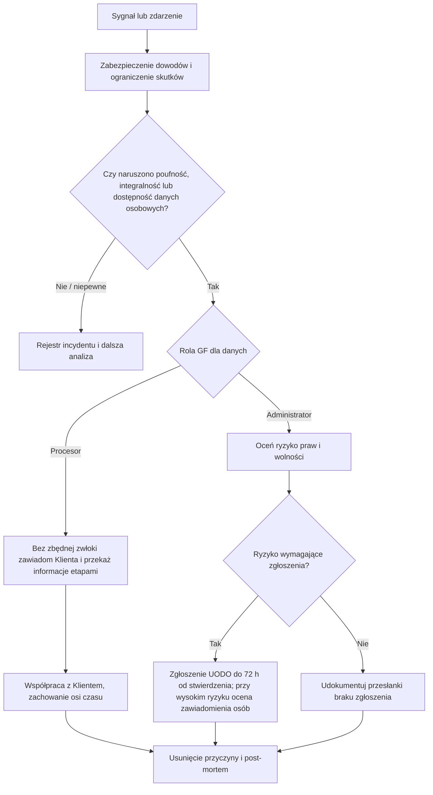

# Procedura naruszenia ochrony danych osobowych

| Metadane | Wartość |
| --- | --- |
| Produkt | GF |
| Wersja | [DO WYPEŁNIENIA: NUMER WERSJI] |
| Status | DRAFT – WYMAGA WERYFIKACJI |
| Właściciel | [DO WYPEŁNIENIA: WŁAŚCICIEL DOKUMENTU] |
| Recenzent | [DO WYPEŁNIENIA: RECENZENT] |
| Data obowiązywania | [DO WYPEŁNIENIA: DATA OBOWIĄZYWANIA] |
| Data przeglądu | [DO WYPEŁNIENIA: DATA PRZEGLĄDU] |
| Dokumenty powiązane | DPA; checklista 72h; rejestr |
| Klasyfikacja | POUFNY / DANE O INCYDENCIE |

> Projekt do weryfikacji prawnej, RODO, księgowej, podatkowej, biznesowej i technicznej w odpowiednim zakresie. Nie stanowi finalnej porady ani gwarancji zgodności lub bezpieczeństwa.

## 1. Rozróżnienie ról

Jako procesor GF zawiadamia administratora (Klienta) bez zbędnej zwłoki po stwierdzeniu naruszenia i współpracuje. To administrator co do zasady ocenia ryzyko oraz obowiązek zgłoszenia organowi w 72 godziny i zawiadomienia osób. Dla danych własnych GF działa jako administrator. Terminu 72 godzin nie należy przedstawiać jako terminu procesora do UODO bez analizy roli.

## 2. Przepływ

## 3. Minimalny materiał

Charakter naruszenia, kategorie i przybliżona liczba osób/rekordów, czas wykrycia i stwierdzenia, systemy, prawdopodobne konsekwencje, podjęte/planowane środki, punkt kontaktowy oraz braki uzupełniane etapami. Nie opóźniać pierwszego zawiadomienia Klienta z powodu niepełnych danych.

## 4. Szablon zawiadomienia Klienta

**Temat:** PILNE — możliwe naruszenie danych / **[DO WYPEŁNIENIA: ID]**. Stwierdzono: **[DO WYPEŁNIENIA]**. Zakres: **[DO WYPEŁNIENIA]**. Skutki: **[DO WYPEŁNIENIA]**. Środki: **[DO WYPEŁNIENIA]**. Następna aktualizacja: **[DO WYPEŁNIENIA]**. Kontakt: **[DO WYPEŁNIENIA]**.

## 5. Dokumentacja i zamknięcie

Odnotować moment „stwierdzenia”, decyzje, podstawę oceny ryzyka, powiadomienia i uzasadnienie. Zamknięcie wymaga właściciela, działań korygujących i daty weryfikacji skuteczności.

## Podstawy i materiały do weryfikacji

- [RODO – art. 5, 24–36](https://eur-lex.europa.eu/legal-content/PL/TXT/?uri=CELEX:32016R0679)
- [UODO – materiały o naruszeniach](https://uodo.gov.pl/pl/598/3563)
- [Wytyczne EROD 07/2020](https://www.edpb.europa.eu/documents/guideline/guidelines-072020-on-the-concepts-of-controller-and-processor-in-the-gdpr_en)
